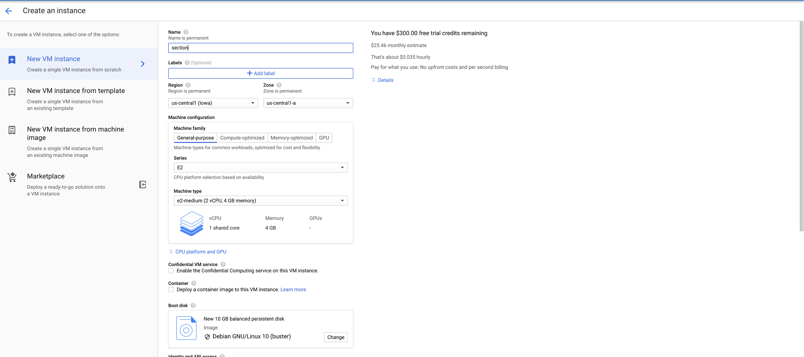

Google Compute Engine(GCE) is a high-end compute service that allows developers to create and run virtual machines on the underlying secure and reliable infrastructure of Google. 

Using GCE takes advantage of the complex computing capabilities and heavy workload without acquiring them physically.

Docker is allows the packaging of an application and its libraries into one. This practice enables running the application on any platform without the need for further configurations.

### Table of content
- [Goal](#goal)
- [Prerequisites](#prerequisites)
- [Creating the Flask app](#creating-the-flask-app)
- [Dockerizing the app](#dockerizing-the-flask-app)
- [Building a container image](#building-the-contrainer-image-and-pushing-to-google-container-registry)
- [Firewall configuration](#configure-a-firewall-rule)
- [Creating the virtual machine](#creating-the-virtual-machine-instance)
- [Configuration of the VM](#working-in-the-virtual-machine)
- [Uploading the container](#uploading-the-conatainer-to-the-vm)
- [Deploying the container](#deployment-to-google-compute-engine)
- [Testing the deployment](#testing-the-application)
- [Conclusion](#conclusion)

### Goal

In this article, we will understand how to deploy a Docker-based application to Google Compute Engine. By the end of the tutorial, you will understand how to create, dockerize and deploy a Flask app onto Google Compute Engine.

Flask is a python framework for building web applications. We need Flask to create a small web project to deploy to GCE. I prefer Flask for its simplicity, and besides, it does not require any special tools to work.

### Prerequisites
You will need the following for the tutorial:
1. A text editor to create the Flask application. I use [VS Code](https://code.visualstudio.com/Download).
2. A basic understanding of Python and Flask Framework.
3. [Docker](https://www.docker.com/products/docker-desktop) installed on your computer.

### Creating the Flask app
To create the Flask app, we need to install `Flask`. In the directory of the project, run the command below:

```bash
pip install Flask
```

Next, create two files. The first file is named `requirements.txt` and `app.py` to hold the libraries and dependencies of the project. The `app.py` is the driver code of the application.

Add the following code to the `app.py` file:

```py
from Flask import Flask, render_template
import Flask
app = Flask(__name__)
# Index route
@app.route('/')
def index():
   return render_template('index.html')
   # We are telling Flask to look for a file named index in the templates folder
   #then render it to the user interface. Note that by default Flask looks for templates in a folder named templates.
if __name__ == '__main__':
   app.run(debug=True)
```

Create a folder named `templates` which contains the HTML files rendered on the webpage. In the `templates` folder, create a view file and call it `index.html`, then paste the code below:

```html
<!DOCTYPE html>
<html lang="en">
<head>
   <meta charset="UTF-8">
   <meta http-equiv="X-UA-Compatible" content="IE=edge">
   <meta name="viewport" content="width=device-width, initial-scale=1.0">
   <title>Docker | GOOGLE COMPUTE ENGINE</title>
   <link rel="stylesheet" href="https://maxcdn.bootstrapcdn.com/bootstrap/3.3.7/css/bootstrap.min.css">
</head>
<body>
   <div class="container">
   <div class="jumbotron text-center">
     <h2>RUNNING DOCKER CONTAINERS ON GCE</h4>
   <p>Lorem ipsum, dolor sit amet consectetur adipisicing elit. Illum officia asperiores impedit possimus quas 
     officiis expedita velit, at architecto iusto natus modi quaerat, nulla laboriosam atque odio amet debitis 
     et voluptas ea! Pariatur autem tempora placeat saepe doloribus minus ab maxime excepturi neque illo. Ratione,
     sapiente magnam? Perspiciatis, molestias nihil.</p>
   </div>
   </div>  
   </div> 
</body>
</html>
```

### Dockerizing the Flask app
Now that our application is up and running, we need to dockerize it. Dockerization is packaging the application and its environmental libraries and dependencies into one unit to run the app anywhere without new configurations.

First, we need to create a `dockerfile`. The docker file creates a new image for the application. It sets up an environment that the application needs to run.

Create a file called `Dockerfile` and add the snippets below:

```py
FROM python:3.8
# working directory
WORKDIR /user/src/app

# copy all local files to the container image
ENV APP /app
WORKDIR $APP_HOME
COPY . ./

# Install pip requirements
RUN python pip install Flask gunicorn

# Run the web service on container startup
CMD exe gunicorn --bind :$PORT --workers 1 --threads 8 --timeout 0 app:app
```

Now that we have successfully created our Dockerfile, we need to make the file executable by running the command below in the terminal.

```bash
chmod +x Dockerfile
```

### Building the container image and pushing to Google Container Registry
We will build and publish our container image to Google Container Registry(GCR). The container image masks the application and its requirements into a single container that will run on the GCE. 

As we will be using the `gcloud command-line tool`, we need to open up the console, and upon prompt, we allow the cloud shell application to access the API key.


To create the container, run the command below:

```bash
gcloud builds submit --tag gcr.io/PROJECT-ID/sectionapp
```
> You need to provide a tag to associate with the container image. For our case, I called mine `sectionapp`.


### Configure a firewall rule
We will set up a firewall to allow traffic through a specific port. In our case, the port is 8080.

On the sidebar, head over to the networking tab ⇾ VPC network ⇾ select firewall. Click on `CREATE FIREWALL BUTTON`.

- Name : `allow-http-8080`
- Targets: `Specified target tags`
- Target tags: `http-server-8080`
- Source-ip: `0.0.0.0/0`
- TCP: `8080`


### Creating the virtual machine instance.
From the Google Cloud Console sidebar menu, go to COMPUTE ⇾ Compute Engine ⇾ VM instances, then click `CREATE INSTANCE`.



- Name : section-instance
- Machine configuration(Series): N1
- Machine configuration(Machine type): f1-micro
- Boot Disk: Debian GNU/Linux 10 (buster)
- Click the `Management, security, disks, networking, sole tenancy` link to expand the available options. 
- Click on the `Networking` tab.
- For `Network tags`, enter `http-server-8080` that we set up in the firewall creation.

To check for the running instances associated with this project, run the command:

```bash
gcloud compute instances list
```


### Working in the virtual machine
Next, we need to log into the virtual machine to install our application and the dependencies needed to run our application. So we will use another `gcloud` command as below:

```bash
gcloud compute ssh section-instance --zone us-central1-a
```
> Note that we specify the instance name and the zone as well. When prompted to create an ssh key, strike enter to go with the defaults.

Next, we will update the system package list by running the command:

```bash
sudo apt-update
```
Next, as this project runs on the Flask, we will need pip to install Flask using the command:

```bash
apt install python3-pip 
```

### Uploading the container to the VM
Use `CTRL+D` to log out of the virtual machine. We need to copy out application files into the virtual machine using the `secure copy` command.

```bash
gcloud computer scp --recursive section section-instance: --zone us-central1-a
```

### Deployment to Google Compute Engine
I prefer deploying my application to the virtual machine instance from the Google Cloud Platform Console using the `gcloud` command-line tool.

To deploy, execute the command:

```bash
gcloud compute instances create-with-container section-instance --container-image gcr.io/PROJECT-ID/sectionapp
```

In the command above, ensure you replace the PROJECT-ID with your project-id.

### Testing the application
- In the running instances, we will select the instance we created `section instance. - The instance has two IP addresses; an `internal IP` and an `external IP'.
- Copy the external IP address the run the application on port 8080. 
- Our application runs as shown below:

Now, head over to the browser on `http://your-external-ip-address/8080` to see if the application is running.


### Conclusion
In this article, we built a web application from scratch using a Flask. We went ahead and containerized the application using Docker in the Google command line. Finally, we took a step further and deployed the application to a virtual machine using compute engine. 
In doing so, we are utilizing Google infrastructure to run our application.

Take note that for you to run your application on Google Compute Engine, you have to provide billing details and once the application is done, shut down the running instances to avoid incurring extra charges.

You can find the code for the Flask application [here.](https://github.com/victorelvice/gce-flask-app)