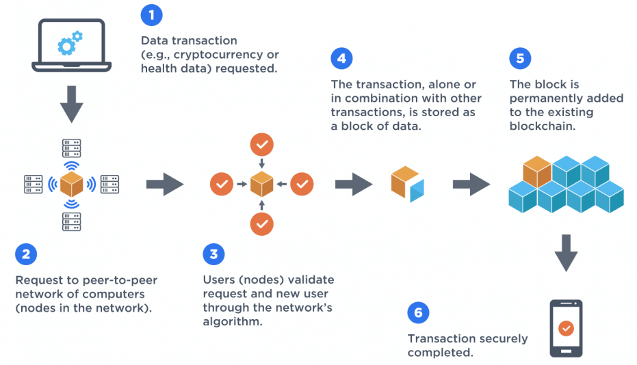

From the [website](https://ethereum.org/en/), Ethereum is a community-run technology powering the cryptocurrency ether (ETH) and thousands of decentralized applications. The technology that powers Ethereum is known as the blockchain. [Blockchain](https://en.wikipedia.org/wiki/Blockchain) is a system of decentralized nodes, comprised of a network’s resources where transaction data is distributed and stored using a consensus algorithm. That means that all the parties under the blockchain network protocol must approve the state of the ledger to increase the trust of unknown peers in a decentralized environment. Unlike Bitcoin, the Ethereum network gives developers the power to deploy smart contracts and decentralized applications, [dapps](https://ethereum.org/en/dapps/).

In this article, we will discuss how Ethereum works, its disruptive technologies, and the smart contracts ecosystem.

### Table of contents
- [Understanding Ethereum and smart contracts](#understanding-ethereum-and-smart-contracts)
  - [The Ethereum blockchain](#the-ethereum-blockchain)
  - [Ether](#ether)
  - [Consensus mechanism](#consensus-mechanism)
  - [The Ethereum Virtual Machine (EVM)](#the-ethereum-virtual-machine-evm)
  - [The smart contracts](#the-smart-contracts)
  - [Common blockchain and smart contracts use cases](#common-blockchain-and-smart-contracts-use-cases)
    - [Supply Chain](#supply-chain)
    - [Real Estate](#real-estate)
    - [Banking](#banking)
    - [Health Care](#health-care)
  - [Conclusion](#conclusion)

## Understanding Ethereum and smart contracts

Before understanding smart contracts, the following is what Ethereum consists of:

### The Ethereum blockchain 

Ethereum uses the blockchain protocol to store the record of transactions. In a blockchain, information needs to be stored in chunks that are structured in blocks. To ensure security, the chain of blocks needs to be encrypted in digital cryptographic signatures. Each block in the network contains data and its hash. A hash needs to be unique and contain a group of transactions that have been permanently committed to the database. Each new block that is introduced will then need to be linked to the previous one. The network is peer-to-peer to eliminate any central authority. When we introduce a new block, the system will synchronize it with everyone in the network. Each node in the network, therefore, validates the block before adding it to its blockchain. If blocks have been tampered with, they get rejected by other nodes in the network.

### Ether 
Ether is the transactional token that facilitates operations on the Ethereum network. All of the programs and services linked with the Ethereum network require computing power (and that computing power is not free). Ether is a form of payment for network participants to execute their requested operations on the network

### Consensus mechanism
Consensus is the method that validates and records data on the blockchain. In scenarios of cryptocurrencies, this is the mechanism that maintains transparency, and security on the network. It is also responsible for issuing new tokens into circulation. In a consensus mechanism, nothing is controlled by a single entity; instead, every participating network can see, share, or track transactional data.

### The Ethereum Virtual Machine (EVM)

In a nutshell, the Ethereum network provides the access to the Ethereum Virtual Machine (EVM) – a decentralized blockchain computer where developers can build smart contracts and embed them into the application. It’s a virtual computer where all Ethereum contracts are executed. The EVM is deterministic in that given an input of a smart contract executing on an EVM, will always produce the same output. This is essential because the blockchain will need to achieve its functionality by ensuring that all blocks agree on smart contract results, and reach consensus. The EVM ensures that these kinds of smart contracts will execute without any downtime, censorship, or influence from any third parties.

### The smart contracts

Ethereum platform can run smart contracts. This is an agreement that is programmed into code(i.e controlled by its internal code). A smart contract is a self-executing contract that is intended to enforce negotiations of contracts digitally. The system first needs to store conditions that will enforce, validate, and make terminations ensuring that each participant has equal outcomes. An example is having two parties betting on a race. We can make a smart contract to hold the money of each party and automatically execute if the conditions under the contracts are met.

### Common blockchain and smart contracts use cases
With blockchain-driven contracts on a rise, some of the industries that can implement this technology will include:

#### Supply Chain

Blockchain can drive the new era of Logistics and supply chain management. As businesses are expanding, the production and complexity of managing the isolated units are demanding. However, this can be effectively managed proper management to the supply chain is implemented. Where blockchain slots in are when a chain grows and hence a vast amount of third-party agents gets involved. The issues guarantee efficiency, transparency, and overall honesty. Since blockchain is a distributed ledger, it becomes handy in the following ways.

- Decentralizing the supply chain network ensures that there is no sole data owner. By integrating blockchain thanks to its decentralized nature of the distributed ledger, this technology can boast a trustworthy way to store data. As long as data is equally allocated amongst users of the ledger, this improves data transparency, nullifies frauds, and counterfeit production among more.

- Allowing transparency of information where everyone can track everything. Implementing blockchain in a logistics network system means every member of the network can now access any available piece of data. This brings us to the level where every single transaction stays transparent and cannot be removed. This is the missing piece in the majority of centralized supply chains systems these days.

- Applying a universal solution in cost reduction: The blockchain technology architecture can scale in distributed ledger infrastructure. Therefore, we can create a shared network for order management from suppliers. Therefore, the approval and validation of orders are automated. 

#### Real Estate
In the ministries of land and real estate, a lot of paperwork is involved. By this, blockchain can progress the industry by minimizing the paperwork and applying smart contracts to automate verification and validation of property ownership. The timestamping of records over the decentralized ledger can improve time-taking processes.

#### Banking
The modern financial system relies on huge centralized banks to hold the fiat currency to validate and perform transactions. However, the banking software system adds extra cost and hassles making it inefficient.
By using the smart contracts aspect of Ethereum, we can unlock the huge potential of a much faster and protected record of loans. Furthermore, with the rise of [DeFi](https://www.coindesk.com/learn/what-is-defi/), we can build apps on blockchain that act as lending platforms in an anonymous system to complete traditional financial transactions without a governing body.

#### Health Care

The health industry is growing rapidly. With the vast volume of medical data, the regulation still makes most of this information remain inaccessible from the outside. This makes it hard for research of increasing complexity of diseases, data breaches, and innovation. However, blockchain is a technology that can fix most of these issues when implemented. Below is why blockchain is a great fit:

- Involving several parties means that we need to improve trust by reducing the trustee middlemen to improve efficiency. Therefore, blockchain can create the version of truth by building consensus while giving the end-users control of data.

- The data needs to be reliable. To achieve this, the data needs to be decentralized and encrypted to avoid the ineffectiveness of central authority failures.

### Conclusion

As a digital platform, Ethereum gives developers a platform to build a wide range of decentralized applications such as security systems, voting systems, payment methods, and more. Despite its major benefits such as safety, confidentiality, the technology is quite new to users and still faces limitations from government regulations. However, blockchain can be the mover and shaker of the [fourth industrial revolution](https://www.salesforce.com/blog/what-is-the-fourth-industrial-revolution-4ir/). 
