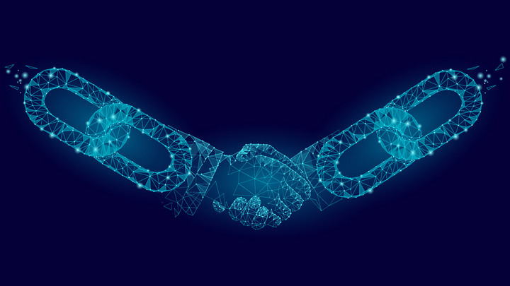

From the [website](https://ethereum.org/en/), Ethereum is a community-run technology powering the cryptocurrency ether (ETH) and thousands of decentralized applications. The technology or the that powers Ethereum is known as blockchain. [Blockchain](https://en.wikipedia.org/wiki/Blockchain) is a system of decentralized nodes, comprised of a network’s resources where transaction data is distributed and stored using a consensus algorithm. That means that all the parties under the blockchain network protocol must approve the state of the ledger to increase trust of unknown peers in a decentralised environment. Unlike Bitcoin, the Ethereum network gives developers the power to deploy smart contracts and decentralised applications, [dapps](https://ethereum.org/en/dapps/).

Smart contracts are scripts of code which can facilitate the exchange of money, shares, content, or anything of value. Smart contracts are formed using the Ethereum Virtual Machine (EVM). These smart contracts will execute without any downtime, censorship, or influence from a third party.

In this article, we will discuss how Ethereum works, its disruptive technologies, and the smart contracts ecosystem.

### Table of contents
- [Table of contents](#table-of-contents)
- [Understanding Ethereum and smart contracts](#understanding-ethereum-and-smart-contracts)
- [Common blockchain and smart contracts use cases](#common-blockchain-and-smart-contracts-use-cases)
  - [Supply Chain](#supply-chain)
  - [Real Estate](#real-estate)
  - [Banking](#banking)
  - [Health Care](#health-care)
- [Conclusion](#conclusion)

### Understanding Ethereum and smart contracts

As we discussed in the introduction, blockchain is a chain of blocks that contains information. A blockchain is a distributed ledger that is completely open to anyone. Each block contains some data, the hash of
the block and the hash of the previous block. Hash identifies a block and all of its contents
and it's always unique. But there is one more way that blockchains secure themselves and that's by being distributed. Instead of using a central entity to manage the chain, blockchains use a peer-to-peer network and anyone is allowed to join. When someone joins this network, he gets the full copy of the blockchain. The node can use this to verify that everything is still in order. Now let's see what happens when someone creates a new block. That new block is send to everyone on the network. Each node then verifies the block to make sure that it hasn't been tampered with. If everything checks out, each node adds this block to their own blockchain. All the nodes in this network create consensus. They agree about what blocks are valid and which aren't. Blocks that are tampered with will be rejected by other nodes in the network.

Ethereum is a platform for building dapps. Ether iz the Ethereum's currency

Ethereum network provides the access to the Ethereum Virtual Machine (EVM) – a decentralized blockchain computer where developers can build smart contracts and embed them into the application. It’s a virtual computer where all Ethereum contracts are executed.

The EVM is deterministic in that given an input of a smart contract executing on an EVM, will always produce the same output. This is essential becoz the blockchain will need to achieve its functionality by ensuring that all blocks agree on smart contract results, and reach consensus.

Eth has ability to run smart contracts(agreement programmed into code)
Are tamper-proof and automatically execute
E.g betting on tommorow's temp, make a smart contract to hold our money and pay the winner
Neither can cheat, change rules, or prematually withdraw
   

 A smart contract is an automated agreement that’s fully executed with code. The computer specifies and stores the conditions for the enforcement and termination and makes sure that both parties receive equal outcomes.

<!-- 
A smart contract can be defined as a self-executing contract which is intended to digitally control and enforce the negotiation of a contract. Smart contracts are almost indistinguishable from regular contracts, except that the agreement of a contract is automatically enforced in real-time on a blockchain.

This greatly facilitates the efficient conduct of an agreement, since it excludes the presence of intermediaries and provides more accountability. 

Why are blockchain-based contracts considered as beneficial?

With smart contracts, you can virtually exchange everything (money, shares, real estate, etc.) and verify shipments and payments in real-time, while saving businesses time and money. 

So, with the popularity of blockchain-based contracts rising across all levels of government, healthcare, and the real estate industries, enabling technology for other sectors is only a matter of time. A concise example of blockchain technology use in smart contracts is given below. 
 -->
### Common blockchain and smart contracts use cases

Some of the industries that smart contracts and blockchain can be implemented include:

#### Supply Chain

Blockchain has the capability to drive the new era of Logistics and supply chain management. As business are expanding, the producation and complexity of managing the isolated units is demanding. However, this can be effectively managed a proper management to the supply chain is implemented. Where blockchain slots in is when a chain grows and hence a vast amount of third-party agents gets involved. The issues that arise from this is the efficiency, transparency, and overall honesty. Since blockchain is a distributed ledger, it becomes handy in the following ways.

- Decentralizing the supply chain network ensures that there is no sole data owner. By integrating blockchain thanks to its decentralized nature of the distributed ledger, this technology can boast of a trustworthy way to store data. As long as data is equally allocated amongst users of the ledger, this improves data transparency, nullifies frauds and counterfiet production among more.

- Allowing transparency of information where everyone can track everything. Implementing blockchain in a logistics network system means every member of the network can now access any available piece of data. This brings us to the level where every single transaction stays transparent and cannot be removed. This is the missing piece in majority of centralised supply chains systems these days.

- Applying a universal solution in cost reduction: The blockchain technology architecture has the ability to scale in distributed ledger infrastructure. Therefore, we can create a shared network for order management from suppliers. Therefore, the approval and validation of orders is automated. 

#### Real Estate
In land and real estate, a lot of paper work is involved. By this, blockchain can progress the industry by minimizing the paper work and applying smart contracts to automate verification, and validation of property ownership. The timestamping of records over the decentralized ledger can improve time-taking processes.

#### Banking
The modern financial system relies on huge centralized banks to hold the fiat currency to validate and perform transactions. However, the banking software system adds extra cost and hassles making it inefficient.
By using smart contracts aspect of Ethereum, we can unlock a huge potential of a much faster and protected record of loans. Further more, with the rise of [DeFi](https://www.coindesk.com/learn/what-is-defi/), we can build apps on blockchain that act as lending platforms in an anonymous system to completes traditional financial transactions without a governing body.

#### Health Care

The health industry is growing rapidly. With the vast volume of medical data, the regulation still makes most of this information remain inaccessible from the outside. This makes it hard for research of increasing complexit of diseases, data breaches, and innovation. However, blockchain is a technology that can fix most of this issues when implemented. Below is why blockchain is a great fit:

- Involving several parties means that we need to improve trust by reducing the trustee middlemen to improve efficiency. Therefore, blockchain can create the version of truth by building consensus while giving the end-users the control of data.

- The data needs to be reliable. To achieve this, the data needs to be decentralized and encrypted to avoid the ineffectiveness of central authority failures.

### Conclusion

As a digital platform, ethereum gives developers a platform to build a wide range of decentralised applications such as security systems, voting systems, payment methods, and more. Despite its major benefits such as safety, confidentiality, the technology is quite new to users, and still faces limitation from government regulations. However, blockchain has the capability to be the mover and shaker of the [fourth industrial revolution](https://www.salesforce.com/blog/what-is-the-fourth-industrial-revolution-4ir/). 
