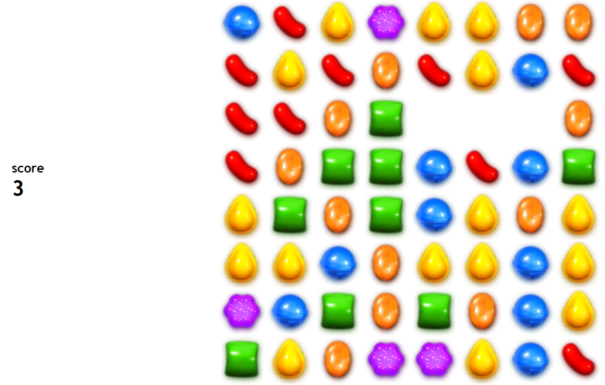

In this instructional exercise, you will learn how to make a fruit-themed version of the classic arcade game (Fruit Ninja). The main objective is to see how creative you can be with your degree of javaScript expertise.
<!--more-->
Before we dive into creating the game, we will study built-in javaScript methods that will help us achieve our project's goal.

### Table of contents
- [Attaching EventListeners to elements using addEventListener()](#attaching-eventlisteners-to-elements-using-addeventlistener)
  - [removeEventLIstener()](#removeeventlistener)
- [using setAttribute() method.](#using-setattribute-method)
- [Timeout and interval](#timeout-and-interval)
  - [setTimeout()](#settimeout)
  - [Cancelling a timeout](#cancelling-a-timeout)
  - [setInterval()](#setinterval)
  - [Stopping an interval](#stopping-an-interval)
- [Node navigation: createElement(),appendChild.](#node-navigation-createelementappendchild)
  - [createElement() and appendChild()](#createelement-and-appendchild)
  - [Inserting to elements](#inserting-to-elements)
  - [Removing elements](#removing-elements)
- [Fruit mania game](#fruit-mania-game)
- [Conclusion](#conclusion)

### Attaching event listeners to elements using addEventListener method
The `addEventListener()` function is used to attach an event listener to the element that has been given.

Syntax:

```Javascript
element.addEventListener(eventType, FunctionToExecute)
```
 
#### Example
Let's attach an `onclick` listener to a button to Display your local computer time:

HTML code to generate a button:

```html
<button type="button" id="btn">showDate</button>
```

Add javaScript:

```javascript
let date = new Date();
let x = document.getElementById("btn");
x.addEventListener("click", function displayDate() {
  console.log(date);
});
```

The code snippet above outputs the following: 

```bash
Sun Oct 24 2021 03:56:03 GMT-0300 (GMT-03:00)
```

### Removing an event listener using removeEventLIstener method
`removeEventListener()` method is used to remove the event handler that was previously attached using the `addEventListener()` method.

Syntax:

```Javascript
element.removeEventListener(eventType, functionToExecute)
```

#### Example
Let's remove the event attached to the button above.

```Javascript
x.removeEventListener("click", displayDate);
```

### Using setAttribute method
The `setAttribute()` method adds a given attribute to an element and assigns the supplied value to that attribute.

Syntax:

```Javascript
element.setAttribute(nameOfTheAttribute, valueOfTheAttribute);
```

#### Example
Let's create a button to change the input field to an input button.

HTML:

```html
<input value="ok" /> <button id="btn">clickMe</button>
```

Javascript:

```javascript
let btnElement = document.getElementById("btn");
let changeInputToButton = () => {
  btnElement.addEventListener("click", () => {
    document.getElementsByTagName("input")[0].setAttribute("type", "button");
  });
};
changeInputToButton();
```

The input field will change to a button when the button is clicked.

### Timeout and interval
#### setTimeout()
`setTimeout()` sets a timer which executes a function once the timer expires.

Syntax:

```Javascript
let intervalId = setTimeout(()=>{
  //code to execute
},delayTime);
```

The function will execute when the timer expires.

`delayTime` is the time to wait before executing the function.
  
**Example**

Let's display a pop-up greeting after 2 seconds:

```javascript
let delayGreeting = setTimeout(() => {
  alert("hello John Doe!");
}, 2000);
```

An alert pop-up with the greeting `John Doe` will be shown after 2 seconds.

#### Cancelling a timeout
To clear a timeout, simply specify the IntervalId of the timeout you want to cancel in the `clearTimeout()` method.

Syntax:

```Javascript
clearTimeout(intervalId)
```

**Example**

Let's clear the timeout created above:

```javascript
let clearTimeout = () => {
  clearTimeout(delayGreeting);
};
```

`delayGreeting` will be canceled.

#### setInterval()
This method repeatedly calls a function.

Syntax:

```Javascript
let timeInterval = setInterval(()=>{
  //code to execute
},delatyTime);
```

The function will be executed in intervals specified in milliseconds.

`dalayTime1` delays the execution of the function.

**Example**

Let's add 2 to x every second:

HTML:

```html
<p id="demo"></p>
```

Javascript:

```javascript
let x = 2;
let addNumber = setInterval(() => {
  x += 2;
  document.querySelectorAll("#demo").innerHTML = x;
});
```

2 will be added every time the code is executed.

#### Stopping an interval
To stop an interval, simply specify the intervalId of the interval you want to cancel, and pass it to the `clearInterval()` method.

Syntax:

```Javascript
clearInterval(intervalId)
```

**Example**

Let's cancel the interval we created above:

```javascript
let x = 2;
let addNumber = setInterval(() => {
  x += 2;
  document.querySelectorAll("#demo").innerHTML = x;
});
let cancelInterval = () => {
  clearInterval(addNumber);
};
cancelInterval();
```

### Node navigation: createElement, appendChild.
#### createElement and appendChild
This method is used to create HTML elements.

Syntax:

```Javascript
document.createElement(element)
```

**Example**

Let's create a `<p>` element.

```javascript
let paraElement = document.createElement("p");
```

Of course, we want to add text inside the `<p>` element. To do this, we need to Create a `text node` and insert it to the `<p>` node:

```javascript
let txtNode = document.createTextNode("my name is  John Doe");
```

Then use `appendChild()` method to insert the text node to the `<p>` element.

```javascript
paraElement.appendChild(txtNode);
```

We have successfully created a `<p>` element with text inside it. Now we can insert the element created to another parent element by using the `appendChild()` method.

Here is a full example:

Create a `div` with an id `demo`:

```html
<div id="demo"></div>
```

We will add a paragraph element using javascript:

```javascript
let paraElement = document.createElement("p");
let txtNode = document.createTextNode("my name is  John Doe");
paraElement.appendChild(txtNode);
document.getElementById("demo").appendChild(paraElement);
```

The code procedure above outputs a paragraph with the text "my name is John Doe".

#### Inserting to elements
Commonly, we only want to insert elements, not completely replace their content.

The `ParentNode.prepend()` method inserts an element (node) before the first child of the `ParentNode`.

**Example**

Let's insert a `li` in an item list.

HTML:

```html
<ul id="list">
  <li>one</li>
  <li>two</li>
  <li>three</li
 </ul>
```

Javascript:

```javascript
let list = document.getElementById("list");
const prependElement = () => {
  let li = document.createElement("li");
  let textNode = document.createTextNode("four");
  li.appendChild(textNode);
  list.prepend(li);
};
```

The outputs is as shown below:

```bash
four
one
two
three
```

The `parentNode.append()` method inserts an element (node) after the last child of the `ParentNode`.

From the task above, using append method could have resulted to the following:

HTML:

```html
<ul id="list">
  <li>one</li>
  <li>two</li>
  <li>three</li
 </ul>
```

Javascript:

```javascript
let list = document.getElementById("list");
const prependElement = () => {
  let li = document.createElement("li");
  let textNode = document.createTextNode("four");
  li.appendChild(textNode);
  list.prepend(li);
};
```

The outputs is as shown below:

```bash
one
two
three
four
```

#### Removing elements
To remove an element, use the `node.remove()` method. The `node.remove()` method removes the node from the tree it belongs.

Let's use the method to remove the `<li>` element added above:

```javascript
let list = document.getElementById("list);
const removeFirstChild = ()=>{
  let li = list.firstElementChild;
  li.remove();
}
```

### Fruit mania game
Now that we have learnt some essentials methods to include in our project, lets dive into it:

To start with, create three files, namely:
1. `index.html`
2. `style.css`
3. `app.js`

`index.html`:

```html
<div class="score-board">
  <h3>score</h3>
  <h1 id="score"></h1>
</div>
<div class="grid"></div>
```

`style.css`:

```css
* {
  margin: 0;
  padding: 0;
}

body {
  display: flex;
  justify-content: space-evenly;
  align-items: center;
  font-family: "Trebuchet MS", "Lucida Sans Unicode", "Lucida Grande",
    "Lucida Sans", Arial, sans-serif;
}

.grid {
  margin-top: 34px;
  height: 560px;
  width: 560px;
  display: flex;
  flex-wrap: wrap;
}

.grid div {
  height: 70px;
  width: 70px;
}
```

`app.js`:

```javascript
document.addEventListener("DOMContentLoaded", () => {
  const grid = document.querySelector(".grid");
  const width = 8;
  const squares = [];
  let scoreDisplay = document.getElementById("score");
  let score = 0;
  const candyColors = ["red", "yellow", "orange", "purple", "green", "blue"];

  // create Board
  let createBoard = () => {
    for (let i = 0; i < width * width; i++) {
      const square = document.createElement("div");
      square.setAttribute("draggable", true);
      square.setAttribute("id", i);
      let randomColor = Math.floor(Math.random() * candyColors.length);
      square.style.backgroundImage = candyColors[randomColor];
      grid.appendChild(square);
      squares.push(square);
    }
  };

  createBoard();
  //drag the candies
  let colorBeingDragged;
  let colorBeingReplaced;
  let squareIdBeingDragged;
  let squareIdBeindReplaced;
  squares.forEach((square) => square.addEventListener("dragstart", dragstart));
  squares.forEach((square) => square.addEventListener("dragEnd", dragEnd));
  squares.forEach((square) => square.addEventListener("dragOver", dragOver));
  squares.forEach((square) => square.addEventListener("dragEnter", dragEnter));
  squares.forEach((square) => square.addEventListener("dragLeave", dragLeave));
  squares.forEach((square) => square.addEventListener("dragDrop", dragDrop));

  function dragstart() {
    colorBeingDragged = this.style.backgroundImage;
    squareIdBeingDragged = parseInt(this.id);
    console.log(colorBeingDragged);
    console.log(this.id, "dragstart");
  }

  function dragOver(e) {
    e.preventDefault();
    console.log(this.id, "dragover");
  }

  function dragEnter(e) {
    e.preventDefault();
    console.log(this.id, "dragenter");
  }

  function dragLeave() {
    console.log(this.id, "dragleave");
  }

  function dragDrop() {
    console.log(this.id, "dragdrop");
    colorBeingReplaced = this.style.backgroundImage;
    squareIdBeindReplaced = parseInt(this.id);
    this.style.backgroundImage = colorBeingDragged;
    squares[squareIdBeingDragged].style.backgroundImage = colorBeingReplaced;
  }

  function dragEnd() {
    console.log(this.id, "dragend");
    //what is a valid move
    let validMoves = [
      squareIdBeingDragged - 1,
      squareIdBeingDragged - width,
      squareIdBeingDragged + 1,
      squareIdBeingDragged + width,
    ];

    let validMove = validMoves.includes(squareIdBeindReplaced);
    if (squareIdBeindReplaced && validMove) {
      squareIdBeindReplaced = null;
    } else if (squareIdBeindReplaced && !validMove) {
      squares[squareIdBeindReplaced].style.backgroundImage = colorBeingReplaced;
      squares[squareIdBeingDragged].style.backgroundImage = colorBeingDragged;
    } else {
      squares[squareIdBeingDragged].style.backgroundImage = colorBeingDragged;
    }
  }

  const checkRowForThree = () => {
    for (i = 0; 1 < 61; i++) {
      let rowOfThree = [i, i + 1, i + 2];
      let decidedColor = squares[i].style.backgroundImage;
      const isBlank = squares[i].style.backgroundImage === "";
      const notValid = [6, 7, 14, 15, 22, 23, 30, 31, 38, 39, 46, 47, 54, 55];
      if (notValid.includes(i)) continue;
      if (
        rowOfThree.every(
          (index) =>
            squares[index].style.backgroundImage === decidedColor && !isBlank
        )
      ) {
        score += 3;
        scoreDisplay.innerHTML = score;
        rowOfThree.forEach((index) => {
          squares[index].style.backgroundImage = "";
        });
      }
    }
  };
  checkRowForThree();

  const checkColumnForThree = () => {
    for (i = 0; 1 < 47; i++) {
      let columnOfThree = [i, i + width, i + width * 2];
      let decidedColor = squares[i].style.backgroundImage;
      const isBlank = squares[i].style.backgroundImage === "";
      if (
        columnOfThree.every(
          (index) =>
            squares[index].style.backgroundImage === decidedColor && !isBlank
        )
      ) {
        score += 3;
        scoreDisplay.innerHTML = score;
        columnOfThree.forEach((index) => {
          squares[index].style.backgroundImage = "";
        });
      }
    }
  };
  checkColumnForThree();

  function moveDown() {
    for (i = 0; i < 55; i++) {
      if (squares[i + width].style.backgroundImage === "") {
        squares[i + width].style.backgroundImage =
          squares[i].style.backgroundImage;
        squares[i].style.backgroundImage = "";
        const firstRow = [0, 1, 2, 3, 4, 5, 6, 7];
        let isFirstRow = firstRow.includes(i);
        if (isFirstRow && squares[1].style.backgroundImage === "") {
          let randomColor = Math.floor(Math.random() * candyColors.length);
          squares[1].style.backgroundImage = candyColors[randomColor];
        }
      }
    }
  }

  window.setInterval(() => {
    moveDown();
    checkRowForThree();
    checkColumnForThree();
  }, 100);
});
```

The output is as shown below:



### Conclusion
The purpose of this post was to provide a refresher on certain fundamental built-in javaScript methods, as well as an examination of their implementation.

With this knowledge, you now understand how to set the attributes of an HTML element, how to create an HTML element, how to work with timers, and most significantly, how to use javascript for game development.

There are other ways of creating the game discussed in this post, and this was simply a straightforward method of doing so. You can experiment with different approaches to make it more fascinating.

Happy Coding!
