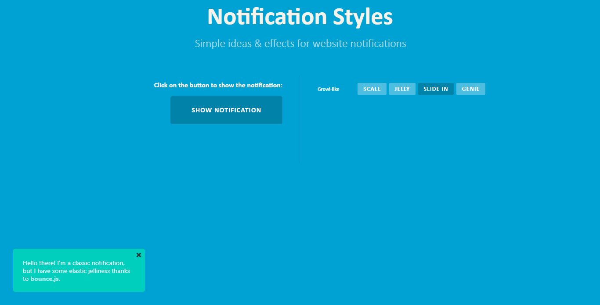

Websites need notifications to display urgent or additional information. Pop-ups, used to pass notifications, are efficient if used effectively and at the right time. Notification effects depending on the main website theme bring a website's unique taste and signature look.

In this article, you will learn how to apply some of these notification effects including the Genie, Slide-in, Jelly, and scale Pop-up notification effects. You will learn how to build eye-catching catching effects and appreciate that these effects are dependent on the type of information being displayed.

### Table of contents

- [Key takeaways](#key-takeaways)
- [Pre-requisites](#pre-requisites)
- [Brief overview](#brief-overview)
- [Create Folder structure](#create-folder-structure)
- [Overall Webpage Structure](#overall-webpage-structure)
- [Add styling](#add-styling)
- [Add a notification to the window](#add-a-notification-to-the-window)
- [Create functions to search for the classes in the HTML file](#create-functions-to-search-for-the-classes-in-the-html-file)
- [Modify the HTML file to add the notification](#modify-the-html-file-to-add-the-notification)
- [Use a minified modernizr file for animations](#use-a-minified-modernizr-file-for-animations)
- [Format the notification](#format-the-notification)
- [Add the growl effect to the notification](#add-the-growl-effect-to-the-notification)
- [Normalize the webpages](#normalize-the-webpages)
- [Conclusion](#conclusion)

### Key takeaways
By the end of this article, you will learn how to apply the following notification effects to a webpage.
- Slide-in effect
- Genie effect
- Scale growth effect
- Jelly pop-up effect

You will also get to know some notification effects which we can use on your webpage and when to use them.

### Pre-requisites
For you to flow easily with this article, you need to know the following:
- Basics of HTML. Know-how on creating web pages and linking other files to them.
- Good use of CSS.
- Interactions with JavaScript.
- Web development IDE. It should support webpage preview capabilities. These will be helpful during the development process.
  I recommend Visual Studio Code IDE. You can download it from [here](https://code.visualstudio.com/).

### Project folder structure
Create a root folder named `Notifications`. All the project code will lie here. The root folder structure will be as shown below:

```shell
.
├── css (folder)
│   ├── demo.css (file)
│   ├── normalize.css (file)
│   ├── ns-default.css (file)
│   └── ns-style-growl.css (file)
├── js (folder)
│   ├── classie.js (file)
│   ├── modernizr.custom.js (file)
│   └── notificationFx.js (file)
├── growl-effects-genie.html (file)
├── growl-effects-jelly.html (file)
├── growl-effects-scale.html (file)
└── growl-effects-slide-in.html (file)
```

### Overall webpage structure

In the `growl-effects-scale.html`, add the following snippet:

```html
<!DOCTYPE html>
<html lang="en">
<head>
    <meta charset="UTF-8" />
    <meta http-equiv="X-UA-Compatible" content="IE=edge">
    <meta name="viewport" content="width=device-width, initial-scale=1">
    <title>Notification Styles | Growl-Style</title>
    <link rel="stylesheet" type="text/css" href="css/demo.css" />
    <link rel="stylesheet" type="text/css" href="css/normalize.css" />
    <link rel="stylesheet" type="text/css" href="css/ns-style-growl.css" />
    <link rel="stylesheet" type="text/css" href="css/ns-default.css" />

</head>
<body>
<div class="container">
    <!-- Top Navigation Structure -->

    <header class="notifications-header">
        <h1>Notification Styles <span>Simple ideas &amp; effects for website notifications</span></h1>
    </header>
    <div class="main clearfix">
        <div class="column">
            <p class="small">Click on the button below to show the notification:-</p>
            <button id="notification-trigger" class="progress-button">
                <span class="content">Show the Notification</span>
                <span class="progress"></span>
            </button>
        </div>
        <div class="column">
            <nav class="notifications-demos">
                <h3>Growl-like</h3>
                <div>
                    <a class="current-demo" href="growl-effects-scale.html">Scale</a>
                    <a href="growl-effects-jelly.html">Jelly</a>
                    <a href="growl-effects-slide-in.html">Slide in</a>
                    <a href="growl-effects-genie.html">Genie</a>
                </div>
            </nav>
        </div>
    </div>
</div>
<!-- /container -->
<script src="js/classie.js"></script>
<script src="js/modernizr.custom.js"></script>
<script src="js/notificationFx.js"></script>

</body>
</html>
```


Copy-paste the above code in the `growl-effects-genie.html` file. Repeat the step in `growl-effects-jelly.html` and `growl-effects-slide-in.html` files.

Modify the class of the current page in the above files so that it will show that it is on that page.
This is shown below:

- In the `growl-effects-genie.html`:

```html
<div>
    <a href="growl-effects-scale.html">Scale</a>
    <a href="growl-effects-jelly.html">Jelly</a>
    <a href="growl-effects-slide-in.html">Slide in</a>
    <!-- Show that it is currently active -->
    <!-- This is by adding the 'current-demo' class referenced in the CSS-->
    <a class="current-demo" href="growl-effects-genie.html">Genie</a>
</div>
```

Repeat this for the other two files to get the Code below for:

- `growl-effects-jelly.html`:

```html
<div>
    <a href="growl-effects-scale.html">Scale</a>
    <a class="current-demo" href="growl-effects-jelly.html">Jelly</a>
    <a href="growl-effects-slide-in.html">Slide in</a>
    <a href="growl-effects-genie.html">Genie</a>
</div>
```

- `growl-effects-slide-in.html`:

```html
<div>
    <a href="growl-effects-scale.html">Scale</a>
    <a href="growl-effects-jelly.html">Jelly</a>
    <a class="current-demo" href="growl-effects-slide-in.html">Slide in</a>
    <a href="growl-effects-genie.html">Genie</a>
</div>
```

### Add styling the webpage
In the `demo.css` file,

- Use `border-box` for all elements before and after. Set clearfix class styling both before and after.

```css
/* All */
*, *:before, *:after { 
  -webkit-box-sizing: border-box;
  box-sizing: border-box;
}
.clearfix:before, .clearfix:after { content: ''; display: table; }
.clearfix:after { clear: both; }
```

- Format the `html` and `body` elements:

```css
html, body {
   height: 100%;
}

body {
   background: #6cc2edFF;
   color: #f5f3ec;
   font-weight: 400;
   font-size: 1em;
   line-height: 1.25;
   position: relative; z-index: 1;
   font-family: 'Raleway', Calibri, Arial, sans-serif;
}
```

- Style the links, buttons, and container elements:

```css
a, button {
   outline: none;
}

a {
   color: rgba(0,0,0,0.5);
   text-decoration: none;
}

a:hover, a:focus {
   color: #fff;
}

.container {
    min-height: 100%;
}
```

- Create color templates to easily choose from for the page:

```css
/* You can choose colors quickly from the color templates below*/
.color-2 { background: #739DBF; }
.color-3 { background: #73BF7B; }
.color-4 { background: #484861; }
.color-5 { background: #7773BF; }
.color-6 { background: #B4BF72; }
.color-7 { background: #73BFB9; }
.color-8 { background: #BFA371; }
.color-9 { background: #6cc2ed; }
.color-9 { color: rgba(0,0,0,0.6); }
.color-10 { background: #00cfbe; }
.color-11 { background: #00a2d3;}
```

- Format the header and the header span:

```css
/* Header */
.notifications-header {
   margin: 0 auto;
   padding: 0 2em 0em;
   text-align: center;
}

.notifications-header h1 {
   margin: 0;
   font-size: 3.5em;
   line-height: 1.3;
}

.notifications-header h1 span {
   padding: 0.4em 0 0.6em 0.1em;
   display: block;
   opacity: 0.7;
   font-size: 45%;
   font-weight: 300;
}
```

- Format the top of the notification:

```css
/* To Navigation Style */
.notifications-top {
   width: 100%;
   text-transform: uppercase;
   font-weight: 700;
   font-size: 0.69em;
   text-align: center;
   padding: 2em 0;
}
```

- Format the buttons which enable you to access the other web pages:

```css
/* Demo Buttons Style */
.notifications-demos {
   padding-top: 1em;
   font-size: 0.8em;
}

.notifications-demos div {
   margin-left: 90px;
   padding-bottom: 1em;
}

.notifications-demos a {
   display: inline-block;
   margin: 0.35em 0.1em;
   padding: 0.35em 0.9em 0.35em;
   outline: none;
   text-decoration: none;
   text-transform: uppercase;
   letter-spacing: 1px;
   font-weight: 700;
   background: rgba(255,255,255,0.3);
   color: #fff;
   border-radius: 2px;
   font-size: 110%;
}

.notifications-demos a:hover,
.notifications-demos a.current-demo {
   background: rgba(0,0,0,0.2);
   color: inherit;
   border-color: initial;
}

.notifications-demos h3 {
   margin: 0;
   padding: 1em 0 0.5em 0;
   font-size: 0.9em;
   float: left;
   min-width: 90px;
   clear: left;
}
```

- Format the content in the main content and the columns:

```css
/* Main content */
/* Main */
.main {
   max-width: 69em;
   margin: 0 auto;
   padding: 3% 0 10%;
}

/* Column */
.column {
   float: left;
   width: 50%;
   padding: 0 2.5em;
   min-height: 200px;
   position: relative;
}

/* First column formatting */
.column:first-child {
   box-shadow: inset -1px 0 0 rgba(0,0,0,0.1);
   text-align: right;
}

/* Paragraph in the column */
.column p {
   font-weight: 300;
   font-size: 1.8em;
   padding: 0 0 0.5em;
   margin: 0;
   line-height: 1.5;
}

/* Small text in the column */
.column p.small {
   font-size: 1em;
   padding: 0.75em 0 1em;
   font-weight: 700;
   line-height: 1.2;
}
```

- Format the progress bar. The bar acts as a trigger example for an event that leads to a notification pop-up.
  The styling is as shown below:

```css
/* Notification progress bar */
/* This mimics a process which produces a notification */
.progress-button {
   position: relative;
   display: inline-block;
   padding: 0 3em;
   outline: none;
   border: none;
   color: #fff;
   text-transform: uppercase;
   font-weight: 700;
   letter-spacing: 1px;
   font-size: 1em;
   z-index: 50;
   line-height: 4;
   overflow: hidden;
   border-radius: 5px;
   background: rgba(0,0,0,0.2);
}

/* Text inside the progress button */
.progress-button .content {
   position: relative;
   display: block;
   z-index: 10;
   -webkit-transition: -webkit-transform 0.3s;
   transition: transform 0.3s;
}

/* Progress button transition animation */
.progress-button .progress {
   position: absolute;
   left: 0;
   background: rgba(0,0,0,0.2);
   top: 0;
   width: 0%;
   opacity: 0;
   height: 100%;
   z-index: 0;
   -webkit-transition: width 0s 0.3s, opacity 0.3s;
   transition: width 0s 0.3s, opacity 0.3s;
}

/* Active button on progress styling */
.progress-button.active .progress {
   opacity: 1;
   width: 100%;
   -webkit-transition: width 1.2s;
   transition: width 1.2s;
}
```

- Create screen responsiveness for different display sizes:

```css
/* Allow the screen to be responsive */
@media screen and (max-width: 46.5em) {
   .column {
      width: 100%;
      min-width: auto;
      min-height: auto;
      padding: 2em;
      font-size: 90%;
   }

   .column:first-child {
      text-align: center;
      box-shadow: inset 0 -1px 0 rgba(0,0,0,0.1);
   }
}

@media screen and (max-width: 25em) {

   .notifications-header h1 {
      font-size: 2.5em;
   }

   .notifications-top a {
      font-size: 1.6em;
      border: 2px solid black;
      border-color: initial;
      padding: 0.5em;
      border-radius: 3px;
   }
}
```


### Add a notification to the window
In the Javascript folder, named `js`, open the 'notificationFX.js' file. In the file, you will do the following:
- Create a function that will take in the window as the argument. The function will later invoke it.
  The function will hold all the other functions in it.
  This code is shown below:

```js
( function( window ) {

    /** This enables you to avoid using undeclared variables */
   'use strict';
    
    
} )( window );
```

- In the function, you will get the root element in the webpage. This code returns the HTML element. Add the end of event names which refer to the end of animations.  You will also create a function that checks if an object has a property that it holds.  If so, it will add the property to the former object.
  The `extend` function will be used in the `NotificationFX` function. It will place a new property to the object that had been initially saved with another property.

This is shown in the code below:

```js
/** Get the root element */
   var docElem = window.document.documentElement,
        /** Use Modernizr css animations */
      support = {
       animations : Modernizr.cssanimations
      },
      animEndEventNames = {
         'animation' : 'animationend',
         'WebkitAnimation' : 'webkitAnimationEnd',
         'msAnimation' : 'MSAnimationEnd',
         'OAnimation' : 'oAnimationEnd'
      },
      // animation end event name
      animEndEventName = animEndEventNames[ Modernizr.prefixed( 'animation' ) ];

   /**
    * extend the obj function
    */
   function extend( a, b ) {
      for( var key in b ) {
         if( b.hasOwnProperty( key ) ) {
            a[key] = b[key];
         }
      }
      return a;
   }

   /**
    * NotificationFx function
     * Uses the extend function created above
    */
   function NotificationFx( options ) {
      this.options = extend( {}, this.options );
      extend( this.options, options );
      this._init();
   }
```

- Create a `NotificationFX options` function that allows one to easily set the notification type and styles.
  The function allows one to set the following:

    - wrapper of the notification
    - message
    - layout
    - effect
    - time taken to leave the scene once displayed (ttl). The time is in milliseconds(ms).
    - on-open and on-close callback functions

These are well displayed below:

```js
/**
    * NotificationFx options
    */
NotificationFx.prototype.options = {
    // element to which the notification will be appended to
    // defaults to the document.body element
    wrapper : document.body,
    // the message to be displayed
    message : 'Hello!!!',
    // layout types: growl|attached|bar|other
    layout : 'growl',
    // effects for the specified layout:
    // for growl layout: scale|slide|genie|jelly
    effect : 'slide',
    // notice, warning, error, success types
    // will add class ns-type-warning, ns-type-error or ns-type-success
    type : 'error',
    // if the user doesn´t close the notification then we remove it
    // after the following time in ttl (ms)
    ttl : 6000,
    // callbacks
    onClose : function() { return false; },
    onOpen : function() { return false; }
}
```

> Remember, the wrapper of the notification can be changed. This can be handy if the notification should only be in a certain element or part of the webpage.

- Add a new function below the above function. This function is for initializing and caching variables created.

The function will do the following:
- create a new `div` element in the HTML file
- add classes to the created element. This addition helps the notification inherit the properties and styles in the stylesheets.
- Add the message specified in the options set above inside the element
- Add a closing tag to the element created
- append the notification to the body or the element specified in `options.wrapper`
- check if the notification is still active or on. If so, dismiss the notification once the time in the `options.ttl` runs out.


```js
NotificationFx.prototype._init = function() {
    // create the HTML structure
    this.ntf = document.createElement( 'div' );
    this.ntf.className = 'ns-box ns-' + this.options.layout + ' ns-effect-' + this.options.effect + ' ns-type-' + this.options.type;
    // Create a div element
    var strinner = '<div class="ns-box-inner">';
    // Add the message
    strinner += this.options.message;
    // Close the div tag
    strinner += '</div>';
    // Add a span
    strinner += '<span class="ns-close"></span></div>';
    this.ntf.innerHTML = strinner;

    // append to body or the element specified in options.wrapper
    // This creates the notification before the first child in the HTML file.
    this.options.wrapper.insertBefore( this.ntf, this.options.wrapper.firstChild );

    // dismiss after this [options.ttl]ms
    var self = this;

    if(this.options.ttl) { 
        // This checks to make sure ttl is not set to false in notification initialization
        this.dismissttl = setTimeout( function() {
            if( self.active ) {
                self.dismiss();
            }
        }, 
                this.options.ttl );
    }

    // initialize the events
    this._initEvents();
}
```

- Create a function that dismisses the notification when one clicks the close button.

```js
    /**
    * initialize the events
    */
NotificationFx.prototype._initEvents = function() {
    var self = this;
    // dismiss the notification
    this.ntf.querySelector( '.ns-close' ).addEventListener( 'click', function() { self.dismiss(); } );
}
```

- Add a function that will display the notification. It will utilize the functions in the `classie.js` file to search for the class names and remove them from the element. The function will add another class to it. It then executes the on-open callback function. Check this out below:

```js
/**
* shows the notification
*/
NotificationFx.prototype.show = function() {
    this.active = true;
    // Removes the class name that hides it
    classie.remove( this.ntf, 'ns-hide' );
    // Adds the class name so as it can be visible
    classie.add( this.ntf, 'ns-show' );
    if (typeof this.options.onOpen === 'function')
        this.options.onOpen();
}
```

- Add a function to dismiss the notification once the timeout runs out or the notification close button is clicked on. The timeout will be cleared. The `ns-show` class name will also be removed. The function then executes on-close callback functions if specified. The time to execute the callback function procedures is set to 25 ms.

The function removes the notification element once the notification ends. If it doesn't find the notification in the `target` inside the DOM element, then returns false.

```js
    /**
    * dismisses the notification
    */
NotificationFx.prototype.dismiss = function() {
    var self = this;
    this.active = false;
    clearTimeout( this.dismissttl );
    // Removes the css class that makes it visible
    classie.remove( this.ntf, 'ns-show' );
    setTimeout( function() {
        classie.add( self.ntf, 'ns-hide' );

        // callback function
        if (typeof self.options.onClose === 'function')
            self.options.onClose();
    }, 25 );

    // after animation ends, remove the notification from the DOM
    var onEndAnimationFn = function( ev ) {
        if( support.animations ) {
            if( ev.target !== self.ntf ) {
              return false;
            }
            this.removeEventListener( animEndEventName, onEndAnimationFn );
        }
        self.options.wrapper.removeChild( self.ntf );
    };

    if( support.animations ) {
        this.ntf.addEventListener( animEndEventName, onEndAnimationFn );
    }
    else {
        onEndAnimationFn();
    }
}
```

- Add the `NotificationFx` function to be a global function seen in all the window. This step allows the function to be used in the HTML file quickly.
  See this in the code below:

```js
    /**
    * adds to the global namespace
    */
window.NotificationFx = NotificationFx;
```

### Create functions to search for the classes in the HTML file
Open the `classie.js` file and add a function to take in the window as an argument and invoke it.

```js
( function( window ) {

'use strict';


})( window );
```

- Create a `RegEX` function that searches for the class name that is in between other words in the file.

```js
function classReg( className ) {
  return new RegExp("(^|\\s+)" + className + "(\\s+|$)");
}
```

- Create functions to check if an HTML file has a certain class in it, to add or remove the class in a certain element.
  These functions utilize the `RegEx` function created above.

```js
// classList support for class management

var hasClass, addClass, removeClass;

// Uses the hasClass, addClass, removeClass that were created
if ( 'classList' in document.documentElement ) {
  hasClass = function( elem, c ) {
    return elem.classList.contains( c );
  };
  addClass = function( elem, c ) {
    elem.classList.add( c );
  };
  removeClass = function( elem, c ) {
    elem.classList.remove( c );
  };
}
else {
  hasClass = function( elem, c ) {
    return classReg( c ).test( elem.className );
  };
  
  // Adds the class name
  addClass = function( elem, c ) {
    if ( !hasClass( elem, c ) ) {
      elem.className = elem.className + ' ' + c;
    }
  };

  // Removes the class name
  removeClass = function( elem, c ) {
    elem.className = elem.className.replace( classReg( c ), ' ' );
  };
}
```

- Create a `toggleClass` function that uses the `hasClass` procedure to check if the file has the class in the element. If it has, it removes it and adds another. This acts as a toggle function.

```javascript
function toggleClass( elem, c ) {
    // Local variable
  var fn = hasClass( elem, c ) ? removeClass : addClass;
  fn( elem, c );
}
```

- Shorten the names of the functions or procedures so that they can be easily used.

```js
var classie = {
  // full names
  hasClass: hasClass,
  addClass: addClass,
  removeClass: removeClass,
  toggleClass: toggleClass,
  // shortened names
  has: hasClass,
  add: addClass,
  remove: removeClass,
  toggle: toggleClass
};
```

- Make the `classie` function to be a global function in the workspace.

```js
// transport
if ( typeof define === 'function' && define.amd ) {
  // AMD
  define( classie );
} else {
  // browser global
  window.classie = classie;
}
```

### Modify the HTML file to add the notification
Inside the `growl-effects-scale.html` file, just below the `<script src="js/notificationFx.js"></script>` line, add a script that does the following:

- Create a function that invokes itself. It will hold the other functions:

```html
<script>
    (function() {
        
    })();
</script>
```

- Listens for a button click from the progress bar button. It enables the button for clicks.  Look at the button below for this:

```js
        var bttn = document.getElementById( 'notification-trigger' );

        // make sure..
        bttn.disabled = false;
```

- Add a function that disables the button which is clicked. It then uses the `NotificationFx` function created before to quickly set the options of the notification. making makes sure that the button is not disabled since disabling the button prevents double-clicking till when the notification disappears. As for the `growl` layout, it supports the following notification effects:
    - scale (will be used in the `growl-effects-scale.html` file)
    - jelly
    - slide in
    - genie

```js
bttn.addEventListener( 'click', function() {
    
    // simulate loading (for demo purposes only)
    classie.add( bttn, 'active' );
    setTimeout( function() {

        classie.remove( bttn, 'active' );

        // create the notification
        var notification = new NotificationFx({

            // Added an apostrophe (') escape character in the message to avoid errors
            message : '<p>Hello there! I\'m a classic notification, but I have some elastic jelliness thanks to <a href="http://bouncejs.com/">bounce.js</a>. </p>',
            layout : 'growl',
            effect : 'scale',
            type : 'notice', // notice, warning, error or success
            ttl : 6000,
            // On close of the notification, enable the button
            onClose : function() {
                bttn.disabled = false;
            }
        });

        // show the notification
        notification.show();

    }, 1200 );

    // disable the button (for demo purposes only)
    this.disabled = true;
} );
```

### Use a minified modernizr file for animations
Head over to this [link](https://github.com/prograte/Genie-Slide-in-Jelly-and-scale-Pop-up-Notification-effects/blob/main/js/modernizr.custom.js) to find the `modernizr.custom.js` file. Copy the content into the `modernizr.custom.js` file in the `js` folder. Do this by copy-pasting the code directly or viewing it as a _RAW_ file before copy-pasting it.

> '**modernizr.custom.js**' has been generated and downloaded from this [Modernizr](http://modernizr.com/download/#-cssanimations-shiv-cssclasses-prefixed-testprop-testallprops-domprefixes-load) site. [Modernizr.com](Modernizr.com) generates for one a minified JS file that detects the browser being used and features it supports. This reduces the blacklisting of browsers in the HTML file. It rather allows developers to customize experiences based on the browser's capabilities.

The downloaded file will enable the webpage to display the notification on the webpage.


One notices that it hardly looks like a pop-up notification. The reason for this is that it has not been formatted yet.

### Format the notification
Style the notification to look like a pop-up notification. In the `ns-default.css` file do the following:

- Style the notification box in the webpage:

```css
/* Common, and default styles for the notification box */

.ns-box {
   position: fixed;
   color: rgba(250,251,255,0.95);
   background: rgba(42,45,50,0.85);
   line-height: 1.4;
   padding: 22px;
   z-index: 1000;
   pointer-events: none;
   font-family: 'Helvetica Neue', 'Segoe UI', Helvetica, Arial, sans-serif;
   font-size: 90%;
}
```

- Style the notification box when the notification is shown:

```css
/* Notification 'on show' styling */
.ns-box.ns-show {
   pointer-events: auto;
}
```

- Format the links and paragraphs in the notification box. This styling is shown below:

```css
/* Notification link styling */
.ns-box a {
   font-weight: 700;
   color: inherit;
   opacity: 0.7;
   
}

.ns-box a:focus,
.ns-box a:hover
 {
   opacity: 1;
}

/* Notification paragraph styling */
.ns-box p {
   margin: 0;
}
```

- Add auto pointer-events when the notification is visible:

```css
/* Visible notification styling */
.ns-box.ns-show,
.ns-box.ns-visible {
   pointer-events: auto;
}
```

- Style the notification when the notification is closed both before and after.
  Check this out below:

```css
/* `on close` notification styling */
.ns-close {
   position: absolute;
   width: 20px;
   height: 20px;
   top: 4px;
   right: 4px;
   overflow: hidden;
   text-indent: 100%;
   cursor: pointer;
   backface-visibility: hidden;
   -webkit-backface-visibility: hidden;
}

.ns-close:hover, 
.ns-close:focus {
   outline: none;
}

/* Notification 'on close' before and after styling */
.ns-close::before,
.ns-close::after {
  /* Set the content to none*/
   content: '';
   background: #6e6e6e;
   width: 3px;
   height: 60%;
   position: absolute;
   top: 50%;
   left: 50%;
}

.ns-close:hover::before,
.ns-close:hover::after {
   background: #fff;
}

.ns-close::before {
   -webkit-transform: rotate(45deg) translate(-50%,-50%);
   transform: rotate(45deg) translate(-50%,-50%);
}

.ns-close::after {
   -webkit-transform: rotate(45deg) translate(-50%,-50%);
   transform: translate(-50%,-50%) rotate(-45deg);
}
```

The results for this styling is as shown in the image below:


Notice that the notification now looks more like a pop-up notification. The only issue is that it doesn't close automatically, neither can it be closed. Solve these problems by adding some CSS styling in the `ns-style-growl.css` file.

### Add the growl effect to the notification
In the `ns-style-growl.css` file, add growl effects. Find the code and some inline commentary of the growl effects CSS code [here](https://github.com/prograte/Genie-Slide-in-Jelly-and-scale-Pop-up-Notification-effects/blob/main/css/ns-style-growl.css).
- Added growl styling that will be shared with all the types of growl effects
- Added individual effects for each of the growl effect sets. This starts with the scale effect.
  The _scale_ effect copies its name. It expands from a small size to a larger size.
  It produces a notification with the animation shown in the GIF below:


- Added the _Jelly_ animation effect. Some part of it is generated from [bouncejs.com](http://bouncejs.com/).

  > [Bouncejs.com](http://bouncejs.com/) is a site used to generate awesome CSS3 animations for a website. Click on the site to check out some presets available or create animations that are tailored for the site.

Head over to the `growl-effects-jelly.html` either by opening it in a browser or clicking the `Jelly` button on the webpage. Click on `SHOW NOTIFICATION` to see the animation. The animation looks like that in the GIF below:


- Added the slide-in animation to the project.
  Open the `growl-effects-slide-in.html` by clicking on the `Slide in` button. This file has the notification style set to slide hence it will implement the `slide in` effect. The effect is displayed in the GIF shown below:


- Finally, in the file, add the Fly Up effect. This effect can be seen on the `growl-effects-genie.html` file accessed by clicking on the  `Genie` button.
  The code for this is shown below:
  


### Normalize the webpages
Copy and paste the content of `normalize.css` file from [here](https://github.com/prograte/Genie-Slide-in-Jelly-and-scale-Pop-up-Notification-effects/blob/main/css/normalize.css). Do this by copy-pasting the code directly or viewing it as a _RAW_ file before copy-pasting it.

The code in the file styles the webpage elements to look well.It is additional formatting to make the webpage look appealing to other browsers. In case of any issues, find the code for the article in [this](https://github.com/prograte/Genie-Slide-in-Jelly-and-scale-Pop-up-Notification-effects) repository. Modify it to create desired outputs for projects.



>Use [coolors.co](https://coolors.co/) to generate color templates for more visually appealing sites.

### Conclusion
In the article, the reader learned the following:
- Creating a web structure for a notification
- Formatting the webpage
- Adding a notification trigger event
- Adding a notification to the webpage
- Changing the type of notifications
- Changing the colors of the site according to the templates created.
