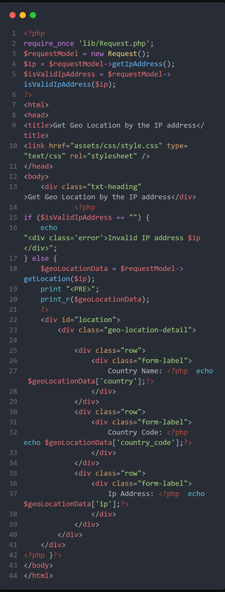
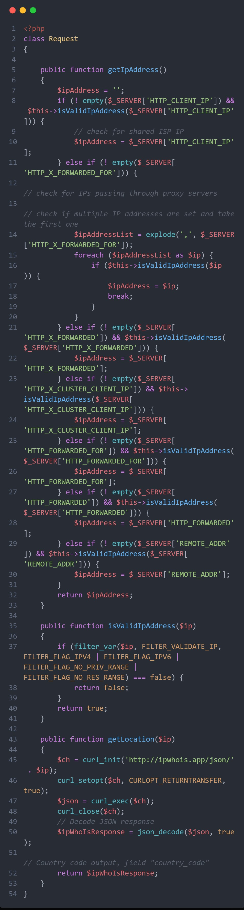
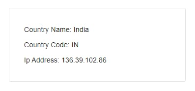
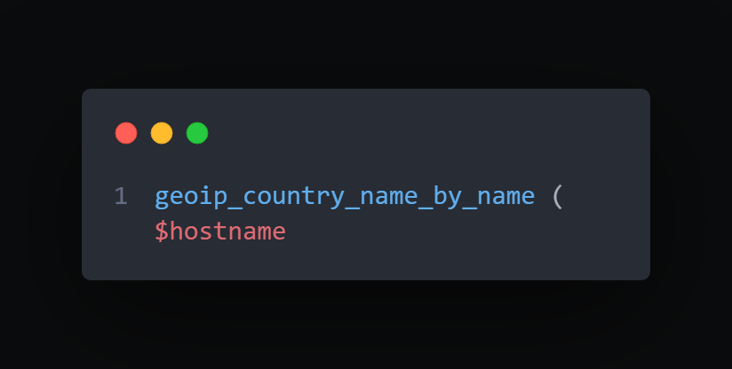

### Introduction

Due to a shortage of data collection methods, geolocation is currently in progress. Most geolocation providers were aware of pranks and monitoring GPS tracking devices. APIs may now be used by developers to move around. New communication points in programming languages are required for cross-framework collaboration (APIs). Customers that have been coerced have IP addresses that correspond to the country where they live. Take advantage of anonymizers, VPNs, and intermediaries to keep your identity secret.

### Table of content

- [Introduction](#introduction)
- [Table of content](#table-of-content)
- [Prerequisites](#prerequisites)
- [Objectives](#objectives)
- [Geolocation Marketing for Business](#geolocation-marketing-for-business)
- [Methods of Geolocation](#methods-of-geolocation)
- [Sign the current IP address.](#sign-the-current-ip-address)
- [Plan a PHP cURL API call for geolocation data.](#plan-a-php-curl-api-call-for-geolocation-data)
- [country geolocation in response to an API call](#country-geolocation-in-response-to-an-api-call)
- [Swap Geolocation API](#swap-geolocation-api)
- [Conclusion](#conclusion)
  - [Further reading](#further-reading)

### Prerequisites

- Fundamentals of PHP

### Objectives

> After completing this model, students should know the major principles of geolocation.

- Get the current IP address.
- Get the area using the PHP cURL API.
- Geolocation data is employed with programming connection point response to recall a nation.
- How to enable/disable Geolocation API.

### Geolocation Marketing for Business

- Customizing and delivering material (e.g., truck area and manifest status)
- Suit and administrative e-disclosure
- Autonomous vehicles
- Coercion recognition and forecasting using IP area technology and misrepresentation profile data
- Constant geolocation progress of logs and other IT information
  > Businesses need a geolocation and mobile technology. With cross-platform mobile applications, companies may combine location with online media and other data to generate superior services.

### Methods of Geolocation

IP addresses can find consumers. Consumer mistakes may nevertheless maintain data consistency and integrity. A common function in applications like currency converters and transit planners is to estimate district visits. The site's single language aids translation. A second layer displays the client's location. To show customers and equipment on Google Maps, utilize the Google Maps API.

### Sign the current IP address.

This is the mark of appearance code that allows consumers to be viewed based on their current geolocation data. It also exchanges the district association class and imports the region association class. When the IP address is valid and produces a lot of data, it asks for the geolocation. Alternatively, something terrible may occur, in which case the UI will be informed through the oversight message.

- index.php

  

### Plan a PHP cURL API call for geolocation data.

`$_SERVER` is used to form an if-else conditional ladder for the IP address acquisition.
`GetLocation()` may utilize cURL to access the `ipwhois API` when an IP address is supported, which gives a large amount of data. Afterward, the API will return a JSON object. Geolocation data is used to determine the nation's location.

### country geolocation in response to an API call

The area measurements, nation name, and ISO 3166 code are all shown on the map below.

An error message is shown to the client if the IP address is invalid.

### Swap Geolocation API

There are a variety of ways APIs may assist you to get new acceptance for local data. The plugin affiliation allows access via PHP, ASP, and JavaScript, despite the restriction. Using token-based authentication, this library identifies IP address space. Local data may be recovered using PHP's built-in GeoIP2 PECL extension. Using either the IP address or the space name, wrap up the country name:

### Conclusion

> Your customers' actual location is available at all times thanks to geolocation, which can be used on any Internet-connected device. Geolocation data may be utilized for several reasons in this context, including:

- Personalization and limitation of access to certain parts of the site
- Restrictions on access and delivery based on topography.
- Avoiding dishonesty.
- Keeping tabs on the flow of information throughout the firm.

#### Further reading

- [Google Maps](https://developers.google.com/maps/documentation/javascript/)

Happy Coding!
