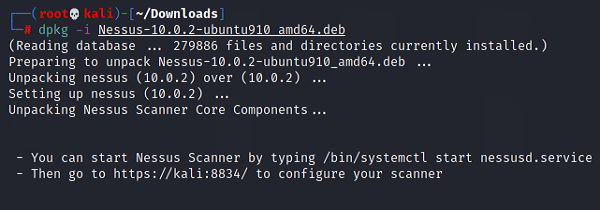
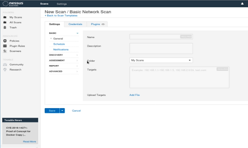
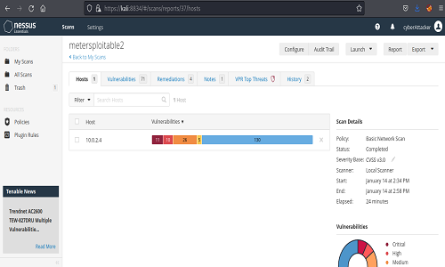
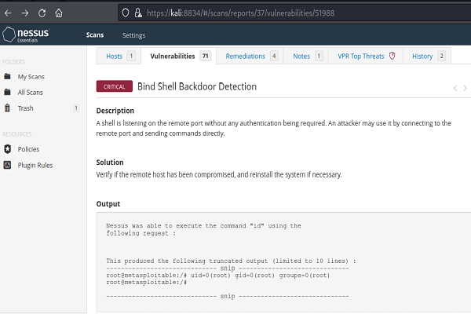

**Nessus Tenable** is a kali-Linux open-source software common among penetration testers, used to provide a variety of security fixes. You are going to be using this tool quite frequently while you work as a pen-tester by scanning for potential vulnerability on a Server/Website.
<!--more-->
**Nessus** scanner is a professional tool that is widely used among hackers and penetration testers. The solution you get assists you to perform high-speed asset discovery, target profiling, malware detection, sensitive data discovery and so many more.
**Tenable** delivers updated plug-ins that provide you with the latest information to customers within 24 hours after a vulnerability has been leaked.
**Nessus Tenable** grant you the privileges to scan basic networks and servers for free, and also provide you with how **critical**,**medium** or how **low** a vulnerability is and helps provide descriptions and solutions for a fix.

Most sites that talk about Nessus only point out how Nessus is being installed and how it is been used, But how to fix a real vulnerability is hardly in the scope of what they teach. I will show you how to fix a common vulnerability and also guide you through important Nessus keywords.

### Goal
At the end of this tutorial, you should be able to:

- Download and install Kali-Linux on your pc.

- Understand the fundamentals of Nessus Scanner.

- Understand the advantages of Nessus Scanner.

- Install and Download Nessus Tenable.

- Understand procedures to take in fixing vulnerabilities.

### Advantages of Nessus Scanner
- It helps you Identify vulnerabilities before attackers can take advantage of them.

- It helps you find misconfigurations like missing patches, mail-relay, etc.

- Capturing of data and showing results reporting impact on the network 

If you don't have Kali-Linux installed on your pc, Don't worry I will show you how to quickly set this up.

### Step 1:

### Installing Kali Linux

Use the link below to get to the download page:

- [Kali Linux iso](https://www.kali.org/get-kali/#kali-platforms)

#### Download Vmware (virtual box)

After successfully downloading the Kali Linux iso, you can now download the VMware virtual box using the link below:

- [Vmware virtual box](https://www.vmware.com/products/workstation-player/workstation-player-evaluation.html).

Follow the [installing Vmware](https://forums.tomshardware.com/faq/how-to-install-vmware-workstation-in-windows-10.3273363/) tutorials to successfully install the VMware virtual box.

After Successfully installing Kali-Linux in a Virtual-Box, You can now Start Kali by
Opening the virtual box, select the Kali Linux option, and click the play button to start your Kali Linux.

Enter your username and password when prompted.

**Note:** The **default** username is **root** and the default password is **toor**.

### Step 2:

### Download Nessus Tenable

- [Nessus Tenable](https://www.tenable.com/downloads/api/v1/public/pages/nessus/downloads/14957/download?i_agree_to_tenable_license_agreement=true).

After Successfully Downloading Nessus Tenable, Follow the steps below to install Nessus on Kali Linux:

- Start the **terminal** by:

 - Holding the **cltr+alt+T** buttons simultaneously or
   - Using the GUI (Graphical User Interface), go to the applications section and double click on the terminal option.

Now run the command below on the terminal to update and upgrade your Kali Linux.

```bash
    $ sudo apt-get upgrade && update -y
```
Now let's change our directory into where Nessus tenable is been installed.

```bash
    $ cd Downloads
```
Use the command below to list  all files in `Downloads` then copy the downloaded file name

```bash
    $ ls
``` 
Use the command below to grab the package to download it and install it.

```bash
    $ dpkg -i Nessus-10.0.2-ubuntu910_amd64.deb
```


You can now start Nessus scanner by typing the following into your terminal.

```bash
    $ /bin/systemctl start nessusd.service
```
Then Navigate to the following URL in your browser to start Nessus Scanner.

- [Nessus localhost](https://kali:8843/) to configure your scanner

- Default port to run Nessus is **`8834`**

If you see connection not secured,  click *advance* Accept risk and continue.

### Step 3:
- And here you have Nessus already on your screen, It going to compile plugins and it going to take a little bit of time so go ahead and let it finish. When it does go ahead and click `Nessus Essentials` and click continue.

- Now provide Your name and a valid Email to receive an activation code.

- Once your activation code has arrived in your email, go ahead and copy it.

- Paste the activation code into the activation box and click continue.

- Then it going to ask you for a Username and a password, go ahead and type in your information.

- Now Nessus is going to start the initializing process which is going to take a couple of minutes, Let it install while you go get a drink or coffee.

- That took forever! Alright now we have loaded Nessus and it is installed.

-  


### Step 4:
We will be using Metersploitable 2 as our vulnerable machine which we will be scanning.
- Metasploitable is an intentionally vulnerable virtual machine designed for training, exploit testing and general target practice. Unlike other vulnerable virtual machines, Metasploitable focuses on vulnerabilities at the operating system and network services layer instead of custom, vulnerable applications.

**Note:** You can scan any Website/Server you have full permission to with Nessus, but I will be using Metersploitable as an example to find its vulnerability and fix them.

### Download Metersploitable
Use the link  below to get to the download page:
- [Metersploitable](https://sourceforge.net/projects/metasploitable/files/Metasploitable2/metasploitable-linux-2.0.0.zip/download)
- Follow the [installing Metersploitable](http://techdjdey.blogspot.com/2017/10/how-to-install-metasploitable-2-in.html) tutorials to successfully install metersploitable into a virtual box.

After Successfully installing Metersploitable in a Virtual-Box, you can confirm your installation by opening the terminal in Kali-Linux and typing the `IP address` of metersploitable into your browser.

**Note:** Whatever you learn in this tutorial is only for educational purposes, and scan sites that you have full permission to.

### Scanning
- Navigate to Nessus in your browser tab

- You will be directed to a blank screen that says My scans, well it is blank because we haven't made a scan yet.

- So let's go ahead and click new scan at the top right corner

Here you are in the scan Template, you will find a lot of options to choose from but I will show the major scans which are **Basic Network Scan** and **Advanced Scan**, you will be using these major tools throughout your career as a Penetration-tester, lets start with the basic scan just as a beginner and then we move to Advanced scan in a more advance tutorial.

  - Let's quickly talk about what we are capable of doing in Nessus, this is the free edition of Nessus which means we can scan against any private address and we can scan up to 16 of those at a time.

### Basic Network Scan

 Click the Basic Network Scan to begin

Let's quickly talk about some tabs on the side, we have: 
-  **General**: This is where the information of the targeted machine will be entered.

- **Schedule**: Once enabled, Nessus will run a scan on a scheduled machine in a given time, you can do this periodically and get updated scan results.

- **Notification**: This is for `SMTP` if you have an SMTP server.

- **Discovery**: This is going to do a port scanning on a targeted machine.

- **Assessment**: We can scan default, Known Web vulnerabilities(quick), Known Web vulnerabilities(complex) But we will be using the know web vulnerabilities for now because it takes less time to scan.

- **Report**: You can use the report to edit scan results and also display hosts that responds to pings.

 - Go ahead and type in the name of the targeted site and description 

 - We're going to provide one `IP address and that is the IP of metersploitable.

 - Then click the save button



So now go ahead and click the **save button** below and then click the lunch (play) button on the next page to start the scanning process.

- You will notice a spinning icon, which means your scan has started.

- Once your scan is done you are going to see a nice checkmark that says complete.

- Double click on the scan and you will see the scan result with found vulnerabilities.



### Step 5
Looking at the overview we can see that the host has a lot of vulnerabilities.

- Click on the vulnerabilities tab take a peek at it and notice this vulnerability.

- Open a vulnerability you will like to fix in my case I will open the **Bind Shell Backdoor Detection vulnerability** and you will find the Description and solution to fix this vulnerability.



Nessus displays the severity, score, family, and count of all the vulnerabilities.
- Dark Red tab shows that the vulnerability is **critical**.
- Red tab shows that the vulnerability is **High**.
- Orange tab shows that the vulnerability is **Medium**.
- Yellow tab shows that the vulnerability is **Low**.

The severity outputs `Critical` and `Score` to be 9.8 which means we need to take quick measures in preventing attackers from exploiting this vulnerability.

**Notice:** You may not get full information about this vulnerability but you can go to the internet and get more details and know why it is critical.
You will get a solution on how to fix it in the solution part, so follow the steps and check out the **Output**

- Bind Shell Exploitaion.
    Metasploitable comes with an open bind shell service running on port 1524. and this open port can be connected easily with Netcat.

    **Note:** If you ever find a bind shell backdoor on any server, use [Nmap](https://www.nmap.org) to scan for an open port with the terminal, find the Bind shell Port and close it, this will block any incoming connection pinging to the open port, and that how you can fix the vulnerability easily.

### Summary

In this article we have learned how to:
* Install Kali-Linux in a Virtual Machine.

* Download and Install Nessus tenable with the terminal

* Scan a targeted host and fix the vulnerability with the solution provided to us.

### Conclusion
From this article, we have learned how to find vulnerabilities and fix them with the solution provided in the scan. There is no way we touch all of this assessment and fix all the vulnerabilities, so let's focus on the low-hanging fruit. So please do go look at your Nessus scan results in the information that is provided to you because it is super important.

### References and Further Reading
1.  [A complete guide to Nmap tutorial](https://www.edureka.co/blog/nmap-tutorial/).
2. [Netcat Complete Guide](https://www.kalilinux.in/2021/01/netcat-linux-tutorial.html).

---
Peer Review Contributions by: [Willies Ogola](/engineering-education/authors/willies-ogola/)
