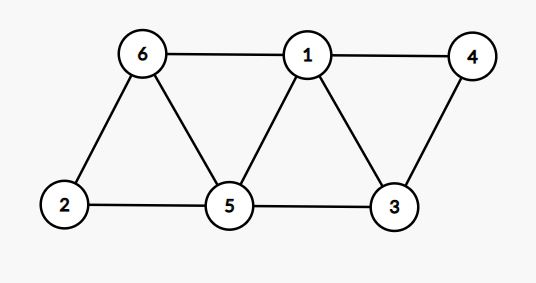
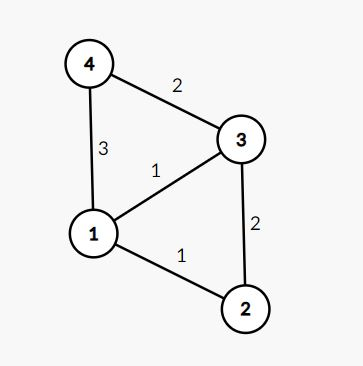

### Graphs in Data structure ( Using C++)

#### Introduction
Graphs are mathematical structures that reflect the pairwise relationship between things. A graph is a type of flow structure that displays the interactions of several objects. It may be represented by utilizing the two fundamental components shown below:

* **Nodes**: These are the most crucial elements of every graph. Edges are used to represent node connections. A graph with two nodes A and B connected by an undirected edge expresses a bi-directional relationship between the nodes and the edge.

* **Edges**: Edges are part of a graph showing the connections between nodes. An edge between two nodes expresses the nodes' one-way or two-way connection.

#### An application in real life 

* **Google Maps**: link your journey from the start to the end
* **Social Networks**: Friends with each other are connected using an edge where each user represents a vertex.
* **Recommendation System**: relationship data between users recommendation is use graph for connection.

#### Type of Graphs :
* **Undirected**: All edges in an undirected graph are bidirectional and do not point in any particular direction.



* **Directed**: In a directed graph all of the edges are uni-directional they point to a single direction.


* **Weighted**: Weighted graph, with each edge, allocated a weight or cost. Consider a network with four nodes, shown in the picture. As you can see, each edge has a weight/cost associated with it. If you wish to get from vertex 1 to vertex 3, you can choose one of three routes:
    * 1->3->2
    * 3->1
    * 1->3->4
  
As a result, the total cost of each path is as follows:

The total cost of 1->3->2 is (1+2), or three units.

The total cost of 1->3 is one unit.

The total cost of 1->3->4 is (3+2), or 5 units.



* **Cyclic**: A graph is cyclic if it has a path that starts and ends at the same vertex. This is referred to as a cycle. An acyclic graph does not have a cycle.


The diagram below depicts a cycle (0->1->2).
A tree is a graph that has just one path connecting any two vertices. An acyclic network with N-1 edges, where N is the number of vertices, is referred to as a tree. Every node in a graph may have one or more parents. In a tree as each node has precisely one parent node.

A tree cannot have any loops or cycles, whereas graphs may.


### Graph Representation 
A graph can be represented in several ways. The following are the two most frequent ways of expressing a graph:

* **Adjacency Matrix** 
A V*V binary matrix is an adjacency matrix. If there is an edge from vertex i to vertex j, element A<sub>i,j</sub> is 1, otherwise A<sub>i,j</sub> is 0.

  **Note**: A binary matrix is one in which the cells can only have one of two potential values: 0 or 1.

The adjacency matrix for the weighted graph can also be modified, such that instead of storing 0 or 1, the weight or cost of the edge is recorded in A<sub>i,j</sub>.

If A<sub>i,j</sub> is 1 in undirected graph then A<sub>i,j</sub> will also be 1.

If A<sub>i,j</sub> is 1 in  directed graph, then may or may not be 1.

The adjacency matrix offers constant-time access (O(1)) to detect if two nodes have an edge. The adjacency matrix has a space complexity of O(V)<sup>2</sup>.

* **Adjacency List**
An adjacency list is another way to represent a graph. An adjacency list is a collection of distinct lists in an array A. Each element of the array A<sub>i</sub> is a list containing all of the vertices next to vertex i.

In the case of a weighted graph, the weight or cost of the edge is stored in the list alongside the vertex using pairs. If vertex j is in list A<sub>i</sub>, vertex i will be in list A<sub>j</sub> in an undirected graph.

The space complexity of the adjacency list is O(V + E), since information in the adjacency list is only stored for edges that exist in the graph.
Representation of an undirected graph,

* G is an undirected graph with 5 vertices and 7 edges.
  
  

* Adjacency-list representation of G
  
  

* The adjacency-matrix representation of G
  
  

**Code for Adjacency list representation of graph** : 

``` C++
#include <iostream>
#include<list>
using namespace std;

class graph{
public:
    list<int> *adjlist;
    int n;
    graph(int v){
        adjlist=new list<int> [v];
        n=v;
    }

    void addedge(int u,int v,bool bi){
        adjlist[u].push_back(v);
        if(bi){
            adjlist[v].push_back(u);
        }
    }

    void print(){
        for(int i=0;i<n;i++){
            cout<<i<<"-->";
            for(auto it:adjlist[i]){
                cout<<it<<" ";
            }
            cout<<endl;
        }
        cout<<endl;
    }


};

int main() {
    graph g(5);
    g.addedge(1,2,true);
    g.addedge(4,2,true);
    g.addedge(1,3,true);
    g.addedge(4,3,true);
    g.addedge(1,4,true);

    g.print();
}

```

The complete execution of the above code can be found [here](https://replit.com/@AnubhavBansal1/Gaphs#main.cpp).

#### Output


* In the output you can see the implementation of graphs in adjacency list view.

#### Conclusion

By learning graphs from basics you will get to think more analytically while solving data structures questions. It would be great if you practice some of the graphs questions after understanding the foundation of graphs 

[Leet Code Problem 1](https://leetcode.com/problems/find-center-of-star-graph/)

[Leet Code Problem 2](https://leetcode.com/problems/find-the-town-judge/)

Happy Coding!
