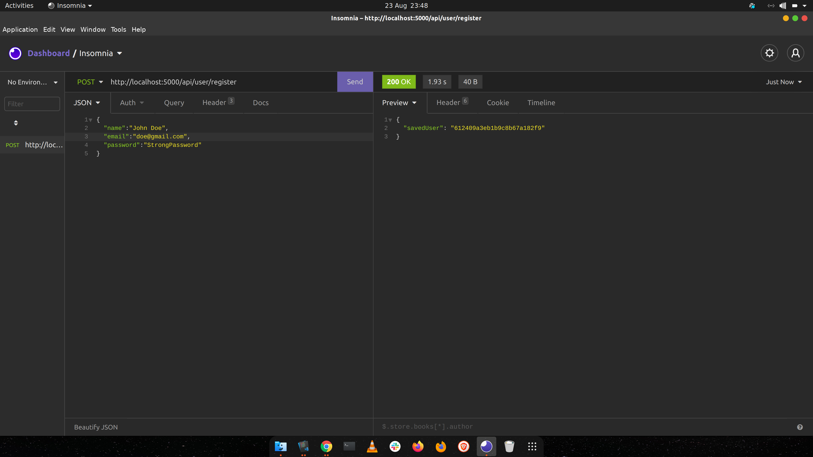

### Introduction
A website's security begins with having clean data in a database. It is good practice to ensure that information submitted to a database is accurate and filtered to avoid clouding it with either redundant or unrealistic records. 

This article enables the reader to learn how to use `Hapi` to clean data submitted in a form and ensure a correct validation before submitting the data to a database. Additionally, we will learn how to use `Bcrypt` in hashing passwords to avoid submitting plaintext password fields into our database. 

The two components work with `Json Web Tokens` to implement an authentication API to ensure security and clean data entry.

### Prerequisites
This project focuses on the back end, so we will be using Insomnia to post the request to the server. In addition, we will build a backend API that facilitates the registration and validation of user input.
To follow along, the reader needs to have the following.
- [Insomnia](https://insomnia.rest/download) installed in your machine.
- Have [Node.js](https://nodejs.org/) installed on your computer.
- A suitable code editor preferably [VS Code](https://code.visualstudio.com/download).


### Project setup
Start by setting up an open application in the desired folder using the command:
```js
npm init -y
```

It is preferable to work on a web project using the MVC architecture. So we will follow the same architecture for this project. Working with this architecture ensures an organized folder structure and easy to debug code. So set up the project folder structure as below.


### Installing dependencies
We need the following dependencies to make this project work:
- Express as the backend manager.
- JSON Web Tokens to generate authentication tokens.
- Hapi Validation to validate inputs before submission to the database.
- Bcryptjs for hashing and password comparisons.
- Dotenv to configure environmental variables.
- Mongoose to connect the project with MongoDB.
- Body0parser to parse request body sent from request.

Run the command  below to install all the dependencies:

```bash
npm install express mongoose jsonwebtokens @hapi/Joi bcryptjs dotenv body-parser
```

### Dependency import 
To import the dependencies installed, we need to add the snippets below in the application's entry point in the `index.js` file.

```js
const express = require('express')
const app = express(); 

//body parser
const bodyParser = require('body-parser')

//dotenv
const dotenv = require('dotenv')

//databse connection object
const connectDB = require('./config/database')
dotenv.config({path: './config/config.env'})

// auth router
const authRoute = require('./routes/auth');

// posts route
const postRoute = require('./routes/posts')

//calling database connection function
connectDB()

//port 
const PORT = process.env.PORT || 5000
app.use(express.json());
app.use(express.urlencoded({extended: true}))
app.use('/api/user', authRoute);
app.use('/api/posts', postRoute)

app.listen(process.env.PORT, () =>{console.log('Running')})
```

### Creating the model
We need one model for the `user`. The user model has a name, email, and password. We also include the date when we create a user. In the `models` folder, create a new file named `User.js` the add the snippet below:

```js
const mongoose = require('mongoose')

const userSchema = new mongoose.Schema(
    {
        name: {
            type: String,
            required: true,
            min: 6
        },
         email:{
            type: String,
            required: true, 
            min: 5,
            max: 255
        },
        password:{
            type: String,
            required: true,
            max: 1024
        },
        date: {
            type: Date,
            default: Date.now
        }
    }
)

module.exports = mongoose.model('User', userSchema);
```

### Connecting to the database
We will use mongo DB Atlas to keep our records. You can follow [this tutorial](https://docs.atlas.mongodb.com/connect-to-cluster/) to find out how to connect a mongo DB Atlas to a web Project. In the `config` folder, create a new file and name it `config.env`.  In this file, we are going to define our global variables for the project,

```env
PORT = 5000
MONGO_URI = 'YOUR MONGOBD CONNECTION URL'
TOKEN_SECRET = any random string
```
>The `TOKEN_SECRET` is a secret we will use with JSON Web Token later in the tutorial.

In the same folder, create a file called `database.js`, then add the snippets below to connect to the database.

```js
const mongoose = require('mongoose')

//connnect to database
const connectDB = async () => {
    try {
        const conn = await mongoose.connect(process.env.MONGO_URI, {
            useNewUrlParser: true,
            useUnifiedTopology: true,
            useFindAndModify: false,
        })
        console.log(`MongoDB Connected: ${conn.connection.host}`)
    } catch (err) {
        console.error(err)
        process.exit(1)
    }
}

module.exports = connectDB
```
### Validating inputs 
In the `routes` folder, create a new file for validation. In the file, we will have two constants for validation during registration and login. Add the snippets below for the validation process. The data object passed contains the information in the request body.

```js
//validation
const Joi = require('@hapi/joi')

const registerValidation = data =>{
    const schema = Joi.object(
    { 
        name: Joi.string().min(6).required(),
        email: Joi.string().min(6).required().email(),
        password: Joi.string().min(6).required() 
    });

    return schema.validate(data);
};

const loginValidation = data =>{
    const schema = Joi.object(
    { 
        email: Joi.string().min(6).required().email(),
        password: Joi.string().min(6).required() 
    });

    return schema.validate(data);
};


module.exports.registerValidation = registerValidation
module.exports.loginValidation = loginValidation
```

### Creating routes
This project will have three routes. The first route is for registering users into the database; the second will be for logging in a registered user, then the last route will show a user a list of items once they are logged in. Finally, the `posts` route will be a protected route only accessible to a registered user identified by an auth token generated by `Json Web Tokens`.

Create a new file called `auth.js` in the' routes folder and add the snippets below.

```js
const router = require('express').Router();
const User = require('../models/User')
const {registerValidation, loginValidation} = require('./validation')
const bcrypt = require('bcryptjs');
const jwt = require('jsonwebtoken')


router.post('/login', async (req, res) =>{
    const { error } = loginValidation(req.body)
    
    if(error){
        return res.status(400).send(error.details[0].message)
    }

    // Check if the user is existing
    const user = await User.findOne({email:req.body.email});
    if(!user){
        return res.status(400).send('Sorry email is not with our records')
    }

    //compare passwords
    const validPassword = await bcrypt.compare(req.body.password, user.password);
    if(!validPassword){
        return res.status(400).send('Sorry the password is invalid')
    }

    //creating and assignikng token 
    const token = jwt.sign({_id: user._id}, process.env.TOKEN_SECRET)
    res.header('authentication-token', token).send(token)
  
    
})

module.exports = router;
```

#### Registration route
This route registers users into the database. The data passed to this route is taken for validation in the `registerValidation`. 

```js
router.post('/register', async (req, res) =>{
    const { error } = registerValidation(req.body)
    
    if(error){
        return res.status(400).send(error.details[0].message)
    }

    // Check if the user is existing
    const emailExists = await User.findOne({email:req.body.email});
    if(emailExists){
        return res.status(400).send('Email already in the database')
    }
})
```

If there are no errors, the email in the request body is checked against all the database records for similarity. If the email is unique, we call `bcrypt` to encrypt the password for security. 

```js
//Hashing the passwords
const salt = bcrypt.genSaltSync(10);
const hashedPassword  = bcrypt.hashSync(req.body.password, salt);
```

Afterward, a new user instance is created and saved into the database.

```js
const user = new User(
    {
        name: req.body.name,
        email: req.body.email,
        password: hashedPassword
    }
);

try{
    const savedUser = await user.save()
    res.send({savedUser: user._id})
}catch(err){
    console.log(err)
    res.status(400).send(err)
}
```

#### The login route
The login route takes data in the request body and passes it for validation by the `loginValidation`. Next, `Hapi` checks the data for any errors. If there is none, the database is queried for a record with the supplied email.

```js
router.post('/login', async (req, res) =>{
    const { error } = loginValidation(req.body)
    
    if(error){
        return res.status(400).send(error.details[0].message)
    }

    // Check if the user is existing
    const user = await User.findOne({email:req.body.email});
    if(!user){
        return res.status(400).send('Sorry email is not with our records')
    }
})
```
In the next step, we use `bcrypt` to compare the supplied password in the request body with its equivalent hash in the database. If the passwords match, the user is logged in and assigned a `JSON web token secret` to his `userID`, which allows them to access protected routes since the token is attached to the request header.

```js
//compare passwords
const validPassword = await bcrypt.compare(req.body.password, user.password);
if(!validPassword){
    return res.status(400).send('Sorry the password is invalid')
}

//creating and assignikng token 
const token = jwt.sign({_id: user._id}, process.env.TOKEN_SECRET)
res.header('authentication-token', token).send(token)
```

### Token verification
We need to verify that the token is passed to the request header so that only authenticated users can access protected routes. We check if there is an `authentication token` in a request, and if the request has no token, it is denied access to a protected route. 

```js
const jwt = require('jsonwebtoken')

module.exports = function(req, res, next){
    const token = req.header('authentication-token');
    if(!token){
        return res.status(400).send('Access denied!');
    }
}

```

However, if the token is available in the request header, we mark the user as verified and allow him to access protected routes.

```js
try {
    const verified = jwt.verify(token, process.env.TOKEN_SECRET)
    req.user = verified;
    next()
} catch (error) {
    res.status(400).send('Invalid token')
}
```

### Protecting routes
To protect a given route, we need to add the `verify` method before the request as show below:

```js
const router = require('express').Router();

//verify
const verify = require('./verifyToken')

//method called in the request
router.get('/', verify, (req, res) =>{
    res.json({
        posts:{
            title:"Very first post",
            body: "Random post you should not even see"
        }
    })
})

module.exports = router;
```
The above snippet means that only authenticated users can access the posts. 

### Testing the project
To test this project, we need to run the command `nodemon index` to start the development and try the endpoint in `Insomnia`. Of course, Postman can work here as well.

#### Testing validation
Let us try using a short password/ email than the length specified in the `registerValidation` to see if our validation worked. We will begin by navigating to the `register` route.


Next, if we use the wrong email, we get a validation error, as shown below.


However, when all fields are filled correctly, and the validation is passed, the user is added to the database. The `user-id` is returned as shown.



#### Testing protected route access
When we try accessing the `posts` route without being logged in, we are denied access.


However, when we are logged in, we get an authentication token that we add to the request's header and obtain access to the protected route.


### Conclusion
This tutorial taught us to validate user input using `Hapi`, password encryption with `bcrypt`, and JWT authentication. We built an authentication API using the three and testes=d out application. This tutorial should give the reader a way of getting started with data cleaning and securing data for their web project.
