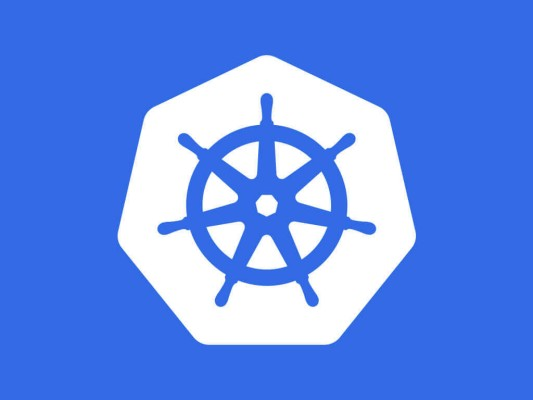
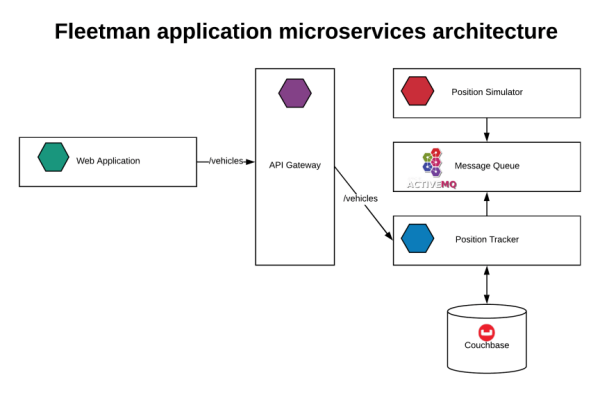
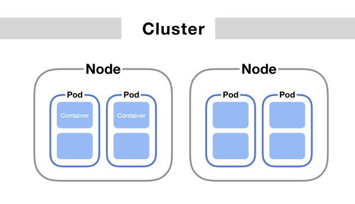
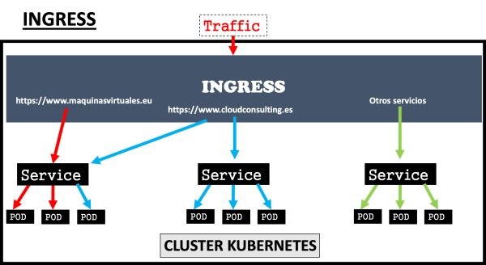

### HOW SWEET IS KUBERNETES?



What was your first impression when you read Kubernetes?

I bet you were already thinking,
*“Oh no, here comes another tech buzzword. Already sounds like a difficult concept.”*

Well, you are not so right. But let’s dive in!

At first, it would be better to understand that we would be using the Fleetman application to explain the concept of Kubernetes.

NB: You can clone the GitHub repository used to describe this tutorial on:

[Deploying fleetman with kubernetes](https://github.com/wizardcalidad/deploying_fleetman_application_with_kubernetes)

The Fleetman Application is built for  a company that needs to track the location of their trucks as they move around the city of London. Those trucks are each equipped with Global Positioning System(GPS) and periodically report their position to the central server. It is a simple microservice architecture with little to no complexity, it is not your day-to-day hello world application. We are using some pre-built images on DockerHub.com under the Richard Chesterwood repository.



### OVERVIEW OF FLEETMAN APPLICATION

Obviously, we are not discussing fleetman’s application here, instead, we will be using fleetman’s application to better understand our content, do not be discombobulated if I did not explain the flow of the processes in the YAML files below in full.


Microservices of course obey the SOLID principle, the first being the Single Responsibility Principle, each and every part of the architecture should do just one thing.

The Position Simulation only simulates the positions of the truck at any point in time and that is its only job, once it reads the position, it hands it over to the Message Queue, the essence of a queue in any architecture of microservice is to avoid loss of data. Instead of making the position simulator and the tracker tightly coupled, a queue is introduced in between to avoid loss of data at any instance. The queue receives the data, keeping it waiting for the request from the position tracker. The queue implemented here is ActiveMQ, it is also utilized as a docker container. The position tracker gets the information from the queue and performs a lot of calculations with it, like calculating the speed a certain truck has covered. API Gateway is the single entry point to the entire application, its job is to match all requests incoming to underlying microservices.

### WHAT KUBERNETES IS

In proper definition: Kubernetes is an open-source system for automating deployment, scaling, and management of containerized applications.

**KUBERNETES Vs. DOCKER**

| s/n | DOCKER  |  KUBERNETES  |
|----|----------------------------|:----------------------------------    |
| 1.|Docker is used for building and contanerizing images.   |Those container built, the function of kubernetes is to manage them effectively, hence you can say Kubernetes is an orchestration tool.  |
| 2. |Docker runs on a single node. | Kubernetes runs across clusters. |
| 3. |Docker is built by three y-connector graduates. | Kubernetes is built by google engineers before been made an open source project. |

However, it’s better to see for ourselves how it works with the aid of the Fleetman application that I deployed on my repo as the instructional material.

### WHAT KUBERNETES IS NOT

Kubernetes is not an alternative to Docker. It is something more.


### MAJOR CONCEPT IN KUBERNETES

**DEPLOYMENT**

Deployment is a configuration that provides declarative updates to applications. It allows you to describe an application's life cycle, such as which images to use for the app, the number of pods there should be, and the way they should be updated. It is also a configuration where you can determine the number of replica sets to be produced per pod. It helps maintain the cluster in order to avoid the minutest downtime. We can say it is like a blueprint that dictates how every pod feature will behave.

The kind of configuration we are declaring is deployment while, the name is position simulator. The container we used is on line 17, the position simulator release 1 from Richard Chesterwood repository. As we can see, ‘replicas’ is being specified as our replica set, and the template is what declares our pod. For a standard, YAML file even though can be separated, to ensure orderliness and separation of concerns, we write the services of each deployment in the same file, separating them with three dashes(-). Some do arrange theirs as all services in a separate file, that too is acceptable.

```insert code in here```
```
apiVersion: apps/v1
kind: Deployment
metadata:
  name: position-simulator
spec:
  selector:
    matchLabels:
      app: position-simulator
  replicas: 1
  template: # template for the pods
    metadata:
      labels:
        app: position-simulator
    spec:
      containers:
      - name: position-simulator
        image: richardchesterwood/k8s-fleetman-position-simulator:release1
        env:
        - name: SPRING_PROFILES_ACTIVE
          value: production-microservice
```

**POD**

Kubernetes uses the concept of pods to interact with the container., A pod is an abstraction of a container and, each container is entirely saved in the pod for Kubernetes to interact with. We can, therefore, say that, the only way a Kubernetes system can interact with a container is through a pod. Pods are represented as a template in our yaml files for deployment.

If you follow through the deployment of the position simulator, you will realize that a fragment of the script is actually declaring our pod. The part:

```insert code in here```
```
 template: # template for the pods
    metadata:
      labels:
        app: position-simulator
    spec:
      containers:
      - name: position-simulator
        image: richardchesterwood/k8s-fleetman-position-simulator:release1
        env:
        - name: SPRING_PROFILES_ACTIVE
          value: production-microservice

```
**REPLICA SETS**

Replica sets are the abstraction of a pod, just as pods are abstractions of a container which is the running instance of an image.

So, why do we need a replica set? It is because we are trying as much as possible to ensure our application runs at all time, while also avoiding downtimes., Iin a situation where our pods are shutting down, we will be sure there are other copies. As the replica sets are stored elsewhere, we can have as many as possible replica sets per pod saved somewhere in a node. It is specified as replicas in the deployment we showed above.

**How does a Replica Set differ from Deployment?**

The major difference between a replica set and deployment is that,

1. A replica set ensures that a specified number of pod replicas are running at any given time. However, a deployment is a higher-level concept that manages Replica Sets and provides declarative updates to pods alongside other useful features.

2. When updates are made to our image in a replica set, the application shuts down because another one is being spun up, unlike a deployment which, ensures that the old replica sets continue running pending the time the new image is being spun up. Once the new one is working, it will shut down the old one entirely, thereby ensuring no downtime at all.

**NODE**



A node is like a single PC in a cluster where pods reside. There can be multiple pods in a node, the least number of nodes you can have in a cluster is two. Inside a node, there is at least a pod and, a container which the pod abstracted. Many times, there are situations when there can be more than one container in a pod., However, the convention is always one container per pod. There can also be several pods in a node, with each one having its own service.

**SECRET**

Because of our database, we need a SECRET configuration whose, the function is to house or store secret data that we do not want to expose.

```insert code in here```
```
apiVersion: v1
kind: Secret
metadata:
   name: mongodb-secret
type: Opaque
data:
   mongo-root-username: d2l6YXJkY2FsaWRhZA==
   mongo-root-password: T2xhdHVuZGU4IQ==


```
However, our database username and password that is kept secret is also not to be exposed to the world. Therefore, the only thing we are exposing is the key generated after converting them to base 64. To convert your username and password, write the following script on your terminal.

```insert code in here```
```
echo -n “the content to convert” | base64

```

**SERVICE**

It is just like an endpoint or API points for Kubernetes, Service has a permanent IP address. When a pod is being updated, the IP of the pod will change but the IP of our services never change. This is why all pods are connected to a service. There can be several pods attached to one service, but that is the essence of our replica sets. So, when one goes down, others are being spun up.

Let's pull out the services in fleetman application as examples.

```insert code in here```
```
apiVersion: v1
kind: Service
metadata:
  name: fleetman-api-gateway

spec:
  # This defines which pods are going to be represented by this Service
  # The service becomes a network endpoint for either other services
  # or maybe external users to connect to (eg browser)
  selector:
    app: api-gateway

  ports:
    - name: http
      port: 8080
      nodePort: 30020

  type: NodePort

```
```insert code in here```
```
apiVersion: v1
kind: Service
metadata:
  name: mongo-express-service
spec:
  selector:
    app: mongo-express
  type: NodePort
  ports:
    - protocol: TCP
      port: 8081
      targetPort: 8081
      nodePort: 30090
```

```insert code in here```
```
kind: Service
apiVersion: v1
metadata:
  name: fleetman-mongodb
spec:
  selector:
    app: mongodb
  ports:
    - name: mongoport
      port: 27017
  type: ClusterIP
```
```insert code in here```
```
apiVersion: v1
kind: Service
metadata:
  name: fleetman-position-tracker

spec:
  # This defines which pods are going to be represented by this Service
  # The service becomes a network endpoint for either other services
  # or maybe external users to connect to (eg browser)
  selector:
    app: position-tracker

  ports:
    - name: http
      port: 8080

  type: ClusterIP
```

```insert code in here```
```
apiVersion: v1
kind: Service
metadata:
  name: fleetman-webapp

spec:
  # This defines which pods are going to be represented by this Service
  # The service becomes a network endpoint for either other services
  # or maybe external users to connect to (eg browser)
  selector:
    app: webapp

  ports:
    - name: http
      port: 80
      nodePort: 30080

  type: NodePort
```
**CONFIGMAP**

This is a configuration that stores all external configurations of the application. External configurations include all third-party configurations like database URLs and ports.

```insert code in here```
```
apiVersion: v1
kind: ConfigMap
metadata:
  name: mongodb-configmap
data:
  database_url: fleetman-mongodb
```
**INGRESS**



This is an external service in our application, and it addresses how the IP address in the browser is being linked to the right service in the node. Do not forget that services are attached to pods, and are just access points consisting of ports that, in turn, interact to be able to interact with our pods. The process through which pods are being scheduled across nodes in the form of replica sets is called the “Master Process”, and it is done with the aid of a “Scheduler”.

### Thanks for reading.
