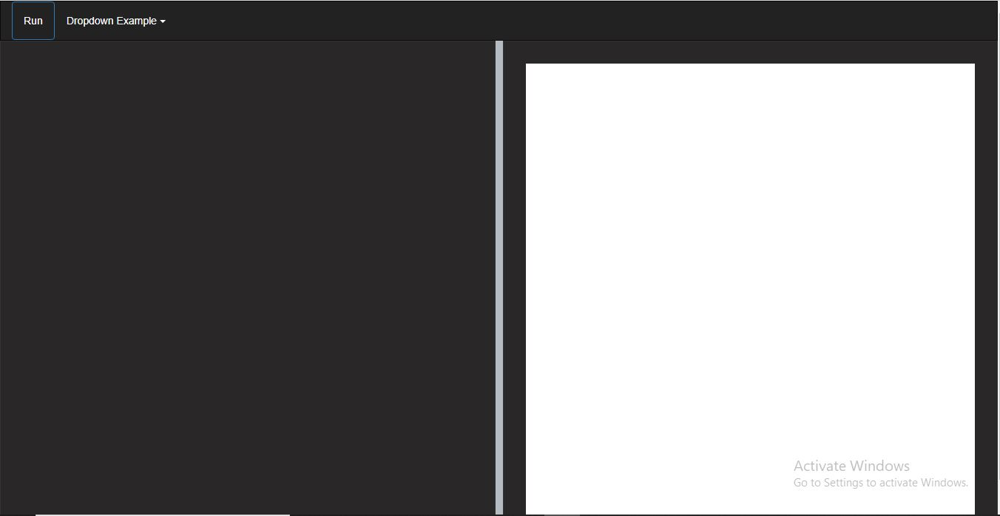
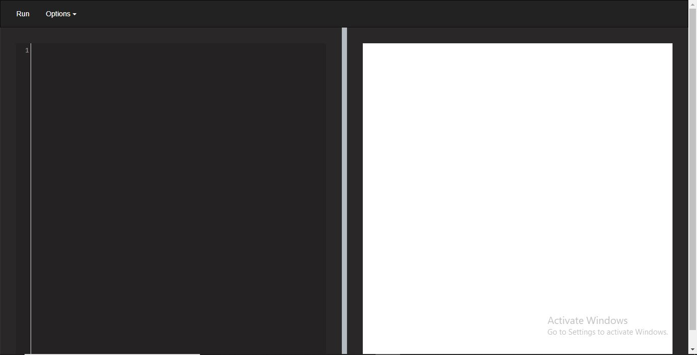

### Introduction 
The advent of online code tutorial websites has brought a need for live code editors. These editors aim to portray available code snippets or add some augmentation to the code snippet. Online code editors also serve as remote workspaces, teamwork tools if implemented. Several websites use code editors, with the most popular being codepen. There are other notable mentions like w3school and js fiddle.

In this article, we'll focus on CodeMirror. CodeMirror is a versatile text editor implemented in JavaScript for the browser. It is specialized for editing code and comes with several language modes and addons that implement more advanced editing functionality. It is the editor used in dev tools for [Firefox](https://hacks.mozilla.org/2013/11/firefox-developer-tools-episode-27-edit-as-html-codemirror-more/), [Safari](https://developer.apple.com/safari/tools/) and [Chrome](https://developer.chrome.com/docs/devtools/).

This tutorial will guide you on how to build your code editor using code mirror's unique API.

### Prerequisites
To understand this guide properly, the reader should have prior knowledge on:
- [JavaScript](https://developer.mozilla.org/en-US/docs/Web/JavaScript).
- [HTML](https://developer.mozilla.org/en-US/docs/Web/HTML).
- [CSS](https://developer.mozilla.org/en-US/docs/Web/css).
- [Bootstrap](https://getbootstrap.com/docs/5.0/getting-started/introduction/).
- Code editors like [_visual studio code_](https://code.visualstudio.com/download), [_sublime text_](https://www.sublimetext.com/3).

### Goal
In this guide, we will build a code editor using codemirror's API. At the end of this tutorial, we will have a functional code editor to run HTML, CSS and JavaScript. It will also have features such as code autocomplete, quick format. With split.js, our editor will have a split, adjustable screen between the editor and iframe display.

### Getting Started

To get started, we'd need to import codemirror's Javascript and CSS files. We took the liberty of downloading the files and stored on the GitHub repository [here](https://github.com/ayodele96/code-editor/tree/main/Src). For ease, we advise the files should be downloaded to your local storage.
#### Creating the navbar
We'll create a simple front end with buttons like run and a drop-down containing our format and comment feature. To achieve this, we'd be making use of bootstrap 5.
To get started, we'd initialize our HTML boilerplate, add our personal CSS and the bootstrap JS and CSS file using a content delivery network (CDN).

#### Example
``` html
<html lang="en">
<head>
    <title>Code-Editor</title>
    <meta charset="UTF-8">
    <meta http-equiv="X-UA-Compatible" content="IE=edge">
    <meta name="viewport" content="width=device-width, initial-scale=1.0">
    <link rel="stylesheet" href="https://maxcdn.bootstrapcdn.com/bootstrap/3.4.1/css/bootstrap.min.css">
</head>
<body>
    
</body>
<script src="https://ajax.googleapis.com/ajax/libs/jquery/3.5.1/jquery.min.js"></script>
<script src="https://maxcdn.bootstrapcdn.com/bootstrap/3.4.1/js/bootstrap.min.js"></script>
</html>
```
Next, we'll create a navbar containing the aforementioned features. We'd start by adding a `nav` tag to our body section, followed by a div. After, we'll add an unordered list tag (`ul`) within the div and concurrently a ordered list tag (`li`) within for the `run`. That's basically the essential tags for the navbar. Below is the navbar design;
```html
<nav class="navbar navbar-inverse">
    <div class="container-fluid">
        <ul class="nav navbar-nav">
            <li><a class="btn" id="run-btn">Run</a></li>
            <li class="nav-item dropdown">
                <a class="btn dropdown-toggle" type="button" data-toggle="dropdown">Dropdown Example
                    <span class="caret"></span></a>
                <ul class="dropdown-menu">
                    <li><a href="javascript:autoFormatSelection()">Format</a></li>
                    <li><a href="javascript:commentSelection(true)">Comment</a></li>
                    <li><a href="javascript:commentSelection(false)">Uncomment</a></li>
                </ul>
            </li>
        </ul>
    </div>
</nav>
```
If properly implemented, we should have our navbar as below;


#### Adding the text editor and iframe display
This part involves adding a side by side editor and iframe display. We would split them apart using an adjustable resizer with the aid of split.js. We will add the codemirrors CSS and JS files, the split.js JS files with a content delivery network.

Example
```html
<link rel="stylesheet" href="codemirror.css">
<script src="codemirror.js"></script>
<script src="https://unpkg.com/split.js/dist/split.min.js"></script>
```
Note! We have made some slight changes to Codemirror's CSS to get our desired result.

We then create a container `div`, followed by two seperate `div` within the container. One of those `div` is for the editor and the other for the iframe display. For the split feature, we would create a script tag for that. An example of the implementation is placed below;
```html
<div class="editor">
    <div id="resizeMe" class="code a">
        <div class="html-code"></div>
    </div>
    <div class="code pa">
        <iframe id="preview-window"></iframe>
    </div>
</div>
```
```html
<script>
    Split(['.a', '.pa'])
</script>
```
`.a` and `.pa` are the class names for the editor and Iframe display.

Altogether, we should have our layout as below;

#### Adding the main editor features
We will show you how to make the editor javascript, CSS and HTML compatible. Also, we'll add the auto-complete and format feature.
 
Let's begin. First, we import the Javascript, HTML and CSS javascript files into our code. They are as below;
```html
<script src="xml.js"></script>
<script src="javascript.js"></script>
<script src="css.js"></script>
<script src="htmlmixed.js"></script>
```
We will be creating a script tag, this is the essential part of the project. According to the documentation, we are to use `.getValue()` rather than `.value()`. The java script code is shown below;
```js
var htmlEditor = CodeMirror(document.querySelector(".editor .code .html-code"), {
    mode: "htmlmixed",
    tabSize: 4,
    lineNumbers: true,
    extraKeys: { "Ctrl-Space": "autocomplete" }
});
CodeMirror.commands["selectAll"](htmlEditor);

function getSelectRange() {
    return { from: htmlEditor.getCursor(true), to: htmlEditor.getCursor(false) };
}

function autoFormatSelection() {
    var range = getSelectRange();
    htmlEditor.autoFormatRange(range.from, range.to);
}

function commentSelection(isComment) {
    var range = getSelectRange(), selStart = htmlEditor.getCursor("start");
    htmlEditor.commentRange(isComment, range.from, range.to);
    htmlEditor.setSelection(selStart, htmlEditor.getCursor("end"));
}
document.querySelector("#run-btn").addEventListener("click", function () {
    let htmlCode = htmlEditor.getValue();
    let previewWindow = document.querySelector("#preview-window").contentWindow.document;
    previewWindow.open();
    previewWindow.write(htmlCode);
    previewWindow.close();
});
```
`.querySelector()` gives the first element that matches a given CSS selector in the document.

For the auto-compelete feature, comment and format feature, we will import their java script and css files. They are shown below;
```html
<link rel="stylesheet" href="show-hint.css">
<script src="formatting.js"></script>
<script src="show-hint.js"></script>
<script src="xml-hint.js"></script>
<script src="html-hint.js"></script>
``` 
Finally, we should have our code has;
```html
<html lang="en">

<head>
    <title>Code-Editor</title>
    <meta charset="UTF-8">
    <meta http-equiv="X-UA-Compatible" content="IE=edge">
    <meta name="viewport" content="width=device-width, initial-scale=1.0">
    <link rel="stylesheet" href="codemirror.css">
    <link rel="stylesheet" href="show-hint.css">
    <link rel="stylesheet" href="https://maxcdn.bootstrapcdn.com/bootstrap/3.4.1/css/bootstrap.min.css">
    <link rel="stylesheet" href="index.css">
</head>

<body>
    <nav class="navbar navbar-inverse">
        <div class="container-fluid">
            <ul class="nav navbar-nav">
                <li><a class="btn" id="run-btn">Run</a></li>
                <li class="nav-item dropdown">
                    <a class="btn dropdown-toggle" type="button" data-toggle="dropdown">Options
                        <span class="caret"></span></a>
                    <ul class="dropdown-menu">
                        <li><a href="javascript:autoFormatSelection()">Format</a></li>
                        <li><a href="javascript:commentSelection(true)">Comment</a></li>
                        <li><a href="javascript:commentSelection(false)">Uncomment</a></li>
                    </ul>
                </li>
            </ul>
        </div>
    </nav>
    <div class="editor">
        <div id="resizeMe" class="code a">
            <div class="html-code"></div>
        </div>
        <div class="code pa">
            <iframe id="preview-window"></iframe>
        </div>
    </div>
</body>
<script src="codemirror.js"></script>
<script src="formatting.js"></script>
<script src="show-hint.js"></script>
<script src="xml-hint.js"></script>
<script src="html-hint.js"></script>
<script src="xml.js"></script>
<script src="javascript.js"></script>
<script src="css.js"></script>
<script src="htmlmixed.js"></script>
<script src="https://unpkg.com/split.js/dist/split.min.js"></script>
<script src="https://ajax.googleapis.com/ajax/libs/jquery/3.5.1/jquery.min.js"></script>
<script src="https://maxcdn.bootstrapcdn.com/bootstrap/3.4.1/js/bootstrap.min.js"></script>
<script>
    Split(['.a', '.pa'])
    var htmlEditor = CodeMirror(document.querySelector(".editor .code .html-code"), {
        mode: "htmlmixed",
        tabSize: 4,
        lineNumbers: true,
        extraKeys: { "Ctrl-Space": "autocomplete" }
    });
    CodeMirror.commands["selectAll"](htmlEditor);

    function getSelectedRange() {
        return { from: htmlEditor.getCursor(true), to: htmlEditor.getCursor(false) };
    }

    function autoFormatSelection() {
        var range = getSelectedRange();
        htmlEditor.autoFormatRange(range.from, range.to);
    }

    function commentSelection(isComment) {
        var range = getSelectedRange(), selStart = htmlEditor.getCursor("start");
        htmlEditor.commentRange(isComment, range.from, range.to);
        htmlEditor.setSelection(selStart, htmlEditor.getCursor("end"));
    }
    document.querySelector("#run-btn").addEventListener("click", function () {
        let htmlCode = htmlEditor.getValue();
        let previewWindow = document.querySelector("#preview-window").contentWindow.document;
        previewWindow.open();
        previewWindow.write(htmlCode);
        previewWindow.close();
    });
</script>
```
If properly implemented, we should have the following results;




### Conclusion
In conclusion, we learned how to create an HTML, CSS and javascript compatible editor, add an HTML code format feature, auto-completion feature, adjustable split-screen using split.js. We brought all these components together to have a responsive code editor using codemirror.
[here](https://github.com/ayodele96/code-editor/blob/main/code-editor.html) is the full code.
### Further Reading
- [The codemirror documentation](https://codemirror.net/)
