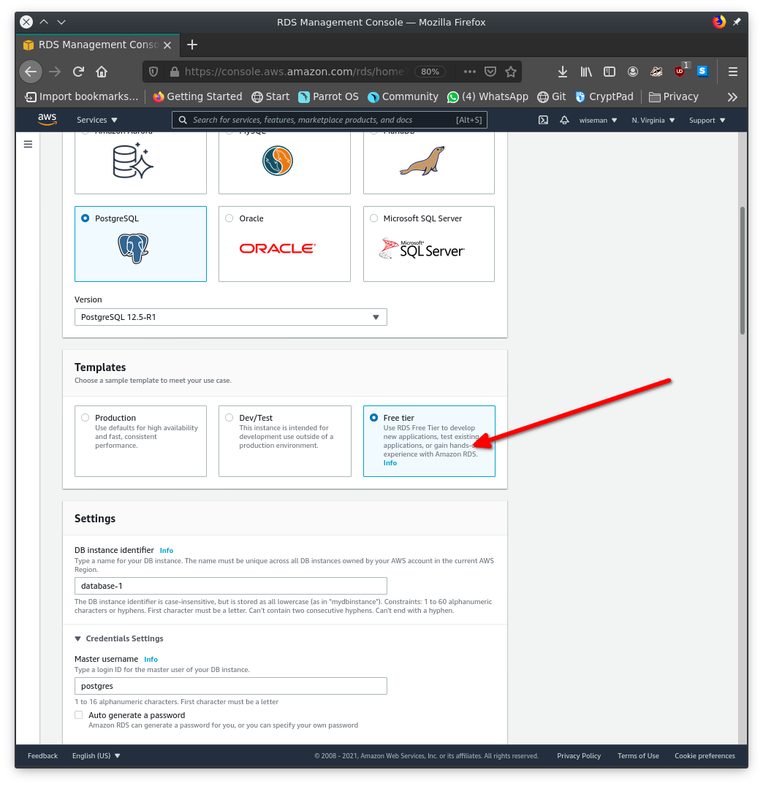
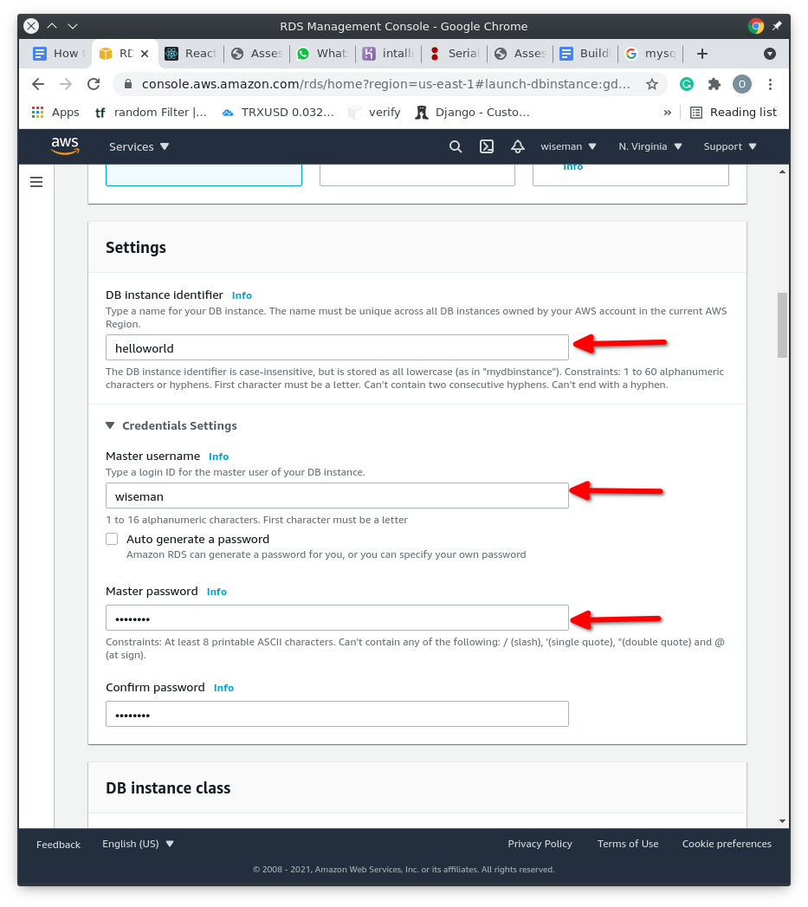

How to Configure a Relational Database Server on AWS

There are a lot of reasons you should use Amazon Web Services (AWS) to host your next project's database. One of them is that AWS offers a variety of options for growing and safeguarding your databases.

However, navigating the AWS configuration settings might prove difficult and the docs aren't always the most user-friendly.

In this article, we will go over how to set up an RDS on AWS. We will also use MySQL Workbench to connect to the RDS.

# Prerequisites


* AWS account
* MySQL-Workbench
* Python
* mysql-connector-python

# Setting up a Security Group


1. Sign in to your AWS account. [https://console.aws.amazon.com/?nc2=h_m_mc](https://console.aws.amazon.com/?nc2%3Dh_m_mc*)
2. In the search bar, type Security groups. Then select Security groups under Features.

 


3. In the new page, select Create Security Groups.
4. After doing that, we enter the details of the new security group we are creating.
5. We also have to set the inbound and outbound rules of the security group. 

The inbound rules specify the type of traffic that will be allowed into the server. We also have to specify our outbound rules, that is the type of traffic that will be allowed to leave the server. We will be allowing traffic on MySQL. 

The source and destination value for the inbound and outbound rule will be set to Any by default. You might want to set it to the IP of your production server so that the database only sends and receives traffic from your production server. This makes the database server less vulnerable. 


6. Save the new security group. 

# Setting up a Relational Database Server


1. On the AWS management console, input RDS in the search bar and select RDS.
2. Under the "Create database" section, select Create database
3. In this tutorial, we will be setting up a MySQL database. In the new page, under the Engine Options, select MySQL. In the template section, choose the free tier option.
4. Fill out the fields in the Settings section as follows
5. Leave all other default settings on the page and scroll down to the connectivity setting. In case you were wondering why we created a security group earlier, this is why we need it. 

In the Existing VPC security group menu under the Connectivity section, look for the security group we created earlier. We named it helloworld-db. Also make sure you select Yes in the public access setting.Select the security group and proceed to the next step.


6. In the Additional Configuration section, set the name of the initial database that will be on your database server instance. 
7. Finally, click on the Create database button In the new page, you’ll see an option to view your database credentials. This will display the credentials you entered when creating the database. You can also click on the name of the database in the table above to view other connecting parameters. 

# Connecting the RDS Server to MySQL Workbench

MySQL workbench is an integrated development environment for MySQL server. Download it [here](https://dev.mysql.com/downloads/workbench/).


If you did not set the password earlier, you will be asked to do so. 

You can now execute SQL queries.

# Connecting to the Rds Server From Python

In this section , we will focus on the MySQL Connector Python module. We can use this module to communicate with the MySQL server we created earlier. We need some parameters to establish the connection.

| Parameter |  Description  |
| -----------| ---------------                   |
| Username | The username you entered while creating the RDS  |
| Password          | The password you entered while creating the RDS|
| Host name  | This can be seen in the Connectivity&Security section   |
| Database name| The database name you entered in the additional information section|


When you have these parameters ready, you can proceed to install mysql-connector-python. `pip install mysql-connector-python`

We can now create tables and perform CRUD operations.

## Creating a Table

```python
import mysql.connector
try:
    # Create Connection
    connection = mysql.connector.connect(
        host="helloworld.cb06vljwaire.us-east-1.rds.amazonaws.com",
        database="mydatabase",
        user="wiseman",
        password="your password",
    )
    # SQL query to create a new table
    create_table_query = """CREATE TABLE people ( 
                             id int(11) NOT NULL,
                             firstname varchar(250) NOT NULL,
                             lastname varchar(250) NOT NULL,
                             age  INT NOT NULL,
                             PRIMARY KEY (Id)) """
    cursor = connection.cursor()
    result = cursor.execute(create_table_query)
except mysql.connector.Error as error:
    print("Failed to create table in MySQL: {}".format(error))
finally:
    if connection.is_connected():
        cursor.close()
        connection.close()
        print("MySQL connection is closed")
```

# Conclusion

In this tutorial, we have been able to configure a Relational Database Server on Amazon Web Services. We used a MySQL server for this. We also explored how to establish a connection with our RDS via MySQL Workbench and python.

