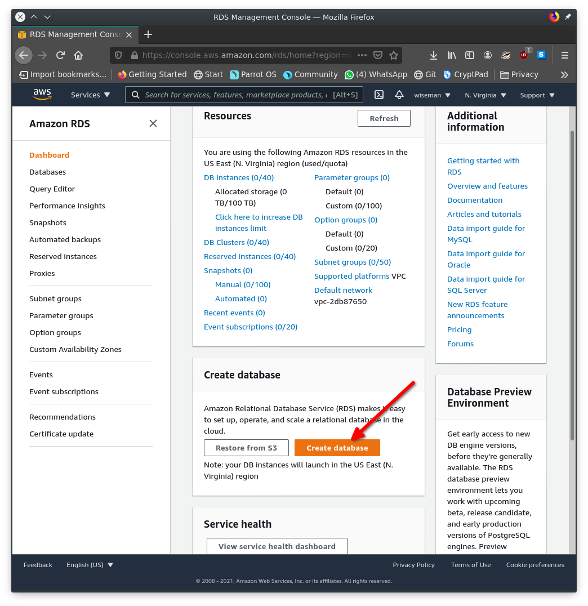

How to Configure a Relational Database Server on AWS

There are a lot of reasons you should use Amazon Web Services (AWS) to host your next project's database. One of them is that AWS offers a variety of options for growing and safeguarding your databases.

However, navigating the AWS configuration settings might prove difficult and the docs aren't always the most user-friendly.

In this article, we will go over how to set up an RDS on AWS. We will also use MySQL Workbench to connect to the RDS.

# Prerequisites

* AWS account
* MySQL-Workbench

# Setting up a Security Group

1. Sign in to your AWS account. [https://console.aws.amazon.com/?nc2=h_m_mc](https://console.aws.amazon.com/?nc2%3Dh_m_mc*)

2. In the search bar, type **Security groups**. Then select **Security groups** under **Features**.
 

3. In the new page, select **Create Security Groups**.

4. After doing that, we enter the details of the new security group we are creating.

5. We also have to set the inbound and outbound rules of the security group. 
The inbound rules specify the type of traffic that will be allowed into the server. We also have to specify our outbound rules, that is the type of traffic that will be allowed to leave the server. We will be allowing traffic on MySQL. 
The source and destination value for the inbound and outbound rule will be set to Any by default. You might want to set it to the IP of your production server so that the database only sends and receives traffic from your production server. This makes the database server less vulnerable. 

6. Save the new security group. 

# Setting up a Relational Database Server

1. On the AWS management console, input RDS in the search bar and select RDS.

2. Under the "Create database" section, select **Create database**

3. In this tutorial, we will be setting up a **MySQL** database. In the new page, under the Engine Options, select **MySQL**. In the **template** section, choose the  **free tier** option.

4. Fill out the fields in the **Settings** section as follows

5. Leave all other default settings on the page and scroll down to the connectivity setting. In case you were wondering why we created a security group earlier, this is why we need it. 
In the **Existing VPC security group** menu under the **Connectivity** section, look for the security group we created earlier. We named it **helloworld-db**. Also make sure you select Yes in the public access setting.

Select the security group and proceed to the next step.

6. In the **Additional Configuration** section, set the name of the initial database that will be on your database server instance. 

7. Finally, click on the **Create database** button 

In the new page, you’ll see an option to view your database credentials. 

This will display the credentials you entered when creating the database. You can also click on the name of the database in the table above to view other connecting parameters. 

# Connecting the RDS Server to MySQL Workbench

**MySQL workbench** is an integrated development environment for **MySQL** server. Download it [here](https://dev.mysql.com/downloads/workbench/).

If you did not set the password earlier, you will be asked to do so. 

You can now execute SQL queries.

# Conclusion

In this tutorial, we have been able to configure a Relational Database Server on Amazon Web Services. We used a MySQL server for this. We also explored how to establish a connection with our RDS via MySQL Workbench. 

