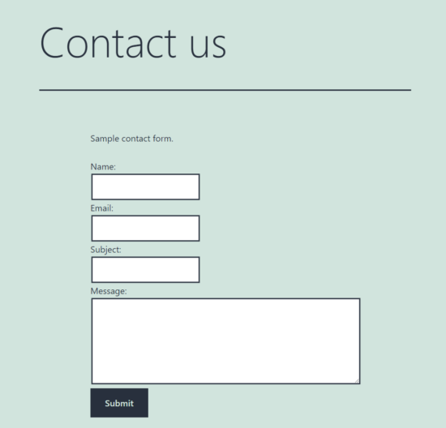

### Introduction

A contact structure is a significant part of any site. It goes about as a scaffold between the supplier and the client. Making a contact structure for a WordPress stage is simple work. You need to go through only a couple of steps to follow to dispatch an effective contact structure for a WordPress site.
We have seen an excessive number of assortments of the contact structures model in center PHP. Regardless of the stage, structure, or CMS, however, the idea is something similar to compose the cycle stream.
In this way, in case you know about a contact structure regarding how it is functioning, then, at that point it is straightforward the WordPress form of it.
I have fabricated a WordPress custom format for this contact structure UI. Then, at that point, I map the layout for the contact page made utilizing the administrator board.

### Table of contents

- [Introduction](#introduction)
- [Establish WordPress environment](#establish-wordpress-environment)
- [Make a contact page utilizing WordPress administrator](#make-a-contact-page-utilizing-wordpress-adminstrator)
- [Make youngster topic for the dynamic subject](#make-youngster-topic-for-the-dynamic-subject)
- [Make a contact template model](#make-a-contact-template-model)
- [Send AJAX demand utilizing wp_ajax snares](#send-ajax-demand-utilizing-wp_ajax-snares)
- [WordPress contact structure yield](#wordpress-contact-structure-yield)
- [Conclusion](#conclusion)

### Establish WordPress environment

Set up the WordPress environment to make a contact structure in that. The requirements of setting up WordPress are,

- PHP 7.4 or more.
- MySQL 5.6 or more or MariaDB 10.1 or more.
- Apache or Nginx (mod_rewrite empowered)
- HTTPS support.

More information on setting up a WordPress environment can be found in the [official documentation](https://wordpress.org/support/article/how-to-install-wordpress/).

### Make a contact page utilizing WordPress administrator

In case you are new to WordPress you should begin with an amateur's manual to figure out how to fabricate a WordPress site.
After establishment, it will permit login to the WordPress administrator board.
In the left menu `Pages->Add` New explores to make another contact page. It will request the page title and content.
**There are different approaches to show the contact page content.**

- The contact HTML can be straightforwardly added to the make new page and administrator interface.
- Showing contact format with the WordPress layout records.
- Enlisting shortcodes to deliver contact page design in the frontend.
  In this model code, I utilized the WordPress format documents to stack the contact design.

### Make youngster topic for the dynamic subject

I have made the WordPress youngster topic to modify the right now initiated subject.
We can likewise make a gadget with the contact structure and render it to the topic design.
The beneath screen capture shows the topic's document structure with the youngster subject. The youngster topic has the WordPress layout record `contact-template.php`. This record has the contact HTML with the customer-side AJAX script.
The `functions.php` record snares the `wp_ajax` to deal with the contact structure on submit.


### Make a contact template model

This is the WordPress format record make for this contact structure model.
It stacks the page title and content of the page made in the WordPress administrator board to show on the contact page.
Added to that, it has the contact structure HTML. The structure contains the fundamental fields name, email and that's only the tip of the iceberg. Every one of the fields is obligatory and approved utilizing JavaScript.
The approval script is in the format record. We can likewise enqueue the JavaScript resources by utilizing the WordPress center capacities `wp_enqueue_script()`.

```php
<?php
get_header();
while (have_posts()) :
    the_post();
    ?>
<article id="post-<?php the_ID(); ?>" <?php post_class(); ?>>

    <header class="entry-header alignwide">
            <?php
    the_title('<h1 class="entry-title">', '</h1>');
    ?>
        </header>
    <!-- .entry-header -->
    <div class="entry-content">
 <?php
    the_content('<p>', '</p>');
    ?>
    <link rel="stylesheet" type="text/css"
            href="/wordpress/wp-content/themes/twentytwentyone-child/style.css">
        <form name="contactForm" id="contactForm" method="post"
            onsubmit="return formValidation()"  action="">
            <div class="row">
                <div class="label">Name:</div>
                <input type="text" id="name" name="name">
            </div>
            <div class="row">
                <div class="label">Email:</div>
                <input type="text" id="email" name="email">
            </div>
            <div class="row">
                <div class="label">Subject:</div>
                <input type="text" id="subject" name="subject">
            </div>
            <div class="row">
                <div class="label">Message:</div>
                <textarea id="message" name="message" rows="5"></textarea>
            </div>
            <div class="row">
                <input type="submit" value="Submit"> <span id="status"></span>
            </div>
        </form>
    </div>
</article>
<!-- #post-<?php the_ID(); ?> -->
<?php
endwhile;
get_footer();
?>
```

The above record has the contact format name toward the start. It assists with showing the Template dropdown records in the administrator.
Pick the `QUICK EDIT` choice of the contact page from `Pages->All` Pages. The beneath screen capture shows the choice to pick the contact layout for the page.
In the contact-page alter screen, it shows the youngster topic layout name in a dropdown.


### Send AJAX demand utilizing wp_ajax snares

This JavaScript code has two capacities. The `formValidation()` is for approving the contact structure and the `processContactSubmit()` is to call `wp_ajax` to handle the contact structure in WordPress.
The AJAX demand passes the approved structure information to the worker side. It calls the `admin_ajax.php` with the activity boundary to snare the `wp_ajax`.

**Ajax script**

```javascript
<script>
function formValidation() {
      event.preventDefault();
      var name = document.forms["contactForm"]["name"].value;
      var email = document.forms["contactForm"]["email"].value;
      var subject = document.forms["contactForm"]["subject"].value;
      var message = document.forms["contactForm"]["message"].value;
      document.getElementById('status').innerHTML = '';
      var errorMessage="<span class='error'>All fields are required.</span>";
      var regEx = /^([A-Za-z0-9_\-\.])+\@([A-Za-z0-9_\-\.])+\.([A-Za-z]{2,4})$/;

         if (name.trim() == "" ||email.trim() == "" || subject.trim() == "" || message.trim() == "") {
             document.getElementById('status').innerHTML = errorMessage;
             return false;
           }
       if (!regEx.test(email)) {
           var errorMessage="<span class='error'>Invalid email.</span>";
            document.getElementById('status').innerHTML = errorMessage;
            return false;
          }
      processContactSubmit();
      return true;
    }

function processContactSubmit() {
                var request = new XMLHttpRequest();
                request.open("POST", "/wordpress/wp-admin/admin-ajax.php?action=process_contact_form");
                request.onreadystatechange = function() {
                    if(this.readyState === 4 && this.status === 200) {
                        document.getElementById("status").innerHTML = this.responseText;
                    }
                };
                var myForm = document.getElementById("contactForm");
                var formData = new FormData(contactForm);
                request.send(formData);
}
</script>
```

functions.php
In functions.php, it snares the `wp_ajax` activity `process_contact_form()` on mentioning through AJAX.
It gets the structure information to set the contact email subject and the primary body content.
It additionally sets the mail header and beneficiary email address to go through the mail sending capacity.
This code utilizes the `wp_mail` to send the contact email utilizing WordPress. There are WordPress modules to empower SMTP for sending messages.

```php
<?php
add_action('wp_ajax_nopriv_process_contact_form', 'process_contact_form');

function process_contact_form()
{
    $to = "Recipient Email Address";
    $subject = $_POST["subject"];
    $headers = "Testing";
    $message = $_POST["message"];
    $attachments = "";
    $sent = wp_mail($to, $subject, $message, $headers, $attachments);
    if (! $sent) {
        echo "<span class='error'>Problem in sending mail.</span>";
    } else {
        echo "<span class='success'>Hi, thank you for the message.</span>";
    }
    wp_die();
}
```

### WordPress contact structure yield

The contact structure yield shows the contact structure format made with a WordPress layout record.
The underneath screen captures show the customer side and worker side reactions on presenting the structure information.


In the wake of executing the wp_ajax mail sending activity, it returns the boolean reaction to check the mail is sent or not.

In light of the wp_mail work return information, the AJAX endpoint plans reactions. Figures show the achievement or the disappointment reaction of this WordPress contact structure model.


### Conclusion

In this way, we have figured out how to make a contact structure in WordPress. I trust this will assist you with reproducing something very similar in a WordPress site.

We have seen different approaches to deliver contact structures or any format on the client end. The means to make a custom contact format might assist with building various layouts and fabricate customizations.

The code with wp_ajax activity snares characterizes a segment to handle contact structure information and mail sending.

With this essential thought, it will allow you to set up a get a statement, project request, or any of such structure-based UI format in WordPress.

Happy coding!
