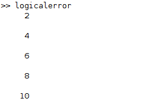
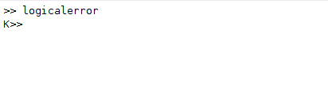
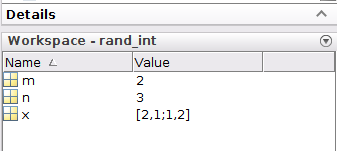

### HOW TO DEBUG MATLAB CODE
### Introduction
Errors occur everywhere in this world and programmers too are not excluded when writing their codes. This could be caused by writing a code 
that the software doesn't understand or a mistyping by the user. When you run your software with these errors, it's either the program will not 
run or give unexpected results. It is not running because it doesn't understand the code and it gives unexpected results due to misinterpretation 
of the code. These errors are called a bug. The process of analysing your code to remove these errors is called debugging.
Debugging a code at some points may be hectic since it involves locating the error. Also, Matlab's error statement may sometimes be difficult to 
understand. In this article, we are going to look at how to locate the error in a code and how to correct them. Besides that, Matlab has an 
inbuilt debugger that helps in debugging codes. We will also look at this tool and how to use it

### Prerequisites
- [Matlab](https://www.mathworks.com/products/get-matlab.html?s_tid=gn_getml) installed.
- Proper understanding of [matlab](https://www.section.io/engineering-education/getting-started-with-matlab/) basics.

### Types of errors in Matlab
Matlab just as other software can detect errors. When this occurs, the program stops running or wrong results are obtained. Generally, there are 
three main types of errors that may occur when using Matlab. These errors are such as;
1. Syntax error
2. logical errors
3. Runtime errors

### 1. Syntax errors
The syntax is the rule that defines the meaning of various symbols in a program. They tell the computer how to read and translate the various codes. 
It is the writing of code using specific words or styles as specified in various softwares. Syntax errors occur when a programmer uses the wrong 
syntax when running his code. They are as well known as typing errors. This is because they majorly occur due to typing errors. An example is typing 
`plog` instead of `plot`. The good news about Matlab is it shows the error and in large codes, for syntax errors, it locates the position of 
the error. Let's have an example of such errors and how Matlab raises the flag.

```Matlab
fprintf(today is my birthday)
```
When we run this code, Matlab raises a flag to show the availability of an error and the execution stops. This is how it appears.


Here, probably the programmer forgot to add some symbols to the code. Thus the execution of the code stops and the flag is raised as shown.
Another syntax error may occur due to the misspelling of a variable. For example, you define a variable but misspell it when using it for example;

```matlab
temp = 15;
newtemp = tem + 3
```
When the code above is executed, we get the below results.


Generally, there are many causes of syntax errors in Matlab. As you continue learning Matlab, You will learn the various syntax errors and know 
how to spot and correct the various errors. 

### 2. Logical errors
Logic errors occur when there is a problem with the logic of the problem. It can be described as the misinterpretation of the Matlab code. Though 
logical errors do not cause the program to crash or stop the execution process, it gives a wrong or unexpected result. These errors may be hectic 
to spot. This is because there is no readable or flag raised by the software for the error. This can be frustrating especially if you do not know 
about debugging.
For example;
```matlab
%print odd numbers from 1 to 10
for i = 1:10
if rem(i,2) == 0
disp(i)
end
end
```
Here we are expecting our program to display the odd number but the output is not as we expected. The results are as shown below;



### 3. Runtime error
These are errors that occur during the execution of a program. They can either occur on the software or the hardware and this cause a malfunction 
on either. This error should be spotted since it may result in critical safety and even business operation concerns. Runtime errors can cause a 
system of high integrity to fail which can cause disastrous results. They are at some point the reason for various system failures. This type 
of error is hard to detect since it involves anticipating every possible execution of your software. Anticipation is the process of testing 
every possible behaviour of your program. This involves testing all the possible combinations of variables or input or all possible decision 
paths at least once. This is maybe so hectic for large programs.

### Debugging of Matlab codes
Matlab have some great debugging tools that help you to find the various mistakes in your code. The main concept of debugging is that of a breakpoint. 
A breakpoint is something that pauses code execution at the location. For example, if you want Matlab to pause before executing a certain line of code, 
you will place breakpoints there. This is done by clicking on dashes next to the number line in a Matlab script or function.


If in case of any modification in the script or function with a breakpoint, the breakpoints turn to grey until the changes are saved. This means 
that the breakpoints are not active. Once the changes are saved, they change to red. This means that they are active. If we run the code above, we have,



The letter K shows that the program is being controlled by a debugger and it is stopped. The green arrow next to the breakpoint shows that the 
execution stopped there since there is a breakpoint there. To be clear, the execution stopped before executing this line.

 
The various debugging components that you can use to debug your code are located at the top of the Matlab window. To get all these components, 
click on the dropdown button of the breakpoint shown in the image above. When you click that, you get the options as shown below.


Now we will discuss the various actions of each. We will not discuss the clear all, set/clear, enable/disable and set conditions since they are 
explained in the window.
- Step-This is the command used to execute the current line. 
- Step in -This is used to get user-defined function in case it should be used in the current line. It calls the function but stops on the first line 
- of the function.
- Step out This used to move the next line of a function in case a function was called using the `step in` function. In case the function or variable 
- was defined in the command window, it returns to the window.
- Continue-This is used for the continuation of the execution of the program to completion unless another breakpoint is encountered in the process.
- Quit debugging-It exits the debugging mode and do not clear the execution of the current function.

### Sample debugging process
Lets debug this function
```matlab
function x = rand_int(n,m)

x = randi(n,m);
fprintf('The last element is %d\n', x(n,m))
```
When we run this function, we have an error as shown below;


We will place a breakpoint in the third line and rerun the program. We get the result as shown;


Now from our error message, we saw the Matlab demanding more arguments, so we will input arguments to our function right in front of the `k` in the
command window. For this case, we will add the code below in front of the `k`.
```Matlab
rand_int(3,2)
```
After making this correction, we click on the `step` to see its effect.


If we look at Matlab's workspace, we have something interesting. let's have a look.


If we look at the workspace, the variables have been assigned a value, but the matrix that we get is a 2x2 matrix which is not what we expect. We can 
type `whos` in the command window to see more details about our variables.
 
Remember the `K>>` act just as normal command window, you can do anything, plot, assign any variable a value we wish e.t.c. The only difference is 
that the window now belongs to the active function and in our case `rand_int`.
We might want to know the values of our variables, but the important part is to use the `size` function to check the dimension of the array stored 
in variable `x` which shows clearly that it is a 2x2 matrix.


At this point, you can now locate your source of error and make a necessary update. Once this is done, we can clear all the breakpoints using `clear all` 
and then `quit debugging`. For more complicated errors, you can click on the `step` to move through the code line by line.

### Conclusion
Debugging is so necessary and important part of a programmer. It is used to avoid problems that may occur due to the various errors caused by 
a program. Though at points it may be so hectic and boring, as a programmer you got no option. This makes it necessary for all programmers to be 
equipped with this skill. For proper debugging, you need to understand what you are doing and the expected result from all your program lines. 
This also makes debugging easy especially when locating the logical errors.
