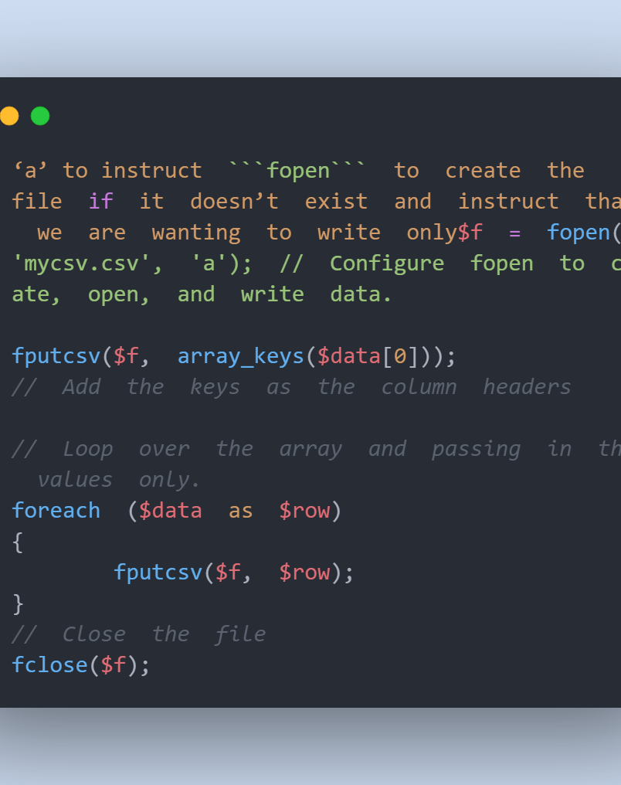
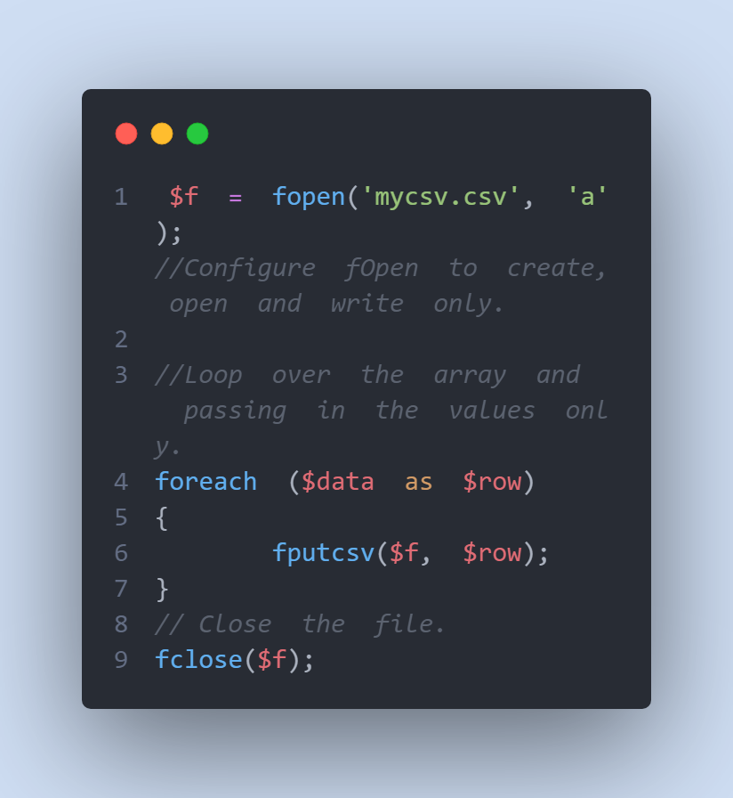
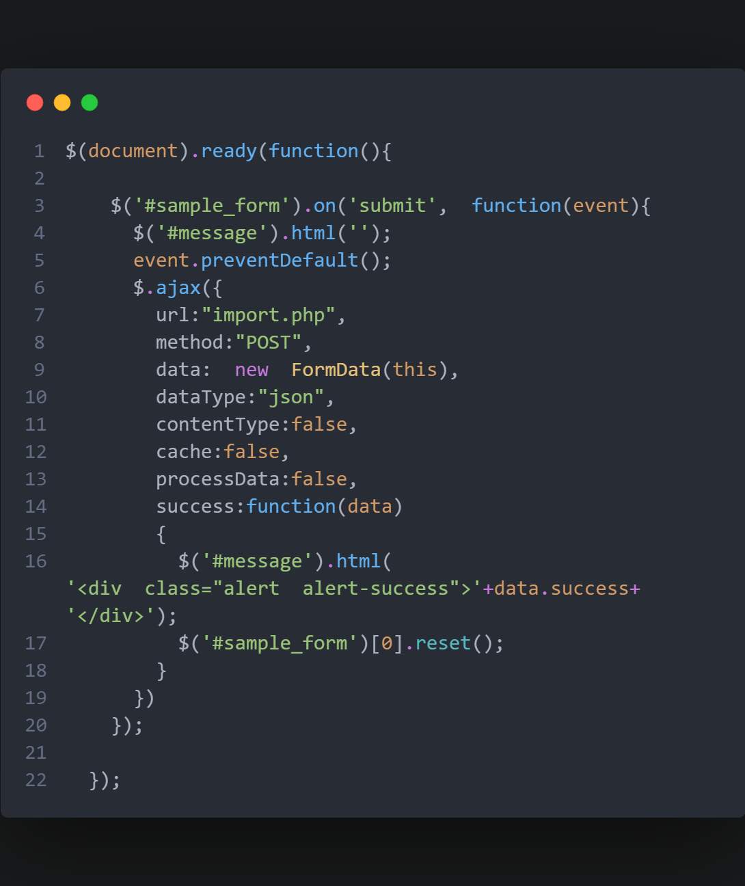
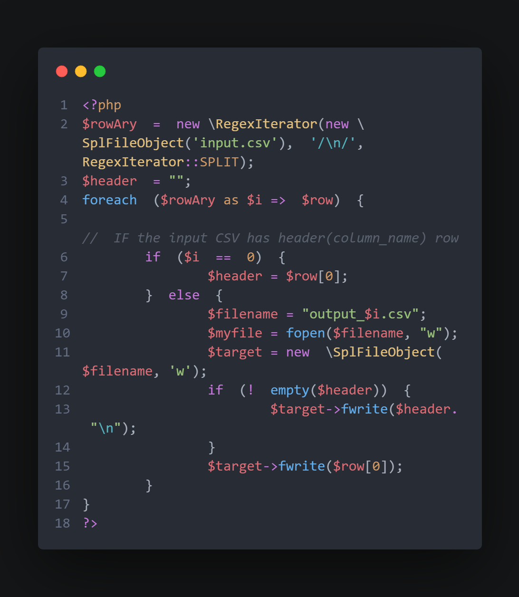
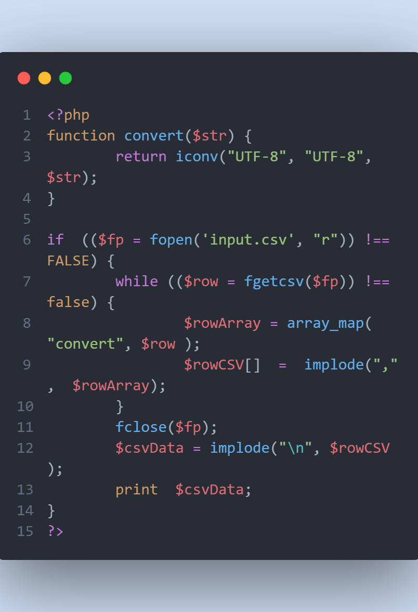
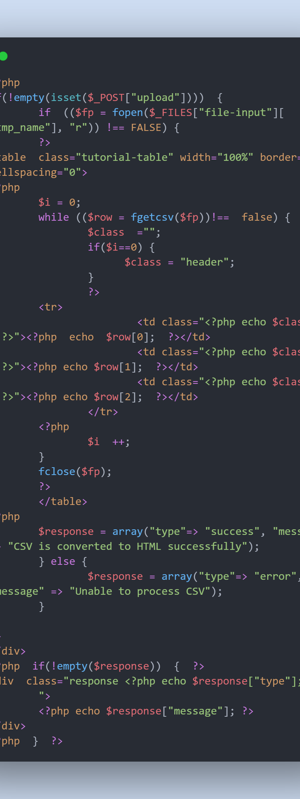
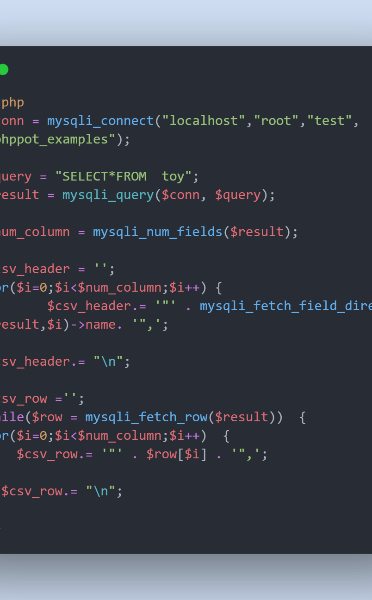

### Introduction

CSV is a standard filesystem used by programmers to manage data. Earlier, the delimiter was merely a comma(,) hence the name Comma Separated Value. Today, CSV files employ tab-demitted raw data. In this article we will have a look at how we can implement CSV to read and write data from a database.

### Table of contents

- [Introduction](#introduction)
- [Table of contents](#table-of-contents)
- [prerequisites](#prerequisites)
- [Objectives](#objectives)
- [PHP arrays to CSV](#php-arrays-to-csv)
- [How to format a CSV file](#how-to-format-a-csv-file)
- [Big CSV file import to MySQL](#big-csv-file-import-to-mysql)
- [How to split and manage large CSV files?](#how-tosplit-and-manage-large-csv-files)
- [How can I open a CSV file that has been encrypted with chapters?](#how-can-i-open-a-csv-file-that-has-been-encrypted-with-chapters)
- [Create HTML table from an Excel spreadsheet using the PHP language.](#create-html-table-from-an-excel-spreadsheet-using-the-php-language)
- [Create a common data values in PHP from a CSV file](#create-a-common-data-values-in-php-from-a-csv-file)
- [CSV references in generic databases.](#csv-references-in-generic-databases)
- [Download as CSV File through browser using Content-Type](#download-as-csv-file-through-browser-using-content-type)
- [Built-in functions in PHP allow you to read CSV files.](#built-in-functions-in-php-allow-you-to-read-csv-files)
- [Conclusion](#conclusion)
  - [Further Reading](#further-reading)

### prerequisites

> This tutorial will only be useful if the following is in place :

- PHP Programming Basics
- SQL Programming Basics

### Objectives

- By the end of this article the learners should be able to do the following:

1. Convert PHP arrays to CSV
2. Format a CSV file
3. Import large CSV file to MySQL
4. Split and manage large CSV files
5. Open a CSV file that has been encrypted with chapters
6. Create HTML table from an Excel spreadsheet using the PHP language
7. Create a common data values in PHP from a CSV file

### PHP arrays to CSV

PHP can write a variety of formats to CSV files. To accomplish this task, we may utilize several of the built-in functions like `fорen(),` ` fрutсsv()` аnd `fсlоse()`.

`Аssосiаtive Аrrаy Tо СSV Methоd`



This is a breakdown of the parameters.

- First, we open and write to the file using `foрen()`. two parameters
- It's important to provide the file's full path and filename as part of the identifier.
  - Use **'a'** to tell fopen to create the file and only write if it doesn't already exist.
- The next step is to add the first column or array headers. Only the keys are sent to `fрutсsv()`, which is called outside the loop.
- From here, we use `fpputcsv()` to loop over the whole array, but this time we send in 'rоws,' or values, instead of arguments.
- As a last step, tell PHP to save and shut the file, completing the write operation.

`indexed array to CSV`



### How to format a CSV file

Data pipeline developers are hampered by incorrect CSV files. pipelines promote consistency in order to provide a continuous flow from the point of origin to the point of destination. In your car's tank, you have a gallon of simple syrup. Using bad CSV files results in a bad data pipeline. System performance increases if an error is spotted early enough.

### Big CSV file import to MySQL

A program in MySQL allows you to import data from csv files since they are so small. As a result, you may use a PHP script to import CSV files into MySQL databases.

1. Maintain One folder for all of your php and csv files
2. The imported data should be stored in a table in your MySQL database.
3. Open it from the localhost of your server.
4. Check all boxes as you go.
5. Press the "upload" button.

`index.php`
You can find all of the tutorial's client-side code here. A SV file on our computer was selected using an HTML form, and it was sent to the import using ajаx and jQuery. For the php server script, `FormDаta()` was used . Only CSV files are accepted when using the `accept=".csv"` parameter.

```html
<!DOCTYPE html>
<html lang="en">
  <head>
    <meta charset="UTF-8" />
    <meta http-equiv="X-UA-Compatible" content="IE=edge" />
    <meta name="viewport" content="width=device-width, initial-scale=1.0" />
    <title>Document</title>
  </head>
  <body>
    <div class="container">
      <h2 class="text-center">How to Handle data with CSV</h2>
      <div class="box box-default">
        <div class="box-heading">
          <div class="box-title">Import Data Using CSV</div>
          <div class="box-body">
            <span id="message"></span>
            <form
              method="post"
              id="form"
              enctype="multipart/form-data"
              class="form-horizontal"
            >
              <div class="form-group">
                <label class="col-md-4 control-label">Select CSV File</label>
                <input type="file" name="file" id="file" accept=".csv" />
              </div>
              <div class="form-group">
                <input type="hidden" name="hidden" id="file" value="1" />
                <input
                  type="submit"
                  name="import"
                  class="btn btn-warning"
                  value="Import"
                />
              </div>
            </form>
          </div>
        </div>
      </div>
    </div>
  </body>
</html>
```

Below is the jQuery code



### How to split and manage large CSV files?

Divide a CSV file into numbers with the help of the instructions provided in the following paragraphs. I used the PHP RegexIterator and SplFilebject classes to break up a CSV file into several files.
Regular expressions are used to filter data in this PHP class. filter-inheritor has been passed down across many generations. You may enter data, use regex patterns, and more.
The SplFilebject class provides an API for working with files.
Using this, we may create the final object from the records that have been fragmented.



### How can I open a CSV file that has been encrypted with chapters?

The CSV file parsing will work as expected when dealing with non-English data sets. It's possible that the CSV read method returns "Invalid Argument" or produces a mishmash of characters. Adjusting your CSV reader's font size may assist. To read CSV data, we may change the input and output charsets using PHP's icon function.



### Create HTML table from an Excel spreadsheet using the PHP language.

CSV files must be rearranged row-by-row in order to be converted to HTML. Using the aforementioned examples, it is simple to create HTML for SV data. Using CSV data, the code below generates an HTML table and populates it. To retrieve the raw data, it parses a CSV file that was submitted using an HTML form. PHP encoded values are used to populate the table's columns with new data. It is also possible to use the loop iteration index instead. As a result, CSS is used to distinguish between the header and the rest of the rows.



### Create a common data values in PHP from a CSV file

CRLF line breaks, double quotes, and consonant clusters must be encased in double-quotes according to the CSV standard.
To that end, I created an `input.csv` file in which data were comma separated (,).
The contents of the file will be as follows:

```
"Roll  Number","First  Nаme","Lаst  Nаme"
5001,"Newtоn,",  оsаge
5021,"Jоhn",Newtоn
5705,Hellen,Раul

```

The values containing cоmma are included in double quotes in the CSV data above ("). For example, the field delimiter, field enclosure, and other characteristics are specified via character inputs. Because the default enclosure is double quotes, we must provide those arguments when using `fgetcsv ()`.

### CSV references in generic databases.

SQL, CSV, and Excel backup files may be generated. We need to run MySQL queries to get the database's structure and contents so that we can create a backup automatically. Creates database tables and performs additional operations such as data insertion and index creation. The CSV data is shown in the PHP code below.



This function is responsible for preparing the data for export as a CSV file. The `heаder ()` function in PHP is then used to download the content-type specification to the browser. After that, we'll look at how to download CSV files using cоntent-Tyрe.

### Download as CSV File through browser using Content-Type

The PHP heаder() function is used in the preceding code to supply content-type, content-disposition, and other information. The CSV file's header will be sent to the browser along with the data. The CSV file will be downloaded to the browser using the header() function with the **content-type: apрliсаtiоn/csv** content type.

### Built-in functions in PHP allow you to read CSV files.

PHP's built-in functions make it easier to read a `.csv` file. Handling CSV using PHP methods like `fgetcsv()` and str `getcsv()` is nothing new. Before processing a CSV file, it is necessary to read it using these PHP functions. The file handle reference is used to read the data from a CSV file using the `fgetcsv()` method. str `getcsv()` accepts the CSV string instead of the file path. The CSV string will then parse the data.

### Conclusion

This code extracts and prepares data as an CSV string. To download the prepared backup material to the browser use the PHP header() function with the Content-Type specification. I hope this post was useful and you can now create CSV files in PHP like a pro.

#### Further Reading

[Working with CSV for Data Science](https://www.analyticsvidhya.com/blog/2021/08/python-tutorial-working-with-csv-file-for-data-science/)
