### How to load and query a csv file created with python in IBM db2 database.

#### In this article you will learn how to 
- Create a CSV file in python
- Load data into IBM Db2 database
- Run SQL queries with your CSV dataset in IBM db2 database

### Introduction
A Comma Separated Values (CSV) file are semi-structure data files which can be transformed to structured data for an ordinary user to understand the meaning of the the data in it. This is where the IBM Db2 database comes in to play, it can collect semi-structure data and transform it into a structured data and also gives you the convenient to query the data to get the required result you need.

### Prerequisite 
- python 3.10 or newest version installed on your machine.
- working knowledge on SQL and Python.
- IBM Db2 database account (In this tutorial we will use the free version).

### Creating a CSV file with python.
They are various ways you can create a CSV file in python, but you can use this simple format provided in this article. Here is a simple way you can create your CSV file in python using the code as shown below.
```python
file = open("./demo.csv", "w")
```
If a `demo.csv` file does not exist in the file directory you are working with, this will generate one for you.
Once your CSV file has been created you will need to put in some data in it, since it is empty. 

For you to achieve that, you will need to change the file permission to read and writie(r+) so you can add some data into your CSV file as shown below.
```python
file = open("./data.csv", "r+")
```

Now you have changed the permission to read and write, you can add some data into your CSV file with python using the code as shown below:
```python
file.write("id,nameid,email\n")
file.write("Ade,Adeda,email@adeda\n")
file.write("King,Kingson,email@kingson\n")
file.write("EFe,Mena,email@efe\n")
file.write("Aisha,Zuberu,email@aisha\n")
file.write("Ochuko,Onojakpor,email@ochuko\n")
file.write("Doro,Onome,email@doro\n")
file.write("Joel,Prince,email@orince")
file.close()
```

At this point your CSV file should have your data in it which would be needed to query in your IBM Db2 database.
Now your CSV file is ready, you should be able to view it in your Integrated Development Environment (IDE) as shown below.

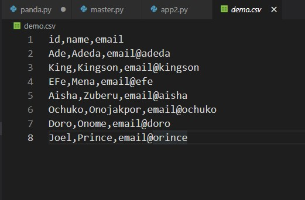

Next you will load your CSV data into your IBM Db2 database.

### Loading your CSV file into IBM Db2 database.
To load data into IBM Db2 database in the first place, you will need to create an account in IBM cloud. In this article you can use the Db2 Lite version which has a one month free option. You can create an IBM cloud account from the link [here](https://cloud.ibm.com/registration) and sign up to follow the tutorial.

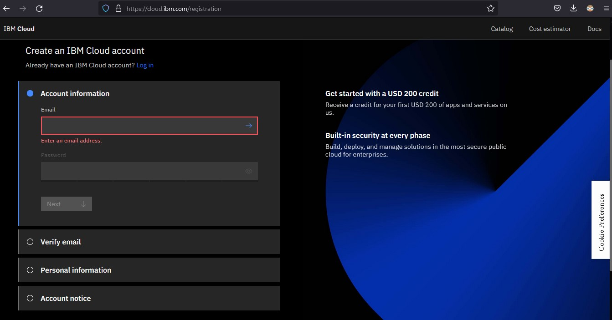

Once you have created your IBM cloud account, you will then need to setup your Db2 lite option. 
Select Services from the Catalog menu option, click on the `Databases` box as you scroll down.

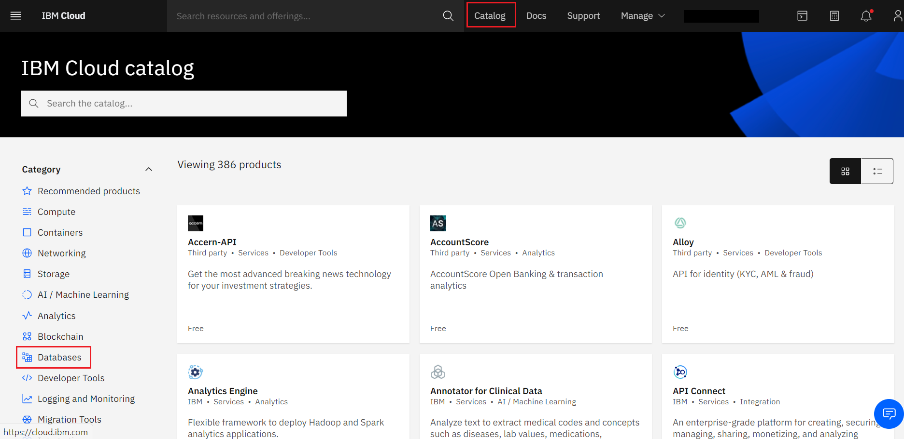

You can now scroll down and select the `Db2` service tile which is among the various database provided by IBM.

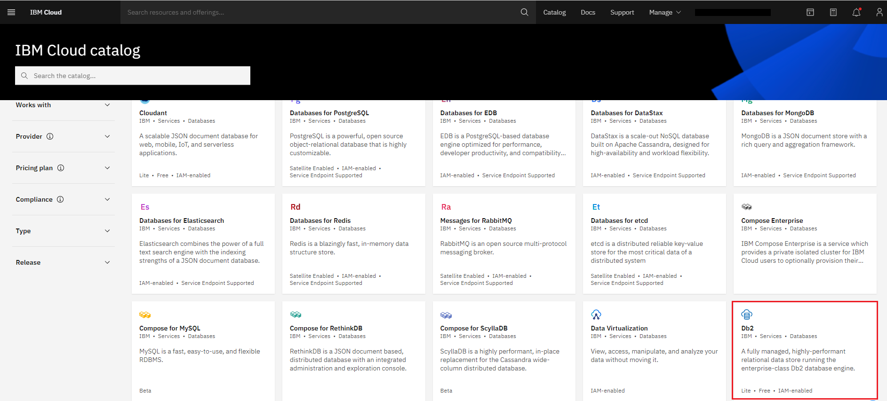

> *NOTE : make sure you click on the `Db2` option as shown below and not the `Db2 hosted` and `Db2 warehouse` option.*

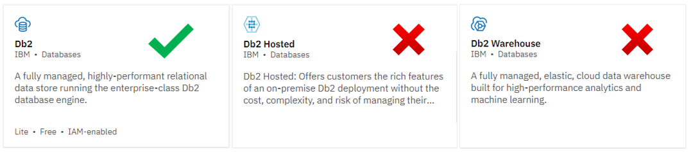

You can now go ahead and click on the create option. You will notice also the option to select a region in the image shown below. It is advisable to leave it at the default region depending on your location.

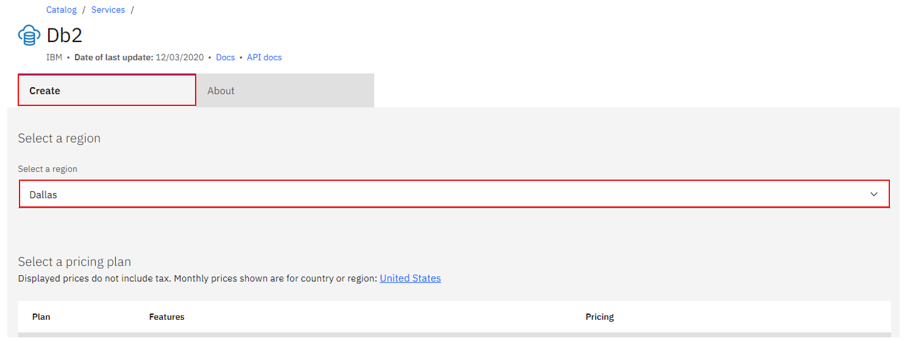

You can now go ahead and choose a pricing plan. For this tutorial you can go with the `Lite` option.
It's a totally free service that doesn't even ask for your credit card information.

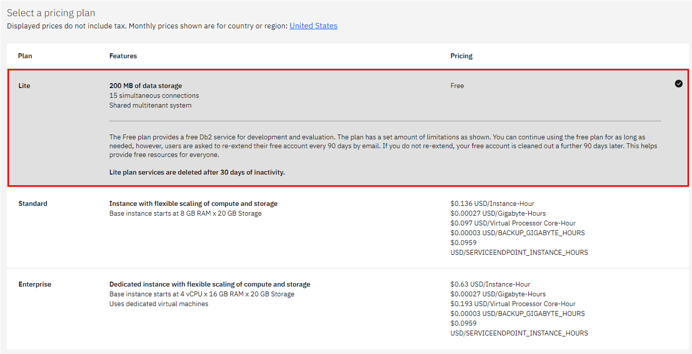

Now you can click on the create option which will redirect you to your Db2 database you just created in your resource list.

You can now open the Db2 database you just created and setup your service credentials as shown below.

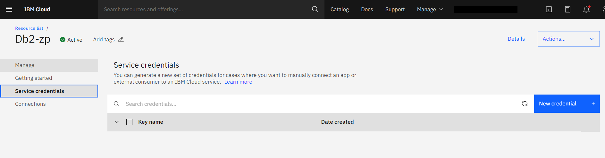

The Name and Role fields in the `Create credential` dialog box will have default values. For the purposes of this tutorial,  you can use the default names.


With the key name `Service credentials-1` which you just created, you'll see a list of your Db2 service credentials.

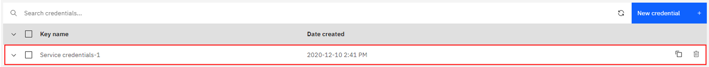

Now you have been able to create your Db2 database. You can now go ahead and load the CSV file you created into the database.

To load data in your Db2 database, click on the `GO to UI` option as shown below.

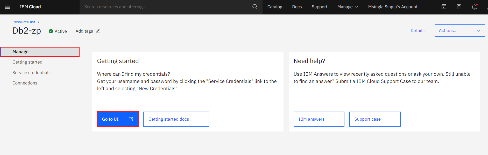

Once you open the `Go to UI` option, at the top left corner of your Db2 service dashboard click the menu bar icon, where you will see the option for `Data` as shown below.

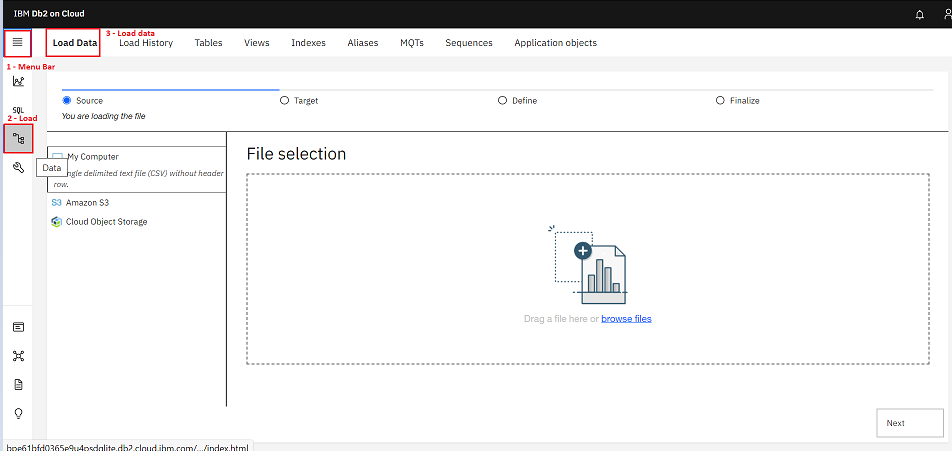

You can either drag and drop the CSV file into the File selection space, or use the `Browse files` option in the File selection space to look for the CSV file in your local directories.

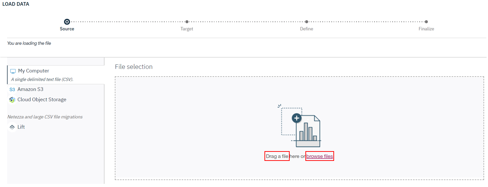

In the Selected file section at the right corner of your screen, the name of the CSV file you uploaded will appear. In this case the `demo.csv` file is what you can see here.

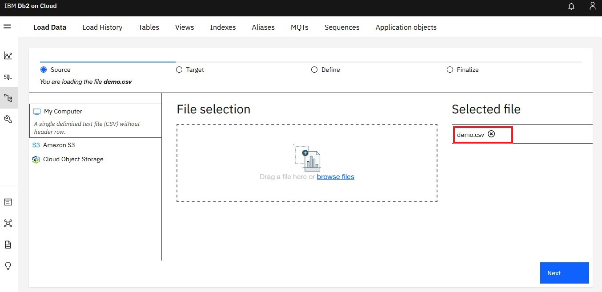

You'll be prompted to choose a Schema from a list of options, you can use the one available for you in the schema option for lite plan users.

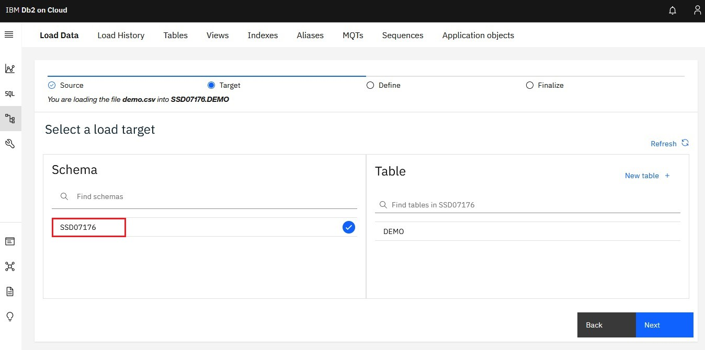

After which you can click on the `new table` option at the top right corner and input any name of your chioce for your table and click on `Next` which will take you to a table of your CSV file.
Make sure your `Header in first row` option is marked. 

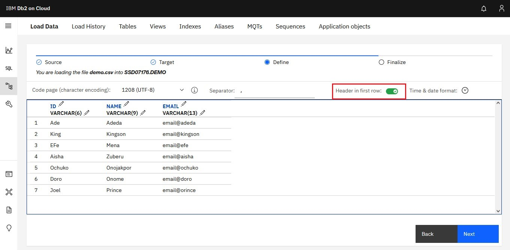

You can now click on `Next` which will take you to the last process in loading your CSV file.

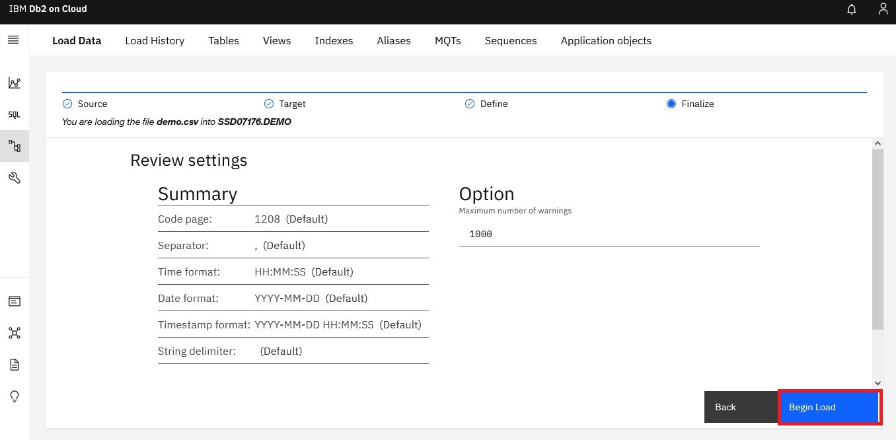

Finally you can now begin loading your CSV file into your Db2 database. If no errors were identified during the process, you will receive a success message.

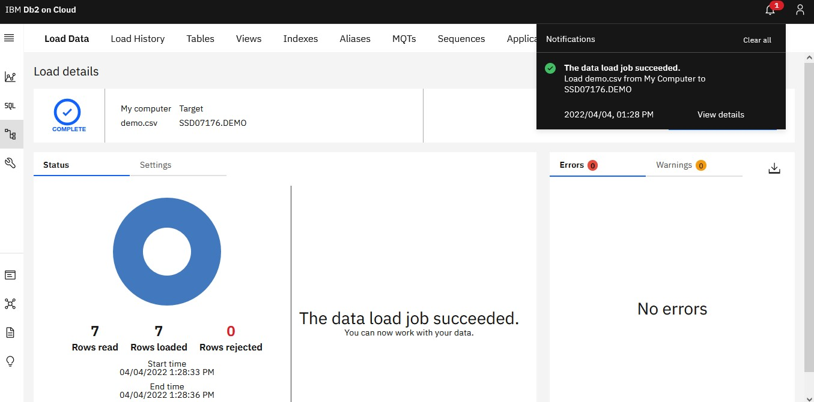

Now you have loaded your CSV file into Db2 database you can now run some SQL queries on it.

### Running SQL queries with your CSV  data in your db2 database.
To run your SQL queries in your Db2 database you will need to go to the `Run SQL` icon in the menu bar section at the top left corner of your screen.

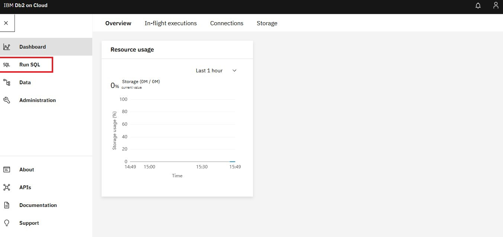

Once you click on it, you will be taken to where you can either upload a file to query or create a new query page. In this case you already have your CSV file you will need to query in the database, so all you will need to do is to create a new query page to query your CSV dataset in the database.

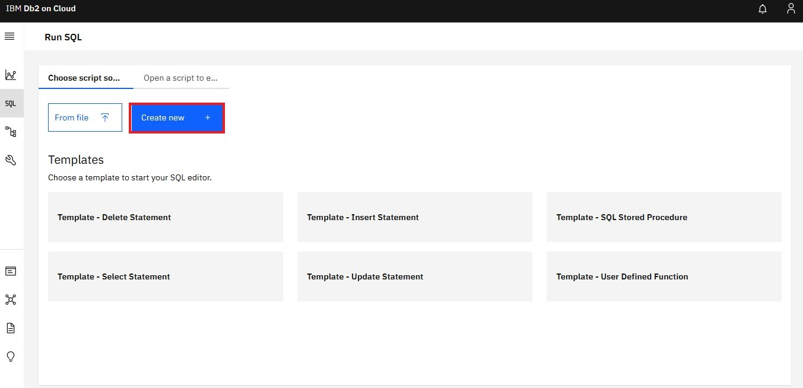

Once you click on the `Create new` option, the SQL editor you will need to run your queries will open.


You can now run some queries on your data in the database. In this case you will run a query to check if your `DEMO` database you created is present in the database using the query code below.

```sql
SELECT * FROM DEMO;
```
  
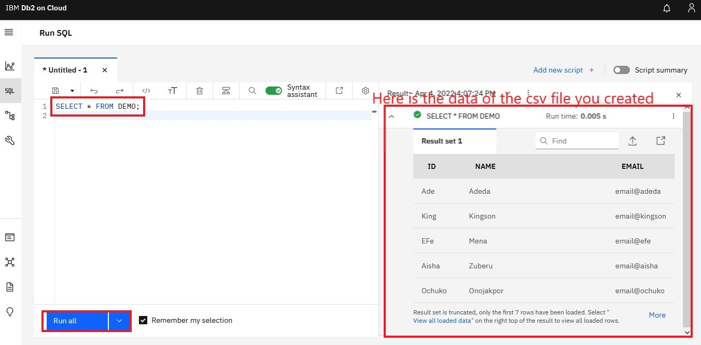

To rap this up you will run a query to add more data into your database using the queries as shown below.
```sql
INSERT INTO DEMO VALUES('Jhon', 'Bobson', 'email@Bobson');
INSERT INTO DEMO VALUES('Mary', 'Madeline', 'email@Bobson');
INSERT INTO DEMO VALUES('Okwonu', 'Ese', 'email@Bobson');
INSERT INTO DEMO VALUES('Queen', 'VIctor', 'email@Bobson');
INSERT INTO DEMO VALUES('Ruona', 'Ighere', 'email@Bobson');
```
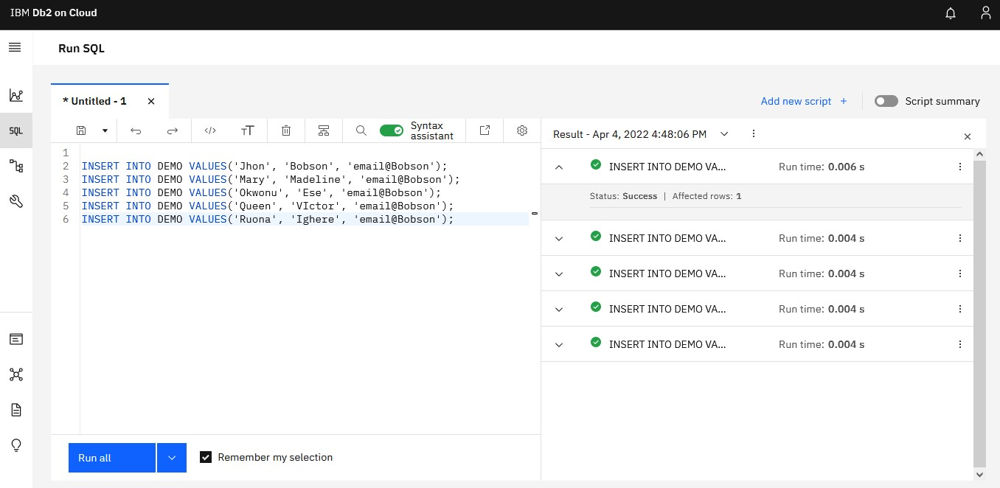

Once you click of the `Run all` button your new data should now be in your database. For you to check if your data has been added to your database you can run the query below to show all your data in your `Demo` database.

```sql
SELECT * FROM DEMO;
```
  
You should be able to see your data at the right corner of your screen. You can also click on the `More` link highlighted below to see all your data in full.

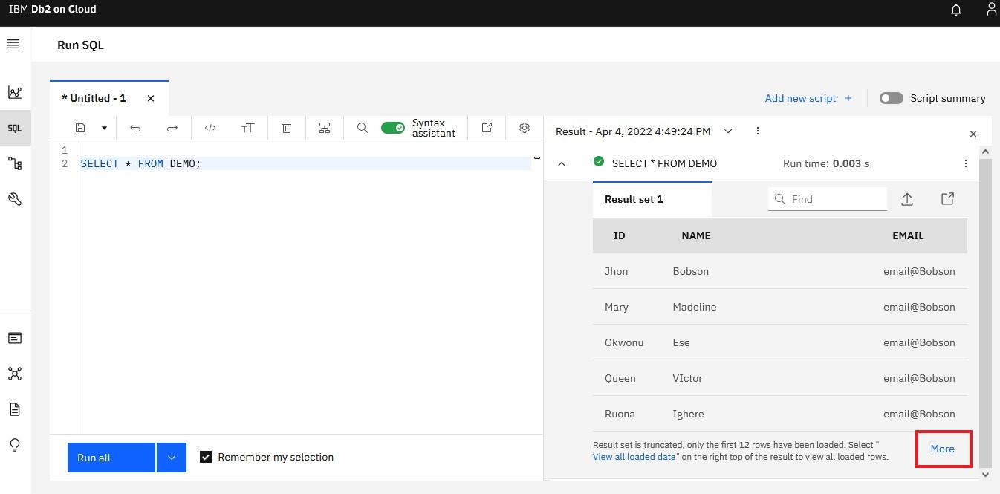

After you have clicked on the `More` link highlighted in the image, you should be able to see all your data including the new ones you just inserted.

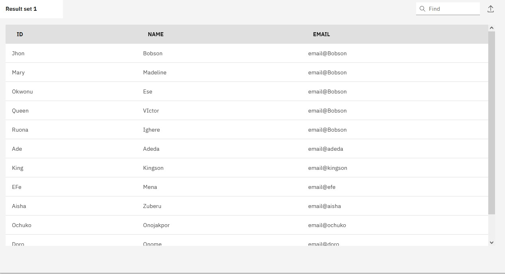

### Conclusion
This tutorial introduced you on how you can create a CSV file in python and also how you can load your CSV file into your IBM Db2 database along side running some SQL queries on your data.

Please do not hesitate to contact me on [Twitter](https://twitter.com/Ade_matics) if you have any questions :).