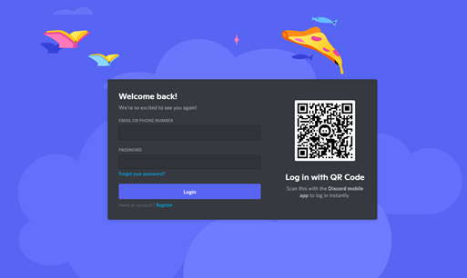
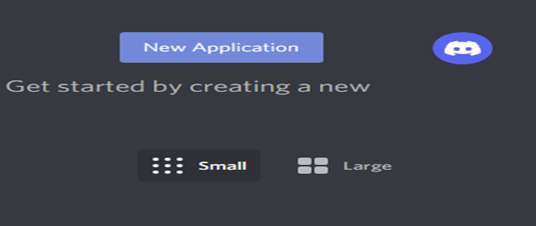
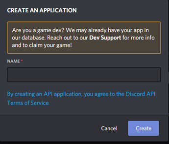
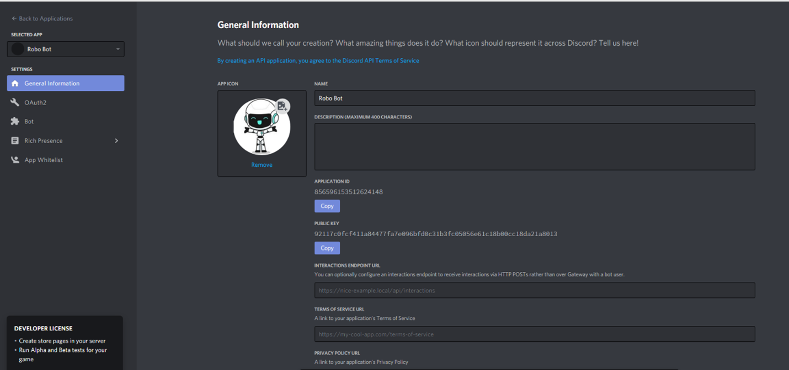
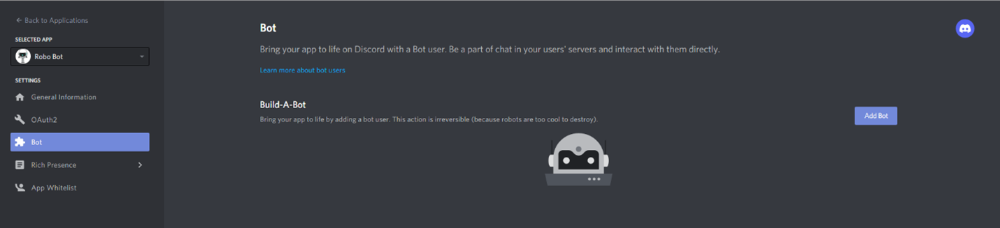
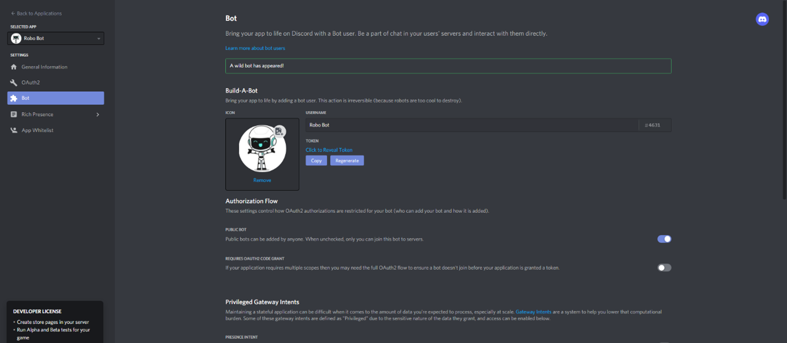
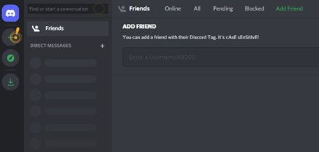
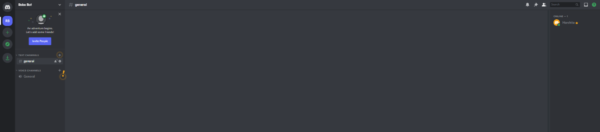

### How to Make a Discord Bot using Python

**Note: This tutorial is an extract from Code with Repl.it: Python programs for beginners, a book and series of tutorials for those who want to learn Python programming by doing it.**

We'll construct a Discord Chatbot with Repl.it and Python in this tutorial. If you're reading this guide, you've undoubtedly heard of Discord and possibly already have an account. If not then with the help of this tutorial you will be able to join the bot to a Discord server and reply to messages delivered by other users.

If you know Python and have used Discord or a comparable service like Skype or Telegram previously, you'll think it's easier to stay along. We won't go through the fundamentals of Python, but we will go over each line of code in great detail, so if you've done any programming before, you should be ready to comprehend along.

Things we will employ in the process of learning to make Discord bot with python are as following
1.	Various tools,
2.	Discord APIs 
3.	Python libraries, and 
4.	a cloud computing platform called Repl.it.

#### Table of Contents

1. Introduction
    1. About Discord 
    2. About Bot
2.  Overview and Requirement
3. Creating a Discord Bot Account on the Discord  
    1.  Forming an Account
    2. Forming an Application
    3. Forming a Bot
    4. Forming a Guild ( a Sever)
4. Creating a discord bot using discord.py library
    1. Installing discord.py and create a Repl
    2. Setting up Discord event for your Bot 
    3. How to run Bot


We will begin with understanding about Discord is and why it’s valuable.

### ABOUT DISCORD
If you're unfamiliar with Discord, it's a VoIP and chat programme that's meant to take the role of Skype for gamers and educational use. It helps the society to communicate better.
 
 
 Discord is used by players, educational institutions, broadcasters, and developers to talk about games, answer queries, communicate while playing and studying, and even more. There's even a gaming store with critical reviews and a streaming service. For gaming communities, it's almost a one-stop store.


### ABOUT BOT
Discord is becoming extremely prevalent. As a result, for a community to survive and develop, automatic procedures such as banning unsuitable members and responding to user requests are critical.

Bot users are automated programmes that appear and behave like people and respond to events and orders on Discord automatically. Users of Discord bots (or just bots) have virtually limitless options.

Let's assume you're in charge of a new Discord guild and a new member joins for the first time. If you're feeling very enthusiastic, you may personally contact out to that individual and welcome them to your community. You may also inform them about your channels or request that they introduce themselves.

When individual feels welcomed and likes the conversations in your guild, therefore they invite their friends.

The guild's membership expands to the point that it's no longer practical to individually reach around to each new member, but you always want to send them something that will acknowledge their arrival.

It's possible to automatically respond to a new member entering your guild using a bot. You may even manage how it interacts with each new user by customizing its behavior based on circumstances.

This is fantastic, but it's only a example of how a bot may be beneficial. Once you learn how to build bots, there are a number of ways to get creative with them.

**Note: Even though Discord permits you to develop bots for vocal communication, this tutorial will focus on the texting side of the platform.**

When building a bot, there are two important stages to follow:
1. Create a Discord bot user and assign it to a guild.
2. Create code that executes your bot's actions and makes use of Discord's APIs.
In the following part, you'll discover how to use Discord's Developer Portal to create a Discord bot.

### OVERVIEW AND REQUIREMENTS
We'll be performing all of our coding and hosting our bot using the Repl.it web IDE, so there won't be any other software to setup in your system. You'll need to establish a Discord account for this guide (You may skip this, if you already have one). The next section contains instructions on how to achieve this.

We'll go through the following points in this tutorial:
* In your Discord account, build an application and a bot user.
*  will be creating server on Discord 
*  Joining the Discord server with our bot.
  
Let's start with the administrative tasks, and then we'll move on to the exciting part: programming our bot.

### CREATING A DISCORD BOT ACCOUNT ON THE DISCORD

We need to create a Discord Bot account before we can use the Python library and the Discord API.

To begin, you'll need to build a few Discord components:
1.	An account
2.	An application
3.	A bot
4.	A guild

In the sections that precede, you'll discover much more about these components.

When you've completed each of these components, you'll need to register your bot with your guild to connect everything together.

You may begin by entering [Discord's User Portal](https://discord.com/login?redirect_to=%2Fdevelopers%2Fapplications)
1.	**Forming an Account** - 

The initial webpage you'll see is a landing page in which you can either log in by filling in details or with QR Code if you're using an account or make a new one:



Click the Register beneath the login button, if you need to establish a new account and fill up your account details.

**Important: You must first validate your email address before proceeding.**

When you're done, you'll be taken to the User Portal home page, on which you can start building your application.

2.	**Forming an application**

By establishing authentication tokens, defining privileges, and so forth, an application facilitates communication with Discord's APIs.

To develop a new application, Proceed towards the application's page.

Select **New Application** Button.



Assign a name to the application and then select "Create."



Congratulations! You created a Discord account. You may view details about the application on the screen:



Remember that every software that communicates with Discord APIs, not only bots, requires a Discord application. Bot-related APIs make up a small portion of Discord's overall interface.

Navigate to the "Bot" tab on the left-hand side panel, as this section is about how to build a Discord bot.

3.	**Forming a Bot**

A bot user is someone who listens to and automatically replies to specific events and orders on Discord, as discussed in the preceding parts.

To see your code in action on Discord, you'll require to build a bot user. For that Select "Add Bot" button.



You'll notice the new bot user in the portal after you confirm by clicking "Yes, do it!".



It's important to realize that the bot user will preserve the name of your application by default. 

Now that the bot is finally ready to go, where will it go?

 If a bot user isn't communicating with other users, it's useless. You'll then create a guild for your bot so that it may communicate with other people.

4.**Forming a Guild (a Server)**

A guild (as it's referred to in Discord's user interface) is a collection of routes where members may communicate.

**Notes: While the terms guild and server are equivalent, the term "guild" will be used in this article because the APIs use the same phrase. The term "server" will only be used in the graphical user interface to refer to a guild.**

Now, go to your Discord home(link) page and establish a guild:

You may see and connect with friends, direct messages, and guilds through this home page. To Add a Server, click the "+" button from the left side panel of the web page:



On the upcoming screen, select "Create a server" and give the server a name. You can interact with yourself or request some people to communicate with you after the server is up and running. We'll be inviting our bot to communicate with us soon. 

You'll be able to view the users on the right side and the channels on the left panel when you've done building your guild:



further, the final stage is to register the bot with the new guild at Discord.

### CERATE A DISCORD BOT USING DISCORD.PY LIBRARY

The bot's programming will be written in Python using the discord.py package. discord.py is a Discord API wrapper that makes creating a Discord bot in Python much easier.

**Installing** discord.py  and create a Repl

Any coding editor may be used to create the bot on your PC. However, we'll utilize Repl.it in this tutorial as it makes things easier for anybody to follow along. Repl.it is a web-based IDE.

Begin by visiting Repl.it. Make a new Repl.it and set the language to "Python."

Simply put import discord at the start of main.py to utilize the discord.py module. When you hit the "run" button on Repl.it, it will automatically install this dependency.

On MacOS, run this command to install discord.py if you wish to develop the bot locally:

``python3 -m pip install -U discord.py``

You may have to use pip3 instead of pip.

``py -3 -m pip install -U discord.py``

#### Setting up discord event for your bot

The structure of events is central to discord.py. An event is anything to which you pay attention and then respond. When a message arrives, for instance, you will be notified via an event to which you can reply.

Let's build a bot that responds to a given phrase. This simple bot code is derived from the discord.py manual, as is the [documentation](https://discordpy.readthedocs.io/en/latest/quickstart.html#a-minimal-bot). Later on, we'll add more functionality to the bot.

This code should be added to main.py. (You may rename the file to whatever you like, just don't call it discord.py.)
```python
import discord
import os

client = discord.Client()

@client.event
async def on_ready():
    print('We have logged in as {0.user}'.format(client))

@client.event
async def on_message(message):
    if message.author == client.user:
        return

    if message.content.startswith('$hello'):
        await message.channel.send('Hello!')

client.run(os.getenv('TOKEN'))
```

You copied a token when you created your bot user on Discord. Now we'll make a.env file to hold the token. You don't need the.env file if you're executing your code locally. Simply substitute the token for os.getenv('TOKEN').

Environment variables are declared in.env files. Most of the files you create on Repl.it are available to everyone, but .env files are exclusively visible to you. The contents of the.env file will not be visible to other individuals viewing a public repl.

If you're developing on Repl.it, include only the private information in a.env file, such as tokens or keys.

Create a file called .env by clicking the "Add file" button.

Add the following line to the file, replacing your token with the one you copied earlier:

``TOKEN=[paste token here]``

Let's have a look at how each line of the code in your Discord bot code does.

1. The discord.py library is imported in the first line.
   
2. The os library is imported in the second line, however it is just needed to obtain the TOKEN variable from the.env file. You don't need this line if you don't use a.env file.
   
3. After that, we construct a Client instance. This is the Discord connection.
   
4. To register an event, use the @client.event() decorator. Because this is an asynchronous library, everything is handled through callbacks. A callback is a function that is invoked when another event occurs. When the bot is ready to be utilized, the on ready() event is invoked in this code. The on_message() event is then triggered when the bot gets a message.
   
5. When a message is received, the on_message() event is triggered, but we don't want that to do anything when the message is from us. If the Message.author and Client.user are the same, the code just returns.
   
6. Next, we look to see if the Message.content contains the string '$hello'. If this is the case, the bot will respond with a 'Hello!' to the channel in which it was utilized.
   
7. The bot is now configured, and the final line executes it using the login token. The token is obtained from the.env file.
   
Now that we have the bot's code, all we have to do is execute it.

How to Run the Bot

To run your bot in Repl.it, click the run button at the top.

If you're writing the bot locally, you may launch it using the following instructions at the terminal:

On Windows:

```py -3 main.py```

On other systems:

```python3 main.py```

Now type "$hello" into your Discord room. "Hello!" should be the response from your bot.

### CONCLUSION

We all can conclude that from the above tutorial, You learned:

* What is Discord and why is it so important?

* How to use the Developer Portal to create a Discord bot

* Discord Connections: How to Make Them

* How to deal with unexpected situation

* What are the different Discord APIs and how can I use them?
