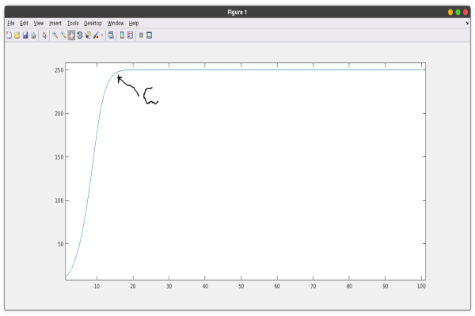

### Solving logistic equations using Matlab
### Introduction
The logistic equation is a population growth model in which the resources and space are limited. Therefore, the logistic model is a model that factors in the carrying capacity. The carrying capacity is the maximum number of populations that an environment can support without the available resources getting exhausted. Therefore, the objective of this model is to find the maximum population that a given environment can support.
The ecology sector uses this equation to model the population growth as they assume the reproduction rate to be directly proportional to the current population and the resources available. It can also determine the various factors that affect the population growth in a given niche. The good news is that you can program these logistic problems. In this article, we will look at how to use Matlab to solve these logistic problems.

### Prerequisites
- [Matlab](https://www.mathworks.com/products/get-matlab.html?s_tid=gn_getml) installed.
- Proper understanding of [matlab](https://www.section.io/engineering-education/getting-started-with-matlab/) basics.

### Overview of the logistic equation
The logistic model gets its base on the mathematical equation below;
$$
\begin{cases} X_{t+1} = X_t + KX_t(1-X_t/C)\\X_0 = 10 \end{cases}
$$
Where;
K = growth rate.
C = Carrying capacity.
$X_n$ = The population at a given time.
n = Time.
The logistic equation is a more realistic model for population growth. We mean here that the logistic model looks at the population of any set of the organism at a given time. In addition, the logistic model is a model that factors in the carrying capacity. Carrying capacity is the maximum number of individuals an environment can support.
The exponential model $A=Ke^{rt}$ assumes an infinite amount of space and resources. Let's say, for example, we have a number of rabbits on a given island. The exponential model assumes that it does not matter how many rabbits are on the island; there will always be enough food and space. It means that the rabbit population will grow with no limit as time goes.
Basically, in the real world, the rabbit population will grow, but it will reach a point in which the rabbits run out of resources or space. When this happens, they don,t grow anymore; they start to level off. So it makes the logistic model a little more realistic. 
### matlab code
We create a function that will help us calculate the logistic equations. 
```Matlab
function logistic_Model
```
We then define the parameters and in this case, our parameters are, `k` and `c`.  
```matlab
% Parameters
k = 0.5;        %growth rate
c = 250;        % Carrying capacity
```
The next thing that we need to do is to use our initial condition. In the equation of the model, we have `x0=10`. It is the initial value of our growth rate. So, we are going to define this in our code. Note that you can change the parameters and the initial value to value at any time, depending on what you are handling.
```Matlab
x0 = 10;
```
The next thing that we can define is the time information. Now, for these discrete equations, we know that time steps forward from 1,2,3,4 e.t.c. It means that we need to tell Matlab the last iteration number we want. 
```Matlab
% Time information
N_end = 100;     %number of iterations
```
Now we are almost at the point at we've done all the back work. We have set the parameters, initial values, and time information. It means we will go ahead and iterate for the solutions. How we are going to do this is by storing our iterations values in a vector. The reason why we do this is that it is going to be immensely important for us as we go about counting. So, if we have our vector of solutions values, we will make the first value in that vector our initial value. The other thing to notice is Matlab starts indexing at one. It means we will be a bit off in the way in which we are thinking of our initial value. Remember, our initial value is `10`. So, we will assign this value to be our first index. 
```matlab
%store the initial value solution in a vector
x(1) = x0;
for n = 1:1:N_end-1
x(n+1) = x(n) + k*x(n)*(1-x(n)/c);
end
```
In the above code, the index `n` will be counting for us every time we go through the loop. In writing the iterations, we consider our equation and update the `x`. This `for` gives a new solution every time we go through the `for` loop.
We are now going to plot our solution to visualize what it looks like. So, we are going to plot the solution against the time information.
```Matlab 
nvec = 1:1:N_end;    %stores n values
```
This value generates values from 1 to N_end with a space of one and stores them in the `nvec` variable. We plot the solution against `nvec`.
```Matlab
plot(nvec,x);
hold on
```
The primary function of the `hold on` is to add more solutions to the same plot. So, for example, if this was a coupled system where we had `x`, `y`, and `z`, you can keep on adding these `hold on` so that the solution for `x` will be plotted on the same plot as the solution for `y` and `z`. 
For proper understanding and easy use of the code, the general code for the logistic equation is;
```Matlab
function logistic_Model

%------------------------------------------
% Parameters
k = 0.5;        %growth rate
c = 250;        % Carrying capacity

%-------------------------------------------
x0 = 10;         %Initial value

%------------------------------------------
% Time information
N_end = 100;     %number of iterations

%------------------------------------------
%Store initial value in the solution vector
x(1) = x0;    %First entry in solution vector is initial value
               %Matlab starts indexing vectors at 1.
%-------------------------------------------
%iterate to get solution values!!
for n = 1:1:N_end-1
    x(n+1) = x(n) + k*x(n)*(1-x(n)/c);
end

%-------------------------------------------
%plot
%         -> Solutions is stored in x
%          -> Plot against time n
nvec = 1:1:N_end;    %stores n values to plot against

plot(nvec,x);
hold on
```

From the output, we see the population grows to a given level where the population is constant. This point is the carrying capacity. When the population rises past this point, the resources will be limited. When the resources are limited, the organisms begin to die, and the population starts to decline.

### Conclusion
The logistic model can be used to estimate the carrying capacity of a given niche. It helps implement various factors that can help maintain the population growth rate in relation to the carrying capacity. This helps manage the available resources in the environment. This model is widely applicable in the ecology sector. Programming these models is easier using Matlab in-built functions, as we have seen. 
