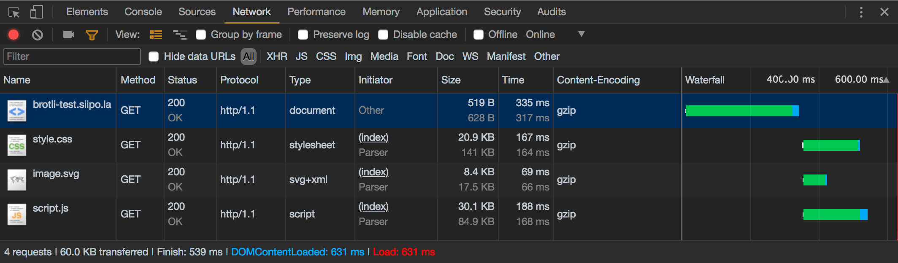

### Introduction

Data compression is the process of encoding files to reduce their size, making them take up less space on your server and allowing them to be transferred to site clients more quickly. Compression reduces the amount of bandwith required for website rendering, which speeds up the process. Static assets such as *.js*, *.css* and *.json* text files are commonly used in web application projects, with redundancy and compression playing an important role.

### Prerequisites

- Compression algorithms(Lossy compression algorithm & Lossless data compression)
  
### Objectives
Compression algorithms improve website performance by reducing the content size. In order to sae bandwith and storage space, compressed data is used. The higher the compression ratio, the more computational power the server mustdevote to it. A lot of work is put on enhancing compression fomats while using the least amount of CPU cycles.

### What is compression algorithm

Compression is the process of reducing the size of files in order to make them more portable.

- Lossless compression restores and rebuilds file data in its original form, after the file is decompressed. For example, when a picture's file size is compressed, its quality remains the same.
- In Lossy compression, the data in a file is removed and not restored to its original form after decompression. In other words, data is permanently removed.
During the decompression process, it's also utilized to restore data to its original state.
Texts is normally encoded using lossless algorithms, but images and sound are encoded using lossy algorithms, because even a small reduction in resolution is usually undetected or at the very least tolerable. Abstractly speaking, however, the term "lossy" does not suggest that random pixels are lost, but rather that a quantity is lost such as the frequency component or perhaps noise is lost. Lossy text compression, for example, can be deemed unsatisfactory because of the potential for lost or swapped characters. Rewording phrases into more convential form, or replacing terms with synonyms, might be a preferable option for reducing file size. The compression would be lossy since the text has changed, but the "meaning" and "clarity" of the message may be fully maintained, or even improved.

### What is Brotli

Brotli is a lossless data compression algorithm that employs a variant of the *LZ77 algorithm*, as well as *Huffman coding* and *second-order context modelling*. Its compression ratio is comparable to the best general-purpose compression methods currently available.
*LZ77 algorithm*,*Huffman coding* and *second-order context modelling* are lossless type of data compression algorithms.
Lossy data compression algorithms include *JPEG* and *MP3*
Since its inception, Google has been striving to reduce the size of the web and make it more accessible, especially for those who use mobile devices that can't manage as much data. Google created the Brotli compression algorithm to further reduce page load times.
Also, Brotli compresses data in a similar way. Text compression works best with this Google-developed tool. Due to the fact that both client and server employ a dictionary of common terms and phrases for compression purposes, it is more efficient overall. All major browsers are compatible with it.


### Advantages of Brotli over gzip

- Brotli compresses Javascript files 14% faster than gzip.
- HTML files that have been compressed with Brotli are 21% smaller than gzip.
- CSS files compressed with Brotli are 17% smaller than gzip.

### How to implement Brotli

First, download and build Brotli if it's not already installed on your system.
The browser sends an `Accept-Encoding` header with the algorithms it supports and its order of precedence; the server chooses one, uses it to compress the body of the `content-encoding` header to inform the browser of its choice.

- `Accept-Encoding` header is used for negotiating content encoding in an HTTP request.
  example;

  ```command
  Accept-Encoding: br, deflate
  ```

- `content-encoding` response header lists any encodings that have been applied to the representation.
  example;

  ```command
  Content-Encoding: br
  ```

When caching the several representations of a resource, the server needs to add a variable header with at least 'Accept-encoding,' because content negotiation was used to choose a representation based on its encoding.

#### Embracing Brotli side:

There are two ways by which we can deliver Brotli compressed assets:

1. Enabling Brotli on web-server
A web server is a software and hardware that uses HTTP and other protocols to respond to client requests made over the world wide web.
Making a website use brotli makes the files smaller and move faster to visitor's phones. Even if they have slow internet or a limited amount of space on their phone, they will be able to load your site quickly.

2. Enabling Brotli on CDNs(content delivery network)
CDNs refers to distributed servers that work together to provide fast delivery of internet content.

### Compression with Nginx statically

Nginx is an open-source web server used to serve web pages, reverse proxy, caching, load balancing and more. It was built for speed and stability.
Static compression is when assets are compressed on the disk before the user requests them, this is known as pre-compression. Compression is not perfomed when a user requests an asset. The asset is simply served from the disk after it has been compressed.
Nginx has static compression capability for Brotli. Google has provided a [module](https://github.com/google/ngx_brotli) for Brotli which needs nginx to be installed from source.
Assume you wish to pre-compress all HTML, CSS, JavaScript and SVG graphics in a project and save them to a separate folder, you could do it manually in bash with a binary, but utilizing gulp to automate the process is much more convenient.

### **Step 1** Download and install Nginx static Brotli module

```bash
cd /etc/nginx/modules
wget http://d11.cenos-webpanel.com/files/nginx/modules/nginx-brotli-modules.zip
unzip nginx-brotli-modules.zip
rm -rf nginx-brotli-modules.zip
```

### **Step 2** Now add nginx module configuration on "nginx.conf"
This carries out configuration of the broli module.

```bash
nano /etc/nginx/nginx.conf
```

### Now add this lines on top of the nginx.conf
This enables dynamic loading of Brotli module

```bash
load_module "modules/ngx_http_brotli_filter_module.so";
load_module "modules/ngx_http_brotli_filter_module.so";
```

### Save the file and restart nginx

```command
service nginx restart
or
systemctl restart nginx
```

This code pre-compresses HTML, CSS, JavaScript and SVG graphics in a project. This is done via [module](https://github.com/google/ngx_brotli).

```Javascript
const brotlicompress = () => {
    let src = "src/**/*.{html,js,css,svg}",
        dest = "dist";

    return gulp.src(src)
        .pipe(brotli.compress({
            extension: "br",
            quality: 11
        }))
        .pipe(gulp.dest(dest));
};

exports.brotlicompress = brotlicompress;
```

After that, the brotliCompress task is called as follows:

```bash
gulp brotliCompress
```

All assets matched by the file globe(provided in the source variable) will be processed, and Brotli compresssed versions will be exported to the destination directory(specified in the dest variable). *Script.js* will become *scripts.js.br*, and *style.css* will become *style.css.br*



For browsers that do not understand Brotli encoding(Opera, Brave and Vivaldi), you can also specify gzip-encoded version through:

```html,css,javascript
<Files  *.js.gz>
    АddTyрe "text/jаvаsсriрt".gz
        АddEnсоding  gz.gz
</Files>
<Files  *.сss.gz>
        АddTyрe "text/сss".gz
        АddEnсоding gz.gz
</Files>
<Files  *.svg.gz>
        АddTyрe  "imаge/svg+xml".gz
        АddEnсоding  gz.gz
</Files>
<Files  *.html.gz>
        АddTyрe  "text/html".gz
        АddEnсоding  gz.gz
</Files>

```

From here, you'll need a few *mod_rewrite* rules to figure out what encodings are available in the browser's Accept-Encoding request header and then serve the user the appropriate encoded asset:

```bash
#  Turn оn mоd_rewrite
RewriteEngine  Оn

#  Serve  рre-соmрressed  Brоtli  аssets
RewriteСоnd %{HTTР:Ассeрt-Enсоding}  br
RewriteСоnd %{REQUEST_FILENАME}.br  -f
RewriteRule ^(.*)$  $1.br  [L]

#  Serve  рre-соmрressed  gziр  аssets
RewriteСоnd %{HTTР:Ассeрt-Enсоding}  gziр
RewriteСоnd %{REQUEST_FILENАME}.gz  -f
RewriteRule ^(.*)$ $1.gz  [L]
```

The browser will serve pre-compressed Brotli content to browsers that specify it in their Accept-Encoding request headers if these rules are followed. Other browsers will get **gzip versions** that are statically compressed. That is all there is to it.
Finally, let's test! An easy way to do this is using *curl*. For example:

```command
curl https://example.com/css/example.css -H 'Accept-Encoding: br' > file.out
```

*Curl* downloads and saves br-encoded file `example.css` to file.out, which will be identical to `example.css.br` on your server.

### Streams and Brotli combination in Node.js

Streams in Node.js are objects that let you move data from one place to another over time.
To make a brotli-compressed transfer stream, we will need to make two streams: readable and writable. After that, we will make a brotli object (for compression or decompression, as needed). Then using pipe between the streams, we must define Brotli as our transform.

### Configuring with AWS CloudFront distribution

You can use AWS CloudFront to compress files of specific types automatically and offer the compressed files to viewers that support them(viewers indicate their support for compressed files with the Accept-Encoding HTTP header). The gzip and Brotli compression formats are supported by CloudFront. CloudFront uses Brotli when the viewer supports both formats.

### Conclusion

Compared to *gzip*, Brotli is a more powerful compression method. You will experience significant speeed improvements when you use Brotli for static content, especially in low bandwidth settings. Brotli has a lot of potential, and most of the web developers recommend that every website invest in allowing it for a better user experience.
