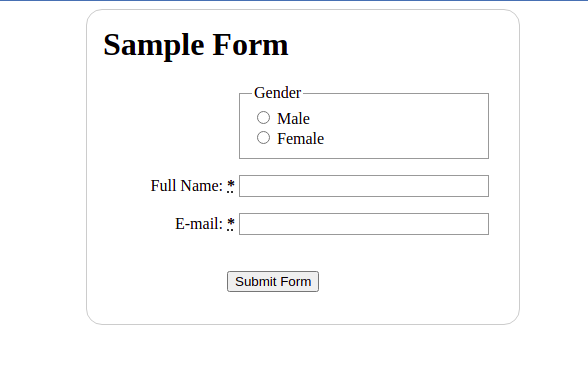
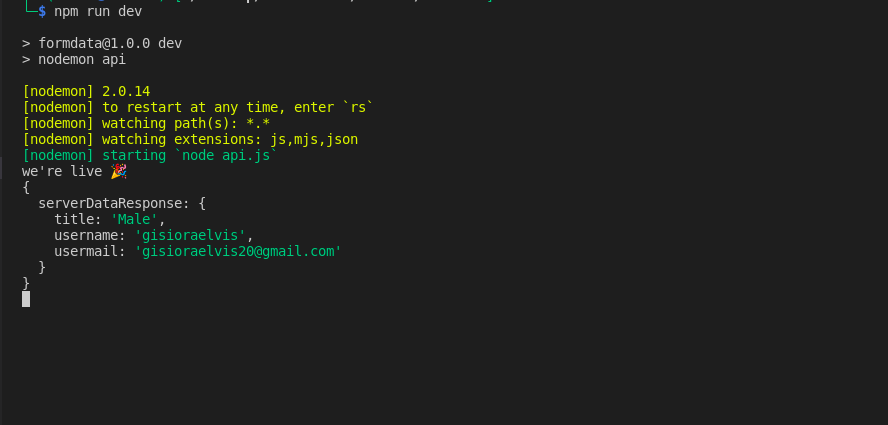
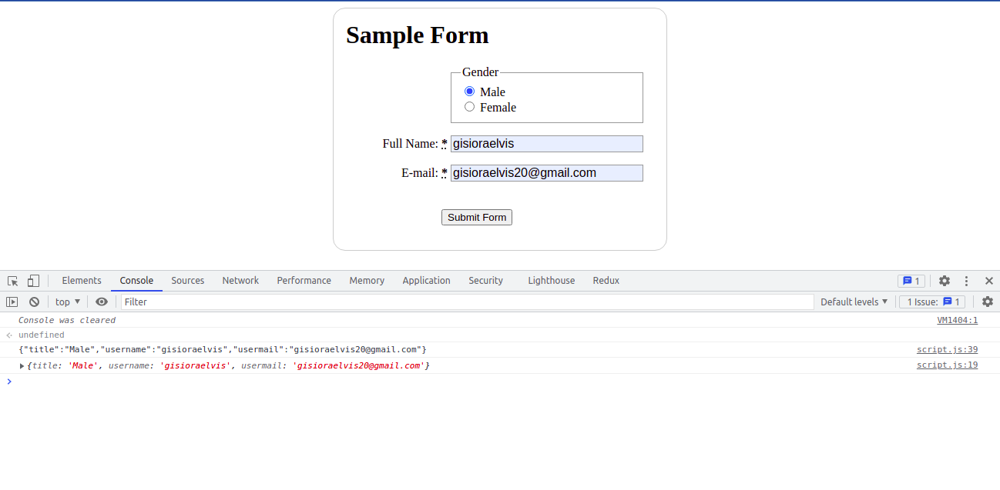

# How To Use FormData Web API With Fetch to POST Form Data As JSON To An API Endpoint 

The [Fetch API](https://developer.mozilla.org/en-US/docs/Web/API/Fetch_API) is used to make requests from the web page front end to an API endpoint of the back end. The [FormData](https://developer.mozilla.org/en-US/docs/Web/API/FormData) API provides a precise way of accessing HTML form fields. Both of this two natively supported browser APIs make it easy to send requests, but to send data as JSON to an API endpoint extra bit of work is needed. In this tutorial, we explore a set by step procedure on how to capture form field data and send it as JSON data to an API endpoint.

## Steps
Here are the steps we are going to follow to achive our goal

1. [Listen for form submission](#Listen-for-form-submission).
2. [Reading the form field values with the browser FormData API](#reading-the-form-field-values-with-the-browser-formdata-api).
3. [Formatting the data as JSON](#formatting-the-data-as-json)
4. [POST the JSON data to a URL endpoint with Fetch API as request body data](#post-the-json-data-to-a-url-endpoint-with-fetch-api-as-request-body-data).
5. [Handling JSON request body with Express Nodejs API](#handling-json-request-body-with-express-nodejs-api).

## Goal
By the end of this tutorial, we will have a working HTML form that sends form data as JSON to an API endpoint. In the process, we will make use of the native browser Fetch and FormData APIs to achieve our goal. As a bonus, we have a simple Express Nodejs API which will listen for the request we send and send back response.

## Prerequisites
It’s assumed you have prior experience with HTML, CSS and JS.

Lets dive in.

## This is the HTML form we will be working with.
```html
<!DOCTYPE html>
<html>

<head>
    <meta charset="utf-8">
    <title>Sample Form</title>
    <link href="style.css" rel="stylesheet">
</head>

<body>
    <form id="example-form" method="post" action="http://localhost:5500/form">
        <h1>Sample Form</h1>
        <section>
            <fieldset>
                <legend>Gender</legend>
                <ul>
                    <li>
                        <label for="title_1">
                            <input type="radio" id="title_1" name="title" value="Male">
                            Male
                        </label>
                    </li>
                    <li>
                        <label for="title_2">
                            <input type="radio" id="title_2" name="title" value="Female">
                            Female
                        </label>
                    </li>
                </ul>
            </fieldset>
            <p>
                <label for="name">
                    <span>Full Name: </span>
                    <strong><abbr title="required">*</abbr></strong>
                </label>
                <input type="text" id="name" name="username">
            </p>
            <p>
                <label for="mail">
                    <span>E-mail: </span>
                    <strong><abbr title="required">*</abbr></strong>
                </label>
                <input type="email" id="mail" name="usermail">
            </p>
            <p> <button type="submit">Submit Form</button> </p>
        </section>
    </form>
    <script src="script.js"></script>
</body>

</html>
```
and the accompanying css to add style to the form.

```css
h1 {
    margin-top: 0;
}

ul {
    margin: 0;
    padding: 0;
    list-style: none;
}

form {
    margin: 0 auto;
    width: 400px;
    padding: 1em;
    border: 1px solid #CCC;
    border-radius: 1em;
}

div+div {
    margin-top: 1em;
}

label span {
    display: inline-block;
    width: 120px;
    text-align: right;
}

input, textarea {
    font: 1em sans-serif;
    width: 250px;
    box-sizing: border-box;
    border: 1px solid #999;
}

input[type=checkbox], input[type=radio] {
    width: auto;
    border: none;
}

input:focus, textarea:focus {
    border-color: #000;
}

textarea {
    vertical-align: top;
    height: 5em;
    resize: vertical;
}

fieldset {
    width: 250px;
    box-sizing: border-box;
    margin-left: 136px;
    border: 1px solid #999;
}

button {
    margin: 20px 0 0 124px;
}

label {
  position: relative;
}

label em {
  position: absolute;
  right: 5px;
  top: 20px;
}
````
The HTML form we will be working with.

## Step 1: Listen for form submission.
When the form’s submit button is clicked a [submit](https://developer.mozilla.org/en-US/docs/Web/API/HTMLFormElement/submit_event) event is dispatched by the browser. We get the form by ID and listen for the submit event.

```js
//Get the form element by id
const exampleForm = document.getElementById("example-form");
//Add an event listener to the form element
exampleForm.addEventListener("submit", handleFormSubmit);

```
We'll define the `handleFormSubmit()` event handler function in the next step.

## Step 2: Reading the form field values with the FormData API.

The FormData API provides a precise way of accessing the HTML form field values by passing it a reference to the form element. 
Let's define Event handler for the form [submit event](https://developer.mozilla.org/en-US/docs/Web/API/HTMLFormElement/submit_event) and prevent the default browser behaviour of submitting the form so that we can handle it ourselves instead. Then get the [element attached to the event handler](https://developer.mozilla.org/en-US/docs/Web/API/Event/currentTarget).We then take the URL from the form's `action` attribute.Takes all the form fields and make the field values available through a [FormData](https://developer.mozilla.org/en-US/docs/Web/API/FormData) instance. Finally we call the `postFormDataAsJson()` function(We'll define it in the next step) and pass the `url` and the `formData` instance as arguments.


```js
//Function to handle submission
async function handleFormSubmit(e) {
    
//Prevent browser default behavior
 e.preventDefault();

 //Get the enitere form fields
 const form = e.currentTarget;
 
 //Get URL for api endpoint
 const url = form.action;
 
 try {
   //Form field instance
   const formData = new FormData(form);
 
   //Call the `postFormDataAsJson()` function
   const responseData = await postFormDataAsJson({ url, formData });
 
 } catch (error) {
   // Handle the error here.
   console.error(error);
 }
}

```
## Step 3: Formatting the data as JSON and POST it to a URL endpoint with Fetch API.

Since our aim is to send the request body as JSON, we can't pass the `FormData` instance directly to `fetch` as that will cause it to automatically format the request body as "multipart" and set the `Content-Type` request header to `multipart/form-data. So we're converting it to a plain object and then into a JSON string.

  We first create an object from the the `formData` instance using the The [Object.fromEntries()](https://developer.mozilla.org/en-US/docs/Web/JavaScript/Reference/Global_Objects/Object/fromEntries) method.
  
  Using the The [JSON.stringify()](https://developer.mozilla.org/en-US/docs/Web/JavaScript/Reference/Global_Objects/JSON/stringify) method we then format the plain form data as JSON.

  We then specify the the [HTTP request method as POST](https://developer.mozilla.org/en-US/docs/Web/HTTP/Methods/POST) and using [the header field of the Fetch API](https://developer.mozilla.org/en-US/docs/Web/HTTP/Headers/Content-Type) specify that we are sending a JSON body request and accepting [JSON responses](https://developer.mozilla.org/en-US/docs/Web/HTTP/Headers/Accept).

  We then then set he body of our POST request as the JSON string that we created from the form data.

  We finally send the request and listen for the response.If the response was not OK, throw an error
  otherwise if the response was OK, return the response body.
        

```js
//Helper function to POST data as JSON  
async function postFormDataAsJson({ url, formData }) {
   
   //Create an object from the form data entries
   const plainFormData = Object.fromEntries(formData.entries());
   // Format the plain form data as JSON
   const formDataJsonString = JSON.stringify(plainFormData);
 
   const fetchOptions = {
       //Set the HTTP method to POST.
       method: "POST",
       //Specify we are sending and accepting JSON data
       headers: {
           "Content-Type": "application/json",
           "Accept": "application/json"
       },
      
       //The body of our POST request, JSON string that we created above.
       body: formDataJsonString,
   };
 
   //Send the request to the API with the options we defined above.
   const response = await fetch(url, fetchOptions);
 
   //Get the response body as JSON.
   //If the response was not OK, throw an error.
   if (!response.ok) {
       const errorMessage = await response.text();
       throw new Error(errorMessage);
   }
   //If the response was OK, return the response body.
   return response.json();
}
```
### Full script code
This is the full js script with inline comments from the steps above that:
1. Captures the form fields using the browser FormData API 
2. Converts them to JSON.
3. Finally sends them to an API endpoint using the browser Fetch API.

```js
//Get the form element by id
const exampleForm = document.getElementById("example-form");

//Add an event listener to the form element
exampleForm.addEventListener("submit", handleFormSubmit);

/**
 * Event handler for the form submit event.
 * @see https://developer.mozilla.org/en-US/docs/Web/API/HTMLFormElement/submit_event
 */
async function handleFormSubmit(e) {
  /**
   * Prevent the default browser behaviour of submitting
   * the form so that we can handle this instead.
   */
  e.preventDefault();

  /**
   * Get the element attached to the event handler.
   * @see https://developer.mozilla.org/en-US/docs/Web/API/Event/currentTarget
   */
  const form = e.currentTarget;

  /**
   * Take the URL from the form's `action` attribute.
   */
  const url = form.action;

  try {
    /**
     * Takes all the form fields and make the field values
     * available through a `FormData` instance.
     * @see https://developer.mozilla.org/en-US/docs/Web/API/FormData
     */
    const formData = new FormData(form);

    /**
     * We'll define the `postFormDataAsJson()` function in the next step.
     */

    
    const responseData = await postFormDataAsJson({ url, formData });

  } catch (error) {
      // Handle the error here.
    console.error(error);
  }
}


/**
 * Helper function to POST data as JSON with Fetch.
 * @param {Object} options
 * @param {string} options.url - URL to POST data to
 * @param {FormData} options.formData - `FormData` instance
 * @return {Object} - Response body from the API that was POSTed to
 */
 async function postFormDataAsJson({ url, formData }) {
	/**
	 * Since we want to send the request body as JSON, We can't pass 
     * the `FormData` instance directly to `fetch` as that will cause 
     * it to automatically format the request body as "multipart" and set 
     * the `Content-Type` request header to `multipart/form-data`.
     * So we're converting it to a plain object and then into a JSON string
	 * @see https://developer.mozilla.org/en-US/docs/Web/HTTP/Methods/POST
	 * @see https://developer.mozilla.org/en-US/docs/Web/JavaScript/Reference/Global_Objects/Object/fromEntries
	 * @see https://developer.mozilla.org/en-US/docs/Web/JavaScript/Reference/Global_Objects/JSON/stringify
	 */

    //Create an object from the form data entries 
	const plainFormData = Object.fromEntries(formData.entries());
    // Format the plain form data as JSON
	const formDataJsonString = JSON.stringify(plainFormData);

	const fetchOptions = {
		//Set the HTTP method to POST.
		method: "POST",
		/**
		 * We are sending a JSON body request and accepting JSON responses.
         * So we need to set the headers that will be added to the request object.
         * @see https://developer.mozilla.org/en-US/docs/Web/HTTP/Headers/Content-Type
         * @see https://developer.mozilla.org/en-US/docs/Web/HTTP/Headers/Accept
		 */
		headers: {
			"Content-Type": "application/json",
			"Accept": "application/json"
		},
		
		//The body of our POST request is the JSON string that we created above.
		body: formDataJsonString,
	};

    //Send the request to the API with the options we defined above.
	const response = await fetch(url, fetchOptions);

    //Get the response body as JSON.
    //If the response was not OK, throw an error.
	if (!response.ok) {
		const errorMessage = await response.text();
		throw new Error(errorMessage);
	}
    //If the response was OK, return the response body.
	return response.json();
}
```
> Link to code on [Github](https://github.com/gisioraelvis/sending-formdata-as-json-using-fetch)

The sample form data (`formDataJsonString`) object sent as JSON;
```json
{"title":"Male","username":"gisioraelvis","usermail":"gisioraelvis@gmail.com"}
```

## Bonus: Handling JSON request body in a Nodejs and Express.js API
As a bonus we are going to implement a simple API using Nodejs and Express.js,  this will expose an endpoint where we will be sending our request.

## Setting up the project
Ensure you have Node.js machine. To check if Node.js is installed run the folliwing command in the terminal. 
``` 
node -v
``` 

In the root of the project folder, run the following command to initialize your Node.js project.

```
npm init
```
Fill in the relevant questions, and then follow through to the next steps.

Alternatively, to auto initialize your project with NPM default values, you can run `npm init -y` . Check this in depth [npm guide](https://www.section.io/engineering-education/beginner-guide-to-npm/) to understand how to use NPM.

### npm packages used:
- Express - Express will help us make the API endpoints that will communicate with the database server. Here is a link to [learn more about express.js](https://www.section.io/engineering-education/express/).

- [Nodemon](https://nodemon.io/) - a dev package (not needed for the app to function). Nodemon ensures that the server is running whenever you make changes. When you save changes, you don’t have to restart the server. Nodemon will handle this for you.
- CORS - CORS stands for Cross-Origin Resource Sharing. It allows us to bypass security applied to a RESTful API. An awesome article on [using cors in express.js](https://www.section.io/engineering-education/how-to-use-cors-in-nodejs-with-express/).

## Installing the necessary dependencies
To install all the Node.js Packages that we listed above:
```
npm install cors express
```
and
```
npm install --save-dev nodemon
```

## The Nodejs API/Server code.
```js
const express = require("express");
const app = express();
var cors = require("cors");
 
//cors to allow cross origin resource sharing
app.use(cors());
//Middleware to parse the body of the request as JSON
app.use(express.json());
 
//The API endpoint that the form will POST to
app.post("/formdata-as-json", (request, response) => {
 //Destructure the request body
 const resData = {
   serverData: request.body,
 };
 
 //Console log the response data (for debugging)
console.log(resData);
//Send the response as JSON with status code 200 (success)
 response.status(200).json(resData);
});
 
//Start the server on port 5500
app.listen(5500, () => console.log("we're live 🎉"));
```
To start the server
Configure the scripts object in package.json as follows.

```json
"dev": "nodemon api"
```
Then, to start the server run
```
npm run dev
```
The console response on the terminal from the API



The console response on browser


> For code reference, here is the full project link on [GitHub](https://github.com/gisioraelvis/sending-formdata-as-json-using-fetch).
## Conclusion
You now have knowledge on how to use the FormData browser API with Fetch to POST Form Data As JSON to An API Endpoint. You can utilize this gained knowledge and skills to craft other powerful applications that make use of this powerful browser APIs.

Happy coding!!


