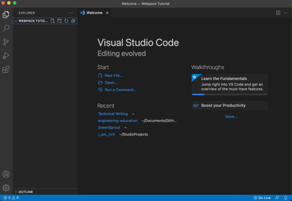
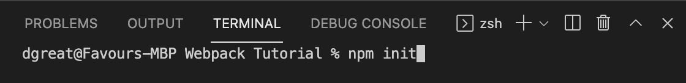
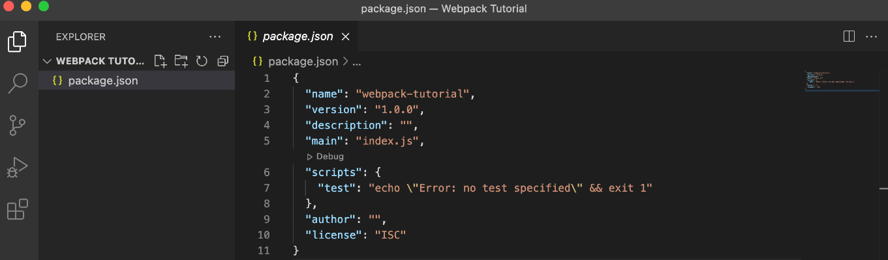
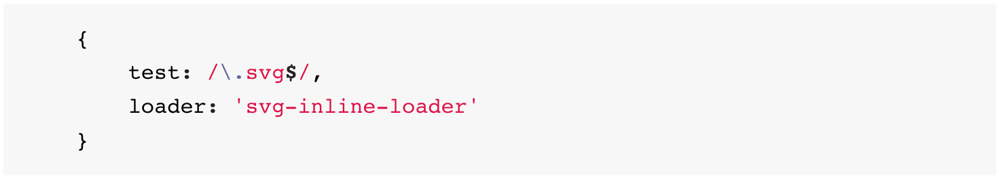
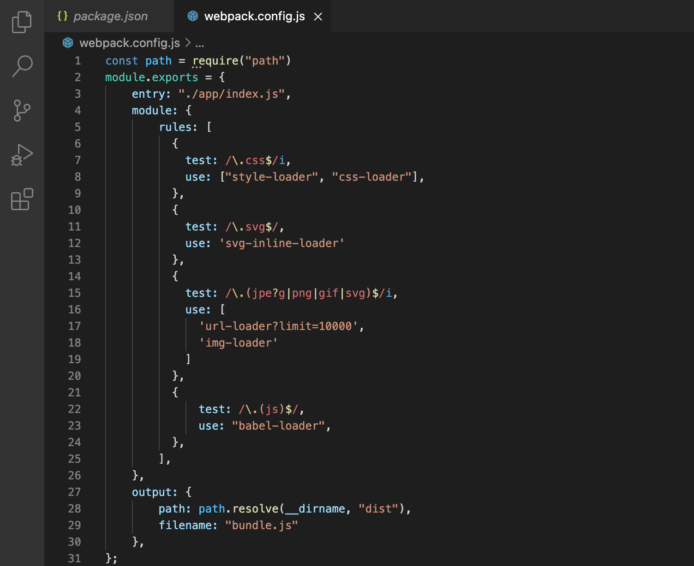
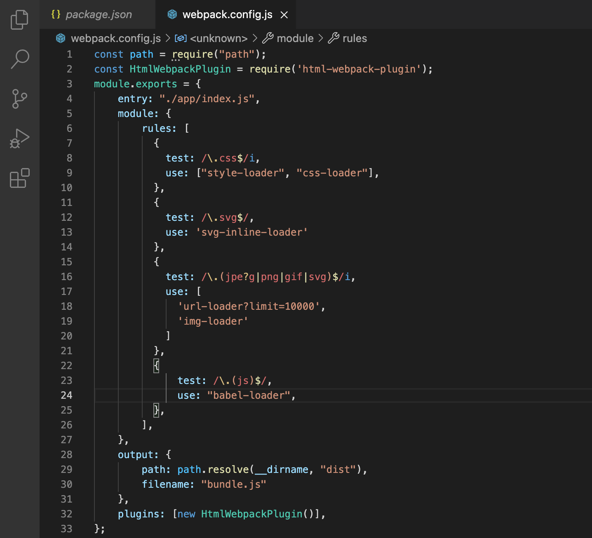

### Importing External Files using Webpack Loaders: The Beginners Guide 
In this article,  we will learn about Webpack and how to use Webpack loaders to import external files while making use of Webpack. 

I am going to be very concise, because I have understood that making use of Webpack loaders to import external files in a web project, can be quite demanding and may look like rocket science, especially for beginners, but it is actually quite easy. 

This tutorial is tailored to suit the needs of a beginner. As a prerequisite, your understanding of HTML, CSS, JavaScript and the use of the Terminal will be helpful. 

### Table Of Contents
1. What is Webpack?
2. Installing Webpack
3. Loaders and Plugins
4. Making use of Webpack loaders to import various types of files

**Let us dive in!**

### What is Webpack?
Webpack is a tool that allows you to modularise your code and helps you to push your codes to one file in other for you not to worry about the hierarchy of your files, especially when working with multiple JavaScript files. 

Webpack also helps you to inject external files, like an SVG, images, your CSS files or other modern JS codes, in your web app. 

**Remember I stated earlier that this tutorial is going to be concise, hence a very simple definition of Webpack, which is what I have stated above, for a more elaborate definition of Webpack, check out this Wiki's Definition of Webpack [Wikipedia's Definition of Webpack](https://en.wikipedia.org/wiki/Webpack)**

### Installing Webpack
The first thing you are going to do is to create a directory or folder, you can call it Webpack or anything you feel appropriate, and then you create another folder and name it Webpack Tutorial. 

Next, you are going to open the Webpack Tutorial Folder with your favorite code editor, in my case is Visual Studio Code!

So I am going to head over to Visual Studio Code and then drag and drop the Folder we last created.



As you can see there is no file in our folder and this is totally fine!

Now the next thing we are going to be doing, is to initialize NPM (Node Package Manager), so I am going to open my terminal in VS Code and enter this command: 

```
npm init
```




**Note: You can only run the npm init command if NodeJs is properly installed on your device. Kindly Check out this link to install NodeJS [Installing NodeJS with Package Manager](https://nodejs.org/en/download/package-manager/)**




If you initalised npm properly, it will generate a package.json file for you, just like I have here.

Now, we have properly initialised our node package and we have our package.json file. Next thing to do, is to install Webpack, and one thing you should note is that installing Webpack only, can make you have some issues later on, so it is always advisable to install Webpack along with the CLI. So you enter this command in your terminal. 

```
npm i webpack webpack-cli --save-dev
```


If you successfully installed Webpack you should have a package-lock.json file and the node_modules folder in your root directory, just like I have here.

Moving forward now, the first thing to do in configuring your webpack, is to create a new file in your root directory and name it webpack.config.js and then we are going to add some codes into this our newly created configuration file. 

Add the following codes into your webpack.config.js file:

```
module.exports = {
    entry: "./app/index.js"
};
```
So in the code above we have the module.exports object and then we declared the entry point for our project which is the app directory and in the app directory, you have the index.js file which is your main file. 

### Loaders and Plugins
Now we have successfully installed webpack and set up our webpack.config.js file. So before we continue to importing our files using Webpack loaders, you need to understand what are loaders and plugins, because this is what we will be using to successfuly handle the importation of our files. 

Whenever there are new things to load in the webpack, for example, we want to import an SVG, or a CSS file, the job of the loaders is simply to bring in these files that we need while things are loaded. So before the final output.js file is created whatever configuration you need to do to bring in your files is being done by the loaders. And whatever configuration that you need to do after the output.js file is created is handled by the plugins. 

As we proceed to import external files using webpack loaders we will understand more the work of the loaders and plugins. 

### Making use of Webpack loaders to import various types of files. 

### Importing your CSS File
The first thing we are going to do is to run the command below in our terminal

```
npm install --save-dev css-loader style-loader
```

Then you add the following into your webpack.config.js file
 ```
 module: {
    rules: [
      {
        test: /\.css$/i,
        use: ["style-loader", "css-loader"],
      },
    ],
  },
```

.png)

Your webpack.config.js file should now look like this. 

We have successfully configured our webpack.config.js file now to be able to load our CSS files and inject our styles into our JavaScript file. 

### Importing an SVG file
The first thing to do is to install the SVG Inline Loader for Webpack. You copy and run this command in the terminal, to do this. 

```
npm install svg-inline-loader --save-dev
```
After successfully installing the SVG Inline loader for webpack, using the command above, the next thing is to add your configuration in your webpack.config.js file. So you add the code below to your webpack.config.js file, in your rules array. 

```
    {
        test: /\.svg$/,
        use: 'svg-inline-loader'
    }
```
If you did that correctly, your webpack.config.js should look like this. 

.png)

**Kindly note that in some other learning resources, you will have them make use of loader instead of use while trying to configure our SVG file in the rules array, but for consistency, we will make use of use instead of the loader. Also, I have found out that in recent learning resources/docs they make use of "use" instead of the loader, for example in the documentation below, the loader was used instead.**


[Image Source](https://www.npmjs.com/package/svg-inline-loader)

### Importing images
Firstly, you are going to install the Image Loader for Webpack by running the command in the terminal below:

```
$ npm install img-loader --save-dev
```
Next, we are going to add the Image loader configuration in our webpack.config.js file:

```
    {
      test: /\.(jpe?g|png|gif|svg)$/i,
      use: [
        'url-loader?limit=10000',
        'img-loader'
      ]
    }
```


Your webpack.config.js file should look like this if you added the Image Loader configuration properly. 

### Importing Babel 
This tutorial is targeted at beginners, but I am going to show you how to also import your Babel JS file. 

The first thing we are going to be doing is to run the command below in our terminal to install the Babel Loader package. 

```
npm install --save-dev babel-loader
```
If you have successfully installed the Bable Loader Package, then we are going to add some configuration in our webpack.config.js file and we will be writing Regex Code. Just copy and add the following in your webpack.config.js file. 

```
    {
        test: /\.(js)$/,
        use: "babel-loader",
    },
```
After doing that your webpack.config.js file should now look like this


We have successfully imported our CSS, SVG, Image and Babel files and added the configuration in our webpack.config.js file but that is not all. 

The next thing we are going to be doing now is to add the output object in our webpack.config.js file. 

So we are going to create an output object and add the path and filename parameter into this object, just copy the code below

```
output: {
        path: path.resolve(__dirname, "dist"),
        filename: "bundle.js"
    }
```
Also, we are going to be importing another module which is the path and this comes in directly as long as you are using node, so you do not need to install it, just add this code to the top of your webpack.config.js. 

```
const path = require("path")
```
If you did everything correctly your webpack.config.js should now look like this



One thing to note here is that you are importing four different files and those files will be bundled up into our bundle.js file but we also need to inject these files into our HTML file, and that is what we are going to be doing next, with the help of HTML webpack plugin. 

To install the HTML Webpack Plugin, we run the command below in the terminal: 

```
npm install --save-dev html-webpack-plugin
```
The next thing to do is to add the code below to the top of our webpack.config.js file

```
const HtmlWebpackPlugin = require('html-webpack-plugin');
```

Then we add the plugins after the output with the code below: 

```
  plugins: [new HtmlWebpackPlugin()],
```


If you did everything correctly, your webpack.config.js file should now be like this. 

Finally, we are going to be installing the Webpack Development Server. 

Run the code below in your terminal
```
npm install webpack-dev-server --save-dev
```
**Note while configuring your webpack there are two modes which are the Production and Development modes, so we are going to declare our modes in the webpack.config.js file**

Add the following to your webpack.config.js file to declare the mode. 

```
mode: process.env.NODE_ENV === "production" ? "production" : "development",
```
In the code above we defined our Environment Variarbale or env and call it NODE_ENV and then we assigned the mode to production and gave a condition. The condition we gave is if it is defined as the production, go ahead and use production mode or else use the development mode.  To define your mode to be development, kindly use this instead: 

```
mode: process.env.NODE_ENV === "development" ? "development" : "production",
```

The next thing to do is to add a start and build script, so add the following in your package.json file

```
    "start": "webpack serve",
    "build": "NODE_ENV='production' webpack",
```

Now all configuration has been done in our webpack.config.js file, so if we have an SVG file, an image, or a CSS file, our webpack has been configured properly to handle these files. 

The next thing we do is to create our app folder in our root directory and inside that app folder, you create a new file called index.js. 

Inside this index.js file, we just add some codes, to test everything we have done so far, so copy the codes below into your index.js file. 

```
const evenNumbers = [2, 4, 6, 8, 10];

console.log(evenNumbers);
```
Now run the following commands in your terminal:

```
npm run build
```

```
npm start
```
After running these two commands, we see that we now have some files that are automatically generated for us. 


Remember that we added an Array of Even Numbers in our index.js file, but then we get our array also in our bundle.js file and then we have the bundle.js script is also inserted into our HTML Webpack plugin generated index.html file. As shown in the images below: 


This shows that our Webpack configuration is totally okay and now you can have a CSS file, an SVG file, an image file, or a modern JS file (Babel JS) and the webpack will take care of it. 

### Conclusion
- We gave a brief description of Webpack
- We learned how to install webpack 
- We briefly discussed about Loaders and plugins
- And finally we made use of webpack loaders to import various file types using a step-by-step approach. 

### Further Reading:
1. [Installing Webpack](https://webpack.js.org/guides/getting-started/)
2. [Webpack Loaders and Plugins](https://stackoverflow.com/questions/37452402/webpack-loaders-vs-plugins-whats-the-difference)
3. [Making use of webpack loaders to import various file types](https://webpack.js.org/guides/asset-management/)