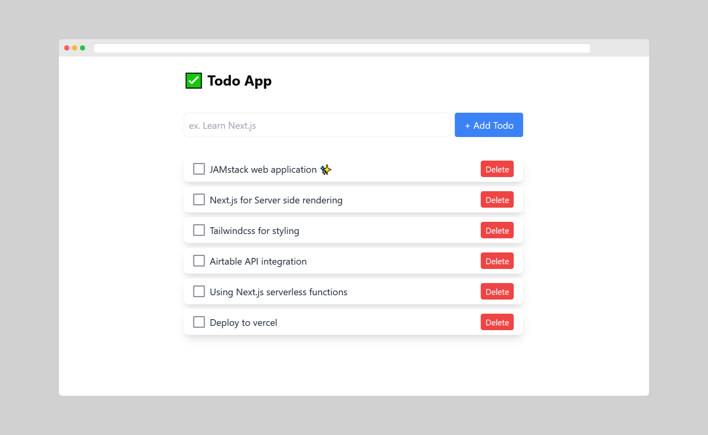

Over the past few years, browsers have evolved and became more powerful. They can work with full functionality even without a single web server. You can take advantage of browser capabilities for building flexible web applications. [JAMstack](https://jamstack.org) is the modern approach for building lightning fast web applications. Database technologies became more user-friendly. In this tutorial, you'll learn how to integrate the Airtable API with a simple web application.

### What we're going to build?



[Final demo](https://replit.com/@giridhar7632/todo-app) | [source code](https://todo-app.giridhar7632.repl.co/)

You'll build a Todo application that will allow you to add all your daily todos, something like the above one. Do not think "again Todo app." You can learn many essential concepts by building simple applications like Todo app. You'll be building the front-end of the application using [Next.js](https://nextjs.org/), a [React](https://reactjs.org/) framework. You will use [tailwindcss](https://tailwindcss.com/) to style our application. The database solution you will use is [Airtable](https://airtable.com/).

Before diving into the tutorial, you should have intermediate knowledge of React. You should be comfortable using [React Hooks](https://reactjs.org/docs/hooks-intro.html) and [Context API](https://reactjs.org/docs/context.html).

### The **JAM**stack and Airtable

The **JAM**stack is a modern approach for developing fast and scalable web applications. The **JAM**stack is the combination of [JavaScript](https://developer.mozilla.org/en-US/docs/Web/JavaScript), [APIs](https://developer.mozilla.org/en-US/docs/Learn/JavaScript/Client-side_web_APIs/Tododuction), and [Markup](https://developer.mozilla.org/en-US/docs/Glossary/markup). The JAMstack website employs third-party APIs to get data.

You will use serverless functions for communicating with Airtable. [Airtable](https://try.airtable.com/database) is a mix of spreadsheet and database. You can integrate Airtable into your application easily using it's excellent API. Airtable API has wonderful documentation. The example code contains all your API keys and base names. To use them in your application, you can copy and paste the code. You can find the Airtable API documentation here: [https://airtable.com/api](https://airtable.com/api).

### Getting started

Open your favorite code editor and run the command `npx create-next-app -e with-tailwindcss`. It generates a Next.js application that has tailwindcss installed. Install Airtable using the command: `npm install airtable`. To verify that everything is working, try running the command: `npm run dev`. You're good to go if you see it render normally.

Next.js supports server-side rendering without the use of any other frameworks. It includes a router that allows you to access any file in the `pages` directory as a new route. Within the `/pages/api` directory, you can create API endpoints using serverless functions.

### Airtable JavaScript setup

Head over to [airtable.com](https://airtable.com/) and sign up for a free account. After you sign in successfully, create a new base starting from scratch. The base is what airtable refers to as a database. You'll have a starter table created with some primary fields. You can personalize the entire base; start with the base's title and the table's name. You can see that the user interface is very friendly, and you can work in the same way you would in a spreadsheet. By right-clicking on a field in the table, you can customize it. You need a `description` field for the user's todo and a `completed` checkbox field. Navigate to [Airtable API](https://www.airtable.com/api/) and select the base you'd like to integrate.

Let's connect Airtable to our app, but first, let's define a few variables that you will need in the code:

- `API_KEY`: the Airtable API key. You can find it within the documentation or in your [account](https://airtable.com/account) page.
- `BASE_ID`: the id of the base you want to integrate. You can find it in the documentation page.
- `TABLE_NAME`: the name of the table in that base (you can use a single base for multiple tables).

Add all these secrets in your application's environment variables (`.env` file). Make sure you ignore them if you're using version control. Learn more about [environment variables](https://www.twilio.com/blog/2017/08/working-with-environment-variables-in-node-js.html).

```
/.env

AIRTABLE_API_KEY=
AIRTABLE_BASE_ID=
AIRTABLE_TABLE_NAME=
```

### Connecting to Airtable

Create a new `Airtable.js` file. I prefer to create it inside a new `utils` folder under the `root` directory, you can create it where ever you want. Add the following code:

```js
const Airtable = require("airtable");

// Authenticate
Airtable.configure({
  apiKey: process.env.AIRTABLE_API_KEY,
});

// Initialize a base
const base = Airtable.base(process.env.AIRTABLE_BASE_ID);

// Reference a table
const table = base(process.env.AIRTABLE_TABLE_NAME);

export { table };
```

The above code establishes a connection with the Airtable base. It first authenticates you using your `API_KEY`. Then all you have to do is initialize a base and reference the table you need.

### Building an API using Next.js

Next.js allows you to create your own API using [API routes](https://nextjs.org/docs/api-routes/tododuction). Next.js maps any file inside the `/pages/api` folder to `/api/*`, an API endpoint instead of a route. For example, the boiler-plate code comes with a simple api endpoint `/api/hello` ([see more on API routes](https://nextjs.org/docs/api-routes/tododuction)).

You can handle any request that hits the endpoint using serverless functions ([what are serverless functions?](https://vercel.com/docs/serverless-functions/introduction)). It has read and write access to the request and response objects. You can handle different types of requests with a single function using a conditional block. But in this project, we are going to create a separate file for handling each request. However, it is not the best practice for developing an API (learn about API [best practices](https://stackoverflow.blog/2020/03/02/best-practices-for-rest-api-design/)).

Now we are going to create an API to perform [CRUD operations](https://www.codecademy.com/articles/what-is-crud) with the Airtable database.

### Get the table records

The Airtable server returns a maximum of 100 records on a page at a time. If you know your table has no more than `100` items, you can use the `firstPage` method. If you have (or expect) more than 100 records, you should paginate through them using the `eachPage` method ([learn how to do it](https://chinarajames.com/how-to-paginate-records-in-airtable-when-using-the-api/)).

Create a new file `todos.js` file in `/pages/api` folder. Add the following code:

```js
import { table } from "../../utils/Airtable";

export default async (_req, res) => {
  try {
    const records = await table.select({}).firstPage();
    res.status(200).json(records);
  } catch (error) {
    console.error(err);
    res.status(500).json({ msg: "Something went wrong! 😕" });
  }
};
```

The above code retrieves all the records that are on the first page (100 records). You will get a record that looks something like this with all the extra data. Another thing to note is that we get nothing in the `completed` field if it is `false`. So we have to add that manually.

```json
[
  {
    "_table": {
      "_base": { "_airtable": {}, "_id": "AIRTABLE_BASE_ID" },
      "id": null,
      "name": "AIRTABLE_BASE_NAME"
    },
    "id": "RECORD_ID",
    "_rawJson": {
      "id": "RECORD_ID",
      "fields": {
        "description": "description",
        "completed": true
      },
      "createdTime": "2021-08-08T13:28:29.000Z"
    },
    "fields": {
      "description": "description",
      "completed": true
    }
  }
]
```

You should map through all the records and get only the required information. Declare the function under `/utils/Airtable.js` and import it when you need it.

```js
// /utils/Airtable.js

// ...

// To get minified records array
const minifyRecords = (records) =>
  records.map((record) => getMinifiedRecord(record));

// to make record meaningful.
const getMinifiedRecord = (record) => {
  if (!record.fields.completed) {
    record.fields.completed = false;
  }
  return {
    id: record.id,
    fields: record.fields,
  };
};

export { table, minifyRecords, getMinifiedRecord };
```

### Create a new record

To create new records, you can use the `create` method. It takes an array of up to 10 record objects. Each of the record objects should have `fields` key with the contents. It returns an array of record objects created if the call succeeded.

Create a new file, `createTodo.js` in the `/pages/api` folder, and add the following code.

```js
import { table, getMinifiedRecord } from "../../utils/Airtable";

export default async (req, res) => {
  const { description } = req.body;
  try {
    const newRecords = await table.create([{ fields: { description } }]);
    res.status(200).json(getMinifiedRecord(newRecords[0]));
  } catch (error) {
    console.log(error);
    res.status(500).json({ msg: "Something went wrong! 😕" });
  }
};
```

You can use [Postman](https://www.postman.com/) or something similar to send a request and test the endpoint.

### Update a record

To update records, you can use the `update` or `replace` method. If you want to update a single field of a record, use the `update` method, or if you're going to replace it with a new record, use `replace` method. The `update` method is very similar to `create` method. It takes an array of `id`s and `fields` up to `10` records and returns the array of updated records.

Create a new file `updateTodo.js` in the `/pages/api` folder and add the following code.

```js
import { table, getMinifiedRecord } from "../../utils/Airtable";

export default async (req, res) => {
  const { id, fields } = req.body;
  try {
    const updatedRecords = await table.update([{ id, fields }]);
    res.status(200).json(getMinifiedRecord(updatedRecords[0]));
  } catch (error) {
    console.log(error);
    res.status(500).json({ msg: "Something went wrong! 😕" });
  }
};
```

Here, you are retrieving the record corresponding to the id and update the fields with new values. You can test the endpoint by sending a request to the API using Postman.

### Delete a record

You can delete a record using the `destroy` method. It takes an array of `id`s of the records you want to delete. You can also set the first parameter to a record ID to delete a single record. It returns the deleted record.

Create a new file `deleteTodo.js` in the `/pages/api` folder and add the following code.

```js
import { table } from "../../utils/Airtable";

export default async (req, res) => {
  const { id } = req.body;
  try {
    const deletedRecords = await table.destroy([id]);
    res.status(200).json(deletedRecords);
  } catch (error) {
    console.log(error);
    res.status(500).json({ msg: "Something went wrong! 😕" });
  }
};
```

### Creating front-end

Now we have our API ready for all our CRUD operations. Let's create the interface to display this data in our Next.js application. Head over to the `index.js` file in your `/pages` directory and get rid of all the code in it. Add the following code:

```jsx
import Head from "next/head";

export default function Home() {
  return (
    <div className="container mx-auto my-6 max-w-xl">
      <Head>
        <title>@Todo App</title>
      </Head>

      <main>
        <p className="text-2xl font-bold text-grey-800 py-2">✅ Todo App</p>
      </main>
    </div>
  );
}
```

The above code is nothing but a React functional component. Next.js has a built-in `Head` component that will act as the `head` tag of your HTML page. Now, if you start running the server, you will see the title of your app. Tailwindcss is a class-based framework. You have to add the classes according to the styles you want, just like in [bootstrap](https://getbootstrap.com).

Next.js has a built-in function `getServerSideProps` for enabling the server-side rendering inside a page. Next.js executes the code inside this function every time before rendering the page. Learn more on `getServersideProps` [here](https://nextjs.org/docs/basic-features/data-fetching###getserversideprops-server-side-rendering).

We will fetch all the todos from the Airtable and then pass them to the `Home` component as [`props`](https://reactjs.org/docs/components-and-props.html) to use the data. Add the following function to your `index.js` page.

```jsx
import { table, minifyRecords } from "../utils/Airtable";

export default function Home({ initialTodos }) {
  console.log(initialTodos);
  // ...
}

export async function getServerSideProps(context) {
  try {
    const todos = await table.select({}).firstPage();
    return {
      props: {
        initialTodos: minifyRecords(todos),
      },
    };
  } catch (error) {
    console.log(error);
    return {
      props: {
        err: "Something went wrong 😕",
      },
    };
  }
}
```

The above function gets all the records from the Airtable and passes them to `initialTodos`. For now, see if it's working by just console logging the data.

### React Context API to Integrate Airtable Data

> Context provides a way to pass data through the component tree passing props down manually at every level - [React documentation](https://reactjs.org/docs/context.html).

In large-scale projects, we have to use the data in many components. So it is a better idea to use React context instead of passing props. Create a new context folder and add a new `todos.js` file. Here, we will perform all the operations on Airtable data and pass the data to the front-end.

```js
import { createContext, useState } from "react";

const TodosContext = createContext();

const TodosProvider = ({ children }) => {
  const [todos, setTodos] = useState();

  // for creating a todo
  const addTodo = async (description) => {
    try {
      // we will send a POST request with the data required to create an tododuction
      const res = await fetch("/api/createTodo", {
        method: "POST",
        body: JSON.stringify({ description }),
        headers: { "Content-Type": "application/json" },
      });
      const newTodo = await res.json();
      // then we will update the 'todos' adding the newly added intoduction
      setTodos((prevTodos) => [newTodo, ...prevTodos]);
    } catch (error) {
      console.error(error);
    }
  };

  // for updating an existing todo
  const updateTodo = async (updatedTodo) => {
    try {
      // we will send a PUT request with the updated information
      const res = await fetch("/api/updateTodo", {
        method: "PUT",
        body: JSON.stringify(updatedTodo),
        headers: { "Content-Type": "application/json" },
      });
      await res.json();
      // then we will update the 'todos' by replacing the fields of existing todo.
      setTodos((prevTodos) => {
        const existingTodos = [...prevTodos];
        const existingTodo = existingTodos.find(
          (todo) => todo.id === updatedTodo.id
        );
        existingTodo.fields = updatedTodo.fields;
        return existingTodos;
      });
    } catch (error) {
      console.error(error);
    }
  };

  // for deleting a todo
  const deleteTodo = async (id) => {
    try {
      // we will send a DELETE request to the API with the id of todo we want to delete
      const res = await fetch("/api/deleteTodo", {
        method: "Delete",
        body: JSON.stringify({ id }),
        headers: { "Content-Type": "application/json" },
      });
      await res.json();
      // them we will update the 'todos' by deleting the todo with specified id
      setTodos((prevTodos) => prevTodos.filter((todo) => todo.id !== id));
    } catch (error) {
      console.error(error);
    }
  };

  return (
    <TodosContext.Provider
      value={{
        todos,
        setTodos,
        updateTodo,
        deleteTodo,
        addTodo,
      }}
    >
      {children}
    </TodosContext.Provider>
  );
};

export { TodosContext, TodosProvider };
```

Follow the comments along with the code. Every time we operate, we have to send an `HTTP` request and update the local `todos` list to avoid refetching data.

Now, open the `/pages/_app.js` file and import the `TodosProvider`. You can only use the `TodoContext` when the component is a child of `TodoProvider`.

```jsx
// /pages/_app.js
import "tailwindcss/tailwind.css";
import { TodosProvider } from "../context/todos";

function MyApp({ Component, pageProps }) {
  return (
    <TodosProvider>
      <Component {...pageProps} />
    </TodosProvider>
  );
}

export default MyApp;
```

You can set the `todos` in `index.js` file. Pass the `initialTodos` you have fetched before to the `setTodos` function. It updates TodosContext and you can use the todos in any component.

```jsx
// /pages/index.js

import React, { useContext, useEffect } from "react";
// ...
import { TodosContext } from "../context/todos";

export default function Home({ initialTodos }) {
  const { todos, setTodos } = useContext(TodosContext);

  useEffect(() => {
    setTodos(initialTodos);
  }, [initialTodos, setTodos]);

  // ...
}

// ...
```

### Displaying Todo

Create a new `Todo.js` in the `components` folder. It takes a prop `todo` and displays it on the webpage.

For adding update and delete functionality, you can import the required functions from `TodosContext`. Here you can update the todo by checking the checkbox. You can delete the todo by clicking the delete button.

```jsx
// /components/Todo.js

import React, { useContext } from "react";
import { TodosContext } from "../context/todos";

const Todo = ({ todo }) => {
  // for updating and deleting todo
  const { updateTodo, deleteTodo } = useContext(TodosContext);

  // Update the record when the checkbox is checked
  const handleCompleted = () => {
    const updatedFields = {
      ...todo.fields,
      completed: !todo.fields.completed,
    };
    const updatedTodo = { id: todo.id, fields: updatedFields };
    updateTodo(updatedTodo);
  };

  return (
    <li className="bg-white flex items-center shadow-lg rounded-lg my-2 py-2 px-4">
      <input
        type="checkbox"
        name="completed"
        id="completed"
        checked={todo.fields.completed}
        className="mr-2 form-chechbox h-5 w-5"
        onChange={handleCompleted}
      />
      <p
        className={`flex-1 text-gray-800 ${
          todo.fields.completed ? "line-through" : ""
        }`}
      >
        {todo.fields.description}
      </p>
      {/* delete todo when the delete button is clicked*/}
      <button
        type="button"
        className="text-sm bg-red-500 hover:bg-red-700 text-white py-1 px-2 rounded"
        onClick={() => deleteTodo(todo.id)}
      >
        Delete
      </button>
    </li>
  );
};

export default Todo;
```

Now, you can import the `Todo` component and map through the array of todos passing each todo to this component.

```jsx
// /pages/index.js

// ...
import Todo from "../components/Todo";

export default function Home({ initialTodos }) {
  // ...
  return (
    // ...
    <main>
      <ul>
        {todos && todos.map((todo) => <Todo key={todo.id} todo={todo} />)}
      </ul>
    </main>
  );

  // ...
}

// ...
```

### Adding Todos

You can create a simple form to add todos to the Airtable. Create a new file `TodoForm.js`. The `form` element in HTML is different from that in React ([learn more on React forms](https://reactjs.org/docs/forms.html)). When you submit the

```jsx
// /components/TodoForm.js

import React, { useState, useContext } from "react";
import { TodosContext } from "../context/todos";

const TodoForm = () => {
  const [todo, setTodo] = useState("");
  const { addTodo } = useContext(TodosContext);

  const handleSubmit = (e) => {
    e.preventDefault();
    addTodo(todo);
    setTodo("");
  };

  return (
    <form className="form my-6" onSubmit={handleSubmit}>
      <div className="flex justify-between w-full">
        <input
          type="text"
          name="todo"
          value={todo}
          onChange={(e) => setTodo(e.target.value)}
          placeholder="ex. Learn Next.js"
          className="flex-1 border border-gray-200 p-2 mr-2 rounded-lg appearance-none focus:outline-none focus:border-gray-500"
        />
        <button
          type="submit"
          className="rounded bg-blue-500 hover:bg-blue-600 text-white py-2 px-4"
        >
          + Add Todo
        </button>
      </div>
    </form>
  );
};

export default TodoForm;
```

You should render the `TodoForm` component in `index.js`.

```jsx
// /pages/index.js

// ...
import TodoForm from "../components/TodoForm";

export default function Home({ initialTodos }) {
  // ...
  return (
    // ...
    <main>
      <TodoForm />
      <ul>{/* ... */}</ul>
    </main>
  );

  // ...
}

// ...
```

Find the source code [here](https://replit.com/@giridhar7632/todo-app).

### Deployment

Let's deploy this application using [vercel](https://vercel.com). I recommend using Vercel for deployment. It does not require any configuration and is free of cost for your personal projects. It supports all the features of Next.js with the best performance. Go to [vercel.com](https://vercel.com) and create an account. Push your project to a Git repository. Then import it to the vercel for deployment ([learn more here](https://vercel.com/guides/deploying-nextjs-with-vercel###step-2:-deploying-your-next.js-project-with-vercel)). See my deployment [here](https://airtable-todo-app.vercel.app/).

### Next steps

Now that you have a full JAMstack application, try extending it's functionality:

- Use the API [best practices](https://stackoverflow.blog/2020/03/02/best-practices-for-rest-api-design/) for building a perfect API.
- Try to add filtering option. You should show all the completed and pending seperately.
- Try to add [Authentication](https://en.wikipedia.org/wiki/Authentication). If you add a todo, everyone can see that one. You can use authenticate a user using third-party services like [Auth0](https://auth0.com/).
