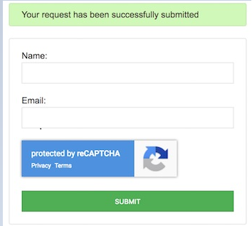

### Introduction

Google reCAPTCHA is entitled your to keeping your website away from abuse and spam. It employs a broad risk evaluation engine and flexible manual human testing to keep automated programming safe on your site.

### Prerequisites

> Before beginning this tutorial, make sure you understand the fundamentals of web development.

### Objectives

- The following is expected at the end of this article:

1. Headings to empower Google vague reCaptcha.
   - 1.1 append the test to a button.
   - 1.2 append the test to a protected or summon the test.
   - 1.3 gather the test.
2. What is it about human tests that Google finds so compelling
3. Note the capability among hCaptcha and Google reCAPTCHA.
4. For what reason should you use Google indistinct reCAPTCHA.
5. Make a Form to Render Google Invisible reCaptcha.
6. Bring Google Invisible reCaptcha Programmatically.

### What is it about human tests that Google finds so compelling?

Because of this, Google has a number of reasons to be concerned about it. First and first, Google must provide the most relevant results. People will switch to other projects if they don't get the results they want. After that, we have the bouts, which include Google reCaptcha returns the data to Google. An IP address allows the data to be organized in Google's database in a logical manner. Using it, you can keep track of which websites you've visited, where you're coming from, and when you last visited them. Every time a user pays close attention to a set of images, it helps Google better understand how a car or traffic signal should behave. For example, with reCaptcha, Google can get the best results, store your site's data, and in the same way have any information on the images.
Google classifies the ambiguous manual human test as structure 3. Neither a checkbox nor a text field can be used. When a customer visits the site or fills out a form, it runs a lead check.

### Comparison of hCaptcha and ReCAPTCHA

reCaptcha is being used by a staggering number of people, and the sheer scale of this usage is remarkable. A bot battle would be pointless in any case, because hCaptcha is simply too strong. Because hCaptcha is not handled by a notification association, it benefits the customer as well as the business. With hCaptcha, you may make money in your area.

### What's the point of using Google's reCAPTCHA?

1. A higher level of security reCAPTCHA is a security measure.
   State-of-the-art advancement allows it to stay on top of spam and abuse fighting designs on the whole. For your safety, reCAPTCHA is cautious.
2. Ease of comprehension Designed with a purpose.
   In addition, be cautious. As a rule of thumb, reCAPTCHA will be kind to humans and harsh to robots. Manual human tests for certified clients are a breeze. That's not to say that the reCAPTCHA isn't capable of making a sound conclusion. An actual client may find our standard sound Manual human testing easily by searching for them on your website or app. Manual human tests are predicted to be more difficult for bots as time goes on.
3. Value Creation
4. People reliably decide on millions of manual human tests.
   In order to reduce the amount of time spent on manual testing, reCAPTCHA utilizes the time that would otherwise be spent on text digitization, image annotation, and the creation of simulated intelligence datasets. This, in turn, saves books, fosters guidelines, and solves difficult computer programming problems.

### The ideal method of using Google invisible reCaptcha

This is refined in three ways:

#### 1. Adding a test to a button is quite common.

It's best to join the main JavaScript resource and add a handful of properties to your html button when employing the ill-defined reCAPTCHA contraption on your page. g-recaptcha is the class name, your site key is stored in the data sitekey field, and a JavaScript callback is used to administer the final human test, which is identified by a callback name in the data callback property.
The content should be layered using HTTPS and be accessible from wherever on the page without hindrance.

#### 2. As a result, either store the results in a safe or gather them.

By presenting your onload callback work and adding cut-off focuses to the JavaScript resource, you may generate the binding. reCAPTCHA challenges are decades old, and this one has the same age restrictions.

#### 3. Typically, the test is summoned.

In order to improve the reCAPTCHA statement, you can use a div with a quality data size='invisible' and frequently call execute to breezing through the evaluation. For this educational exercise, we'll be thinking in this approach, and we'll have a manual to ensure it's clear to everyone.

### Table of content

- [Introduction](#introduction)
- [Prerequisites](#prerequisites)
- [Objectives](#objectives)
- [What is it about human tests that Google finds so compelling?](#what-is-it-about-human-tests-that-google-finds-so-compelling)
- [Comparison of hCaptcha and ReCAPTCHA](#comparison-of-hcaptcha-and-recaptcha)
- [What's the point of using Google's reCAPTCHA?](#whats-the-point-of-using-googles-recaptcha)
- [The ideal method of using Google invisible reCaptcha](#the-ideal-method-of-using-google-invisible-recaptcha)
  - [1. Adding a test to a button is quite common.](#1-adding-a-test-to-a-button-is-quite-common)
  - [2. As a result, either store the results in a safe or gather them.](#2-as-a-result-either-store-the-results-in-a-safe-or-gather-them)
  - [3. Typically, the test is summoned.](#3-typically-the-test-is-summoned)
- [Table of content](#table-of-content)
- [As a Case in Point](#as-a-case-in-point)
- [Google's Imperceptible reCaptcha in HTML](#googles-imperceptible-recaptcha-in-html)
- [The programmable collection of Google's invisible reCaptcha](#the-programmable-collection-of-googles-invisible-recaptcha)
- [A PHP script to verify that a user's response was received.](#a-php-script-to-verify-that-a-users-response-was-received)
- [Conclusion](#conclusion)

### As a Case in Point

Using the third framework, I've depicted Google's confusing reCaptcha allegiance in this model. The Google's hypothetical reCaptcha is brought and passed on in a DIV on an HTML structure when a page is loaded. In the process of transferring, the response token will be used to attract attention to something far beyond what most people think is conceivable. The PHP code will be checked to see if this specialist has been set.


you can get the example [here](https://github.com/EssyG10/invisible-google-recaptcha)

### Google's Imperceptible reCaptcha in HTML

This code displays the HTML structure with the login and email address information fields. In a DIV, Google reCaptcha is called when this HTML page is stacked. HTML5 data attribute with Google reCaptcha key is required for this DIV to pass the vague manual human test. Adding a restricted intel field to set the response token on helpful is part of this upgrade.

```html
<!DOCTYPE html>
<html lang="en">
  <head>
    <meta charset="UTF-8" />
    <meta http-equiv="X-UA-Compatible" content="IE=edge" />
    <meta name="viewport" content="width=device-width, initial-scale=1.0" />
    <title>Automatically bind the challenge to a button</title>
  </head>
  <body>
    <div class="container">
      <form action="validateAccess.php" method="post">
        <div class="row">
          <!-- userName -->
          <div class="input-grp-u-name">
            <label for="userName">userName</label>
            <input type="text" name="u_name" id="u_name" />
          </div>
          <br />
          <!-- email -->
          <div class="input-grp-u-email">
            <label for="email">email</label>
            <input type="text" name="email" id="email" />
          </div>
          <div
            class="g-recaptcha"
            data-sitekey="YOUR-SITE-KEY"
            data-badge="inline"
            data-size="invisible"
            data-callback="response"
          ></div>
          <br />
          <input type="hidden" name="hidden-resp-btn" id="response-c" />
        </div>
        <div class="btn">
          <button type="submit" class="btn-submit" name="submit_btn">
            SUBMIT
          </button>
        </div>
      </form>
    </div>
  </body>
</html>
```

`ValidateContact()` JavaScript framework will be called when this arrangement is introduced to ensure that the fields pertaining to the arrangement are not empty. We've come across a wide range of client-side endorsing model code. As an illustration, consider the PHP contact structure model with JavaScript endorsement code. To proceed with structure submission to the PHP code, this endorsement will restore a boolean value.

```javascript
let validateContactInfo = () => {
  let valid = true;
  let element = document.querySelector(".info");
  if (!document.querySelector("#name").value) {
    document.querySelector("#userName-info").innerHTML("(required)");
    document.querySelector("#name").style.borderColor = "red";
    valid = false;
  }
  if (!document.querySelector("#email").value) {
    document.querySelector("#userEmail-info").innerHTML("(required)");
    document.querySelector("#email").style.borderColor = "red";
    valid = false;
  }
  if (
    !document.querySelector("#email").value.match(/^([w-.]+@([W-]+[w-{2,4}])?$/)
  ) {
    document.querySelector("#userEmail-info").innerHTML("invalid");
    document.querySelector("#email").style.borderColor = "red";
    return false;
  }
  return valid;
};
```

### The programmable collection of Google's invisible reCaptcha

A callback function called onload is used to support the most efficient method of collecting Google reCaptchas fictitious. By specifying the boundary name, we call the Google reCaptcha Programming interface at the time of appearance. Google's reCaptcha is summoned to pass the reCaptcha device on in a DIV portion in this restriction context. The data credits data `size="invisible"`, data `callback="setResponse"` are contained in the DIV portion, as we saw earlier. There is no requirement to use the data callback. While tearing the Google reCaptcha contraption, the `setResponse()` function is invoked. This callback's response token will be set to a confusing value and maintained in the PHP code.

### A PHP script to verify that a user's response was received.

The PHP Curve interest is used to set the Google reCaptcha site attestation request in this PHP code. The answer text is written with the consumer in mind, taking into account how closely the server monitors the outcome.

```php
<?php
if(isset($_POST['submit_btn'])){
    if(isset($_POST['hidden-resp-btn']) && !empty($_POST['hidden-resp-btn'])){
    $info = array('cret' => 'SECRET KEY', 'answer'=>$_POST['response']);
    $auth = curl_init();
    curl_setopt($auth, CURLOPT_URL,"https://www.google.com/recaptcha/api/siteverify");
    curl_setopt($auth, CURLOPT_POST, true);
    curl_setopt($auth,CURLOPT_POSTFIELDS,http_build_query($info));
    curl_setopt($auth, CURLOPT_SSL_VERIFYPEER, false);
    curl_setopt($auth, CURLOPT_RETURNTRANSFER, true);
    $res = curl_exec($auth);
    if($res == true){
       $msg = '<p id="success"> There has been a request made.</p>';
       echo $res;
    }else{
     $msg = '<p id="fail"> Unable to verify, please retry</p>';
     echo $res;
    }
  }else{
    $result = '<p id="fail"> Unable to verify, please retry</p>';
    echo $res;
  }
}

?>

```

### Conclusion

We've looked the reCAPTCHa implementation in more detail in this lesson to show you how to do it yourself. Detailed instructions for using this feature can be found in the official documentation [here](https://developers.google.com/recaptcha/docs/invisible).

Happy Coding !
