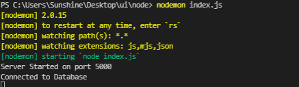
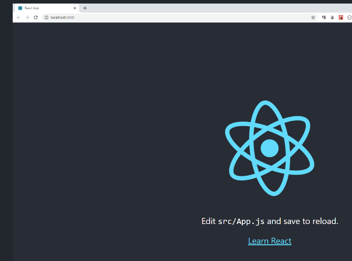
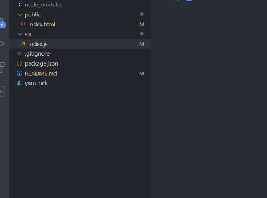
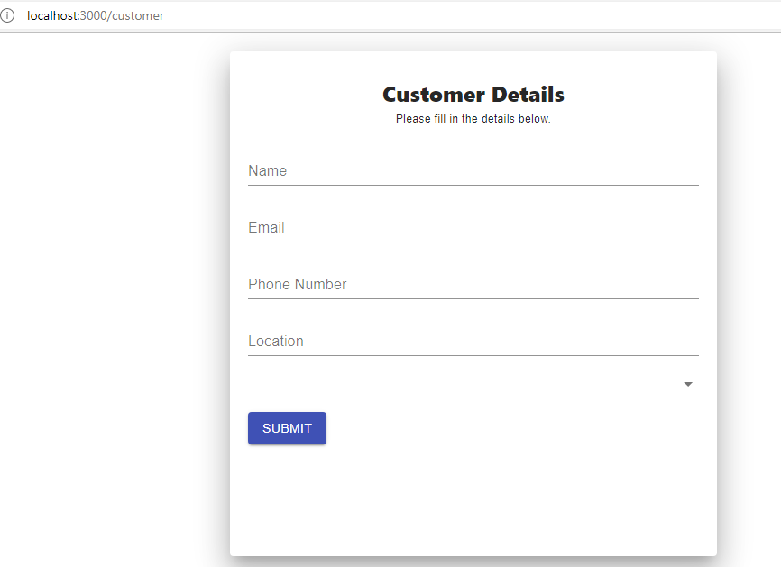
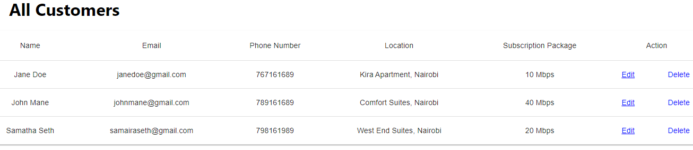
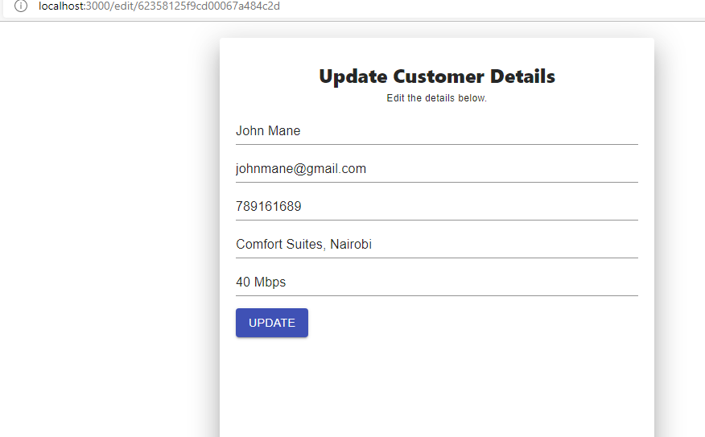

### How to build an Internet Service Provider Management System using MERN Stack.

In this tutorial, we will learn how to integrate our knowledge of various technologies, including MongoDB, Express, React, and Node.js, to create a functional web application.

The web application is going to be a customer management system where one can create, read, update and delete customer information.

Internet Service Providers (ISPs) offer internet access to customers. 
The providers offer services including Wi-Fi installation for individual and corporate clients.
The organizations need an informative and dynamic platform to manage their customers and ensure accurate business records. 
You can learn more about ISPs [here](https://en.wikipedia.org/wiki/Internet_service_provider).

The main aim of this tutorial is to provide foundational knowledge on how to create a MERN stack application through a real-life project.

### Prerequisites

1. An understanding of JavaScript.
2. Basic knowledge of React and Node JS.
3. Basic knowledge of MongoDB.
4. You should also have [Node](https://nodejs.org/en/download/) installed on your machine.

### Table of Contents

- [Backend](#backend)
- [Frontend](#frontend)
- [Connecting Frontend to Backend](#Connecting-Frontend-to-Backend)
- [Conclusion](#conclusion)

### Backend
The web application will follow the architecture shown below  consisting of the Client, Server, and Database.


We will handle all the backend functionality of our app using a [REST API](https://www.smashingmagazine.com/2018/01/understanding-using-rest-api/) created using Node, Express, and MongoDB.
- **MongoDB:** A database that uses a document-oriented data model.
- **ExpressJS:** A web application framework for building web applications and APIs.
- **Node.js:** A cross-platform JavaScript runtime environment used to build servers, and applications.

#### Setting up Development Environment

Let us first set up our development environment.
Create a new folder and navigate to the new folder by running the following commands on a terminal

``mkdir api``
``cd api``

Inside this folder, run `npm init--y` to get a starter package.json which will contain all the dependencies we will need to run the app.
Our package.json file gets updated when we install various dependencies.
Then install Mongoose,Express, and MongoDB using the following command.
``npm install express mongodb mongoose --save``

We will use express to set up a node serve.
MongoDB will enable us to connect to the database, and mongoose, which we will use for defining models.

We will be sharing resources from the server to the client; therefore, we install cors to handle cross-origin resource sharing.

To install cors run this command on the terminal.
``npm install cors``

We use the cors package to enable the server to shares its resources only with clients on a different domain.
You can learn more about CORS [here](https://en.wikipedia.org/wiki/Cross-origin_resource_sharing).

We will install nodemon to run our server automatically when we make changes.

``npm install nodemon --save-dev``

Change the scripts in package.json to 

``"devStart": "nodemon index.js"``

We will also install dotenv to handle our variables from a .env file.

``npm install dotenv --save-dev``

> nodemon and dotenv are in our development dependencies.

#### Setting up the Server

Create a ``.env`` file within the api folder.
We will add the database url which we will connect to and the port we will be listening for new connections.
Add the following to the ``.env`` file.
```
DATABASE_URL = mongodb://localhost/customers
PORT = 5000
```

Create ``index.js`` where we will set up the server.
- Load the environment variables from the .env file by requiring and configuring the dotenv package.
The environment variables are loaded into the ``process.env`` object. 
Import the mongoose package and load the PORT variable.

```javascript 
require('dotenv').config()
const mongoose = require('mongoose')
const PORT = process.env.PORT || 5010
```
- Import the ExpressJS library and initialize a new ExpressJS application. 
```javaScript
const express = require('express')
const app = express()
```
- Import cors and enable the app to use the CORS middleware.
```javascript
const cors = require('cors')
app.use(cors())
```
- add ``express.json()`` method to parse the HTTP request body and listen for new connections on port 5000.

```javascript
app.use(express.json())
app.listen(PORT, () => console.log(`Server Started on port ${PORT}`))
```

``app.use(express.json())`` is a middleware function that parses incoming JSON requests and puts the parsed data in req.body.

``app.listen()`` listens to the connections on the specified port and executes the callback function we pass.

- Create a connection to the database.
use the ``mongoose.connect()`` method to connect to MongoDB.
Include ``useNewUrlParser`` and ``useUnifiedTopology`` to avoid deprecation warnings.
```javascript
mongoose.connect(process.env.DATABASE_URL,
    {
        useNewUrlParser: true,
        useUnifiedTopology: true
    })
```

- Listen for the connect event to determine if the connection is successful.

```javascript
const db = mongoose.connection
db.on('error', (error) => console.error(error))
db.once('open', () => console.log('Connected to Database'))
```

#### Schema Definition
Now let us create the database models and schema.

The database model defines the logical design and structure of a database including how data is stored, accessed and updated.
The schema describes the fields you will have in a document because MongoDB is a document-oriented database.
It contains the attributes of an object in the database.

- Create a ``models`` folder and inside the folder, create a ``Customer.js`` file which will contain our customer schema.

- Import mongoose and create new schema.
```JavaScript

const mongoose = require('mongoose')
const customerSchema = new mongoose.Schema({
}}
```
- Add the following fields inside the customerSchema object.

```javascript
name: {
      type: String,
      required: true
  },
email:{
    type: String,
    required: true
},
phoneNumber: {
    type: Number,
    required: true,
},
location: {
    type: String,
    required: true,

},
subscribedToPackage: {
    type: String,
    required: true
},
subscribeDate: {
    type: Date,
    required: true,
    default: Date.now
}
```
The schema contains the customer's properties which are defined as a JavaScript object where we specify the data type and whether a field is required.

- Export the model
This will make the model available to other files in our application.
```javascript
module.exports = mongoose.model('Customer', customerSchema)
```

#### Setting up API Endpoints

API endpoints are URLs that provide the locations of different resources on the server. 
The endpoints allow the API to receive requests and sends responses. 

The API endpoints to handle our HTTP requests.  We are interested in the POST, GET, PATCH and DELETE methods.
The POST request is used for sending data to the server.
The GET request is used to retrieve data from the server.
The PATCH request is used to update data while the DELETE request is used to delete the specified resource.
The API endpoints enable us to create, read,update and delete customer details.

Create a ``routes`` folder and ``customers.js`` file inside this folder.

- Import express and create a new router object using ``express.Router()`` to handle requests. 
We will use the new router object to handle the get,post,patch and delete requests.

```javaScript
const express = require('express')
const router = express.Router()
const Customer = require('../models/customer')
```
- Add a route to get all customers.

```javaScript
// Get all customers
router.get('/', async (req, res) => {
    try {
        const customers = await Customer.find()
        res.json(customers)
    } catch (err) {
        res.status(500).json({ message: err.message })
    }
})
```

- Add a route to create a new customer.

```javaScript
// Create customer
router.post('/', async (req, res) => {
    const customer = new Customer({
        name: req.body.name,
        email: req.body.email,
        phoneNumber: req.body.phoneNumber,
        location: req.body.location,
        subscribedToPackage: req.body.subscribedToPackage
    })
    try {
        const newCustomer = await customer.save()
        res.status(201).json(newCustomer)
    } catch (err) {
        res.status(400).json({ message: err.message })
    }
})
```
- Create a helper function to get the customer by ID.
We will use this function to avoid repeating code for the routes where we need to work with one customer.

```javaScript
async function getCustomer(req, res, next) {
    let customer
    try {
        customer = await Customer.findById(req.params.id)
        if (customer == null) {
            return res.status(404).json({ message: 'Cannot find customer' })
        }
    } catch (err) {
        return res.status(500).json({ message: err.message })
    }

    res.customer = customer
    next()
}

```
The function gets the customer by ID then calls ``next()``.

``next()`` is a callback function that passes the handler to the next route handler in the route path.

- Add a route to get one customer

```javascript
// Get one customer
router.get('/:id', getCustomer, (req, res) => {
    res.json(res.customer)
})
```
We use the getCustomer() function we defined earlier. 

- Add a route to update a customer's details

```javascript
// Update
router.patch('/:id', getCustomer, async (req, res) => {
    if (req.body.name != null) {
        res.customer.name = req.body.name
    }
    if (req.body.email != null) {
        res.customer.email = req.body.email
    }
    if (req.body.phoneNumber != null) {
        res.customer.phoneNumber = req.body.phoneNumber
    }
    if (req.body.location != null) {
        res.customer.location = req.body.location
    }
    if (req.body.subscribedToPackage != null) {
        res.customer.subscribedToPackage = req.body.subscribedToPackage
    }
    try {
        const updatedCustomer = await res.customer.save()
        res.json(updatedCustomer)
    } catch (err) {
        res.status(400).json({ message: err.message })
    }
})

```

- Add a route to delete a customer.

```javascript
// Delete
router.delete('/:id', getCustomer, async (req, res) => {
    try {
        await res.customer.remove()
        res.json({ message: 'Deleted Customer' })
    } catch (err) {
        res.status(500).json({ message: err.message })
    }
})
```

- Export router
We export the router to make it available for import elsewhere. file
```javaScript
module.exports = router
```
- Add Routes to ``index.js``
Import router from customers.js in the routes folder to make it available for use when we pass the HTTP requests.
```javascript
const customersRouter = require('./routes/customers')
app.use('/customers', customersRouter)
```

#### Run the Server

Run `nodemon index.js` to test if everything in our backend is working.

If the server is properly set up we will get the following output.




### Frontend

For our frontend, we are using React, one of the most popular JavaScript libraries.
Our user interface will consist of three different pages that help the ISP manage customer details.
We will build a form to submit customer details, a table to display all customers and allow the ISP to delete or update customer details.
We will also build a form to facilitate editing customer details.

#### Setting up the Frontend

Run this command in your terminal to get all the boilerplate code we need to run our React app. 

``npx create-react-app ui``

navigate to the ui folder and run `npm start` 

```
cd ui
npm start
```
React App is running on port 3000 which you can view on your browser at http://localhost:3000/ .

You should see this on your browser.




Remove some of the boiler plate code which do not need to remain with the following folder structure.



Let us install some dependencies that we will need to run our app ssuccessfuly. 
We will be using [Material UI](https://mui.com/getting-started/usage/) for our styling which we install by running:

``npm install material-ui/core``

We will also need Axios to send HTTP requests to our backend on port 5000. Install Axios using:

``npm install axios``

#### Creating Routes

- Create the routes in our react app to ensure we render the desired page for a given path. 
The routes correspond to the components we will build later.
We will rely on react-router-dom to navigate to different pages of our app using the BrowserRouter, Router and Route components.
You can learn more about react-router-dom [here](https://v5.reactrouter.com/web/guides/quick-start)

In ``App.js``

```JavaScript
import { BrowserRouter, Routes, Route } from 'react-router-dom'
import CreateCustomer from './components/createCustomer';
import CustomerList from './components/customerList';
import EditCustomer from './components/editCustomer';

function App() {
    return (
        <BrowserRouter>
            <Routes>
                <Route path="/customer" element={<CreateCustomer />} />
                <Route path='/customerlist' element={<CustomerList />} />
                <Route path='/edit/:id' element={<EditCustomer />} />
                <Route exact path='/' element={<CreateCustomer />} />

            </Routes>
        </BrowserRouter>

    );
}

export default App;
```
> Exporting the App makes it available to index.html which is the main html page of our app.

#### Creating Components
React apps are made of different reusable components. Our app will have three main components; createCustomer,editCustomer,customerList.

Let us create each component.
Create a ``components`` folder in the ``src`` folder and add ``createCustomer.js``, ``editCustomer.js``, and ``customerList.js`` files inside the components folder.

##### CreateCustomer Component
This component will render a form that allows user to submit their details.

We will use Material UI's Grid, Paper, TextField, and Button components to create our customer details form.

In the createCustomer.js file, let us create the form.

```javascript
import React from 'react'
import { Grid, Paper, Typography, TextField, Button } from '@material-ui/core'
import Select from '@material-ui/core/Select';

export default function CreateCustomer() {
    const paperStyle = { padding: '30px 20px', height: '500px', width: '500px', margin: "20px auto" }
    const headerStyle = { margin: 0, fontWeight:"800" }
    const marginTop = { marginTop: 15 }
    
    return (
        <Grid>
            <Paper elevation={20} style={paperStyle}>
                <Grid align='center'>
                <h2 style={headerStyle}>Customer Details</h2>
                    <Typography variant='caption' gutterBottom>Please fill in the details below.</Typography>
                </Grid>
                <form>
                    <TextField style={marginTop} id="name" fullWidth label='Name' placeholder="Enter your name" />
                    <TextField style={marginTop} id="email" fullWidth label='Email' placeholder="Enter your email" />
                    <TextField style={marginTop} id="phoneNumber" fullWidth label='Phone Number' placeholder="Enter your phone number" />
                    <TextField style={marginTop} id="location" fullWidth label='Location' placeholder="Apartment,City" />
                    
                    <Select style={marginTop} id="subscription" fullWidth label="Subscription" placeholder="Subscription" ></Select>
                    
                    <Button type='submit' variant='contained' color='primary' style={marginTop}>Submit</Button>
                    
                </form>
            </Paper>
        </Grid>
    )
}
```
For the Select field we need to supply some options for users to choose from based on the available subscriptions offered by the internet service provider.

Add the following code to the createCustomer.js file
```javascript
const options = [
    {
        label: "5 Mbps",
        value: "5 Mbps",
    },
    {
        label: "10 Mbps",
        value: "10 Mbps",
    },
    {
        label: "20 Mbps",
        value: "20 Mbps",
    },
    {
        label: "40 Mbps",
        value: "40 Mbps",
    },
];
```

To display these options in the select field, include the following code.

```javascript
{options.map((option) => (
    <option value={option.value}>{option.label}
    </option> 
   ))}
              
```
The select field should have the following code:
```javascript
<Select style={marginTop} id="subscription" fullWidth label="Subscription" placeholder="Subscription" >
    {options.map((option) => (
        <option value={option.value}>{option.label}</option>
     ))}
                      
</Select>
```

##### CustomerList Component

This component will display a list of all the customers and their details.
We use Material UI's table component to display the customer details and offer the internet service provider options to update customer details or delete a customer.

In customerList.js, let us create the table by adding the following code.

```javascript
import React from "react";
import Table from "@material-ui/core/Table";
import TableCell from "@material-ui/core/TableCell";
import TableContainer from "@material-ui/core/TableContainer";
import TableHead from "@material-ui/core/TableHead";
import TableRow from "@material-ui/core/TableRow";
import Paper from "@material-ui/core/Paper";
export default function CustomerList() {

    return (
            <>
            <h1 style={{ margin:"20px 0 20px 50px" }}>All Customers</h1>
            <TableContainer component={Paper}>
                <Table aria-label="simple table">
                    <TableHead>
                        <TableRow>
                            <TableCell align="center" fontWeight="bold"> Name </TableCell>
                            <TableCell align="center" fontWeight="bold"> Email </TableCell>
                            <TableCell align="center" fontWeight="bold"> Phone Number </TableCell>
                            <TableCell align="center" fontWeight="bold"> Location </TableCell>
                            <TableCell align="center" fontWeight="bold"> Subscription Package </TableCell>
                            <TableCell align="center" fontWeight="bold" colSpan={2}> Action</TableCell>
                        </TableRow>
                    </TableHead>
                </Table>
            </TableContainer>
        </>
    );
}
```
So far we have defined the structure of the table which will be populated by customer data from the database.
We will implement this later on in our app while connecting the frontend to the backend.

#### EditCustomer component 
This component will render a page that will help us update customer details.
It will be pre-populated with the customer details of the selected customer allowing the ISP to make only the needed changes.
The component is similar to the createCustomer component but has different functionality.

In editCustomer.js include,

```JavaScript
import React from 'react'
import { Grid, Paper, Typography, TextField, Button } from '@material-ui/core'


export default function EditCustomer(props) {
    const paperStyle = { padding: '30px 20px', height: '500px', width: '500px', margin: "20px auto" }
    const headerStyle = { margin: 0, fontWeight: "800" }
    const marginTop = { marginTop: 15 }
    
    return (
        <Grid>
            <Paper elevation={20} style={paperStyle}>
                <Grid align='center'>
                    <h2 style={headerStyle}>Update Customer Details</h2>
                    <Typography variant='caption' gutterBottom>Edit the details below.</Typography>
                </Grid>
                <form>
                    <TextField style={marginTop} id="name" fullWidth label='' placeholder="Enter your name" />
                    <TextField style={marginTop} id="email" fullWidth label='' placeholder="Enter your email" />
                    <TextField style={marginTop} id="phoneNumber" fullWidth label='' placeholder="Enter your phone number" />
                    <TextField style={marginTop} id="location" fullWidth label='' />
                    <TextField style={marginTop} id="subscription" fullWidth label='' />
        
                    <Button type='submit' variant='contained' color='primary' style={marginTop} > Update </Button>
                </form>
            </Paper>
        </Grid>
    )
}
```
We will make some additional changes to pre-populate the fields and create the update functionality.

### Connecting Frontend to Backend
The goal is to send the customer data to the database and the fetch data to perform CRUD operations.

#### CreateCustomer Component
Let's begin with posting customer details in the createCustomer component.

We need to manage the state of different variables storing our customer details; therefore, we will use the ``useState`` react hook because we are using functional components.
The ``useState`` hook takes the initial state of the customer details and returns the current state, and the setCustomer function, which updates the state.

In createCustomer.js, outside the return statement,
```javascript
import {useState} from 'react'
    const [customer, setCustomer] = useState({
        name: "",
        email: "",
        phoneNumber: "",
        location:"",
        subscribedToPackage: "",
    });
    
```
- create a function to handle the post request using axios.

```javascript
import axios from "axios"
    const createCustomer = () => {
        axios.post("http://localhost:5000/customers", customer).then(() => {
            window.alert('Successfully Registered')
            window.location.reload(false);
        })
    };
 ```
 The ``createCustomer()`` function is called when the ``onClick()`` event occurs on the submit button.
 
 - Read and Update state
State is updated when the ``onChange()`` event is triggered in the textfields in our form.

Edit the form in ``createCustomer.js`` to include,

```javascript
<form>
    <TextField style={marginTop} id="name" value={customer.name} onChange={(e) => setCustomer({...customer, name: e.target.value })}
        fullWidth label='Name' placeholder="Enter your name" />
    <TextField style={marginTop} id="email" value={customer.email} onChange={(e) => setCustomer({ ...customer,email: e.target.value })}
        fullWidth label='Email' placeholder="Enter your email" />
    <TextField style={marginTop} id="phoneNumber" value={customer.phoneNumber} onChange={(e) => setCustomer({ ...customer,phoneNumber: e.target.value })}
        fullWidth label='Phone Number' placeholder="Enter your phone number" />
    <TextField style={marginTop} id="location" value={customer.location} onChange={(e) => setCustomer({...customer,location: e.target.value })}
        fullWidth label='Location' placeholder="Apartment,City" />

    <Select style={marginTop} id="subscription" value={customer.subscribedToPackage} 
        onChange={(e) => setCustomer({ ...customer,subscribedToPackage: e.target.value })}
        fullWidth label="Subscription" placeholder="Subscription" >
        {options.map((option) => (
            <option value={option.value}>{option.label}</option>
         ))}
    </Select>
    <Button type='submit' variant='contained' color='primary' style={marginTop} onClick={createCustomer}>Submit</Button>
</form>
```
Run ``npm start`` in your terminal

> The server should still be running on port 5000.

Our CreateCustomer component renders out as follows when we navigate to http://localhost:3000/ or http://localhost:3000/customer:



#### CustomerList Component 
The list of customers from the database will make up our table body in the rendered by the customerList component.

- Declare state variable and fetch the data from the database

``useState`` react hook helps us set and update the state of the components.  
The ``useEffect`` hook is used in fetching data and setting the data in the local state of the component.

```javascript
const [customerList, setCustomerList] = useState([]);
useEffect(() => {
        axios.get("http://localhost:5000/customers").then((allCustomers) => {
            setCustomerList(allCustomers.data);
        });
    }, []);
 ```
 In the Action's column in our table, one can delete or update customer details.
 
- Update Customer
 Link this to the editCustomer component using react-router-dom's Link.
 
- Delete Customer
use the ``axios.delete()`` method to delete a customer based on their id which is a unique number generated by MongoDB.

```javascript
import { useEffect,useState } from 'react'
import axios from "axios"
import { Link } from 'react-router-dom'

const deleteCustomer = (id) => {
        axios.delete(`http://localhost:5000/customers/${id}`).then(() => {
            window.location.reload(false);
        })
    }
```
To display the customer list, add the table body component and iterate through the list returned from the database.

```javascript
<TableBody>
    {customerList.map((customer, key) => (
        <TableRow key={customer.key}>
            <TableCell align="center" component="th" scope="row">{customer.name}</TableCell>
            <TableCell align="center">{customer.email}</TableCell>
            <TableCell align="center">{customer.phoneNumber}</TableCell>
            <TableCell align="center">{customer.location}</TableCell>
            <TableCell align="center">{customer.subscribedToPackage}</TableCell>
            <TableCell align="center" style={{ color: "blue", cursor: "pointer" }} component={Link} to={`/edit/${customer._id}`} > Edit</TableCell>
            <TableCell align="center" style={{ color: "blue", cursor: "pointer" }} onClick={() => deleteCustomer(customer._id)} > Delete</TableCell>
        </TableRow>
    ))}
</TableBody>
            
```
Run ``npm start``.

Our CustomerList component renders out as follows when we navigate to http://localhost:3000/customerlist:



So far we have achieved the CREATE,READ, and DELETE functionalities.

- EditCustomer Component.
 Use ``axios.patch()`` method to update customer details after getting the specified customer by id.
 
 Use the ``useParams()`` hook to access URL parameters and extract the id used to pre-populate the fields in the editCustomer form.
 
- Set customer variable and get customer by id

```javascript
import { useEffect,useState } from 'react'
import { useParams } from 'react-router-dom';

 const [customer, showCustomer] = useState([]);
    const { id } = useParams();

    useEffect(() => {
        axios.get(`http://localhost:5000/customers/${id}`).then((customer) => {
            showCustomer(customer.data);

        })
    }
```

- Update Details in database.

```javascript
const updateCustomer = () => {
        axios.patch((`http://localhost:5000/customers/${id}`), customer).then((customer) => {
            showCustomer(customer.data)
            window.alert('Successfully Edited')
            //window.location.reload(false);
        })
    }
 ```
 Include the following in the button in editCustomer.js to call the ``updateCustomer()`` function.
 
 ```javascript
 onClick={updateCustomer}
 ```
 
 Edit the editCustomer.js file to include the following code in the form.
 
 ```javascript
  <form>
        <TextField style={marginTop} id="name" value={customer.name} onChange={(e) => showCustomer({ ...customer, name: e.target.value })}
            fullWidth label='' placeholder="Enter your name" />
        <TextField style={marginTop} id="email" value={customer.email} onChange={(e) => showCustomer({ ...customer, email: e.target.value })}
            fullWidth label='' placeholder="Enter your email" />
        <TextField style={marginTop} id="phoneNumber" value={customer.phoneNumber} onChange={(e) => showCustomer({ ...customer, phoneNumber: e.target.value })}
            fullWidth label='' placeholder="Enter your phone number" />
        <TextField style={marginTop} id="location" value={customer.location} onChange={(e) => showCustomer({ ...customer, location: e.target.value })}
            fullWidth label='' />
        <TextField style={marginTop} id="subscription" value={customer.subscribedToPackage} 
            onChange={(e) => showCustomer({ ...customer, subscribedToPackage: e.target.value })}
            fullWidth label='' />
        <Button type='submit' variant='contained' color='primary' style={marginTop} onClick={updateCustomer}>Update</Button>
   </form>
 ```
Run ``npm start``
The EditCustomer component renders a page similar to the one shown below when we click on the edit action in the customerlist page.



#### Conclusion

We have successfully created a management system for ISPs.
In summary, we have learned:
- how to create REST API in Node.js,Express and MongoDB
- how to create a user interface with React.
- how to connect the server and client using Axios and React hooks.

You can access the complete project [here](https://github.com/wanguiwaweru/MERN-STACK)
Happy Learning !!!
