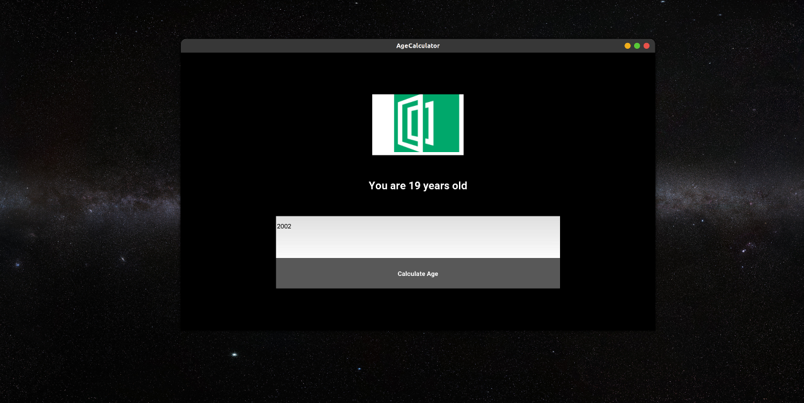

There is a recent transformation into the development of multi-platform languages and frameworks where are one library is used to develop applications that can run on Windows, macOS, Android, and Linux. Fortunately, this trend levies programmers from having to rewrite the same code again for a different platform. So, for instance, an Android developer could write one code base that can efficiently run on different devices.

Kivy python takes the same path, allowing developers to develop multi-platform applications for several operating systems and devices. Thus, applications developed using this library a similar across all the platforms on which they run. One advantage of Kivy is providing a graphical user interface that the developer interacts with as he develops the application.

In this tutorial, the reader will learn to set up Kivy for development and creating a basic application using the same library. Then, we will build a graphical user interface application for a user to do quick basic age calculations.

The development of this project will enable the user to learn how to use the Kivy library, create a graphical user interface using components such as images, text, buttons, and labels. Besides, this tutorial will teach the user how to interact with various layout components.

### Prerequisites
The reader should have a good understanding of the following in order to follow along with this tutorial.
- Python programming language
- Objects and Classes in Python

### Project setup
It would be best if you had the Kivy library installed in your system to get started. Use the command below to install Kivy on your machine.

```bash
pip install kivy
```

### Library import
Create a folder and call it the `calculator app`. This name is the name of the application, and it can be modified. In the folder created, create a new file, call it `main.py`, and add the snippet below.

```py
from kivy.app import App
from kivy.uix.gridlayout import GridLayout
from kivy.uix.label import Label
from kivy.uix.image import Image
from kivy.uix.button import Button
from kivy.uix.text input import TextInput
```

### Coding the application widgets
The snippet above imports the component widgets we require to build the `Age Calculator`application.

Next, create a window object for the application by initializing a class called `AgeCalculator`. Kivy Python is based on Classes and Objects, so if one is not good with Python classes, they can look at that before the tutorial.

```py
class AgeCalculator(App):
    def build(self):
        self.window = GridLayout()
    return self.window
```

Lastly, we specify the function to run as soon as the program executes the file.

```py
if __name__ == "__main__":
 AgeCalculator().run()
```

We need to style our application so that it looks fantastic. For instance, we will begin by setting the number of columns that our grid layout takes. We will do further styling after we have implemented full functionality.

```py
self.window.cols = 1
```

In the same class, we will set the logo for our application using the snippet below. Again, save the application's logo in the same direcory as the `main.py` file, so the application will easily find it.

```py
self.window.add_widget(Image(source("logo_image.png")))
```

Since this application aims to find the user's age when they provide the date of birth, we need to provide an input where they insert the date of birth and give it a label stating "enter your date of birth".

```py
self.ageRequest = Label(text = "Enter your year of birth...")
self.window.add_widget(self.ageRequest)

self.date = TextInput(multiline=False)
self.window.add_widget(self.date)
```

### Collecting user input
Let us set up an application to connect the user input, which is the date of birth.

```py
self.date = TextInput()
```

### Bind to calculate age function to the button
We need to bind the callback function that calculates the age to the button such that when the button is clicked, the `getAge` function is called to calculate the age from the input year of birth.

```py
self.button = Button(text = "Calculate Age")
self.button.bind(on_press = self.getAge)
self.window.add_widget(self.button)
```

### Calculate age function
This function takes the input year of birth and subtracts it from the current year. We use the `DateTime` module in python and extract the year part from it. Additionally, we convert the user input year from string to an integer to calculate a uniform data type. Lastly, we convert the result to a string and display it to the user.

```py
def getAge(self, event):
    today = datetime.today().year 
    dob = self.date.text
    age = int(today) - int(dob) 
    self.ageRequest.text = "You are " + str(int(age)) + " years old"
```

### styling the application.
To style our application correctly, we can begin by adding margins to the application's sides and bottom. Margin is the space around a given component in the application. For our case, the margin will be the space around the container layout. Subsequently, we play around with all other components of the application using the snippet below. 

Another advantage of the module is that the application developed automatically responds to screen size and gives a clear outline of the subjected screen size.

```py
def build(self):
    self.window = GridLayout()
    self.window.cols = 1
    self.window.size_hint = (0.6, 0.7)
    self.window.pos_hint = {"center_x": 0.5, "center_y": 0.5 }
    self.window.add_widget(Image(source("logo_image.png")))


    self.ageRequest = Label(
        text = "Enter your date of birth...", 
        font_size = 50,
        color = "#ffffff",
        bold = True
    )
    self.window.add_widget(self.ageRequest)
    
    self.date = TextInput(
        multiline=False,
        padding_y = (30, 30),
        size_hint = (1, 0.7),
        font_size = 30
    )
    self.window.add_widget(self.date)

    self.button = Button(
        text = "Calculate Age",
        size_hint = (0.5, 0.5),
        bold = True,
        font_size = 30
    )
    self.button.bind(on_press = self.getAge)
    self.window.add_widget(self.button)

    return self.window
```

### Running the application
To run the application, open the terminal, then navigate to the project directory. Next, run the command below in the project directory.

```bash
python main.py
```


### Conclusion
In this article, the reader learned how to create an application using the Kivy python library. We developed an age calculator application using the multi-platform python module and tested our applications' functionality. We realized how every component of development using Kivy is based on understanding Python Classes and Objects.
