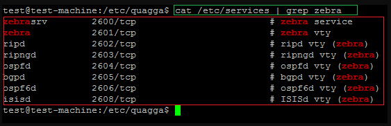

In the Linux working framework, Quagga is a basic open-source project utilized to give steering administrations. It is one of the most generally utilized open-source projects accessible. 
<!--more-->
Various powerful conventions are upheld by this framework, including Open Shortest Path First, Routing Information Protocol, Border Gateway Protocol, Intermediate System to Intermediate System, and Multiprotocol Label Switching. CISCO/virtual JUNIPER's terminal or order line interface for setting conventions is upheld, albeit partially by this variant of the product.

Here we will exhibit how to introduce the Quagga steering suite on a Ubuntu working framework through an order line interface.

### Table of contents
- [Introduction](#introduction)
- [Table of contents](#table-of-contents)
- [Installation](#installation)
- [Configuration](#configuration)
  - [Zebra daemon](#zebra-daemon)
- [Ospfd daemon](#ospfd-daemon)
  - [Ripd daemon](#ripd-daemon)
- [Conclusion](#conclusion)
  - [Further reading](#further-reading)

### Installation
Quagga can be introduced from source code; Here, it will be presented in deb/paired bundle.
In your Ubuntu Operating system terminal, run the code below to check the conditions of the Quagga bundle.

```
#apt-cache depends on Quagga
```

- The following shows the results of running the previously mentioned command.


Introduce the Quagga steering programming by running the accompanying instruction.

```
#apt-get install quagga
```

The accompanying picture shows the Quagga bundle establishment measure.


### Configuration
Bundle sending isn't upheld naturally on Linux-based gadgets except if a couple of piece settings are empowered. Utilizing the directions demonstrated in the image, empower IPv4 bundle sending. The changed worth will stay in the/and so `on/sysctl.conf` document for the remainder of the time.

```
$echo "net.ipv4.conf.all.forwarding=1" | sudo tee -a /etc/sysctl.conf
$echo "net.ipv4.conf.default.forwarding=1" | sudo tee -a /etc/sysctl.conf
 $sudo sysctl -p
```


To utilize Quagga directing programming on Linux, we should initially empower parcel sending. Quagga daemon must be arranged as it continues to work on Ubuntu.

```
babeld.conf
bgpd.conf
isisd.conf
ospf6d.conf
ospfd.conf
ripd.conf
ripngd.conf
vtysh.conf
zebra.conf
```

This is a rundown of arrangement documents that the client might make or replicate from the model's catalog to the quagga setup records registry on the client's framework.


The accompanying picture tells the best way to duplicate records inside the `/etc/quagga/` registry.


After putting the examples in the `/etc/quagga/` index, rename the documents in the envelope.

```
mine@target-computer:/etc/quagga$sudo mv babeld.conf.sample babeld.conf
mine@target-computer:/etc/quagga$sudo mv isisd.conf.sample isisd.conf
mine@target-computer:/etc/quagga$sudo mv ospfd.conf.sample ospfd.conf
mine@target-computer:/etc/quagga$sudo mv ripngd.conf.sample ripngd
mine@target-computer:/etc/quagga$sudo mv zebra.conf.sample zebra.conf
mine@target-computer:/etc/quagga$sudo mv bgpd.conf.sample bgpd.conf
mine@target-computer:/etc/quagga$sudo mv ospf6d.conf.sample ospf6d.conf
mine@target-computer:/etc/quagga$sudo mv ripd.conf.sample ripd.conf
mine@target-computer:/etc/quagga$sudo mv vtysh.conf.sample vtysh.conf
```


Daemons running as quagga approach documents as Quagga, which permits them to adjust record possession and consents. Ubuntu makes the client quagga when putting in new bundles.


To change the proprietor and authorizations, run the accompanying orders in the/and so on/quagga envelope.

```
$sudo chown quagga:quagga *
```


The records as of now have the consent "640" set. At long last, we should initiate or stop specific Quagga daemons. 

The Zebra daemon is an essential part of the steering suite, and all things considered, it should be empowered in the/and so on/quagga/daemons setup document. There could be no other convention daemons designated in the record for this article.

The accompanying picture shows the daemons' record's default settings. The default arrangement document debilitates all directing daemons.


The following is an illustration of an arrangement record that has OSPF and RIP empowered.


The Quagga suite's daemons will utilize the TCP convention and tune in on ports 2600 to 2800.

```
mine@target-computer:/etc/quagga $cat /etc/services | grep zebra
zebrasrv          2600/tcp    # zebra service
zebra             2601/tcp    # zebra vty
ripd              2602/tcp    # ripd vty
ripngd            2603/tcp    # ripngd vty
ospfd             2604/tcp    # ospfd vty
bgpd              2605/tcp    # bgpd vty
ospf6d            2606/tcp    # ospf6d vty
isisd             2608/tcp    # isisd vty
```



Utilize the accompanying order to dispatch the Quagga steering suite.

```
$sudo /etc/init.d/quagga restart
```


We might check that daemons are working effectively by utilizing the netstat tool.

```
$sudo netstat -antp | grep 260
```


The accompanying strategies are accessible for arranging Quagga directing.

```
vtysh

telnet (telnet 127.0.0.1 ospfd/ripd/bgpd/zebra)
```

`vtysh` gives you a focal area to deal with your daemons as a whole. The accompanying order will dispatch a virtual shell for arranging Quagga.

```
$ sudo vtysh
```


vtysh can be utilized to arrange `zebra`, `ospfd`, and `ripd`.


The accompanying pictures exhibit how to arrange daemons utilizing the telnet order.

#### Zebra daemon

```
$telnet localhost zebra
```


### Ospfd daemon

```
$telnet localhost ospfd
```


#### Ripd daemon

```
$telnet localhost ripd
```


### Conclusion
Quagga steering suite is generally utilized on the Linux stage to perform dynamic directing. In this article, we learned the establishment, design, and utilization of the Quagga steering suite. It upholds various ways of arranging running conventions like Open Short Path First and Routing Information Protocol. We can utilize Quagga-based steering gadgets for little and medium endeavors.

#### Further reading
[How to set up Squirrelmail on a Linux computer](https://squirrelmail.org/docs/admin/admin-3.html)

Happy Coding!

---
Peer Review Contributions by: [Dawe Daniel](/engineering-education/authors/dawe-daniel/)