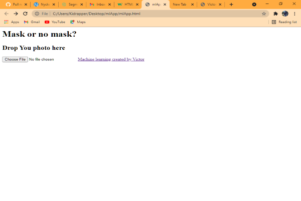
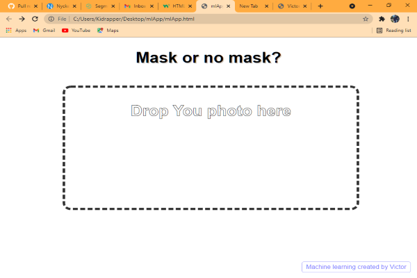
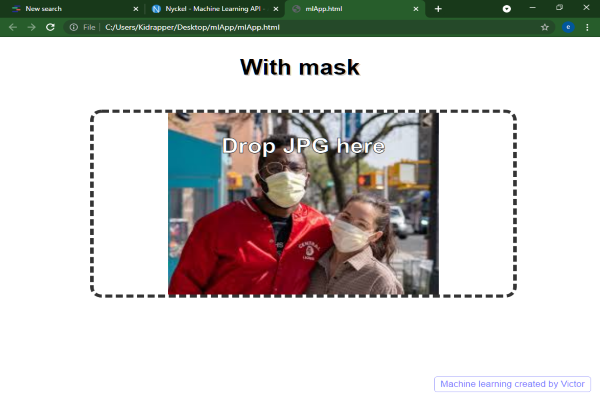
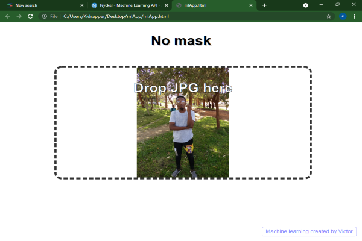

### Machine Learning Image Classification with Javacsript and Nyckel.

### Table of Contents
- [Introduction](#introduction)

- [Requirements](#requirements)

- [Building the Machine Learning model using Nyckel](#building-the-Machine-Learning-model-using-nyckel)

- [Javascript CSS and HTML website build](#Javascript-css-and-html-website-build)

- [ML model integration with the Web Application](#ml-model-integration-with-the-web-application)

- [App live testing](#app-live-testing)

- [Conclusion](#conclusion)

### Introduction
Artificial intelligence has become the future of technology and everyone is trying to apply it in all areas. Artificially intelligent applications are a huge contribution to AI technology with the likes of trading bots and others. Web developers too want to integrate these models into their applications.

This article shows how you can implement Machine Learning models in a web application to classify images. In this case, we will classify and identify the images of people that are wearing and those who are not wearing a mask.

### What is Nyckel?
Nyckel is a Machine Learning API that provides automated training to models instead of manually writing the code. It also allows these models to be integrated into applications with the best simplicity.

### Requirements
To develop, you will need the following;
- A suitable editor like visual studio, sublime and others.
- Prior knowledge to Nyckel, css, Javascript.
- HTML basics.

With these requirements in place, the coding journey can kick off.
Follow each step below to develop your own Machine Learning-enabled web application.

### Javascript CSS and HTML website build
We are going to build a simple web application where you can upload a photo from the desktop into the app. The layout will only need a section to place your photo and an button to make a system call to the file explorer.

#### **HTML Build-up**
Below are the steps involved in HTML build-up. Create a file with .html extension and follow the following steps.
This code is placed under the head tag creates a connection to the Javascript file.

```html
<html>

<head>
  <script src="https://code.jquery.com/jquery-latest.min.js"></script>
</head>

```
Under the body tag is where the upload button and the upload section lies. This code creates what is required under the body section without any styling.

```html
<body>

  <div id="main" class="container">

    <h1 id="title">Mask or no mask?</h1>

    <!-- Drag and Drop container-->
    <div class="upload-area" id="uploadfile">
      <h2>Drop Your photo here</h2>
    </div>
    <input type="file" name="file" id="file">
    <a id="nyckel" href="https://www.nyckel.com">Machine Learning application created by Victor</a>
  </div>
</body>
```
When you run the combination of the code above, you should have a web page with a button and an upload section only as shown in the photo below.



#### **CSS Styling**
In this section we will style the web page to make look presentable and appealing.
We will style the upload section and the arrangements of every feature.
The code below does a general styling just to give an organized page. You can change the code to make the application look more interesting to the client. 

Create a css file(.css) and place this code in it.

```css
body {
    font-family: "Open Sans", sans-serif;
    color: #444444;
    margin: 0;
}

#title {
    color: black;
    text-shadow: #ccc 2px 2px;
}

.upload-area {
    position: absolute;
    width: 70%;
    height: 50%;
    left: 15%;
    top: 20%;
    border: 6px solid #333;
    border-radius: 20px;
    border-style: dashed;
    margin: 0 auto;
    text-align: center;
    overflow: auto;
    background-size: contain;
    background-repeat: no-repeat;
    background-position-x: center;
}

.upload-area:hover {
    cursor: pointer;
}

#file {
    display: none;
}

/* Thumbnail */

.thumbnail {
    width: 80px;
    height: 80px;
    padding: 2px;
    border: 2px solid lightgray;
    border-radius: 3px;
    float: left;
}

.size {
    font-size: 12px;
}

h1 {
    text-align: center;
    font-size: 4vw;
    margin-top: 5vh;
    color: black;
}

h2 {
    color: white;
    font-size: 40px;
    line-height: 60px;
    -webkit-text-stroke: 1px black;
}

h1, h2 {
    text-align: center;
}

body {
    background-attachment: fixed;
    background-size: cover;
}

.banner {
    display: none;
    position: fixed;
    top: 0;
    width: 100vw;
    height: 20vh;
    text-align: center;
    font-size: 12vh;
    line-height: 18vh;
    color: white;
    -webkit-text-stroke: 1px black;
}

.banner h3 {
    position: absolute;
    top: 0;
    margin: 0 auto;
    width: 100%;
    text-align: center;
}

.banner-circle {
    position: relative;
    top: 10vh;
    margin: auto;
    width: 20vh;
    height: 20vh;
    line-height: 25vh;
    border-radius: 50%;
    font-size: 15vh;
    text-align: center;
}

#thinking {
    display: none;
}

#nyckel {
    position: absolute;
    right: 15px;
    bottom: 15px;
    padding: 5px 10px;
    background-color: white;
    opacity: 0.8;
    text-decoration: none;
    color: rgb(87, 87, 255);
    border-radius: 5px;
    border: solid 1px rgb(142, 142, 252);
}

#nyckel:hover {
    text-decoration: underline;
    /* color: white;
    background-color: rgb(163, 203, 255); */
}

@media only screen and (max-width: 600px) {
    h1 {
        font-size: 7vh;
        margin-top: 10vh;
    }
    h2 {
        font-size: 4vh;
    }
    .banner h3 {
        font-size: 8vh;
        line-height: 18vh;
    }
}
```
To link this file to the html file, add the reference link below in the html file under the head tag.

```html
<link rel="stylesheet" type="text/css" href="../mlApp/css/style.css">

```

After applying the css code above, save and refresh the page. The result for this exact code gives the result as shown in the photo below;



#### **Javascript functions**
Javascript helps in client-side scripting. It mostly uses functions to enabled some activities in a webpage. Example of such activities to be enabled by these functions in this page include; upload by dragging, Sending AJAX request to Nyckel to run against ML model, ensure what is uploaded is an image, resizing large images and many more.

This code below contains such functions. Create a Javascript file(.js)

```Javascript
$(function ()
{
    // preventing page from redirecting
    $("html").on("dragover", function (e)
    {
        e.preventDefault();
        e.stopPropagation();
        $("h2").text("Drag here");
    });

    $("html").on("drop", function (e) { e.preventDefault(); e.stopPropagation(); });

    // Drag enter
    $('.upload-area').on('dragenter', function (e)
    {
        e.stopPropagation();
        e.preventDefault();
        $("h2").text("Drop");
    });

    // Drag over
    $('.upload-area').on('dragover', function (e)
    {
        e.stopPropagation();
        e.preventDefault();
        $("h2").text("Drop");
    });

    // Drop
    $('.upload-area').on('drop', function (e)
    {
        e.stopPropagation();
        e.preventDefault();

        $("h2").text("Checking...");

        var file = e.originalEvent.dataTransfer.files;

        showImage(file[0]);

        resizeAndUploadImage(file[0]);
    });

    // Open file selector on div click
    $("#uploadfile").click(function ()
    {
        $("#file").click();
    });

    // file selected
    $("#file").change(function ()
    {
        var file = $('#file')[0].files[0];
        showImage(file);
        resizeAndUploadImage(file);
    });
});
```

```Javascript
function showImage(file)
{
    var reader = new FileReader();
    reader.onload = function (e)
    {
        $('.upload-area').css("background-image", "url(" + e.target.result + ")");
    }
    reader.readAsDataURL(file);
}
```

```javascript
function resizeAndUploadImage(file)
{
    // Ensure it's an image
    if (file.type.match(/image.*/))
    {
        // Load the image
        var reader = new FileReader();
        reader.onload = function (readerEvent)
        {
            var image = new Image();
            image.onload = function (imageEvent)
            {
                // Resize the image
                var canvas = document.createElement('canvas'),
                    max_size = 600,
                    width = image.width,
                    height = image.height;
                if (width > height)
                {
                    if (width > max_size)
                    {
                        height *= max_size / width;
                        width = max_size;
                    }
                } else
                {
                    if (height > max_size)
                    {
                        width *= max_size / height;
                        height = max_size;
                    }
                }
                canvas.width = width;
                canvas.height = height;
                canvas.getContext('2d').drawImage(image, 0, 0, width, height);
                var dataUrl = canvas.toDataURL('image/jpeg');
                var resizedImage = dataURLToBlob(dataUrl);

                checkImageWithNyckel(resizedImage);
            }
            image.src = readerEvent.target.result;
        }
        reader.readAsDataURL(file);
    }
    else
    {
        alert("You must choose an image");
        resetPage();
    }
}
```

```Javascript
/* Utility function to convert a canvas to a BLOB */
var dataURLToBlob = function (dataURL)
{
    var BASE64_MARKER = ';base64,';
    if (dataURL.indexOf(BASE64_MARKER) == -1)
    {
        var parts = dataURL.split(',');
        var contentType = parts[0].split(':')[1];
        var raw = parts[1];

        return new Blob([raw], { type: contentType });
    }

    var parts = dataURL.split(BASE64_MARKER);
    var contentType = parts[0].split(':')[1];
    var raw = window.atob(parts[1]);
    var rawLength = raw.length;

    var uInt8Array = new Uint8Array(rawLength);

    for (var i = 0; i < rawLength; ++i)
    {
        uInt8Array[i] = raw.charCodeAt(i);
    }

    return new Blob([uInt8Array], { type: contentType });
}
/* End Utility function to convert a canvas to a BLOB      */
```

```Javascript
function displayResult(response)
{
    resetPage();
    $("#title").text(response.labelName);
}

function resetPage()
{
    $("#thinking").hide();
    $(".upload-area").show();
    $("h2").text("Drop JPG here");
}


// Sending AJAX request to Nyckel to run against ML model
function checkImageWithNyckel(image)
{
    var formdata = new FormData();
    formdata.append('file', image);

    $.ajax({
        url: 'https://www.nyckel.com/v1/functions/j3l3xdfs0fv4tec7/invoke',
        type: 'post',
        data: formdata,
        contentType: false,
        processData: false,
        dataType: 'json',
        success: function (response)
        {
            displayResult(response);

            //Show the JSON response in the console
            console.log(response);
        },
        error: function (response)
        {
            alert("Error checking image", response);
            $("#title").show();
            resetPage();
        }
    });
}
```
To link this file to the html file, you will similarly create a Javascript reference link in the html file below the css link as indicated below.

```html
<script type="text/Javascript" src="../mlApp/js/main.js"></script>

```
Now refresh your page and try clicking on the upload area. It opens the windows explorer to allow you upload a photo.

### Building the Machine Learning model Using Nyckel
In this section, we are going to train a model using Nyckel to classify images of people wearing a mask and those not wearing a mask. You will require a web association with access 'Nyckel website' for worked on preparing of the model. The steps below will produce a successfully trained model for our web application.

 #### **Create a Nyckel account**
Creating an account will allow you to use Nyckel training site for your model. To sign-up, go to [nyckel.com](https://login.nyckel.com/login?state=hKFo2SBTbW16WjhGLWFjQ1A5UU5sbjZ5SmVSVG0ySmhLSVhYWaFupWxvZ2luo3RpZNkgdjd6bWtmdGRHUFRkNmpaOHNoVEdOSW0tX202QTg5clKjY2lk2SBJdnlPaktQa011YXJHMzZIb2xYb3NUU1BNVnJaT0xtOQ&client=IvyOjKPkMuarG36HolXosTSPMVrZOLm9&protocol=oauth2&redirect_uri=https%3A%2F%2Fwww.nyckel.com%2Fauthentication%2Flogin-callback&response_type=code&scope=openid%20profile%20email&code_challenge=hQvJg-KMgpHyRS8Z7JXGLBtZ1Kg31lFTdjh1Ns566Yc&code_challenge_method=S256&response_mode=query) sign-up page to set up your connection with this API.

- After signing up, select input type (image for this case) then add output categories as  `with mask` and `without mask` then hit `create function` button. 
- In the area provided, upload your photos, two with mask on and two without masks then label them correctly using the two labels. 
- Upload more photos and import while checking their categorization accuracy. The more photos used for training, the higher the accuracy of the model.

After categorizing, you will get a notification that your model is trained.
Navigate to invoke section and perform a satisfaction test on the model by upload a different photo from the ones used in training the check the output function.

Having done all that, your model is trained and ready to use.

### ML model integration with the web Application
To integrate the trained model to the web application, navigate to API section and copy the url given and paste in the Javascript code under `$ajax`. The url looks almost familiar to the one shown below ending with the word `invoke`.

Once done, your application is ready for testing with photos which were not included during training. 

### App live testing
After integrating the model with the web application, you can now upload photos to see how good the app is. The photo below shows how a successful categorization is displayed.

#### Result for a picture with a mask


#### Result for picture without a mask 


### Conclusion
To this extent, you must have learnt how to train a model, a web application that is compatible with a ML model and how to integrate the model into web applications.
Having learnt this, developers can build any type of a Machine Learning-enable web application. The flexibility and easy usability with Nyckel will highly help in growth of Artificial Intelligence technology in the near future.

I hope you find this tutorial helpful.

---
Happy coding...
