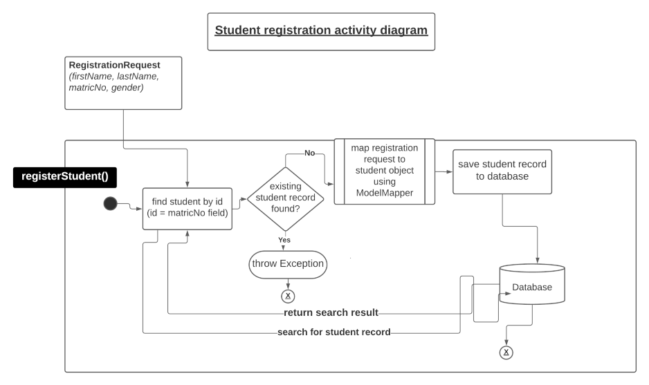
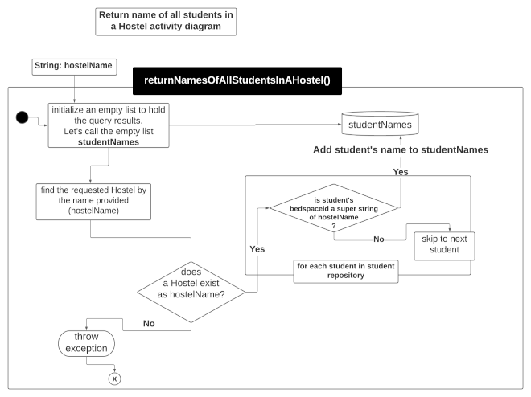
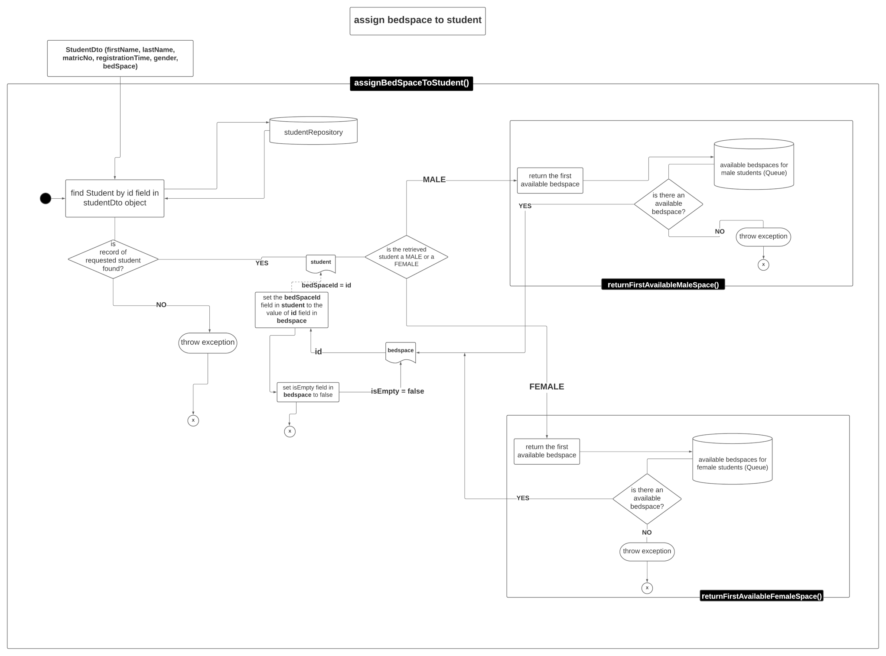

#Mocking with JUnit and Mockito- The Why and How
The idea of unit testing is that we want to verify that our code works regardless of its dependencies. Let us imagine
that we have a service that processes orders from a database.
It is cumbersome to set up an entire database to test this service.
Here mocking comes into play. The concept of mocking revolves around creating test doubles that mock the behavior of
external dependencies in a system. In our scenario, we can create a test double (generally known as a mock) of our database
and then specify the behaviors of our test doubles. Mocking enables us to test code independent of its dependencies, helping us achieve introspection and code isolation.


Mocking with Mockito is a broad topic and would require an entire textbook to exhaust completely. This tutorial will explain:
* the importance of mock, what to mock and what not to mock.
* how mock objects work by giving a brief insight into two(2) types of mocking frameworks.
* how to use Mockito to create mocks
* how to perform basic [stubbing](https://stackoverflow.com/questions/31890991/how-to-use-stubs-in-junit-and-java) on methods of mock objects.
* how to stub methods with an ```Answer``` and explain the use cases of this form of stubbing.
* How to verify the number of invocations of a stubbed method.
* We how to verify arguments using ```ArgumentCaptor```

Our system under test will be the service class of a Hostel Management System built
using Java, [Hamcrest](http://hamcrest.org)(a framework that provides intuitive matchers for testing), [JUnit5](https://junit.org/junit5/)
(a java test engine) and [AssertJ](https://github.com/assertj/assertj-core) (a library that provides fluent assertions for java unit tests.
We make use of AssertJ in this project because Hamcrest does not offer an intuitive API for testing for exceptions).
We also make use of [Spark web framework](https://sparkjava.com/) (a lightweight java web framework) for exposing our API endpoints. The project is available in this [repository](https://github.com/ehizman/bedspaces).

### Goal
At the end of this tutorial, the reader should:
1. have an understanding of how mock objects work and about the types of mocking frameworks.
2. understand why mocking is essential, what to mock and what not to mock.
3. know how to add Mockito to a Java project.
4. know how to stub using Mockito and use simple stubbing mechanisms.
5. know how to verify method invocation.
6. know to verify arguments using ```ArgumentCaptor```.
7. know how to create custom responses from mocks that depend on the call's arguments.

### Prerequisites

As a prerequisite for this tutorial, the reader should have:
- An understanding of Java programming language,
- A basic knowledge of how to use Data Transfer Objects(DTOs) to receive requests and send out responses
- A basic knowledge of how to use the [ModelMapper](http://modelmapper.org/) for mapping models to each other.
- Knowledge of how to use [Lombok](https://projectlombok.org/) and its associated methods
- A basic understanding of how to use [JUnit](https://en.wikipedia.org/wiki/JUnit) for unit tests.
- Java Development Kit (JDK) [installed](https://www.oracle.com/java/technologies/downloads/) on your computer.
- IntelliJ code editor [installed](https://www.jetbrains.com/idea/download/).
- Maven [installed](https://maven.apache.org/)
- Internet access to download Maven dependencies

### Why mocking is essential, what to mock and what not to mock
A test double is a mock implementation of an external dependency used to test a system's interaction with the external dependency. In Mockito, we generally refer to all kinds of test doubles as mocks, but in reality, they can fall into one of the following three(3) categories: stubs, mocks, and spies.

| Type |                                                                            Description                                                                            |
|------|:-----------------------------------------------------------------------------------------------------------------------------------------------------------------:|
| Stub |                         A *stub* is an object that always returns a value regardless of which parameters we pass into the stub's methods                         |
| Mock |                      A *mock* is an object whose behavior -in the form of parameters and return values- we declare before running a test                       |
| Spy  | A *spy* is an object that logs each method call performed on it. We query spies to create assertions to verify the system's behavior under test. |

Mockito supports creating mock objects and spies.
Mocking is a powerful concept in testing across languages. Without mocks and Mocking:
1. It will take much boilerplate code to set up some system dependencies for testing our system(for example - web servers, databases, and services that require calls made over the internet). Using mocks, we only have to "instantiate" one mock instead that will imitate the behavior of an object instead of having to build the object.
2. Without mocks, the execution of our test suite will be slow.
3. It will be impossible to test error conditions, exceptions, and functions that perform costly tasks such as deleting files or database tables since we are testing with the actual objects. Our tests will be sensitive to faults in the external system and not related to what we are testing.

On the other hand, mocks are not a one-size fit all solution for the following reasons:
1. Mocking systems depend strongly on [reflection](https://en.wikipedia.org/wiki/Reflective_programming) and are therefore very slow
2. The need to mock every class interaction forces the creation of extra interface classes whose sole purpose is to allow mocking. Over mocking leads to over-abstraction, making our code extremely complicated.

[Robert C. Martin](https://en.wikipedia.org/wiki/Robert_C._Martin) suggests mocking sparingly. He recommends that we
"mock across architecturally significant boundaries, but not within those boundaries." He means that we should mock out the database, web servers, and any external service(for example, parts of our code that interact with SMTP servers to send emails or perform I/O operations). He suggests that we should avoid mocking interactions between every class.
>mock across architecturally significant boundaries, but not within those boundaries

### How mock objects work
As quipped by this [article on devopedia](https://devopedia.org/mock-testing), there are essentially two types of mocking frameworks. There are proxy-based mocking frameworks and classloader-remapping-based frameworks. Let us look at the first and more popular option, mocking via proxy objects.

In proxy-based mocking, a proxy object imitates the actual object.
We inject the proxy object as a dependency through either the constructor or the setter. Dependency Injection (DI) frameworks such as Spring utilize this form of mocking. Mocking frameworks such as *EasyMock*, *JMock*, and *Mockito* offer this form of mocking. However, there may be limitations in proxying static/private/final methods or a final class.

In classloader-remapping-based mocking, a class loader remaps the reference to the `.class` file of a dependency to the `.class` file of the mock object.
Thus, it loads the mock object rather than the actual object. Mocking frameworks such as *JMockit* and *PowerMock* support this form of mocking.  Classloader-remapping-based mocking overcomes the limits of proxy-based mocking.

### Mockito in use
This section demonstrates the use of Mockito while building a Hostel Management System. The system allows the following actions:
* Students can register on the system.
* Students can be assigned bed spaces.
* The system allows a user to find all students in a Hostel by providing the name of the Hostel.
* The system allows a user to find all students in a room by providing the room's id.

The domain classes used in the program are *Hostel, Room, Student, HostelName, BedSpace, and Gender*
The system's class diagrams are displayed below.


>*Hostel* represents a real-world Hostel.
The system comprises two(2) male hostels and two(2) female hostels.
Each *Hostel* comprises twenty(20) *Room*s.
Each *Room* comprises four(4) *Bedspaces*.
Our ```HostelRepository``` exists as an array of ```Hostel``` objects, and our ```StudentRepository``` exists as a Map of student matricNo: student-object pairs.

The ```StudentServiceImpl``` class is dependent on the ```StudentRespository``` class the
```HostelRepository``` class.

### Setting up Mockito
There are different ways of using Mockito. But the use Mockito, we first need to add the following dependencies to our
```pom.xml``` file:

```xml
<dependencies>
    <dependency>
        <groupId>junit</groupId>
        <artifactId>junit</artifactId>
        <version>4.13.2</version>
        <scope>test</scope>
    </dependency>
    <dependency>
      <groupId>org.assertj</groupId>
      <artifactId>assertj-core</artifactId>
      <version>3.21.0</version>
      <scope>test</scope>
    </dependency>
    <dependency>
      <groupId>org.mockito</groupId>
      <artifactId>mockito-core</artifactId>
      <version>4.1.0</version>
      <scope>test</scope>
    </dependency>
</dependencies>
```
1. #### Creating Mocks with Plain Mockito

We can create mock manually with [Mockito::mock](http://static.javadoc.io/org.mockito/mockito-core/2.2.28/org/mockito/Mockito.html#mock(java.lang.Class)). Using ```Mockito::mock``` to create mock objects works regardless of the version of JUnit (or the test framework).
```java
private HostelRepository hostelRepository = Mockito.mock(HostelRepository.class);
private StudentRepository studentRepository = Mockito.mock(StudentRepository.class);
private StudentService studentService = new StudentService(hostelRepository, studentRepository);
```
We can simply declare a variable with the type of component we want to mock. Taking the example from above, we mocked the
```HostelRepository``` and ```StudentRepository```, so we do not have to rely on dependencies(like a database).
We pass the mock object to the ```StudentService```-the system under test.

2. #### Initializing Mocks with Mockito Annotations
The [MockitoAnnotations::initMocks](https://static.javadoc.io/org.mockito/mockito-core/2.2.28/org/mockito/MockitoAnnotations.html)
to is used to create mocks programmatically by annotating the objects to mock with the
[@Mock](https://static.javadoc.io/org.mockito/mockito-core/2.2.28/org/mockito/Mock.html) annotation. We use Mockito annotations when we have several dependencies to mock, and we do not want to create mock manually for each dependency.
This method of creating mocks works regardless of the JUnit version (or test framework for that matter but Java 9 could interfere here, depending on whether the test code ends up in a module or not).

```java
class StudentServiceImpl_StubbingTests {
    private StudentService studentService;
    @Mock
    private StudentRepository studentRepository;
    @Mock
    private HostelRepository hostelRepository;
    private RegistrationDto registrationRequest;
    private Student student;

    @BeforeEach
    void setUp() {
        MockitoAnnotations.openMocks(this);
        studentService = new StudentServiceImpl(studentRepository, hostelRepository);
    }
    //test cases excluded for the sake of brevity
}
```
We can annotate each field to mock with ```@Mock``` annotation. Annotating each field does not initialize the mocks yet.
To initialize mocks, we call ```MockitoAnnotations.openMocks(this)``` in the ```@BeforeEach``` section before then injecting
the mocks into the constructor of our service.

3. #### Using JUnit Jupiter's MockitoExtension
[JUnit 5](https://junit.org/junit5/) has a powerful extension model, and Mockito published one under the group/artifact ID [org.mockito:mockito-JUnit-jupiter](http://search.maven.org/#search%7Cgav%7C1%7Cg%3A%22org.mockito%22%20AND%20a%3A%22mockito-junit-jupiter%22).
We can use the extension by adding ```@ExtendWith(MockitoExtension.class)``` to the test class and annotating mocked
fields with ```@Mock``` The ```@Mock``` annotation eliminates the need for ```MockitoAnnotations::initMocks``` in the previously described
annotation-based method, making our test classes neat and concise.

```java
@ExtendWith(MockitoExtension.class)
class StudentServiceImpl_StubbingTests {
    private StudentService studentService;
    @Mock
    private StudentRepository studentRepository;
    @Mock
    private HostelRepository hostelRepository;
    private RegistrationDto registrationRequest;
    private Student student;

    @BeforeEach
    void setUp() {
        //we inject the mocks into the studentServiceImpl
        studentService = new StudentServiceImpl(studentRepository, hostelRepository);
    }
    //test cases excluded for the sake of brevity
}
```
We can use the mockito extension by first adding the following dependency to our ```pom.xml``` file.
Note that this single dependency replaces both the```mockito core``` and the ```junit``` dependencies defined above.
```xml
<dependency>
  <groupId>org.mockito</groupId>
  <artifactId>mockito-junit-jupiter</artifactId>
  <version>3.12.4</version>
  <scope>test</scope>
</dependency>
```
4. #### Injecting Mock with Spring
If we have a more complex test fixture, and we want to inject the mock into Spring's ```ApplicationContext``` we can make
use of ```@MockBean```:
```java
@ExtendWith(MockitoExtension.class)
class StudentServiceImplTest {
    @MockBean
    private StudentRepository studentRepository;
    @MockBean
    private HostelRepository hostelRepository;
    @InjectMocks
    private StudentService studentService;

    //test cases for the sake of brevity
}
```
> ```@MockBean``` is not an annotation from Mockito but SpringBoot. Spring places the
mock in the context when spinning up the test so that we do not need to do it ourselves. Spring injects the mock instead of the actual object wherever a bean requests to satisfy its dependency.

#### When to use plain/ classic Mockito and when to use @MockBean from Springboot
If our test does not need any dependencies from the SpringBoot container, the classic/ plain Mockito is the way:
it is fast and ensures the isolation of each test component.

If our test needs to rely on the SpringBoot container, and we also want to add or mock one of the container beans:
```@MockBean``` from SpringBoot is the way. Typical usage of SpringBoot  ```@MockBean```
is in writing controller tests with test classes annotated with ```@WebMvcTest``` The [Spring Boot Documentation](https://docs.spring.io/spring-boot/docs/current/reference/html/) provides
a clear summary:

> Often ```@WebMvcTest``` will be limited to a single controller and used in combination with ```@MockBean``` to provide mock implementations for the required collaborators

### Defining the behavior of mock objects- performing basic stubbing with Mockito
Mockito allows us to define the behavior of our mocks through stubbing operations on the mock object's methods. Stubbing
allows us to return a given value whenever we invoke a specific method. The simple stubbing directive
```when(something).thenReturn(somethingElse)``` allows us to perform basic stubbing.

The ```when()``` method represents a **trigger**. The "`when` "trigger does not work when the method is void.

The following is the syntax of importing "`when` ":
```java
import static org.mockito.Mockito.when;
```
There are several ways to use the ```when-then``` directive.
1. ```when- thenReturn()```: This stubbing directive returns a particular hardcoded value whenever we invoke a specific method on a mock object. To demonstrate the ```when- theReturn()``` directive, let us consider the *student can register* use-case of our hostel management system.
   

The ```registerStudent``` method code snippet is shown below:

```java
  @Override
  public StudentDto registerStudent(RegistrationRequest registrationRequest) throws Exception {
      Optional<Student> optionalStudent = studentRepository.findById(registrationRequest.matricNo());
      if (optionalStudent.isPresent()){
          throw new HostelManagementException("Matric number is not unique");
      }
      Student student = ModelMapperConfig.getMapper().map(registrationRequest, Student.class);
      student = studentRepository.save(student);
      return ModelMapperConfig.getMapper().map(student, StudentDto.class);
  }
```

The test case code snippet for ```registerStudent``` method is as follows:
```java
@Test
void registerStudentTest() throws Exception {
    RegistrationRequest registrationRequest = new RegistrationRequest(
                                                  "John",
                                                  "Doe",
                                                  "securedPassword",
                                                  "MAT100419",
                                                  Gender.MALE);
    Student studentToSave = Student.builder()
                                .firstName("John")
                                .lastName("Doe")
                                .matricNo("MAT100419")
                                .password("securedPassword")
                                .gender(Gender.MALE).build();

    when(studentRepository.save(any(Student.class))).thenReturn(studentToSave);

    StudentDto studentDto = studentService.registerStudent(registrationRequest);

    assertThat(studentDto, hasProperty("firstName", equalTo("John")));
    assertThat(studentDto, hasProperty("lastName", equalTo("Doe")));
    assertThat(studentDto, hasProperty("matricNo", equalTo("MAT100419")));
    assertThat(studentDto, hasProperty("gender", equalTo(Gender.MALE)));
}
```

First, we create a registration request object since our ```registerStudent```method takes an object of ```RegistrationRequest``` as a parameter. Next, we create a ```studentToSave``` object, and the ```save``` method in the ```studentRepository``` class is stubbed to return ```studentToSave``` object whenever the ```save``` method is invoked. Note that the ```any(Student.class)```
[Mockito Argument Matcher](https://javadoc.io/doc/org.mockito/mockito-core/latest/org/mockito/ArgumentMatchers.html)
is passed to the ```save``` method, which means that whenever we invoke the ```save``` method with any object of class ```Student```
the ```studentToSave``` object will be returned.

2. ```when- thenThrow(e)```: This throws an ```e``` exception whenever we invoke the stubbed method. To explain how ```when- thenThrow``` works, let's say we want to stub the ```save``` method in our ```StudentRepository```
      ```java
       public Student save(Student student) throws HostelManagementException {
            if (student == null){
                throw new NullEntityException("student object cannot be null");
            }
            database.put(student.getId(), student);
            return student;
       }
      ```
We can direct our mock ```studentRepository``` to throw a ```NullEntityException``` whenever a null object is passed into
   the ```save``` method :
      ```java  when(studentRepository.save(null)).thenThrow(NullPointerException.class);
      ```
3. ```thenAnswer(Answer answer)```: Instead of calling hardcoded values, the ```thenAnswer``` stubbing method executes a
   user-defined logic. ```Answer``` is an interface. We use the ```thenAnswer(Answer answer)``` stubbing method when our assertion includes a return value computed at run time. To demonstrate the usage of the ```thenAnswer()``` stubbing method, let us add a
   ```registrationTime``` field of type ```LocalDateTime``` to our ```Student``` model. ```thenAnswer``` makes sense to use in this scenario because we want our mock to return the exact time a student registered. To do this:
  * First, we declare a variable ```time``` in our test class and initialize it to ```null``` in our ```@BeforeEach```
```java
 @ExtendWith(MockitoExtension.class)
 class StudentServiceImpl_StubbingTests {
 private StudentService studentService;
 @Mock
 private StudentRepository studentRepository;
 @Mock
 private HostelRepository hostelRepository;
 private LocalDateTime time;

 @BeforeEach
     void setUp() {
     time = null;
     studentService = new StudentServiceImpl(studentRepository, hostelRepository);
   }
 }
 ```
* Next, we create a getter method called ```getTime``` that will return the value of the ```time``` variable whenever it
  is called:
```java
private LocalDateTime getTime() {
  time = LocalDateTime.now();
  return time;
}
```
* Finally, we write our test case as follows:
```java
@Test
void registerStudentTest_WithRegistrationTime() throws Exception {
    RegistrationRequest registrationRequest = new RegistrationRequest(
        "John",
        "Doe",
        "securedPassword",
        "MAT100419",
        Gender.MALE);
  when(studentRepository.save(any(Student.class))).thenAnswer(answer->{
        return Student.builder()
                 .firstName("John")
                 .lastName("Doe")
                 .matricNo("MAT100419")
                 .password("securedPassword")
                 .registrationTime(getTime())
                 .gender(Gender.MALE).build();
     });
     StudentDto studentDto = studentService.registerStudent(registrationRequest);

     assertThat(studentDto, hasProperty("firstName", equalTo("John")));
     assertThat(studentDto, hasProperty("lastName", equalTo("Doe")));
     assertThat(studentDto, hasProperty("matricNo", equalTo("MAT100419")));
     assertThat(studentDto, hasProperty("registrationTime", equalTo(time)));
     assertThat(studentDto, hasProperty("gender", equalTo(Gender.MALE)));
}
```
4. ```thenCallRealMethod()```: This method calls the real method on the mock object.
> Note that we may not get very realistic behavior when calling the actual method on a mock because mocked objects will
skip all constructor and initializer calls. That means that if our method uses any instance state at all, it is unlikely
to work as a mock with "`thenCallRealMethod` "or "`doCallRealMethod` "(for mocking void methods). However, with a
Mockito *spy* we can create a more realistic interaction with our mock object.

Let us say we want to return the names of all students that have bed spaces in two (2) hostels- *HALL3 and HALL4*.
Also, let us say  that ```returnNamesOfAllStudentsInAHostel``` method in the ```studentServiceImpl``` class involved
some complex algorithm to find all students in a hostel and return their names as a list. In this scenario, we will want to
call the actual implementation of the ```returnNamesOfAllStudentsInAHostel``` method because it interfaces with many methods
in other classes hence stubbing the behavior of mock objects that interact with the method will lead to writing confusing
and fragile test cases.

The activity diagram for the ```returnNamesOfAllStudentsInAHostel``` method is as follows:



The implementation of ```returnNamesOfAllStudentsInAHostel``` method is given as:
```java
public List<String> returnNamesOfAllStudentsInAHostel(String hostelName) throws Exception {
    List<String> studentNames = new ArrayList<>();
    Hostel hostel = hostelRepository.findHostelByName(hostelName);
    for (Student student: studentRepository.findAll()) {
            if (student.getBedSpaceId().contains(hostel.getName().name())){
            studentNames.add(student.getName());
        }
    }
    return studentNames;
}
```
Our test case for ```returnNamesOfAllStudentsInAHostel``` method will be as follows:
```java
@Test
void testReturnNamesOfAllStudentsInAHostel() throws Exception {
    List<StudentDto> registeredStudents = registerStudents();
    for (StudentDto dto: registeredStudents) {
        studentService.assignBedSpace(dto);
    }
    when(studentRepository.findAll()).thenCallRealMethod();
    when(hostelRepository.findHostelByName(anyString())).thenCallRealMethod();
    List<String> studentsInHall3 = studentService.returnNamesOfAllStudentsInAHostel("HALL3");
    List<String> studentsInHall1 = studentService.returnNamesOfAllStudentsInAHostel("HALL1");

    assertThat(studentsInHall3, hasSize(2));
    assertThat(studentsInHall3, hasItems("John Doe", "Peter Rabbit"));
    assertThat(studentsInHall1, hasSize(2));
    assertThat(studentsInHall1, hasItems("Mary Fallow", "Patricia Lemon"));
}

private List<StudentDto> registerStudents() throws Exception {
    RegistrationRequest firstRegistrationRequest = new RegistrationRequest(
                                                                  "John",
                                                                  "Doe",
                                                                  "securedPassword",
                                                                  "MAT100419",
                                                                  Gender.MALE);
    RegistrationRequest secondRegistrationRequest = new RegistrationRequest(
                                                                  "Mary",
                                                                  "Fallow",
                                                                  "securedWassword",
                                                                  "MAT100420",
                                                                  Gender.FEMALE);
    RegistrationRequest thirdRegistrationRequest = new RegistrationRequest(
                                                                  "Peter",
                                                                  "Rabbit",
                                                                  "securedDassword",
                                                                  "MAT100421",
                                                                  Gender.MALE);
    RegistrationRequest fourthRegistrationRequest = new RegistrationRequest(
                                                                  "Patricia",
                                                                  "Lemon",
                                                                  "securedBassword",
                                                                  "MAT100422",
                                                                  Gender.FEMALE);
    StudentDto firstStudentDto = studentService.registerStudent(firstRegistrationRequest);
    StudentDto secondStudentDto = studentService.registerStudent(secondRegistrationRequest);
    StudentDto thirdStudentDto = studentService.registerStudent(thirdRegistrationRequest);
    StudentDto fourthStudentDto = studentService.registerStudent(fourthRegistrationRequest);

    return new ArrayList<>(List.of(firstStudentDto, secondStudentDto,
    thirdStudentDto, fourthStudentDto));
}
```

First, we make a call to a helper method- ```registerStudents``` which registers students and then returns a list of
```StudentDto``` objects. Notice the use of ```when- thenCallRealMethod```. ```when(studentRepository.findAll()).thenCallRealMethod()```  instructs the ```studentRepository``` to make a real call to the ```findAll``` method. ```when(hostelRepository.findHostelByName(anyString()).thenCallRealMethod()``` instructs the ```hostelRepository``` to make a real call to the ```save``` method whenever any ```String``` object is passed into it.

However, when we run our test case, we get the following error:

```
java.lang.NullPointerException: Cannot invoke "java.util.Map.getOrDefault(Object, Object)" because "this.database" is null
```

We get this error because, as explained earlier, creating a mock object of a class will skip all constructor and initializer calls
therefore those instance variables that we initialized in the constructor will be null.
To fix the error, we can create **spies** of dependencies using one of the following methods:

```java
// 1. Using Mockito- JUnit extension
@Spy
StudentRepository studentRepository;

@Spy
HostelRepository hostelRepository;
```


```java
// 2. Using Mockito static methods
StudentRepository studentRepository = spy(StudentRepository.class);

HostelRepository hostelRepository = spy(HostelRepository.class);
```

```java
//3. Using ```org.mockito.Mockito.CALLS_REAL_METHODS```
StudentRepository studentRepository = Mockito.mock(StudentRepository.class, CALLS_REAL_METHODS
);


HostelRepository hostelRepository = spy(HostelRepository.class);

```


We can refactor our test class by creating partial mocks of our dependencies. [Partial mocking](https://stackoverflow.com/questions/14970516/use-mockito-to-mock-some-methods-but-not-others) enables us to mock some methods without mocking others.

```java
@ExtendWith(MockitoExtension.class)
public class StudentServicePartialMockingTests {
    private StudentService studentService;
    @Spy
    private StudentRepository studentRepository;
    @Spy
    private HostelRepository hostelRepository;

    @BeforeEach
    void setUp() throws Exception {
        studentService = new StudentServiceImpl(studentRepository, hostelRepository);
    }

    @Test
    void testReturnNamesOfAllStudentsInAHostel() throws Exception {
        List<StudentDto> registeredStudents = registerStudents();
        for (StudentDto dto: registeredStudents) {
            studentService.assignBedSpace(dto);
        }
        List<String> studentsInHall3 = studentService.returnNamesOfAllStudentsInAHostel("HALL3");
        List<String> studentsInHall1 = studentService.returnNamesOfAllStudentsInAHostel("HALL1");

        assertThat(studentsInHall3, hasSize(2));
        assertThat(studentsInHall3, hasItems("John Doe", "Peter Rabbit"));
        assertThat(studentsInHall1, hasSize(2));
        assertThat(studentsInHall1, hasItems("Mary Fallow", "Patricia Lemon"));
    }

  private List<StudentDto> registerStudents() throws Exception {
    RegistrationRequest firstRegistrationRequest = new RegistrationRequest(
                                                                "John",
                                                                "Doe",
                                                                "securedPassword",
                                                                "MAT100419",
                                                                Gender.MALE);
    RegistrationRequest secondRegistrationRequest = new RegistrationRequest(
                                                                "Mary",
                                                                "Fallow",
                                                                "securedWassword",
                                                                "MAT100420",
                                                                Gender.FEMALE);
    RegistrationRequest thirdRegistrationRequest = new RegistrationRequest(
                                                                "Peter",
                                                                "Rabbit",
                                                                "securedDassword",
                                                                "MAT100421",
                                                                Gender.MALE);
    RegistrationRequest fourthRegistrationRequest = new RegistrationRequest(
                                                                "Patricia",
                                                                "Lemon",
                                                                "securedBassword",
                                                                "MAT100422",
                                                                Gender.FEMALE);
    StudentDto firstStudentDto = studentService.registerStudent(firstRegistrationRequest);
    StudentDto secondStudentDto = studentService.registerStudent(secondRegistrationRequest);
    StudentDto thirdStudentDto = studentService.registerStudent(thirdRegistrationRequest);
    StudentDto fourthStudentDto = studentService.registerStudent(fourthRegistrationRequest);

    return new ArrayList<>(List.of(firstStudentDto, secondStudentDto,
      thirdStudentDto, fourthStudentDto));
  }
}
```

When we *spy* on a class, Mockito spins a class object.

> Notice that we have removed the ```when -then``` directives from our test case. However, using spies changes the test
case for the methods we want to mock. Hence, we refactor the test case for the registerStudent method as follows:

```java
 @Test
    void registerStudentTest() throws Exception {
      RegistrationRequest registrationRequest = new RegistrationRequest("John", "Fallow",
      "my_password", "PSC1004396", Gender.MALE);
      Student student = Student.builder()
                    .firstName("John")
                    .lastName("Fallow")
                    .matricNo("PSC100419")
                    .password("my_password")
                    .gender(Gender.MALE).build();
      doReturn(student).when(studentRepository).save(any(Student.class));
      StudentDto studentDto = studentService.registerStudent(registrationRequest);
      assertThat(studentDto, hasProperty("firstName", equalTo("John")));
      assertThat(studentDto, hasProperty("lastName", equalTo("Fallow")));
      assertThat(studentDto, hasProperty("matricNo", equalTo("PSC100419")));
      assertThat(studentDto, hasProperty("gender", equalTo(Gender.MALE)));
  }
```

> Notice ```doReturn(student).when(studentRepository).save(any(Student.class));``` is similar to writing
```when(studentRepository.save(any(Student.class)).thenReturn(student)```.  However, there is an important pitfall to note
when using spy objects with the  ```when- then```directive. The actual method will be called (because ```studentRepository.save(any(Student.class))``` is evaluated before ```when(..)``` at runtime). Using the ```when- then``` directive with spies can be a problem if our method contains logic that we do not want to invoke.
Hence, we use```doReturn(student).when(studentRepository).save(any(Student.class));```

At this point, it is important to highlight that the ```do…when``` directive can be used as an alternative to the ```when -then```
directive:
* ```when(studentRepository.save(any(Student.class))).thenReturn(student)``` can be rewritten as ```doReturn(student).when(studentRepository).save(any(Student.class))```
* ```when(studentRepository.save(null)).thenThrow(NullEntityException.class)``` can be rewritten as ```doThrow(NullEntityException.class).when(studentRepository).save(null)```
* ```
  when(studentRepository.save(any(Student.class))).thenAnswer(answer->{
  return Student.builder()
                .firstName("John")
                .lastName("Doe")
                .matricNo("MAT100419")
                .password("securedPassword")
                .registrationTime(getTime())
                .gender(Gender.MALE)
                .build();
  });
```

    can be rewritten as:

    doAnswer(answer->{ return Student.builder()
                   .firstName("John")
                   .lastName("Doe")
                   .matricNo("MAT100419")
                   .password("securedPassword")
                   .registrationTime(getTime())
                   .gender(Gender.MALE).build();
      }).when(studentRepository).save(any(Student.class))```
```
### Verifying method invocation using Mockito.verify()
Verifying if a method is invoked the correct number of times in a process or verifying whether we are wrongly invoking a stubbed method is important in testing. Mockito provides an API for verifying method invocation and the number of method invocations using the static ```verify``` method.

Mockito does not automatically verify all stubbed calls.
If a stubbed behavior is invoked wrongly due to a bug in the code, ```verify``` flags an error
(though we have to verify that manually). ```verify``` comes very hand when testing ```void``` methods.


#### How to use Mockito.verify()
The ```verify``` method is overloaded. ```verify``` "has a version that takes

```Times``` as an argument. ```Times``` is a Mockito class of the ```org.mockito.internal.verification``` package, and it takes ```wantedNumberOfInvocations``` as an integer argument.

If we pass *1* as an argument to ```Times```, it infers the stubbed method will be invoked only once in the testing path.

If we pass *0* as an argument to ```Times```, we infer that we do not expect the stubbed method to be invoked in the testing path.

If we pass a negative number to the ```Times``` constructor, Mockito throws a "`MockitoException -org.mockito.exceptions.base.MockitoException` "
with the error message- " **Negative value is not allowed here**."


The following demonstrates how we can use ```verify``` using several [verification modes](https://www.javadoc.io/doc/org.mockito/mockito-core/2.2.6/org/mockito/verification/VerificationMode.html).
* ```times(int wantedNumberOfInvocations)``` : If the stubbed method is not invoked ```wantedNumberOfInvocations``` times,
  then the test fails. To demonstrate this, let us consider the *assign bed-space to student* use case of our Hostel Management System.



To assign a bed-space to a student, our ```assignBedSpace``` method receives a ```studentDto``` object as an argument.
Using the ```matricNo``` field in the ```studentDto``` object, it tries to retrieve a ```student``` record from the
```studentRepository``` whose ```matricNo``` matches the one specified. If we find a match, we obtain the student record from the ```studentRepository```; else, we throw an exception. If the ```gender``` field in the student record retrieved from the database is ```MALE```, a call is made to the ```returnAvailableMaleSpace``` method in the ```HostelRepository``` class. The implementation of ```returnAvailableMaleSpace``` is seen in the second snippet. We simply return the first available bed-space in ```availableBedSpacesForMales``` (represented as a queue) using the ```poll``` method. We throw an exception if there is no available bed space (as shown in the catch clause). At the end of the ```returnAvailableBedSpacesForMales``` method, control is returned back to the ```assignBedSpace``` method.
Next, we set the ```bedSpaceId``` field in the ```student``` object with the value of the ```id``` field in the returned ```bedSpace``` object. Finally, the method concludes by setting the ```isEmpty``` field in the returned ```bedSpace```
object to false.

>The implementation of ```returnAvailableFemaleSpace``` method is similar to the implementation of ```returnAvailableMaleSpace```. The only difference is that ```returnAvailableFemaleSpace``` retrives the first available bedspace from the ```availableBedSpacesForMales``` queue.


``` java
@Override
public void assignBedSpace(StudentDto studentDto) throws Exception {
    Student student = studentRepository.findById(studentDto.getId()).orElseThrow(()->
            new HostelManagementException("student with specified matric number not found!"));
    BedSpace bedSpace;
    if(studentDto.getGender()== Gender.FEMALE){
        bedSpace = hostelRepository.returnAvailableFemaleSpace();
    }
    else{
        bedSpace = hostelRepository.returnAvailableMaleSpace();
    }
    student.setBedSpaceId(bedSpace.getId());
    bedSpace.setEmpty(false);
}
```


```java
public BedSpace returnAvailableMaleSpace() throws NoAvailableBedspaceException {
    try {
      return availableBedSpacesForMales.poll();
    }
    catch(NoSuchElementException exception){
      throw new NoAvailableBedspaceException(exception.getMessage());
    }
}
```


Our test class for verifying the number of invocation of specific methods of mocked objects is shown below:

```java
public class StudentServiceImpl_VerifyTests {
    private StudentService studentService;
    @Spy
    private StudentRepository studentRepository;
    @Spy
    private HostelRepository hostelRepository;
    private LocalDateTime time;
    private Student student;

    @BeforeEach
    void setUp() {
        time = null;
        studentService = new StudentServiceImpl(studentRepository, hostelRepository);
    }
}
```

First, we create spies of ```studentRepository```and ```hostelRepository```. Next, we inject them into an object of
```studentServiceImpl```

Next, our test case is shown below:

```java
@Test
void test_assignBedSpaceToStudent() throws Exception {
    RegistrationRequest registrationRequest = new RegistrationRequest(
            "John",
            "Doe",
            "securedPassword",
            "MAT100419",
            Gender.MALE);

    StudentDto studentDto = studentService.registerStudent(registrationRequest);
    verify(studentRepository, times(1)).findById("MAT100419");
    reset(studentRepository);
    studentService.assignBedSpace(studentDto);
    verify(studentRepository, times(1)).findById("MAT100419");
    verify(hostelRepository, times(0)).returnAvailableFemaleSpace();
    verify(hostelRepository, times(1)).returnAvailableMaleSpace();
}
```
First, we attempt to register a student. Next, we verify that the ```findById``` method is invoked on the ```studentRepository``` spy exactly once with an argument of value -" MAT100419".
Next,  we reset the behavior of our mock object using Mockito's static ```reset``` method.
Next, we attempt to assign a space to a student. We verify that we correctly invoked the ``` findById``` method on the
```studentRepository``` spy exactly once with an argument of value- "MAT100419". We also verify that the
```returnAvailableFemaleSpace``` method is not invoked since our subject is a male student. Finally, we verify that ```returnAvailableMaleSpace``` is invoked exactly once.

* ```never()```: This method signifies that the stubbed method is never invoked on the mock object. As an alternative, we can use
  ```times(0)``` to represent the same scenario. The test fails if the stubbed method is invoked at least once.
  To demonstrate this, let us consider the following test case for the ```returnNamesOfAllStudentsInARoom``` method.

```java
@Test
void test_returnNamesOfStudentInARoom() throws Exception {
    RegistrationRequest firstRegistrationRequest = new RegistrationRequest(
            "John",
            "Doe",
            "securedPassword",
            "MAT100419",
            Gender.MALE);

    RegistrationRequest secondRegistrationRequest = new RegistrationRequest(
            "Mary",
            "Fallow",
            "securedPassword",
            "PSC100419",
            Gender.FEMALE);

    StudentDto firstStudentDto = studentService.registerStudent(firstRegistrationRequest);
    StudentDto secondStudentDto = studentService.registerStudent(secondRegistrationRequest);
    studentService.assignBedSpace(firstStudentDto);
    studentService.assignBedSpace(secondStudentDto);
    reset(studentRepository);//This reset is put here to re-initialize before interaction with returnTheNamesOfAllStudentsInARoom()
    List<String> studentNames = studentService.returnTheNamesOfAllStudentsInARoom("HALL3 Room 1");
    verify(studentRepository,never()).findById(anyString());
    verify(studentRepository, times(1)).findAll();
    assertThat(studentNames).contains("John Doe");
    studentNames = null;
    reset(studentRepository);
    studentNames = studentService.returnTheNamesOfAllStudentsInARoom("HALL1 Room 1");
    verify(studentRepository,never()).findById(anyString());
    verify(studentRepository, times(1)).findAll();
    assertThat(studentNames).contains("Mary Fallow");
}
```

We verify that the ```findById``` method is never invoked  on the ```studentRepository``` spy object.
* ```atLeastOnce()```. This method signifies that we invoked the stubbed method at least once. It fails if the stubbed method is not invoked at all. To verify that the ```findById``` method is called on the ```studentRepository``` object
at least once with any string as a parameter, we can write:

```java
verify(studentRepository, atLeastOnce()).findById(anyString());
```
* ```at Least(int minNumberOfInvocations)```: This method is used to verify that a stubbed method is invoked at least ```minNumberOfInvocation``` times. It works fine if the method is invoked more than ```minNumberOfInvocation``` times. However, it fails if the method is not called at least ```minNumberOfInvocation``` times.
```java
verify(studentRepository, atLeast(1)).findById(anyString());
```
* ```atMost(int maxNumberOfInvocation)```: This method is called at most ```maxNumberOfInvocation``` times. The operation fails, if the stubbed method is invoked more than ```maxNumberOfInvocation``` times.
```java
verify(studentRepository, atMost(1)).findById(anyString());
```
* ```only()```: The ```only``` method called on a mock fails if any other method is invoked on the mock object besides the specified method.
  Let us say that we want to return the names of all students in the student repository; we can verify that only the ```findAll``` method is called on ```studentRepostory``` as follows:
``` java
verify(studentRepository, only()).findAll();
```
* ```timeOut(int millis)```: This method verifies that a stubbed method is invoked within a specified time range on a mock object.

#### Verifying zero and no more interactions
The ```verifyNoInteractions(Object... mocks)``` method verifies that no method was invoked on the specified mock objects.
The following snippet demonstrates using ```verifyNoInteractions``` with mock objects.

```java
studentService.findStudentById("MAT100419");
verifyNoInteractions(hostelRepository);
```
#### Verifying the order of interactions
Mockito provides an interface - [InOrder](https://www.javadoc.io/static/org.mockito/mockito-core/2.6.9/org/mockito/InOrder.html#verifyNoMoreInteractions())
that allows us to verify the order of interactions with mock objects.

There are three versions of ```Inorder```:
* ```verify (Syntax: <T> T verify(T mock))```: This verifies that an interaction with a mock object happened once in order.
  The following snippet demonstrates how to use the ```InOrder.verify``` method:

```java
void testTheOrderOfInteractions() throws Exception {
  RegistrationRequest registrationRequest = new RegistrationRequest(
          "John",
          "Doe",
          "securedPassword",
          "MAT100419",
          Gender.MALE);
  StudentDto studentDto = studentService.registerStudent(registrationRequest);
  studentService.assignBedSpace(studentDto);
  InOrder inorder = inOrder(studentRepository, hostelRepository);
  inorder.verify(studentRepository).findById(anyString());
  inorder.verify(hostelRepository).returnAvailableMaleSpace();
}
```
Here we are verifying that when assigning a bed space to a student, the ```studentRepository``` object is interacted with
once by invoking the ```findById``` method with any string passed in as a parameter.
Next, we are verifying that the ```hostelRepository``` object is interacted with exactly once by invoking the
```returnAvailableMaleSpace``` method.

* ```Verify``` with [verification mode](https://www.javadoc.io/static/org.mockito/mockito-core/2.6.9/org/mockito/verification/VerificationMode.html)
  passed in as an argument ("`Syntax: T mock, VerificationMode mode` "): This verifies that interaction occurred with a mock object exactly once but with verification mode passed in as an argument

```java
@Test
void testTheOrderOfInteractionWithVerificationModePassedAsAnArgument() throws Exception {
  RegistrationRequest registrationRequest = new RegistrationRequest(
          "John",
          "Doe",
          "securedPassword",
          "MAT100419",
          Gender.MALE);
  StudentDto studentDto = studentService.registerStudent(registrationRequest);
  studentService.assignBedSpace(studentDto);
  InOrder inorder = inOrder(studentRepository, hostelRepository);
  inorder.verify(studentRepository, times(1)).findById(anyString());
  inorder.verify(hostelRepository, times(1)).returnAvailableMaleSpace();
  inorder.verify(hostelRepository, never()).findHostelByName(“HALL 3”);
}
```

Here we are verifying that  in other to assign a bed space to a student, first, the ```findById``` method is invoked on the mock
```studentRepository``` object exactly once. Next, the ```returnAvailableMaleSpace``` method is invoked on the mock ```hostelRepository```
object exactly once. Finally, we verify that the ```findHostelByName``` method is never called on the mock ```hostelRepository``` object.

> It is possible to use ```verify``` with any argument as in the line: ```inorder.verify(studentRepository, times(1)).findById(anyString());```.
Using ```verify``` with an exact parameter passed in as an argument is also possible.

* verifyNoMoreInteractions(```Syntax: void verifyNoMoreInteractions()```): This verifies that no more interactions
  happened in order. It differs from ```Mockito.verifyNoMoreInteractions(Object …)``` because the order of verification matters.
  More specifically, the ```verifyNoMoreInteractions``` method ensures no interaction is left for verification.
  To demonstrate this, let us borrow an example from the [java documentation](https://www.javadoc.io/static/org.mockito/mockito-core/2.6.9/org/mockito/InOrder.html#verifyNoMoreInteractions()) for ```InOrder``` interface

```java
mock.foo(); //1st
mock.bar(); //2nd
mock.baz(); //3rd

InOrder inOrder = inOrder(mock);

inOrder.verify(mock).bar(); //2nd
inOrder.verify(mock).baz(); //3rd (last method)
// passes because there are no more interactions after last method:
inOrder.verifyNoMoreInteractions();
//however this fails becauhttps://site.mockito.org/javadoc/current/org/mockito/ArgumentCaptor.htmlse 1st method was not verified:
Mockito.verifyNoMoreInteractions(mock);
```
> The ```Mockito.verifyNoMoreInteractions(mock)``` line fails because not all the interactions have been verified.

### Verifying Argument using ArgumentCaptor
[```ArgumentCaptor```](https://site.mockito.org/javadoc/current/org/mockito/ArgumentCaptor.html)
is used to verify the arguments passed to a stubbed method. ```ArgumentCaptor``` is useful in mock testing. It provides an API that we can use to access arguments within the method under test.

To use ```ArgumentCaptor``` first, you must import ```import org.mockito.ArgumentCaptor```. With the aid of the Mockito- JUnit extension we can simply create an argument captor for a class as follows:
```java
@Captor
ArgumentCaptor<Student> studentArgumentCaptor;
```

Without the Mockito- JUnit extension, we can create an argument captor for class ```Student``` as follows:
```ArgumentCaptor<Student> studentArgumentCaptor = ArgumentCaptor.forClass(Student.class)```

Our test case is as follows:

```java
@Test
void capturingArgumentsUsingArgumentCaptor() throws Exception {
  RegistrationRequest registrationRequest = new RegistrationRequest(
          "John",
          "Doe",
          "securedPassword",
          "MAT100419",
          Gender.MALE);
  //The following lines asserts that our ModelMapper works as expected
  StudentDto studentDto = studentService.registerStudent(registrationRequest);
  verify(studentRepository).save(studentArgumentCaptor.capture());
  Student student = studentArgumentCaptor.getValue();
  assertThat(studentDto.getFirstName()).isEqualTo(student.getFirstName());
  assertThat(studentDto.getLastName()).isEqualTo(student.getLastName());
  assertThat(studentDto.getMatricNo()).isEqualTo(student.getMatricNo());
  assertThat(studentDto.getRegistrationTime()).isEqualTo(student.getRegistrationTime());
}
```

```verify(studentRepository).save(studentArgumentCaptor.capture())``` verifies that the student repository mock object is called, ```studentArgumentCaptor.capture()``` captures the argument that we passed into the save method.

```Student student = studentArgumentCaptor.getValue();``` gets the value that was captured by ```studentArgumentCaptor``` and gives it a student reference.

> ArgumentCaptor also has a method ```getAllValues``` that returns a list.

The above test suite can be rewritten as:


```java
@Test
void capturingArgumentsUsingArgumentCaptor_DemonstratingGetAllValues() throws Exception {
    RegistrationRequest registrationRequest = new RegistrationRequest(
            "John",
            "Doe",
            "securedPassword",
            "MAT100419",
            Gender.MALE);
    //The following lines asserts that our ModelMapper works as expected
    StudentDto studentDto = studentService.registerStudent(registrationRequest);
    verify(studentRepository).save(studentArgumentCaptor.capture());
    Student student = studentArgumentCaptor.getAllValues().get(0);
    assertThat(studentDto.getFirstName()).isEqualTo(student.getFirstName());
    assertThat(studentDto.getLastName()).isEqualTo(student.getLastName());
    assertThat(studentDto.getMatricNo()).isEqualTo(student.getMatricNo());
    assertThat(studentDto.getRegistrationTime()).isEqualTo(student.getRegistrationTime());
}
```
```studentArgumentCaptor.getAllValues``` returns a list of students(in this case our list contains only one student)

>Although, we can use the ```ArgumentCaptor``` with ```Mockito.when``` we should avoid doing so. When stubbing, we should
use an ```ArgumentMatcher``` instead(```any()```, ```anyString()```, ```anyInt()```, ```anyBoolean()``` are all examples of argument matchers)

To demonstrate the reasons why we should avoid stubbing with ```ArgumentCaptor``` , let us consider a simple test case for the registerStudent method in the ```StudentService``` class:

```java
@Test
void registerStudentTest() throws Exception {
// these parts are skipped for brevity sake
  when(studentRepository.save(any(Student.class))).thenReturn(studentToSave);
  StudentDto studentDto = studentService.registerStudent(registrationRequest);
  assertThat(studentDto, hasProperty("firstName", equalTo("John")));
  assertThat(studentDto, hasProperty("lastName", equalTo("Doe")));
  assertThat(studentDto, hasProperty("matricNo", equalTo("MAT100419")));
  assertThat(studentDto, hasProperty("gender", equalTo(Gender.MALE)));
}
```
Next, consider the same test but using an ```ArgumentCaptor``` instead:

```java
@Test
void registerStudentTest() throws Exception {
//these parts are skipped for brevity sake
  when(studentRepository.save(studentArgumentCaptor.capture())).thenReturn(studentToSave);
  StudentDto studentDto = studentService.registerStudent(registrationRequest);
  assertThat(studentDto, hasProperty("firstName", equalTo("John")));
  assertThat(studentDto, hasProperty("lastName", equalTo("Doe")));
  assertThat(studentDto, hasProperty("matricNo", equalTo("MAT100419")));
  assertThat(studentDto, hasProperty("gender", equalTo(Gender.MALE)));
}
```

As demonstrated above, the readability of our tests is reduced when we use argument captors instead of argument matchers in stubbing methods.

Also, if the ```studentService.registerStudent(registrationRequest)``` does not call ```studentRepository.save(student)```, we will get an exception:

>org.mockito.exceptions.base.MockitoException:
No argument value was captured!

We get this error because the stubbed method has not captured an argument. We used ```ArgumentCaptor``` instead of an Argument Matcher when stubbing methods misdirects to an exception in the test instead of the method we are testing.


### Conclusion
In this tutorial, we have successfully learned how to write unit tests using Mockito, the different types of mocking frameworks, the different ways of creating mock objects using Mockito, and how to perform basic stubbing in Mockito using the ```when- then``` directive. Finally, we concluded with learning how to use argument captors.

The code is accessible from this [repository](https://github.com/ehizman/bedspaces)

Happy Coding!

### References
1. Using Mockito ArgumentCaptor- https://www.baeldung.com/mockito-argumentcaptor
2. Testing with Hamcrest - https://www.baeldung.com/java-junit-hamcrest-guide
3. Mockito ArgumentMatchers- https://www.baeldung.com/mockito-argument-matchers
4. Mockito Verify Cookbook-https://www.baeldung.com/mockito-verify
5. Stubbing and Mocking with Mockito and JUnit-https://semaphoreci.com/community/tutorials/stubbing-and-mocking-with-mockito-2-and-junit
6. Interface InOrder-https://www.javadoc.io/doc/org.mockito/mockito-core/2.6.9/org/mockito/InOrder.html
7. Mockito - verifyNoMoreInteractions() and verifyNoInteractions()-https://www.logicbig.com/tutorials/unit-testing/mockito/verify-no-more-interactions.html
8. Mastering Unit Testing Using Mockito and JUnit -An advanced guide to mastering unit testing using Mockito and JUnit by Sujoy Acharya
9. Interface VerificationMode - https://www.javadoc.io/doc/org.mockito/mockito-core/2.2.6/org/mockito/verification/VerificationMode.html


