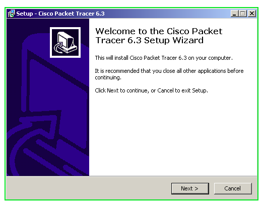
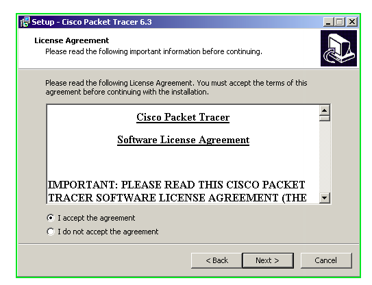
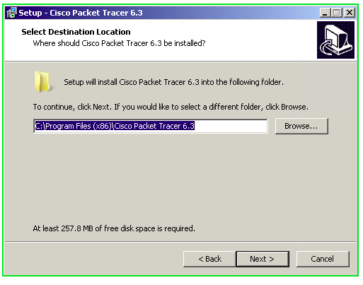
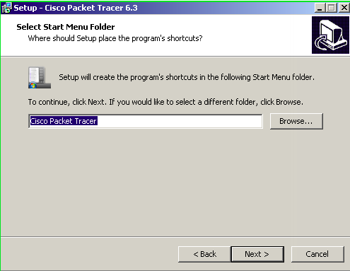
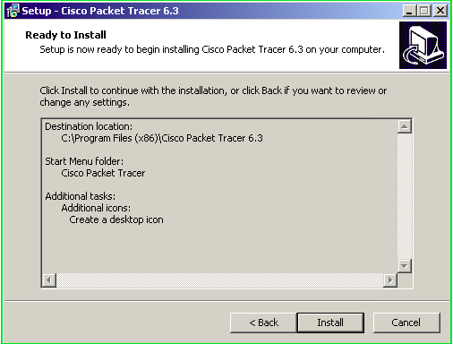
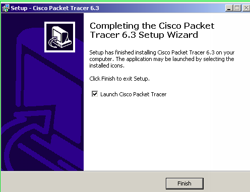
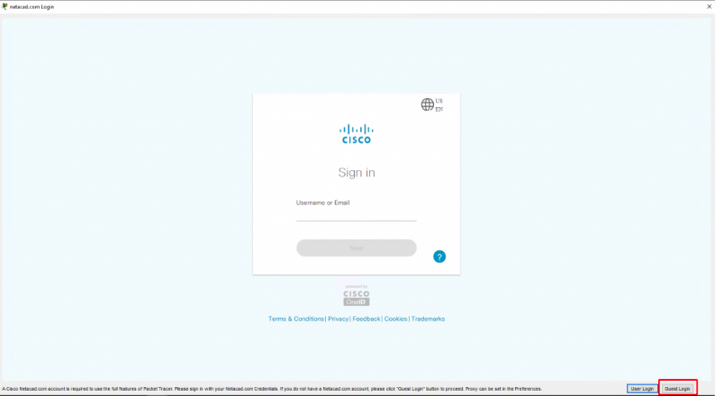
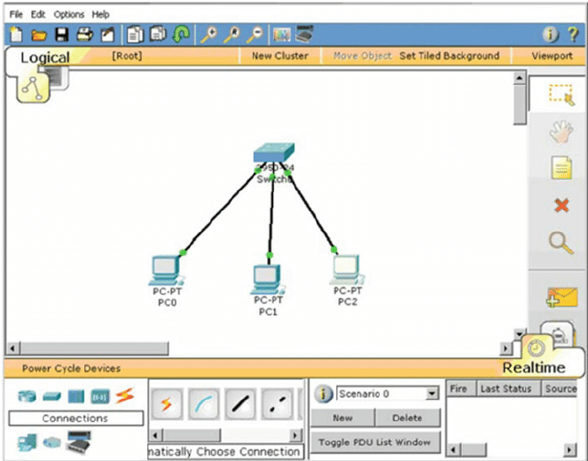

### Getting started with Packet tracer

Packet tracer is a network simulation tool. This means a a user can be able to create immarginary network topologies and immitate the fucntionality of a live network with it. The user can create routers and switches on the percet tracet user interfece and then go ahead to configure and meke them function like they were real life physical devices.

### Table of contents
1. [Prerequisites](#prerequisites)
2. [Introduction](#introduction)
3. [Why do we need packet tracer](#why-do-we-need-packet-tracer)
4. [How to install  Cisco packet tracer for windows operating system](#how-to-install-cisco-packet-tracer-for-windows-operating-system)
5. [How does packet tracer work?](#how-does-packet-tracer-work)
6. [Conclusion](#conclusion)

### Prerequisites
A reder will be able to understand this article in a clear manner if they have the following prior  kwowledge:
- An undersanding of computer networking
- A begginer's  understanding of network development

### Introduction
Packet tracer was developed by Cisco for educational purposes especially for their CCNA courses and its fuctionalities have grwn with time due to the impressive results it has shown with network simulation. Hence the most commonly used simulator is the Cisco Packet tracer.

Packet tracer can be installed and run in Windows, Linux and Macintosh operating systems.

### Why do we need packet tracer

- Packet tracer throught its network simulation capabilities are used by students to learn network creation and configuration. This is advisable concidering the prices of the devices if the learners used real devices to learn.

- Packet tracer allows for networked collaboration due to its ability to support systems with multiple users

- Packet tracer is used in network simulation. Before an actual network is developed, a prototype can be made using packet tracer just in oder to predict the network performance before actual development.

### How to install  Cisco packet tracer for windows operating system
After successfully downloading packet tracer from the internet, the following steps are executed with the downloaded installation life in readiness for use.

### Step 1

Open the installation file that you have just downloaded and a pop up window will appear wich is the welcome window as shown:

On this window you just need to click next to continue with the installation process.
### Step 2
Clicking next on the first window opens up the second configation window where you just need to accept the Cisco software licence  agreement by checking the check-box and click next to proceed as shown below:

### Step 3
Accepting the agreement in step 2 opens up the third configuration window where you are required to specify the folder where you want your packet tracer to be installed. Most of the time its just advisable to leave the already specified intallation location though one can always change it. Once satisfied with the installation location, click next.

### Step 4

Having specified your installation location, the forth configuration window requires you to specifiy the start menu detail. ie the program shortcut location. A user is usually adviced to leave this unchanged though altering to specify a folder of your liking is allowed.

### Step 5

This step allows you to create a Desktop icon for your home screen or even a quick launch icon for quick start up of the application by just checkin the check boxes on that configuration window as shown below:

### Step 6
This is the last step of this installation, displayed in the configaration window are the details of the insallation. Here you are not required to make any changes but just click install to begin installing Packet tracer in your device.

The installation process should take a few second after wich a window will pop up prompting you to finish the installation process. Click finish to exit the the setup window.

### How does packet tracer work?

Having successfully completed the installtion proces, you are required to sign into the account because Cisco Packet tracer is not a free software. At the bottom right of the sign in window is a "Guest login", Click that to start using Packet tracer immediately.

The software has a user friendly interface where a user can add and remove The network devices by simply dragging and dropping. The devices can then be joined to one another using physical item "cable".
Bellow is the user interface where the networks are created.

Below is an exaple of a network where three personal computers are connected to a switch. 
- To add the three  personal computers, click a personal computer on the bottom left of the user inteface, drag it to your desired location and drop it.
Do that fow the three  pcs.

- To add a switch, pick a switch amongst the devices in the bottom left and drop it in your desired location.
- To connect the Personal computers to the switch, choose a connection cable of your choice amongst the cables under your screen.
The outcome is shown below:

Packet trace also allows you to delete deviceses and connections from your network using the "x" symbol on the right side of the work area.

### Conclusion

Packet tracer is an important tool in the education sector especially with the network simulation capability hence saving resources that would otherwise be used in training learners with real actual devices and cables. This is a breakthrough not only for the economy but also for the learners who rely on packet tracer for practical know how.

Blissfull reading!