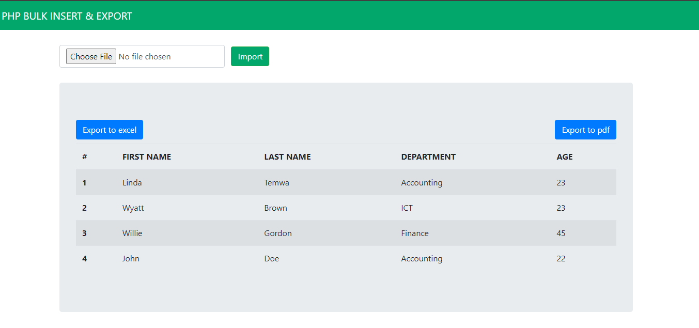
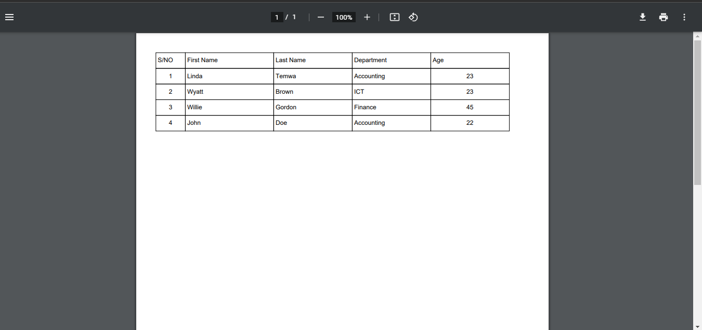

### Introduction
Bulk insert and bulk export are some of the most valuable functionalities when dealing with dynamic database records. For instance, a company conducted a study and recorded data in Excel sheets or CSV, but now the records need to be inserted into the database for further analysis. In such a case, a bulk insert comes into place.

### Benefits of bulk operations
Bulk export works when database records need to be read from a separate document apart from the system. For instance, accompany may generate its reports of sales, employees, profit per product, and assets in stock. This case means that all the database records are organized in a particular way, formatted, then printed in a readable format.

These are two core concepts that every PHP developer needs to learn when dealing with dynamic databases. In addition, a developer needs to know how to import and export data out of a system. Apart from the mentioned advantage, these two methods are helpful when performing system overhaul or when migrating from one system to another. It will make the process seamless instead of transferring a single record at a time.

### Article goal
This article aims to take the reader through a stepwise process of understanding dealing with bulk insert and bulk export in PHP. Thus, the reader will understand the benefits of this functionality. Moreover, they will get a chance to build a working project with the complete implementation of the functionality.

### Project overview
We will have a simple employee management system that, besides performing crude functionalities, will allow for bulk insert and bulk export. We will export the data into both Excel and PDF in real-time. The project will use MySQL database PHP and a bit of bootstrap 4 stylings.

### Prerequisites
This project  is a web development project, so besides basic web development skills, the reader should have an idea about:
- Working with MySQL database.
- Basics of PHP programming language.
- Working with Bootstrap 4.
- XAMPP installed in the reader's machine.

### Project setup
Create a project folder with a name of your choice. In the folder, create the following files and folders:
- `files` folder to contain the imported files from the system.
- `Database.php` where we will write our class to perform the desired operations.
- `index.php` is the file that displays the information on the webpage and presents the users with buttons to perform bulk operations.

### The user interface
We will not be doing much on the user interface because it is basic bootstrap styling of tables and buttons to import and export data in different formats. However, we will have a navigation bar, and below it have a container that encapsulates our form for selecting the file to import into the database. 

```html
   <form method= "post"  enctype = "multipart/form-data" class="form-inline my-2 my-lg-0">
        <div class="sm-3">
            <input class="form-control mr-sm-2" type="file" name="file">
            <input type="submit"  name= "submit" value="Import" class="btn btn-success my-2" style="background-color: #02a86b;">
        </div>
    </form>
```

The table has two buttons in a form to export all records to Excel or PDF. The code snippet for the user interface can be found in this [link]. I intentionally omitted them to make the article brief.

```html
<form method= "post" class="form-inline my-2 my-lg-0">
    <input type="submit"  class="btn btn-primary my-2" name="excel" value="Export to excel"><hr>
    <input type="submit" class="btn btn-primary my-2" name="pdf" value="Export to pdf">
</form>
```

Below the form is a table showing the list of employees in the system with columns of their names, the department in which they work and age. 

```php
<thead>
    <tr>
    <th scope="col">#</th>
    <th scope="col">FIRST NAME</th>
    <th scope="col">LAST NAME</th>
    <th scope="col">DEPARTMENT</th>
    <th scope="col">AGE</th>
    </tr>
</thead>
<tbody>
    $database->getRecords();
</tbody>
```

Notice that the snippets for the user interface are written in the `index.php file`. Copy the code and paste it into the `index.php` file. On top of the file, we need to include the `Database.php` file and instantiate the `Database` class.

```php
<?php
include('Database.php');
$database = new Database();
```

### Working on the Database class
The Database class contains the driver code for the application. In addition, it has a constructor for the database class and highlights the various functions that we need to perform on the system. 

Before starting this class, add these snippets just below where you instantiated the database class. 

```php
if(isset($_POST['submit'])){
    $database->importFile($_FILES['file']['tmp_name']);
}

if(isset($_POST['excel'])){
    $database->exportToExcel();
}

if(isset($_POST['pdf'])){
    $database->exportToPdf();
}
```

These snippets listen to check which button is pressed and invoke the respective method in the database class. Finally, they import CSV files, export the records to excel and to PDF in that order.

#### Connection to the database
The `Database` class extends the `mysqli` class to make working with my SQL database easy. In the class constructor, we specify the server, the username, the password, and the database to connect to. 

Doing this ensures that a connection to the database is called at any moment of the database class instantiation.

```php
class Database extends mysqli{
    private $state = false;
    private $server = "localhost";
    private $databaseUser = "root";
    private $userPassword = "";
    private $databaseName = "bulk-op"
    private $state = false;

    public function __construct(){
        parent::__construct($server, $databaseUser, $userPassword, $databaseName);
        if($this->connect_error){
            echo "Cannont connect to the database becauser : ".$this->connect_error;
        }
    }
}
```

#### The bulk import function
The bulk import function works by reading data from one Excel file, converting it to an array, then running through the array and inserting every element into the database. 

The first step of performing the bulk import is opening an Excel file in reading mode. While reading a single row, we separate the data read by a comma(,) using the `implode()` function. We, then, call the `SQL INSERT` query to insert the data into the respective fields of the database. 

At any instance, if a query fails, the private variable `state` is set to `false`, and an error is thrown showing that the import procedure did not go through. Otherwise, a success alert is sent to the user.

```php
public function importFile($fileToImport){
    //open file in reading mode
    $fileToImport = fopen(fileToImport, 'r');

    // read the file row by row separating the column elements by comma
    while($record = fgetcsv(fileToImport)){
        $valuesExtracted = "'". implode("','", $record)."'";

        //call the insert mysql query
        $sql = "INSERT INTO employee(fname, lname, department, age) VALUES(".$valuesExtracted.")";

        //confirm is the query is executed
        if($this->query($sql)){
            $state = true;
        }else{
            $state = false;
        }
    }

    if($state = true){
        echo "Succefully imported records!";
    }else{
        echo "There was in erro fetching the records. Check and try again";
    }
}
```

#### Getting the database records
When working with the user interface, we called the method `$database->getRecords();` from the front end. In this step, we will write the function executed when the method is called.

First, we use the query that select everything from the employees' table and orders it in descending manner so that the newest records are displays fast. Then for every row of the result fetched by the query, we extract the column element and assign it to a variable corresponding to the column name on the table them displayed accordingly.

```php
public function getRecords(){
    $count = 0;
    $query = "SELECT * FROM employee ORDER BY ID DESC";
    $result = $this->query($query);
    while ($record = $result->fetch_assoc()) {
        $fname = $record['fname'];
        $lname = $record['lname'];
        $dpt = $record['department'];
        $age = $record['age'];
        $count +=1;
    
    ?>
        <tr>
            <th scope="row"><?php echo $count ?></th>
            <td><?php echo $fname ?></td>
            <td><?php echo $lname ?></td>
            <td><?php echo $dpt ?></td>
            <td><?php echo $age ?></td>
        </tr>
    <?php
    }
}
```

#### Bulk export to Excel
The export to Excel function works in the exact opposite way as the import function does. In this case, we select the values that we want to export. 

Next, we open a file in reading mode, then write to the file row by row as fetched from the employees' table. Lastly, we close the file. 

Notice that we also create a unique name for every file that we export to differentiate them. However, every file will be prefixed with `"records"` and must have a CSV extension at the end.

```php
public function exportToExcel(){
    $this->state = false;

    //select the desired fielfs from db
    $sql = "SELECT t.fname, t.lname, t.department, t.age FROM employee as t";

    //query the database
    $temp = $this->query($sql);

    //check if the querry returned data and the rows fetched is greater than 0
    if(!empty($temp) && $temp->num_rows > 0){

        //create a new filename 
        $filename = "records".uniqid().".csv";

        //open the file in the files directory of the project in writing mode
        $file = fopen("files/".$filename, "w");

        //loop the records fetched and write them to the file opened
        while($row = $temp->fetch_array(MYSQLI_NUM)){
            if(fputcsv($file, $row)){
                //if success, set state to true
                $this->state = true;
            }else{
                //set state to flase
                $this->state = false;
            }
        }

        //send success message if state is true
        if($state = true){
            echo "Succefully exported records!";
        }else{
            echo "There was in error fetching the records. Check and try again";
        }
        //close the file 
        fclose($file);
    }else{
        //the querry returned no data or the database is emplty
        echo "NO data fecthed".$this->error;
    }
}
```

### Bulk export to PDF
PDF stands for portable document format. It is one of the standard formats for presenting documents to avoid editing. 

To export our database records to PDF, we need to use a small library called [fpdf](http://www.fpdf.org/). Download and extract the [library](http://www.fpdf.org/en/dl.php?v=184&f=zip) in a folder named 'fpdf` in your project. 

On top of the `Database.php` file,  require the `fpdf.php` file using the line below.

```php
require('fpdf/fpdf.php');
```

Most of the library's configurations can be found in the [official documentation](http://www.fpdf.org/en/tutorial/index.php). However, you can copy my configuration and edit it to suit your desire. 

To export using this library, we first select the records to export and assign every row element to the respective cell that it should appear. 

We also specify the document's name and format of view, whether we need the file to be downloaded or show in a browser. In my case, I called my file `records.pdf` and displayed it in a browser so the user would choose whether to download it or not.

```php
public function exportToPdf(){
    //getting recods form the database
    $query = "SELECT * FROM employee ORDER BY ID DESC";
    $result = $this->query($query);
    $count = 0;

    //creating a new instance of the fpdf class for our data
    $pdf = new Fpdf();
    $pdf-> AddPage();
    $pdf->SetFont('Arial','',9);
    $pdf->Cell(15,8,"S/NO",1);
    $pdf->Cell(45,8,"First Name",1);
    $pdf->Cell(40,8,"Last Name",1);
    $pdf->Cell(40,8,"Department",1);
    $pdf->Cell(40,8,"Age",1);

    //writing every row fecthed to the pdf file
    while ($record = $result->fetch_assoc()){
        $count +=1;
        $pdf->Ln();
        $pdf->Cell(15,8,$count,1,0,'C');
        $pdf->Cell(45,8,$record['fname'],1);
        $pdf->Cell(40,8,$record['lname'],1);
        $pdf->Cell(40,8,$record['department'],1);
        $pdf->Cell(40,8,$record['age'],1,0,'C');
        
    }
    
    //specify the output file name and view formar
    $pdf->output('records.pdf', 'I');
}
```

### Creating a database and running the application
Open `phpmyadmin` then create a new database called `bulk_up`. This name is the same name we specified while writing the constructor that connects the project to the database in the `Database.php` file. In the database, create a table called `team member` with the following properties;
- id
- fname
- lname
- department and
- age. 

Migrate the project folder into the `htdocs` folder found in the `XAMPP` installation directory. Start MySQL and Apache servers, then navigate to the localhost to view your project.



### Conclusion
This article guided readers on how to perform bulk operations in PHP using MySQL database. Bulk operations are helpful when dealing with large amounts of data. 

We build a project that lists employees' information to import more records from an Excel file, export to excel, and event PDF formats. 

Additionally, we discussed setting up the `fpdf library` for exporting data into PDF formats. The reader should find more about this library and how to use it better with company-specific customizations.
