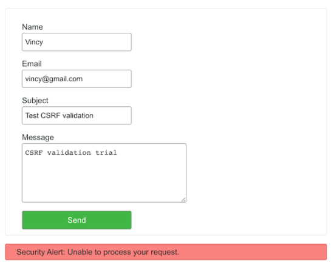

### Introduction

Cross-site request forgery is abbreviated as CSRF. It's a kind of hacking assault in which a hacker pushes you to do something against a website where you're presently signed in.


### Table of content

- [Introduction](#introduction)
- [Table of content](#table-of-content)
- [Objectives](#objectives)
- [Prerequisites](#prerequisites)
- [About Example](#about-example)
- [Step 1: Create a PHP session and generate a CSRF token.](#step-1-create-a-php-session-and-generate-a-csrf-token)
- [Step 2: Render contact form with CSRF token](#step-2-render-contact-form-with-csrf-token)
- [Step 3: Anti Cross-Site Request Forgery (CSRF) validation in PHP](#step-3-anti-cross-site-request-forgery-csrf-validation-in-php)
- [Step 4: Security service to generate, insert, validate CSRF token](#step-4-security-service-to-generate-insert-validate-csrf-token)
- [Output: CSRF validation response from server](#output-csrf-validation-response-from-server)
- [Conclusion](#conclusion)
- [Further Reading](#further-reading)

### Objectives

- Overview of CSRF attacks
- Understanding how to prevent CSRF attacks
- PHP Token management session activity set-up
- Adding tokens in HTML

### Prerequisites

- Fundamentals of PHP
- Text Editor of your choice

### About Example

This code protects a PHP contact form from CSRF attacks. It is used to create a contact form. This form's post handlers check for CSRF attacks on user requests. The CSRF token is generated by the PHP script when the landing page is loaded. This token will be a hidden field in the form footer. It also takes care of the token in a PHP session. The PHP code will check for the CSRF token parameter when the form fields are submitted. If the token from the session is found, it is validated. If a user sends a request without including a CSRF token, the server will reject it. The server will also deny the request if the token does not match the token from the session. It will send the contact email to the target address if the CSRF token is validated successfully.

### Step 1: Create a PHP session and generate a CSRF token.

The form footer script on a landing page calls SecurityService. This class generates a CSRF token in PHP. It saves the token in a PHP session to be used later. It will aid in the processing of the CSRF validation after the form has been submitted. The form footer is a framework file that loads a hidden field with the generated token. The code excerpt below is from the SecurityService.php file, and it generates a CSRF token. The service class's complete code is presented in the next section of this article.

```php
- **SecurityService.php (code to generate CSRF token)**

    public function getCSRFToken()
    {
        if (empty($this->session[$this->sessionTokenLabel])) {
            $this->session[$this->sessionTokenLabel] = bin2hex(openssl_random_pseudo_bytes(32));
        }

        if ($this->hmac_ip !== false) {
            $token = $this->hMacWithIp($this->session[$this->sessionTokenLabel]);
        } else {
            $token = $this->session[$this->sessionTokenLabel];
        }
        return $token;
    }
```

### Step 2: Render contact form with CSRF token

This is a contact form HTML with the usual fields name, email, subject, and message. Added to that it has a hidden field csrf-token with the generated token.
The submit action processes jQuery form validation before posting the parameters to the PHP.
The client-side validation script handles the basic validation on submit. It applies the not-empty check on each field

```php
index.php (HTML Template)

<html>
<head>
<title>CSRF Protection using PHP</title>
<link rel="stylesheet" type="text/css"
    href="assets/css/style.css" />
<script src="vendor/jquery/jquery-3.2.1.min.js"></script>
</head>
<body>
    <div class="container">
        <h1>CSRF Protection using PHP</h1>
        <form name="frmContact" id="cnt-frm" class="form"
            frmContact"" method="post" action="" enctype="multipart/form-data"
            onsubmit="return validateContactForm()">

            <div class="-row">
                <div class="label">
                    Name <span id="userName-info" class="validation-message"></span>
                </div>
                <input type="text" class="input" name="userName"
                    id="userName"
                    value="<?php if(!empty($_POST['userName'])&& $type == 'error'){ echo $_POST['userName'];}?>" />
            </div>
            <div class="-row">
                <div class="label">
                    Email <span id="userEmail-info" class="validation-message"></span>
                </div>
                <input type="text" class="input" name="userEmail"
                    id="userEmail"
                    value="<?php if(!empty($_POST['userEmail'])&& $type == 'error'){ echo $_POST['userEmail'];}?>" />
            </div>
            <div class="-row">
                <div class="label">
                    Subject <span id="subject-info" class="validation-message"></span>
                </div>
                <input type="text" class="input" name="subject" id="subject"
                    value="<?php if(!empty($_POST['subject'])&& $type == 'error'){ echo $_POST['subject'];}?>" />
            </div>
            <div class="-row">
                <div class="label">
                    Message <span id="userMessage-info" class="validation-message"></span>
                </div>
                <textarea name="content" id="content" class="-input" cols="60"
                    rows="6"><?php if(!empty($_POST['content'])&& $type == 'error'){ echo $_POST['content'];}?></textarea>
            </div>
            <div class="-row">
                <input type="submit" name="send" class="send-button" value="Send" />
            </div>

            <?php require_once __DIR__ . '/view/framework/form-footer.php';?>

        </form>
        <?php if(!empty($message)) { ?>
        <div id="message" class="<?php  echo $type; ?>"><?php if(isset($message)){ ?>
                    <?php echo $message; }}?>
                   </div>
    </div>
    <script src="assets/js/validate.js"></script>
</body>
</html>

```

This is the form footer script that triggers the service handler to generate tokens. The `insertHiddenToken()` writes HTML code to load the csrf token field into the form.

- **view/framework/form-footer.php**

```php
<?php
require_once __DIR__ . '/../../lib/SecurityService.php';
$antiCSRF = new SecurityService\securityService();
$antiCSRF->insertHiddenToken();
```

### Step 3: Anti Cross-Site Request Forgery (CSRF) validation in PHP

On submitting the token-embedded contact form, the form action executes the following script. The SecuritySercive’s `validate()` function compares the posted token with the one stored in the session. If a match is found, then it will proceed further to send the contact email. Otherwise, it will acknowledge the user with an error message.

- **index.php (PHP CSRF validation and form handling)**

```php
<?php
use MailService;

session_start();
if (! empty($_POST['send'])) {
    require_once __DIR__ . '/lib/SecurityService.php';
    $antiCSRF = new SecurityService\securityService();
    $csrfResponse = $antiCSRF->validate();
    if (! empty($csrfResponse)) {
        require_once __DIR__ . '/lib/MailService.php';
        $mailService = new MailService();
        $response = $mailService->sendContactMail($_POST);
        if (! empty($response)) {
            $message = "Hi, we have received your message. Thank you.";
            $type = "success";
        } else {
            $message = "Unable to send email.";
            $type = "error";
        }
    } else {
        $message = "Security alert: Unable to process your request.";
        $type = "error";
    }
}

?>
```

### Step 4: Security service to generate, insert, validate CSRF token

This service class created in PHP includes methods to process the CSRF protection-related operations. It defines a class property to set the form token field name, session index. It has methods to generate tokens and write them into the HTML and a PHP session. It uses XSS mitigations while writing the form footer with the token. Also, it has the option to exclude some URLs from the validation process. The excluded URLs bypass the CSRF validation process. The code gets the current request URL from the PHP SERVER variables. Then, it compares it with the array of excluded URLs to skip the validation.

```php
<? php
namespace SecurityService;
class securityService
{

    private $formTokenLabel = 'eg-csrf-token-label';

    private $sessionTokenLabel = 'EG_CSRF_TOKEN_SESS_IDX';

    private $post = [];

    private $session = [];

    private $server = [];

    private $excludeUrl = [];

    private $hashAlgo = 'sha256';

    private $hmac_ip = true;

    private $hmacData = 'ABCeNBHVe3kmAqvU2s7yyuJSF2gpxKLC';

    public function __construct($excludeUrl = null, &$post = null, &$session = null, &$server = null)
    {
        if (! \is_null($excludeUrl)) {
            $this->excludeUrl = $excludeUrl;
        }
        if (! \is_null($post)) {
            $this->post = & $post;
        } else {
            $this->post = & $_POST;
        }

        if (! \is_null($server)) {
            $this->server = & $server;
        } else {
            $this->server = & $_SERVER;
        }

        if (! \is_null($session)) {
            $this->session = & $session;
        } elseif (! \is_null($_SESSION) && isset($_SESSION)) {
            $this->session = & $_SESSION;
        } else {
            throw new \Error('No session available for persistence');
        }
    }

    public function insertHiddenToken()
    {
        $csrfToken = $this->getCSRFToken();

        echo "<!--\n--><input type=\"hidden\"" . " name=\"" . $this->xssafe($this->formTokenLabel) . "\"" . " value=\"" . $this->xssafe($csrfToken) . "\"" . " />";
    }


    public function xssafe($data, $encoding = 'UTF-8')
    {
        return htmlspecialchars($data, ENT_QUOTES | ENT_HTML401, $encoding);
    }


    public function getCSRFToken()
    {
        if (empty($this->session[$this->sessionTokenLabel])) {
            $this->session[$this->sessionTokenLabel] = bin2hex(openssl_random_pseudo_bytes(32));
        }

        if ($this->hmac_ip !== false) {
            $token = $this->hMacWithIp($this->session[$this->sessionTokenLabel]);
        } else {
            $token = $this->session[$this->sessionTokenLabel];
        }
        return $token;
    }

    private function hMacWithIp($token)
    {
        $hashHmac = \hash_hmac($this->hashAlgo, $this->hmacData, $token);
        return $hashHmac;
    }


    private function getCurrentRequestUrl()
    {
        $protocol = "http";
        if (isset($this->server['HTTPS'])) {
            $protocol = "https";
        }
        $currentUrl = $protocol . "://" . $this->server['HTTP_HOST'] . $this->server['REQUEST_URI'];
        return $currentUrl;
    }


    public function validate()
    {
        $currentUrl = $this->getCurrentRequestUrl();
        if (! in_array($currentUrl, $this->excludeUrl)) {
            if (! empty($this->post)) {
                $isAntiCSRF = $this->validateRequest();
                if (! $isAntiCSRF) {
                    // CSRF attack attempt
                    // CSRF attempt is detected. Need not reveal that information
                    // to the attacker, so just failing without info.
                    // Error code 1837 stands for CSRF attempt and this is for
                    // our identification purposes.
                    return false;
                }
                return true;
            }
        }
    }

    public function isValidRequest()
    {
        $isValid = false;
        $currentUrl = $this->getCurrentRequestUrl();
        if (! in_array($currentUrl, $this->excludeUrl)) {
            if (! empty($this->post)) {
                $isValid = $this->validateRequest();
            }
        }
        return $isValid;
    }

    public function validateRequest()
    {
        if (! isset($this->session[$this->sessionTokenLabel])) {
            // CSRF Token not found
            return false;
        }

        if (! empty($this->post[$this->formTokenLabel])) {
            // Let's pull the POST data
            $token = $this->post[$this->formTokenLabel];
        } else {
            return false;
        }

        if (! \is_string($token)) {
            return false;
        }

        // Grab the stored token
        if ($this->hmac_ip !== false) {
            $expected = $this->hMacWithIp($this->session[$this->sessionTokenLabel]);
        } else {
            $expected = $this->session[$this->sessionTokenLabel];
        }

        return \hash_equals($token, $expected);
    }

    /**
     * removes the token from the session
     */
    public function unsetToken()
    {
        if (! empty($this->session[$this->sessionTokenLabel])) {
            unset($this->session[$this->sessionTokenLabel]);
        }
    }
}
```

This `MailService.php` uses the PHP core `mail()` function to send the contact emails. You may replace this with the SMTP via email sending script. Check this to get an IP address using PHP. It may be useful to log the user’s IP address.

- **MailService.php**

```php
<?php
namespace Fab;

class MailService
{

    function sendContactMail($postValues)
    {
        $name = $postValues["userName"];
        $email = $postValues["userEmail"];
        $subject = $postValues["subject"];
        $content = $postValues["content"];

        $toEmail = "ADMIN EMAIL";
        $mailHeaders = "From: " . $name . "(" . $email . ")\r\n";
        $response = mail($toEmail, $subject, $content, $mailHeaders);

        return $response;
    }
}
```

### Output: CSRF validation response from server

The screenshot shows the usual contact form below. We have seen this output in many of the contact form tutorials before. Below the form interface, this screenshot shows the security alert message in red. It acknowledges the users who send requests with the wrong or empty token.



### Conclusion

Thus we have implemented the anti-CSRF protection in a PHP contact form. Hope the example code is useful and you get the implementation process we discussed here. We have created a SecurityService class in PHP to handle the CSRF protection. It is reusable for several applications wherever you need to enable CSRF protection. The PHP code that returns response messages acknowledges the user properly. For practice sake, [here](https://github.com/EssyG10/csrf-protection/) is the project example.

### Further Reading

- [Understanding SQL injection](https://www.section.io/engineering-education/sql-injection-made-familiar/)
