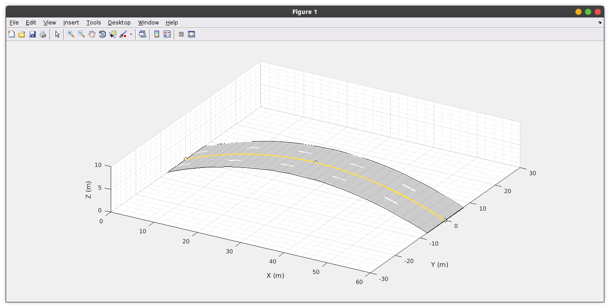

### Road layout design programmatacally using matlab
### Table of content
- [Road layout design programmatacally using matlab](#road-layout-design-programmatacally-using-matlab)
- [Table of content](#table-of-content)
- [Introduction](#introduction)
- [### Prerequisites](#-prerequisites)
- [Straight road](#straight-road)
- [Roads with lanes](#roads-with-lanes)
- [Road intersection](#road-intersection)
- [Curved roads layout](#curved-roads-layout)
- [Roundabout road layout](#roundabout-road-layout)
- [Elevated road layout](#elevated-road-layout)
- [Overpass roads](#overpass-roads)
- [Conclusion](#conclusion)


### Introduction
In designing road layout, we use the `drivingscenario` function. `scenario` function allows for simulation of an activity or a structure that can be found in the real world. `Drivingscenario` function can be used to create different designs of road layout by plotting the road layout in 2D or 3d graphs. This is done by specifying the coordinates of the road center using function `roadCentre=[];` and the road width then plotting these points on the graph.

This article will discuss the design of the  following road layout using Matlab functions:

- Straight road.
- Roads with lanes.
- Intersecting roads.
- Curved road layouts.
- Roundabout layout.
- Elevated road layout.
- Overpass road layout.

### ### Prerequisites
To follow along with this tutorial, you'll need:
- [MATLAB](https://www.mathworks.com/products/get-matlab.html?s_tid=gn_getml) installed.
- [Proper understanding](/engineering-education/getting-started-with-matlab/) of MATLAB basics.

### Straight road
A straight road layout has a fixed width. It can be designed by defining the road center coordinates with two points and a specified width. The graph axis is labeled in meters.

The first step of designing any road layout is defining the `Scenario` function as  `drivingscenario`, that is `scenario=drivingScenario`.  After the declaration of scenario function the road center coordinates are specified for our case we will use (0 10) and (60 10) with a road width of 8 meters. The final road layout is gotten by plotting the `scenario`, road centerline, and width. The resultant figure will have a straight road layout.
```matlab
scenario = drivingScenario; %declering the scenario function
road_center = [0 10;60 10]; %specifying road center coordinates
road_width = 8; %specified road width
road(scenario,road_center,road_width); %road properties
plot(scenario,'RoadCenters','on','Centerline','on')
```


### Roads with lanes
Road lanes can be created by providing lane specifications. Road lanes are used to control traffic flow by informing the driver about the boundaries, lane can also determine the caring capacity of the road.

In Matlab, the road lane is specified in form of two numbers coordinated with the center of the road, the first number presents the number of lanes in the first half of the road while the second number presents the number of lanes in the second half of the road. The function used in making lanes on road layout is `lanespec([]);`. For example `lanespec([2 2]);` will produce a total of four lanes with two lanes at each half of the road whereas `lanespec([3 2]);` will produce a total of five lanes with the first half having three lanes and the second half having two lanes.

Below codes are demonstrating formation of a total of four lanes with each side of the road centre having two lanes.
```matlab
scenario = drivingScenario; %declaring scenario function
road_centers = [0 10;50 10]; %specifying road centers
road(scenario,road_Centers,'lanes',lanespec([2 2])); % road properties
plot (scenario,'Roadcenters','on');
```


### Road intersection
Road intersection is where two roads heading in different directions cross each other forming a cross-like structure. In Matlab, intersections are automatically created whenever two roads meet.

To make a road intersection layout, one has to make two different roads. One of the two roads will be vertically oriented while the other one horizontally oriented. For demonstrations, we will intercept two straight roads. The verticle road will have road center coordinates as `[0 10; 50 10]` while the horizontal road will have road center coordinates as `[30 -30; 30 30]`.

Below codes demonstrates process of creating road intersections:
```matlab
scenario = drivingScenario;
road_Centre = [0 10;50 10]; %specifying road centre

% defining the first road
road_Centers =[0 10;50 10];
road(scenario,road_Centers,'lanes',lanespec([1 1]));

% defining the second road
road_Centers =[30 -30;30 30];
road(scenario,road_Centers,'lanes',lanespec([1 1]));

% plotting the two roads
plot(scenario,'RoadCenters','on');
```


### Curved roads layout
The curved road can be generated by using three or more points to specify the road center coordinates. The road will have a fixed width hence if the lanes are not mentioned then the width must be specified.

The code syntax for making a curved road layout is almost similar to that of making straight roads, the only difference is that three or more points are used for plotting the road center while in a straight road layout two points are enough for making the road. The more road center coordinates used the more the formation of a complex curve road.

Below codes illustrates making of curve road layout. We will use a four point coodinates to define the road center, that is `[0 0; 13 10; 30 -10; 50 -25]`. The width used will be 8 meters.
```matlab
scenario=drivingScenario; %declaring scenario function
road_Centers = [0 0; 13 -10; 30 -10; 50 -25]; %defining road centre coordinates
road_width =8; % specifing the road width
road(scenario,road_Centers,road_width,'lanes',lanespec(2)); % road properties
plot(scenario,'RoadCenters','on');
```


### Roundabout road layout
Roundabout roads are circular and have four existing roads. When designing a roundabout, the circular part is formed by specifying the center of the clothoid curves. 

The first coordinate of the clothoid curve is repeated at end of the coordinate description for it to form a continuous circular loop. Four existing roads are then added to the circular road to complete the road layout. The exit roads coordinate should be defined in a way that they cut the circular road circumference into a quarter.

The example below illustrates designing of roundabout layout. First we define the road centre coordinate of the circular section of the road as `[-20 -20; 20 -20; 20 20; -20 20; -20 -20];`. The four exist roads are made using four different straight roads whose coordinates are defined as `[-35 0; -30 0];`, `[30 0; 35 0];`, `[0 35; 0 30];`, and `[0 -30; 0 -35];`. The bellow codes shows this process.
```matlab
scenario = drivingScenario;
% defining coordinates of the circular part of the layout
roadCenter = [-20 -20
              20 -20
              20 20
              -20 20
              -20 -20];
road(scenario,roadCenter,'lanes',lanespec(1));

% defining the four exist roads coordinates
road(scenario,[-35 0; -30 0],'lanes',lanespec([1 1]));
road(scenario,[30 0; 35 0],'lanes',lanespec([1 1]));
road(scenario,[0 35; 0 30],'lanes',lanespec([1 1]));
road(scenario,[0 -30; 0 -35],'lanes',lanespec([1 1]));

% plotting the defined roads
plot(scenario,'RoadCenters','on')
```


### Elevated road layout
Road layout design on higher grounds can be made by introducing `z` coordinates to plot the display on a 3D graph. The coordinates will be in form of `(x,y,z)`. The `z` coordinate mainly define the latitude of the road, for example, roads on highlands are elevated hence have higher latitude.

The elevated road layout is made by defining the road center coordinates with the 3 point coordinates. The magnitude of the elevation is determined by the value of the z-axis coordinate.

From the below codes demonstrating elevated road layout, The road center coordinates are `[0 0 0; 30 0 6; 60 0 0]` with four lanes equally distribute in the halves. The highest point in the road will be 6 meters above sea level as defined in the coordinates.
```matlab
scenario = drivingScenario; % declering scenario type

% defining road center coordinates
roadCenter= [0 0 0
             30 0 6
             60 0 0];

% plotting the road layout            
road(scenario,roadCenter,'lanes',lanespec([2 2]));
plot(scenario,'RoadCenters','on');
view(30 24)  
```



### Overpass roads
Overpass layout is where roads cross each other without intercepting. One road will be above another road hence the layout is defined using three-point coordinates `(x y z)`.

To demonstrate, we will design a road to pass 10 meters above another road, the height of the overpass is defined in the z-axis. The layout will join a curved road to form a continuous loop.
```matlab
scenario = drivingScenario;

% road center coordinates
roadCenters = [0 0 0
               15 -25 0
               15 25 10
              -25 -25 10
              -25 15 0
               0 0 0];

% ploting the road coordiantes
road(scenario,roadCenter,'lanes',lanespec([2 2])); 
plot(scenario,'RoadCenters','on');
view(40,25)
```


### Conclusion
Matlab provides a platform for designing road layout by either using a drivingscenario designer app or programmatically as shown in the articles. Road layouts design techniques can be applied in traffic simulation, road plans, and game development.
