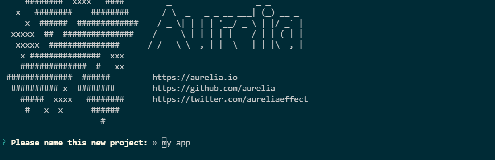
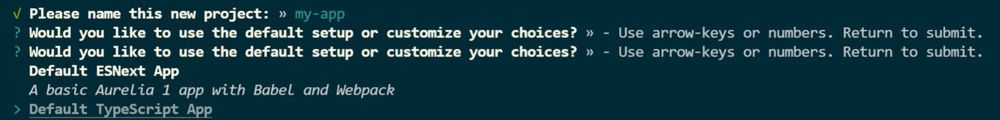
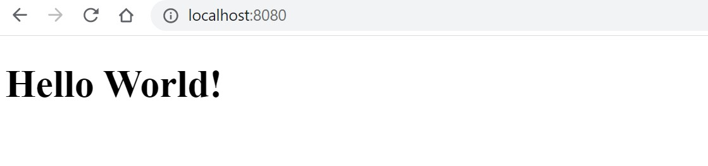

JavaScript has numerous framework that helps you implement your application out of the pos. This includes React.js Vue, Angular, Next.js, Svelte, Node.js, and Aurelia.js. Each framework enables you to achieve your application objectives. Frameworks such as Aurelia.js, React.js Vue, Angular, Next.js, and Svelte are used to create the frontend web application. In this guide, we will learn how to get started and use Aurelia to build web apps.

Aurelia is a JavaScript client framework for web, mobile, and desktop that leverages simple conventions to empower your UI creativity. Aurelia is the only framework that lets you build applications components using vanilla JavaScript/TypeScript. It uses modern JavaScript and HTML to let you get started quickly and build complex apps.

This guide will help you set up and run Applications using TypeScript while still using the Aurelia.js framework.

### Why use TypeScript

On the other hand, Typescript is a superset of JavaScript. Typescript is gaining a lot of popularity among JavaScript developers. It is one of the fast-developing programming languages for building extensive applications.

### How to set up a basic TypeScript Aurelia project

Let's dive and set up Aurelia TypeScript. First, you need to install the [Aurelia CLI](https://aurelia.io/docs/cli/webpack/) (command-line interfaces). An interface is a medium through which a user can interact with any tool using a computer. A CLI is a way to interact with the computer program bY typing in instructions or commands.

Aurelia provides CLI commands that allow you to bootstrap the Aurelia project. This allows you to have a sample project that you can build on rather than creating an application from scratch. This bootstrapped app comes will preconfigured settings that you can use on the fly. This prevents developers from creating redundant settings every time they create an appliv=cation. It saves time and increases the developers' productivity.

To bootstrap an Aurelia app, you must first install the [Aurelia CLI](https://aurelia.io/docs/cli/webpack/) globally on your computer. To do this, run this command on your terminal:

```bash
npm install aurelia-cli -g
```

Once you have installed the CLI, proceed and bootstrap the basic Aurelia project. Create a project folder and run this Aurelia command:

```bash
au new
```

This command will launch an interactive interface that allows you to choose the default settings of your Aurelia project. Once you run the command, enter the application name of your choice.



In this tutorial, we are creating the Auleria app with TypeScript code. Thus you need to set the right environment to execute TypeScript. In your command line, select the **Default TypeScript App** as shown below:



Use the arrow keys or numbers to select the **Default TypeScript App** and hit enter to submit.

Finally, select the dependency manager you want to use between NPM and Yarn.

This will create a ready configured Aurelia TypeScript app. To test if the setup is working, run `npm start`. Once done, open `http://localhost:8080/` on your browser. This will log a **Hello World** on your browser.



This indicates that the created setup is working and ready to start building on your Auleria applications.

### Build a Todo app using Aurelia and TypeScript

Let's dive in to create and run a todo application using this configuration. This will use the TypeScript code to create the application.

As we said, Aurelia is the only framework that lets you build applications using vanilla JavaScript/TypeScript. It uses modern JavaScript/TypeScript and HTML to let you get started quickly and build complex apps. In this case, the code structure of Aurelia looks similar to that of the vanilla JavaScript/TypeScript. It becomes very handle to build an application using such technologies while still maintaining the relevance of backed simplicity.

To start setting up the application code, navigate to the project's `src` directory and implement the todos using TypeScript, as shown below.

### Set up the todos Inteface

Typescript uses [interfaces](https://www.typescriptlang.org/docs/handbook/interfaces.html) to define classes. A class acts as a blueprint for an object. A Typescript interface act as a blueprint for creating classes. An interface lets you define the data structures of your application. This describes the shape of your data object structures. For example, using the todo's scenario, a single todo will have a title that describes that todo. This will also require you to specify the type of data the title takes, such as number, string, etc.

Head over to your project directory and create an `app.ts` file to create an interface. Then use the keyword `interface` followed by your interface name, as shown below.

```ts
interface Todo {
}
```

The add properties that define the shape of the object as shown below;

```ts
interface Todo {
  title: string;
  description: string
  completed: boolean;
}
```

Any object that doesn't have this described structure is rendered incompatible. The consumers of this interface must implement these properties.

This becomes quite useful when you have multiple teams working on a very large project. If someone decides to name things differently or forget something, the application will adhere to the set properties. The properties named differently will automatically become incompatible with the set object. This helps you avoid some code errors around your teams.

Therefore, it makes sense to have a common description of the specific properties of a todo.

### Create todos class

As described above, a class acts as a blueprint for an object. The object is now created in the above step. Let's now set up a class that describes its blueprint. To do this, Navigate to the `app.ts` file and follow the following steps;

### Set up the `App` class

One of the important use cases where an interface is really useful is when setting up a class. This sets the compatibility of your data. A class basically has the same properties as the `interface` at any given time. If all the required properties are not set, the whole data set becomes incompatible. Below is how the class `App` will be set based on the interface `Todo`.

```ts
class App {
  heading = "Todos List APP";
  todos: Todo[] = [];
  todoTitle = '';
  todoDescription = '';
}
```

This will add a heading/ title to the application and array of todos and empty properties `todoTitle` and `todoDescription`.

### Create constructors and methods

A class goes hand in hand with a constructor. A constructor is commonly referred to as a special method that has the same name as the class. In Typescript, a constructor is a special function with the keyword `constructor`. It constructs/initializes the object before it gets assigned to its methods.

A method gets assigned to the initialized constructor. Here you will create methods to add, remove and clone a todo. The methods body specifies the properties you want to want access. These are the properties of the class on which you're running this method. In simple terms, a method runs an instance of the class `App`.

Below is how to set up these constructors and methods. Thet goes inside the class `App`:

- Add a new todo

```ts
addTodo() {
    if (this.todoTitle || this.todoDescription) {
        this.todos.push({
            title: this.todoTitle,
            description: this.todoDescription,
            completed: false
        });
        this.todoTitle = '';
        this.todoDescription = '';
    }
}
```

- Delete a todo

```ts
removeTodo(todo) {
    const index = this.todos.indexOf(todo);
    if (index !== -1) {
        this.todos.splice(index, 1);
    }
}
```

This will delete existing todos from the existing list.

- Clone a todo

```ts
cloneTodo(todo) {
    const index = this.todos.indexOf(todo);
    if (index !== -1) {
        this.todos.push(todo);
    }
}
}
```

This copies and duplicate an existing todo. The `indexOf()` will access the index of an added todo. Then `push()` will compy and duplicate that todo and add it to the application.

Finally, export your class to access it within your application.

```ts
export { App }
```

### Set up the Aurelia template

Aurelia uses the templating system to create the application UI components. This creates intuitive interfaces.

To create these UIs, add the `template` tags, then wrap every component inside these tags. To do this, navigate to the `app.html` page and add these tags.

```html
<template>
</template>
```

Any subsequent components will be added inside these `template` tags.

Aurelia templates then use binding to connect to the view model you have created. In this case, you have created a todo model. Thus templates will access it to manipulate the todos data using data binding.

Below is how to connect to the todos model:

- Add a filter component

First, add a filter component. This will be sued to filter any todo from ye list of the added todos.

```html
<nav class="navbar navbar-daNrk bg-dark">
    <div class="container-fluid">
        <a class="navbar-brand">Todo App</a>
        <form class="d-flex">
            <input class="form-control me-2" type="search" placeholder="Search" aria-label="Search">
            <button class="btn btn-outline-success" type="submit">Search</button>
        </form>
    </div>
</nav>
```

- Get the application header

```html
<h1 class="text-center">${heading}</h1>
```

This header is defined inside the `app.ts` inside the class `App`. `heading` is a property of the model. The above line of code will bind it to the template using the string interpolation. The `${}` operator helps you extract the `heading` string value.

- Add a form to add todos

```html
<form submit.trigger="addTodo()">
    <label for="addTodoInput" class="form-label">Enter New Todo</label>
</form>
```

This form will trigger the constructor `addTodo()` to manipulate the data.

- Add todo title form input

```html
<input type="text" value.bind="todoTitle" id="addTodoInput" class="form-control" placeholder="Enter Title">
```

Like the model states, each todos has three properties: a title, description, and completed value. In this case, the completed value is added to false by default. The above code block will provide a form to enter the todo title.

- Add todo description form input

```html
<input type="text" value.bind="todoDescription" id="addTodoInput" class="form-control" placeholder="Enter Description">
```

- Add a button to submit the form input

```html
<button class="btn btn-primary" type="submit" disabled.bind="!todoTitle">Submit</button>

<div class="form-check" repeat.for="todo of todos">
</div>
```

To link the view model's `todoTitle` and `todoDescription`, use the `value.bind`. This will then map the value to the template.

- Add a checkbox

```html
<input class="form-check-input" type="checkbox" value="" id="flexCheckDefault" checked.bind="todo.completed">
```

This will be used to update the todos using the set `completed` value.

- Update a todo

```html
<label class="form-check-label" for="flexCheckDefault"
    css="text-decoration: ${todo.completed ? 'line-through' : 'none'}">
    ${todo.title}
    ${todo.description}
</label>
```

This will access the todos description and title. When the checkbox is clicked, Aurelia will check the `todo.completed` value and add line-through to make the todo as completed.

- Delete a todo

```html
<button class="btn btn-danger" click.trigger="removeTodo(todo)">Delete</button>
```

- Clone a todo

```html
<button click.trigger="cloneTodo(todo)">Clone</button>
```

Finally, run `npm start` and open `http://localhost:8080/` on the browser to start interacting with your Aurelia application.

### Conclusion

Aurelia.js Framework allows to write modern JavaScript. This way, you can implement two-way binding. Meaning your views and JavaScript/Typescript are always in agreement. It just lets you write pure JavaScript or Typescript. I hope you found running these Aurelia Typescript applications useful.
