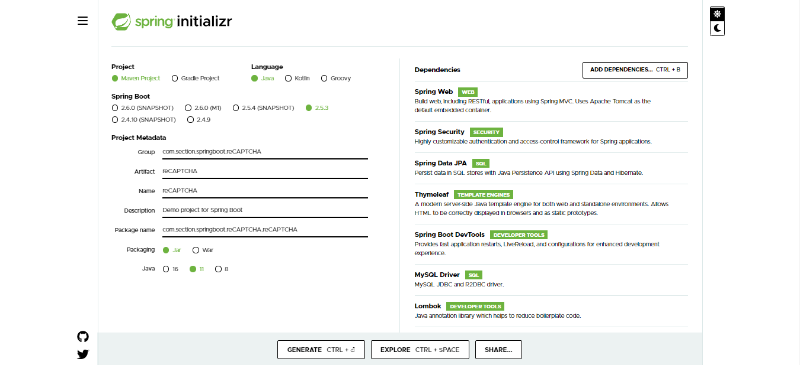
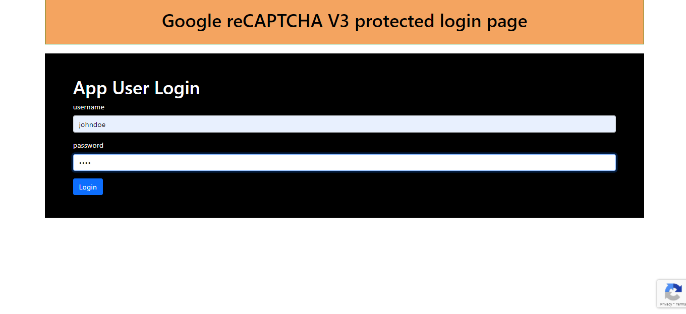
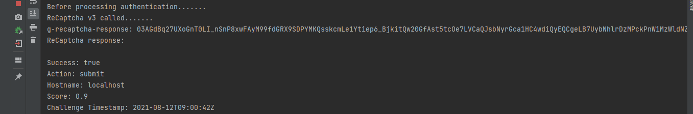
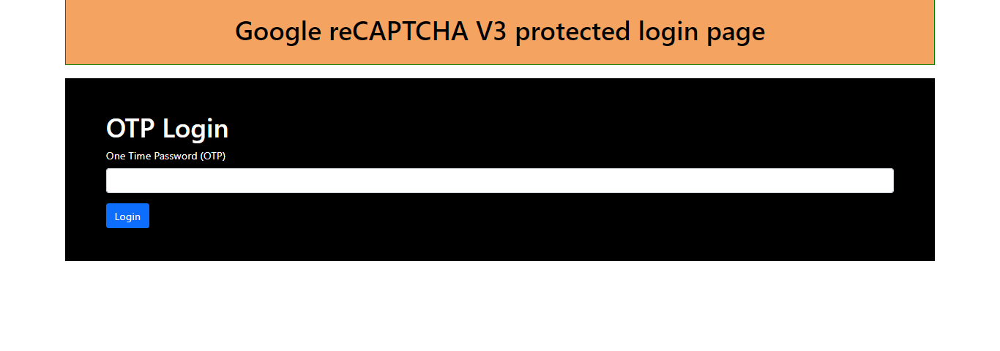

### Implementing Google reCAPTCHA in a SpringBoot application

### Introduction
Google ReCAPTCHA is a system that enables users to protects their sites from bots. The ReCaptcha generates a score that ranges from zero to one, if the score is less than `0.5` there is a possibility the action was invoked by a bot and if the score is greater than `0.5` the action was not invoked by a bot. In this tutorial, you will learn how to Implement Google reCAPTCHA version 3 to protect a login form using SpringBoot. We will intercept the authentication during login and if the score generated is less than `0.5` the user will be requested to enter an OTP sent to their email else the authentication will continue processing. 

### Table of Contents
- [Create new site with Google to verify your captcha response]()
- [Create a SpringBoot application using spring initializr]()
- [Configure database connection properties]()
- [Create User, Role, and ReCaptchaResponse models]()
- [Create User and Role repositories]()
- [Add a `CommandLineRunner` to create custom users]()
- [Create a user service to handle user details]()
- [Add `WebSecurityConfigurerAdapter` configuration class to handle login ]()
- [Create ReCAPTCHA handler to get the score]()
- [Create a Login Filter to redirect the user based on the score]()
- [Add the `addFilterBefore()` to `HttpSecurity`]()
- [Create a login and OTP Controller]()
- [Create a login and OTP form and a default success page]()
- [Test the login when the score is greater than 0.5]()
- [Test the login when the score is less than 0.5]()

### Prerequisites
- Spring Boot
- Spring Data JPA
- Spring Security
- Thymeleaf
- JDK 11+
- Intellij IDE

### Create a new site with Google to verify your captcha response
[Create a new reCAPTCHA V3 site ](https://www.google.com/recaptcha/admin/create) with any name you want but the domain can be localhost as we will be testing the application locally. Take note of the site key and secret key which will be used later in the application.

### Create a SpringBoot application using spring initializr
Go to [Spring Initialzr](https://start.spring.io/) and generate a new project with dependency `Spring Web`, `Spring Security`, `Spring Data JPA`, `Thymeleaf`, `Spring Boot Dev Tools`, `MySQL Driver` and `Lombok`.

Import the generated project into Intellij and ensure you have an active internet connection to download the dependencies from the remote central repository.



### Configure database connection properties
Since we will not deploy the application to production, the database tables, and data will be automatically created for us during application initialization using `spring.jpa.hibernate.ddl-auto=create` property.

The SQL statements that will be generated will be displayed to the console to see what is happening behind the scenes and this will be enabled by `spring.jpa.show-sql=true` property.

To ensure that we read the SQL statements easily, we can ensure they are formatted well by including the `spring.jpa.properties.hibernate.format_sql=true` property.

application.properties
```properties
spring.datasource.url=jdbc:mysql://localhost:3306/recaptcha
spring.datasource.username=username
spring.datasource.password=password
spring.jpa.hibernate.ddl-auto=create
spring.jpa.show-sql=true
spring.jpa.properties.hibernate.format_sql=true
spring.jpa.properties.hibernate.dialect=org.hibernate.dialect.MySQL8Dialect
```

### Create User, Role, and ReCaptchaResponse models
We will make use of project `Lombok` to generate getters and setters, no-argument constructor, and all arguments constructor for all the models that will be used.

Create a class named Role with fields `id` and `role name` where the role name represents the authority that a user can have.
```java
import lombok.AllArgsConstructor;
import lombok.Data;
import lombok.NoArgsConstructor;
import lombok.ToString;

import javax.persistence.*;

@Data
@AllArgsConstructor
@NoArgsConstructor
@ToString
@Entity(name = "role")
@Table
public class Role {
    @Id
    @GeneratedValue(strategy = GenerationType.AUTO)
    private Long id;

    private String roleName;

    public Role(String roleName) {
        this.roleName = roleName;
    }
}

```

`@Data` - Generates all getters and setters for the fields in the class.

`@AllArgsConstructor` - Generates a constructor with all the fields declared in the class.

`@NoArgsConstructor` - Generates a constructor without any arguments.

`@ToString` - Generates a string representation of the fields that can be used when debugging.


Create a class named AppUser with fields `id`, `username`, and `password` which represents different users who can interact with the application depending on the rights they have.

Since a user can have many rights we must include a Role field in the app user class and annotate with `@ManyToMany` annotation.

```java
import lombok.AllArgsConstructor;
import lombok.Data;
import lombok.NoArgsConstructor;
import lombok.ToString;

import javax.persistence.*;
import java.util.ArrayList;
import java.util.Collection;

@Entity(name = "user")
@Data
@NoArgsConstructor
@AllArgsConstructor
@ToString
public class AppUser {
    @Id
    @GeneratedValue(strategy = GenerationType.AUTO)
    private Long id;

    @Column(name = "user_name")
    private String userName;

    @Column(name = "password")
    private String password;

    @ManyToMany(fetch = FetchType.EAGER, cascade = CascadeType.ALL)
    private Collection<Role> roles = new ArrayList<>();

    public AppUser(String userName, String password) {
        this.userName = userName;
        this.password = password;
    }
}
```
Create a class named ReCaptchaResponse with field `success`, `hostname`, `action`, `score`, `challenge_ts`, and `errorCodes` which is an array of string and annotate it with `@JsonProperty("error-codes")` indicating that response from the server is a `JSON` and will be mapped to an array of strings. 

```java
import com.fasterxml.jackson.annotation.JsonProperty;
import lombok.Data;

@Data
public class ReCaptchaResponse {
    private boolean success;
    private String hostname;
    private String action;
    private float score;
    private String challenge_ts;

    @JsonProperty("error-codes")
    private String[] errorCodes;
}
```

### Create User and Role repositories
Create an interface named `AppUserRepository` and extend `JpaRepository` which will provide us the capability to perform CRUD operations without writing any queries.

Create a method that returns an `AppUser` by searching for a username and this can be achieved by adding the following method which is created by chaining the field names using special keywords.

```java
import org.springframework.data.jpa.repository.JpaRepository;

public interface AppUserRepository extends JpaRepository<AppUser, Long> {
    AppUser findAppUserByUserName(String username);
}
```

Create an interface named `RoleRepository ` as we did previously and add a method that returns a role by searching for a role name.

```java
import org.springframework.data.jpa.repository.JpaRepository;


public interface RoleRepository extends JpaRepository<Role, Long> {
    Role findRoleByRoleName(String roleName);
}
```
### Add a `CommandLineRunner` to create custom users
In your main class where the main method is located, create a password encoder `Bean` that will be used to encode the password before saving it to the database.

```java
@Bean
PasswordEncoder passwordEncoder(){
    return new BCryptPasswordEncoder();
}
```

Inside the main class, create a `CommandLineRunner` Bean that we will use to create some custom users to test our application when the application bootstraps.

The command-line runner will accept three parameters including `AppUserRepository`, `RoleRepository`, and `PasswordEncoder`.

```java
@Bean
    CommandLineRunner commandLineRunner(AppUserRepository appUserRepository,
                                        RoleRepository roleRepository,
                                        PasswordEncoder passwordEncoder){
        return args -> {

        }
                                       
}
```

Inside the arrow function of the command, line runner create a list of roles and use the `RoleRepository` to save the roles in the database using the `saveAll(roles)` method.

```java
return args -> {
            List<Role> roles = List.of(
                    new Role("ROLE_USER"),
                    new Role("ROLE_ADMIN")
            );

            roleRepository.saveAll(roles);
}
```
Create two users in the arrow function with username `johndoe` and `marypublic` and password of `1234` for both users then use AppUserRepository to save the users in the database.

```java
return args -> {
            List<Role> roles = List.of(
                    new Role("ROLE_USER"),
                    new Role("ROLE_ADMIN")
            );

            roleRepository.saveAll(roles);


            List<AppUser> appUsers = List.of(
                    new AppUser("johndoe",passwordEncoder.encode("1234")),
                    new AppUser("marypublic",passwordEncoder.encode("1234"))
            );
            appUserRepository.saveAll(appUsers);
}
```
Add role `ROLE_USER` to user `johndoe` and role `ROLE_ADMIN` to user `marypublic` and ensure the changes are committed to the database using the `save()` method.

The main application will finally look as shown below.

```java
import org.springframework.boot.CommandLineRunner;
import org.springframework.boot.SpringApplication;
import org.springframework.boot.autoconfigure.SpringBootApplication;
import org.springframework.context.annotation.Bean;
import org.springframework.security.crypto.bcrypt.BCryptPasswordEncoder;
import org.springframework.security.crypto.password.PasswordEncoder;

import java.util.List;

@SpringBootApplication
public class ReCaptchaApplication {

    public static void main(String[] args) {
        SpringApplication.run(ReCaptchaApplication.class, args);
    }

    @Bean
    PasswordEncoder passwordEncoder(){
        return new BCryptPasswordEncoder();
    }

    @Bean
    CommandLineRunner commandLineRunner(AppUserRepository appUserRepository,
                                        RoleRepository roleRepository,
                                        PasswordEncoder passwordEncoder){
        return args -> {
            List<Role> roles = List.of(
                    new Role("ROLE_USER"),
                    new Role("ROLE_ADMIN")
            );

            roleRepository.saveAll(roles);


            List<AppUser> appUsers = List.of(
                    new AppUser("johndoe",passwordEncoder.encode("1234")),
                    new AppUser("marypublic",passwordEncoder.encode("1234"))
            );
            appUserRepository.saveAll(appUsers);

            AppUser john = appUserRepository.findAppUserByUserName("johndoe");
            Role roleForJohn = roleRepository.findRoleByRoleName("ROLE_USER");
            john.getRoles().add(roleForJohn);
            appUserRepository.save(john);


            AppUser mary = appUserRepository.findAppUserByUserName("marypublic");
            Role roleForMary = roleRepository.findRoleByRoleName("ROLE_ADMIN");
            mary.getRoles().add(roleForMary);
            appUserRepository.save(mary);
        };
    }
}
```
### Create a user service to handle user details.
Create an interface named `AppUserService` that extends `UserDetailsService`. The user detail service is used to authenticate the user by returning the username, password, and roles for a particular user.

```java
import org.springframework.security.core.userdetails.UserDetailsService;

public interface AppUserService extends UserDetailsService {
}
```
Create a class naed `AppUserServiceImpl` and implement `AppUserService` then Override the `loadUserByUsername(username`) method to locate the user.

```java
import lombok.RequiredArgsConstructor;
import org.springframework.security.core.authority.SimpleGrantedAuthority;
import org.springframework.security.core.userdetails.User;
import org.springframework.security.core.userdetails.UserDetails;
import org.springframework.security.core.userdetails.UsernameNotFoundException;
import org.springframework.stereotype.Service;

import javax.transaction.Transactional;
import java.util.ArrayList;
import java.util.Collection;

@Service
@RequiredArgsConstructor
@Transactional
public class  AppUserServiceImpl implements AppUserService{
    private final AppUserRepository appUserRepository;
    @Override
    public UserDetails loadUserByUsername(String username) throws UsernameNotFoundException {
        AppUser appUser = appUserRepository.findAppUserByUserName(username);
        if (username == null){
            throw new UsernameNotFoundException("user not registered");
        }else {
            Collection<SimpleGrantedAuthority> authorities = new ArrayList<>();
            appUser.getRoles().forEach(role -> {
                authorities.add(new SimpleGrantedAuthority(role.getRoleName()));
            });
            return new User(appUser.getUserName(),appUser.getPassword(),authorities);
        }

    }
}
```
### Add `WebSecurityConfigurerAdapter` configuration class to handle login
Create a class named `AppConfig` that extends the `WebSecurityConfigurerAdapter` class to add custom security information to our application and Override two methods `configure(AuthenticationManagerBuilder)` and `configure(HttpSecurity)`.

Declare a final property for the `AppUserService` interface inside the class and the `@RequiredArgsConstructor` annotation will create a constructor with the fields declared final which will be used by Spring for dependency injection.

```java
@Configuration
@EnableWebSecurity
@RequiredArgsConstructor
@Slf4j
public class AppConfig extends WebSecurityConfigurerAdapter {
    private final AppUserService appUserService;

     @Override
    protected void configure(AuthenticationManagerBuilder auth) throws Exception {
    }

    @Override
    protected void configure(HttpSecurity http) throws Exception {
    }

}
```
Add a password encoder Bean inside the app configuration class which will be used by the data access object authentication provider.

```java
@Bean
BCryptPasswordEncoder bCryptPasswordEncoder(){
    return new BCryptPasswordEncoder();
}
```

Create a `DaoAuthenticationProvider` and set the user details and password encoder as created above.

```java
 @Bean
DaoAuthenticationProvider daoAuthenticationProvider(){
    DaoAuthenticationProvider daoAuthenticationProvider = new DaoAuthenticationProvider();
    daoAuthenticationProvider.setUserDetailsService(appUserService);
    daoAuthenticationProvider.setPasswordEncoder(bCryptPasswordEncoder());
    return daoAuthenticationProvider;
}
```

Add the DAO authentication provider to the authentication manager builder.

```java
 @Override
protected void configure(AuthenticationManagerBuilder auth) throws Exception {
    auth.authenticationProvider(daoAuthenticationProvider());
}
```
Configure the route that will return the login page, process the login page, and redirect the user after successful login in the `configure(HttpSecurity)` method.

The `/login` is the path that returns the login form, `/processLogin` is the path that processes the login form, and `/success` is the path that returns the success page after successful authentication.

```java
 @Override
    protected void configure(HttpSecurity http) throws Exception {
        http.csrf().disable();
        http.cors().disable();
        http.
                .authorizeRequests()
                .anyRequest()
                .authenticated()
                .and()
                .formLogin()
                .loginPage("/login")
                .loginProcessingUrl("/processLogin")
                .defaultSuccessUrl("/success",true)
                .permitAll();
    }
```

### Create ReCAPTCHA handler to get the score
The class `ReCaptcharV3Handler` will be used to verify the `g-recaptcha-respone` of the form by providing additional information such as the secret key and the server URL to verify our response.

After successful verification, this class will return a JSON response and we will map to a plain java object to return `ReCaptchaResponse` object and return the score to be used by the authentication filter.

Inside the class, create a method named verify with `g-recatcha-response` argument of type string that will return a float value of our score.

Inside the verify method use the `RestTemplate` class with server URL, request object, and response entity, and since it will return a `ReCaptchaResponse` object use a getter to retrieve the score and return its value generated by the server.

We will log all the values returned from the server which include `success`, `action`, `hostname`, `score`, `challenge`, and `errorCodes` to verify that our `reCAPTCHA` is working.

```java
import org.springframework.http.HttpEntity;
import org.springframework.http.HttpHeaders;
import org.springframework.http.MediaType;
import org.springframework.util.LinkedMultiValueMap;
import org.springframework.util.MultiValueMap;
import org.springframework.web.client.RestTemplate;

public class ReCaptcharV3Handler {
    private String secretKey = "6Lc4JNUbAAAAANKqiE4UXytmsQw35UcHkzAScS_o";
    private String serverAddress = "https://www.google.com/recaptcha/api/siteverify";

    public float verify(String recaptchaFormResponse) throws InvalidReCaptchaTokenException{
        System.out.println("ReCaptcha v3 called.......");
        System.out.println("g-recaptcha-response: "+recaptchaFormResponse);

        HttpHeaders headers = new HttpHeaders();
        headers.setContentType(MediaType.APPLICATION_FORM_URLENCODED);

        MultiValueMap<String, String> map = new LinkedMultiValueMap<>();
        map.add("secret",secretKey);
        map.add("response",recaptchaFormResponse);

        HttpEntity<MultiValueMap<String, String>> request = new HttpEntity<>(map,headers);

        RestTemplate restTemplate = new RestTemplate();
        ReCaptchaResponse response = restTemplate.postForObject(
                serverAddress,request, ReCaptchaResponse.class);


        System.out.println("ReCaptcha response: \n");

        System.out.println("Success: "+response.isSuccess());
        System.out.println("Action: "+response.getAction());
        System.out.println("Hostname: "+response.getHostname());
        System.out.println("Score: "+response.getScore());
        System.out.println("Challenge Timestamp: "+response.getChallenge_ts());

        if (response.getErrorCodes() != null){
            System.out.println("Error codes: ");
            for (String errorCode: response.getErrorCodes()){
                System.out.println("\t" + errorCode);
            }
        }

        if (!response.isSuccess()){
            throw new InvalidReCaptchaTokenException("Invalid ReCaptha. Please check site");
        }
        // return 0.4f;
        return response.getScore();
    }
}
```

### Create a Login Filter to redirect the user based on the score
This class will intercept the request before the authentication happens.In order for the interception of the request to work we need to extend the `UsernamePasswordAuthenticationFilter` class from spring security and then Override the `attemptAuthentication()` method which accepts the `HttpServeletRequest` and `HttpServletResponse` arguments.

With the request we can retrieve the `g-captcha-response` from the URL and pass it to the verify method as an argument and depending on the score that will be returned, we can allow the authentication to continue or request the user to send the OTP emailed to them.

Create a class named `CustomLoginFilter` with parameters `loginURL` and `httpMethod` of type String and inside the constructor call the parent method `setRequiresAuthenticationRequestMatcher()` that accepts the two parameters of the constructor.

The method will match the request with the given path and HTTP method and if true the request will be intercepted.

```java
public CustomLoginFilter(String loginURL, String httpMethod){
        super.setRequiresAuthenticationRequestMatcher(new AntPathRequestMatcher(loginURL,httpMethod));
    }


```

The `CustomLoginFilter` class will finally look as shown below. 
```java
import lombok.extern.slf4j.Slf4j;
import org.springframework.security.core.Authentication;
import org.springframework.security.core.AuthenticationException;
import org.springframework.security.web.authentication.UsernamePasswordAuthenticationFilter;
import org.springframework.security.web.util.matcher.AntPathRequestMatcher;

import javax.servlet.ServletException;
import javax.servlet.http.HttpServletRequest;
import javax.servlet.http.HttpServletResponse;
import java.io.IOException;

@Slf4j
public class CustomLoginFilter extends UsernamePasswordAuthenticationFilter {

    public CustomLoginFilter(String loginURL, String httpMethod){
        super.setRequiresAuthenticationRequestMatcher(new AntPathRequestMatcher(loginURL,httpMethod));
    }


    @Override
    public Authentication attemptAuthentication(HttpServletRequest request, HttpServletResponse response) throws AuthenticationException {
        String recaptchaFormResponse = request.getParameter("g-recaptcha-response");

        System.out.println("Before processing authentication.......");

        ReCaptcharV3Handler handler = new ReCaptcharV3Handler();


        try {
           float score = handler.verify(recaptchaFormResponse);
            if (score < 0.5){
                    request.getRequestDispatcher("otp_login").forward(request,response);
            }
        } catch (InvalidReCaptchaTokenException | ServletException | IOException e) {
            try {
                response.sendError(HttpServletResponse.SC_INTERNAL_SERVER_ERROR, e.getMessage());
            } catch (IOException ioException) {
                ioException.printStackTrace();
            }
        }


        return super.attemptAuthentication(request, response);
    }
}
```

### Add the `addFilterBefore()` method to `HttpSecurity`
Before we add the method we need to create the filters that will be used by the application.

Create a method named `getCustomLoginFilter()` that returns a `CustomLoginFilter` in `AppConfig` class.

Inside the method add a `CustomLoginFilter` constructor and use `/login` and `post` parameters to ensure the authentication is intercepted.

Set the authentication manager the default provided by spring security `authenticationManager()` and the login form processing url using `setFilterProcessesUrl()` method.

Override the `onAuthenticationSuccess()` method that tells spring the page that the user should be redirected to once the authentication is successful.

Override the `onAuthenticationFailure()` that tells spring the page that the user should be redirected to if there was an error.

```java
private CustomLoginFilter getCustomLoginFilter() throws Exception{
        CustomLoginFilter filter = new CustomLoginFilter("/login","POST");
        filter.setAuthenticationManager(authenticationManager());
        filter.setFilterProcessesUrl("/processLogin");
        filter.setAuthenticationSuccessHandler(new AuthenticationSuccessHandler() {
            @Override
            public void onAuthenticationSuccess(HttpServletRequest request, HttpServletResponse response, Authentication authentication) throws IOException, ServletException {
                if (!response.isCommitted()){
                    response.sendRedirect("/success");
                }
            }
        });
        filter.setAuthenticationFailureHandler(new AuthenticationFailureHandler() {
            @Override
            public void onAuthenticationFailure(HttpServletRequest request, HttpServletResponse response, AuthenticationException e) throws IOException, ServletException {
                if (!response.isCommitted()){
                    response.sendRedirect("login?error");
                }
            }
        });

        return filter;
    }
```
To ensure the request is intercepted before the authentication happens we just need to add the method `addFilterBefore()` in the `configure(HttpSecurity)` method of `AppConfig`.

The `addFilterBefore()` method has two parameters composed of the filter we created above and the class it belongs to.

```java
 @Override
    protected void configure(HttpSecurity http) throws Exception {
         http.addFilterBefore(getCustomLoginFilter(),CustomLoginFilter.class)
    }
```

### Create a login and OTP Controller

The login controller consists of two `GET` methods one to return the login form and the other to return the success page once the login is successful.

```java
import org.springframework.stereotype.Controller;
import org.springframework.web.bind.annotation.GetMapping;

@Controller
public class LoginController {
    @GetMapping("/login")
    public String loginForm(){
        return "login";
    }

    @GetMapping("/success")
    public String successPage(){
        return "success";
    }
}
```
The OTP controller returns the `otp-login` page when the score generated by the server is less than `0.5`.

```java
import org.springframework.stereotype.Controller;
import org.springframework.web.bind.annotation.PostMapping;

@Controller
public class OTPController {

    @PostMapping("/otp_login")
    public String otpForm(){
        return "otp_login";
    }

}
```
### Create a login and OTP form and a default success page

When creating the login form, you add ReCaptcha to the site by adding the following information.

- Load the javascript API.

```html
<script src="https://www.google.com/recaptcha/api.js"></script>
```

- Add a callback function to handle the token.

```html
<script>
   function onSubmit(token) {
     document.getElementById("demo-form").submit();
   }
 </script>
```

- Add attributes to your HTML button.

```html
<button class="g-recaptcha" 
        data-sitekey="reCAPTCHA_site_key" 
        data-callback='onSubmit' 
        data-action='submit'>Submit</button>
```

login.html
```html
<!doctype html>
<html lang="en" xmlns:th="http://www.thymeleaf.org">
<head>
    <!-- Required meta tags -->
    <meta charset="utf-8">
    <meta name="viewport" content="width=device-width, initial-scale=1">

    <!-- Bootstrap CSS -->
    <link href="https://cdn.jsdelivr.net/npm/bootstrap@5.0.2/dist/css/bootstrap.min.css" rel="stylesheet" integrity="sha384-EVSTQN3/azprG1Anm3QDgpJLIm9Nao0Yz1ztcQTwFspd3yD65VohhpuuCOmLASjC" crossorigin="anonymous">

    <title>reCAPTCHA V3 with Spring Boot</title>
    <style>
        .row-1{
            border: 2px solid green;
            background-color: sandybrown;
            color: black;
            padding: 20px;
            text-align: center;
        }

        .row-2{
            background-color: black;
            margin-top: 20px;
            color: white;
            padding: 50px;
        }
    </style>
    <script>
        function onSubmit(token){
            document.getElementById("loginForm").submit();
        }
    </script>
</head>
<body>
<div class="container">
    <div class="row row-1">
        <div class="col-md-12">
            <h1>Google reCAPTCHA V3 protected login page</h1>
        </div>

    </div>
    <div class="row row-2">
        <div class="col-md-12">
            <h1>App User Login</h1>
            <form id="loginForm" action="#" th:action="@{/processLogin}" method="post">
                <div class="mb-3">
                    <label for="username" class="form-label">username</label>
                    <input id="username" class="form-control" type="text" name="username" >
                </div>
                <div class="mb-3">
                    <label for="password" class="form-label">password</label>
                    <input id="password" class="form-control" type="password" name="password">
                </div>
               <button class="g-recaptcha btn btn-primary"
                        data-sitekey="6Lc4JNUbAAAAAE6D668IzCuXpTH5LCKypwhdBECs"
                        data-callback='onSubmit'
                        data-action="submit">
                   Login
               </button>
            </form>
        </div>

    </div>

</div>
<script src="https://www.google.com/recaptcha/api.js"></script>
</body>
</html>
```

otp_login.html

```html
<!doctype html>
<html lang="en" xmlns:th="http://www.thymeleaf.org">
<head>
    <!-- Required meta tags -->
    <meta charset="utf-8">
    <meta name="viewport" content="width=device-width, initial-scale=1">

    <!-- Bootstrap CSS -->
    <link href="https://cdn.jsdelivr.net/npm/bootstrap@5.0.2/dist/css/bootstrap.min.css" rel="stylesheet" integrity="sha384-EVSTQN3/azprG1Anm3QDgpJLIm9Nao0Yz1ztcQTwFspd3yD65VohhpuuCOmLASjC" crossorigin="anonymous">

    <title>reCAPTCHA V3 with Spring Boot</title>
    <style>
        .row-1{
            border: 2px solid green;
            background-color: sandybrown;
            color: black;
            padding: 20px;
            text-align: center;
        }

        .row-2{
            background-color: black;
            margin-top: 20px;
            color: white;
            padding: 50px;
        }
    </style>
</head>
<body>
<div class="container">
    <div class="row row-1">
        <div class="col-md-12">
            <h1>Google reCAPTCHA V3 protected login page</h1>
        </div>

    </div>
    <div class="row row-2">
        <div class="col-md-12">
            <h1>OTP Login</h1>
            <form id="loginForm" action="#" th:action="@{/processLogin}" method="post">
                <div class="mb-3">
                    <label for="username" class="form-label">One Time Password (OTP)</label>
                    <input id="username" class="form-control" type="text" name="otp" >
                </div>
              <input type="submit" class="btn btn-primary" value="Login">
            </form>
        </div>

    </div>

</div>
</body>
</html>
```

success.html

```java
<!doctype html>
<html lang="en">
<head>
  <!-- Required meta tags -->
  <meta charset="utf-8">
  <meta name="viewport" content="width=device-width, initial-scale=1">

  <!-- Bootstrap CSS -->
  <link href="https://cdn.jsdelivr.net/npm/bootstrap@5.0.2/dist/css/bootstrap.min.css" rel="stylesheet" integrity="sha384-EVSTQN3/azprG1Anm3QDgpJLIm9Nao0Yz1ztcQTwFspd3yD65VohhpuuCOmLASjC" crossorigin="anonymous">

  <title>reCAPTCHA V3 with Spring Boot</title>
  <style>
    h1{
      border: 2px solid green;
      padding: 10px;
      background-color: green;
      color: white;
    }
  </style>
</head>
<body>
<div class="container">
  <div class="row">
    <div class="col-md-12">
      <h1>You have successfully logged in</h1>

    </div>

  </div>

</div>

</body>
</html>
```
### Test the login when the score is greater than 0.5
Most of the time the server will return a score greater than 0.5 meaning the authentication will continue processing and on successful login, the user will be able to see the success page.

Run the application and go to `http://localhost:8080/login` on your browser and fill in the login details with any username and password of a user created by the `CommandLineRunner`.



On pressing the login button you will notice the following `g-captcha-response` that is generated and the result that is returned by the server after verification on the console.



The score generated by the server is `0.9` and it will allow the authentication to continue to the success page if the login is successful.


### Test the login when the score is less than 0.5
As indicated earlier the server mostly generates a score greater than `0.5` so we have to modify our application manually so that the verify method returns a score less than `0.5` for testing purposes.

Note that the application has been created in such a way that when the value is less than `0.5` the OTP page will be returned but no further processing is done such as the implementation of verifying the OTP emailed to the user as it is out of this scope.

Return a random score in the verify method that is less than `0.5` and run the application again. When you enter the login details and press the login button, the interceptor will return the OTP page meaning the score generated was less than `0.5`.



### Conclusion
In this tutorial, you have learned how to implement Google ReCAPTCHA V3 in a SpringBoot application by leveraging a login form protected by Spring security and backed with persistent users in the database who have specific roles. Depending on the score that was generated, many decisions can be decided as I mentioned in the introduction section, and not just requiring the user to send the one-time password (OTP) emailed to them.