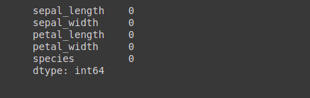
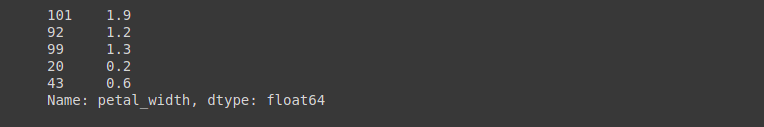

Hypothesis is the act of making observations and generating probing questions from the observations made in an attempt to come to a conclusion. Hypothesis testing is the test of assumptions on a population sample. It involves checking out whether a hypothesis should be accepted or not. In the world of work, hypothesis testing has been of great importance in making worthy decisions off mere observations. Billions of data are being generated on a daily basis around the globe and this has made the relevance of hypothesis testing a stronghold in making business decisions.
<!--more-->
### Table of Contents
*1.0. Prerequisites.*

*2.0. Goals of the tutorial.*

*3.0. Understanding hypothesis testing.*

*4.0. Confidence of null hypothesis (Probability Value)*

*5.0. Statistical techniques for hypothesis testing*

  - *Chi-Square Test*
  - *T-Test*
  - *ANOVA Test*

*6.0. Conclusion*

*7.0. Extra Resources*

### Prerequisites
The reader of this tutorial should try meet the following criteria:
- must have basic knowledge of python programming.
- must have an idea or the knowledge of basic exploratory data analysis and how pandas and numpy work.
- must have basic knowledge of statistics.
- must be one of a data science enthusiast, newbie or professional.

### Goals of the Tutorial
At the end of this tutorial, readers should be able to 
- understand clearly the concept of statistical hypothesis testing.
- perform the implementation of t-test, chi-squared test & ANOVA with python and a new dataset.
- differentiate clearly the trade-off between type 1 and type 2 error of null hypothesis.
- explain the confidence of the null hypothesis.
- play with basic pandas function for exploratory data analysis.
- figure out the best case-study for "t-test", "chi-squared test" and "ANOVA test".

### Understanding Hypothesis Testing
There are two types of hypothesis testing, namely, null hypothesis and alternate hypothesis.

**Null hypothesis** is the initial assumption about an event (also referred to as the ground truth), whereas alternate hypothesis is an assumption that counters the initial assumption".

In a scenario whereby a seventy years old woman has her belly looking like she is carrying a baby, and knowing fully well that there is a small chance for such an old lady to be pregnant, our initial assumption is going to be that 
**"She is pregnant"**.
while our alternate hypothesis will be
**"She is not pregnant"**.

The null hypothesis is a statement believed to be true unless we can prove otherwise beyond a reasonable doubt.

In trying to make a valid conclusion between two assumptions on a certain sample of data. We will refer to the first assumption (H0) as our null hypothesis and the counter assumption (H1) as our alternate hypothesis, there seem to be many alternative names for H0 (ground truth, initial assumption, prior assumption, e.t.c) whereas H1 is popularly known as alternate hypothesis.

To carry out hypothesis testing, the first step is to form an initial assumption and label it as H0. The next step would be to collect all data samples available to support our hypothesis, collect all the shreds of evidence and analyze the data, and make a decision whether to accept the H0 or reject it. 
While doing that, there is a likelihood for four events to happen.

1. The ground truth is not true, accept the H1 (alternate hypothesis) and hence reject H0 (null hypothesis).

This is impressive as there is no *error*.

2. The ground truth(H0) is true, accept the null hypothesis(H0).

This is also very good as there is no *error*.

3. We reject the ground truth but eventually it is true. (H0) Null hypothesis is true but we reject it.

It looks very bad as it points to an error called *Type 1 Error*. 

4. We do not reject the ground truth despite the fact that it is not true, i.e, (H0) Null hypothesis is not true, but we did not reject it.

it looks bad as it points to an error called *Type 2 Error*.

The most dangerous of the two types of error depends on the problem we are trying to solve, the analyst has to decide whether type 1 error is more harmful or type two error is more harmful in their project approach.

Using the previously mentioned example above, a scenario whereby a seventy years old woman has a swollen stomach like she is pregnant, our ground truth is going to be that 
**"She is pregnant"** 

while our alternate hypothesis will be
**"She is not pregnant"**

```
H0 = "She is pregnant"
H1 = "She is not pregnant" (Maybe she has fibroid)
```

In this case, after carrying out hypothesis testing on her condition, will it be safe to make the mistake of assuming
**"She is pregnant",** 
when she actually has fibroid? 
or will it be costlier to make the assumption of  
**"She is not pregnant",**
When she's actually pregnant.

There is someone's life involved here, therefore care must be taken before making assumptions. 
In this case, encountering type 1 error is assuming she's not pregnant when she actually is, i.e. the null hypothesis is true but we reject it. The consequence might be getting her to abort it which might be threatening to her life.
If a type two error is encountered, which is assuming she's pregnant when she is truly not, the null hypothesis is wrong but we insist on not rejecting it. The consequence might probably be leaving the bump-like pregnancy to grow, and it turns out to be an acute fibroid.

Considering the two cases, the consequence of type 2 error seems to be more dangerous than type 1 error because abortion might be carried out successfully but an overgrown fibroid will kill.

### Confidence of Null Hypothesis (Probability Value)

Technically, the only way we can accept or reject our ground truth (null hypothesis) is after determining our [*P-value*](https://www.scribbr.com/statistics/p-value/) which is an abbreviation for probability value. It is the only thing that has the decisive power to accept or reject H0. P-value explains the likelihood of the gathered fact or data to occur under the condition of the null hypothesis.

***The smaller our P-values is the more delicate it is to accept our null hypothesis.***

To calculate our P-value, there should be a certain level of significance to our ground truth or initial assumption, so a smaller P-value is telling us there are more reasons why we should accept our alternative hypothesis.

P-value is within the range of 0 and 1, but the threshold value is always set at 0.05, it can also be called *alpha*, alpha is always set before the experiments in order to avoid bias. 

Our alpha value is the probability of making a wrong decision when the ground truth(H0) is true. It is always calculated as 

```
alpha = 1 - confidence level
```
if the confidence level from what we've seen in our data is 95%, then 
```
alpha = 1 - 0.95
```
which is 0.05.

Why is 95% confidence level the most accustomed?
Since we know that alpha level is the probability of encountering a Type I error(which is rejecting H0 despite being true), would it not make sense to make it as bitsy as possible. Imagine our alpha value being set to 10%, obviously, there is an increasing chance that we will make the mistake of rejecting the null hypothesis, but it must not be too small as well, if we set the alpha value as 1%, it will be too small that our decision will be reeking of bias. Hence, the standard has been 5%.

### Statistical Techniques for Hypothesis Testing

In this tutorial, I will be touching on three methods of carrying out statistical hypothesis testing, namely:

1. Chi-Square Test
2. T-Test
3. ANOVA Test

#### Chi-Square Test

This is used to perform testing on two categorical variables in our data population. It is focused on looking for an important relationship between two categorical variables.
For example, comparing the aftereffect of malaria drug A, malaria drug B, and malaria drug C.
Chi-square is a tool for checking how divergent the observed frequency is from the expected frequency.
With Chi-Square, we accept the null hypothesis when variable A and variable B are not dependent, i.e. there is no relationship between them.
We reject the null hypothesis(or accept the alternate hypothesis) when variable A depends on variable B, i.e. there is a relationship between them.

A very good illustration of the mathematics involved with the chi-square test is:

A mathematics teacher conducted a test for a class of 20 students. He expected 5 to score good marks, 7 to score average marks while 8 to fail. Eventually, when the result came out, 5 failed, 6 were ln the average while 9 scored good marks. Mathematically, to carry out chi-square test for this class.

|  | Good  |  Average  | Fail | Total |
|----|--------|:----------|--------------|--------|
| Observed| 9 | 6 | 5 | 20 |
| Expected| 5 | 7 | 8 | 20 |

Let:
observed good = A,
expected good = a,
observed average = B,
expected average = b,
observed fail = C,
expected fail = c.
```
Chi-square = Σ[(observed value - expected value)² / expected value]
```
```
A-a = 4
B-b = -1
C-c = -3
```
```
# find the square of our values
/A-a/² = 16
/B-b/² = 1
/C-c/² = 9
```
```
Good = (16/5) = 3.2
Average = (1/7) = 0.143
Fail = (9/8) = 1.125

chi-square = 3.2 + 0.143 + 1.125
chi-square = 4.468
```
To get a full grab of how to calculate it mathematically to carry out hypothesis testing, follow this [article](https://www.yourarticlelibrary.com/project-reports/chi-square-test/chi-square-test-meaning-applications-and-uses-statistics/92394). However, since the tutorial is focused on python implementation, I will try to show the easier way to get things done on time.
#### Load our dependencies.

```python
import pandas as pd
import numpy as np
import scipy.stats as stats
from scipy.stats import f_oneway
from scipy.stats import chi2_contingency
import matplotlib.pyplot as plt

import statsmodels.api as sm
from statsmodels.formula.api import ols

import warnings
warnings.filterwarnings( "ignore" )
```

The libraries imported are the day-to-day libraries for any data science python implementation work, except the f_oneway for the ANOVA and chi2_contigency for Chi-square.

*I will be using the popular iris data set for the tutorial, you can get it almost anywhere but I downloaded this from [Kaggle](https://www.kaggle.com/vikrishnan/iris-dataset).*

#### Load the data into the notebook
```python
df = pd.read_csv("/content/drive/MyDrive/IRIS.csv")
```
```python
df.head()
```

On checking the first five, it seems all the species of flower are setosa, but the iris dataset has 2 more samples apart from that, to be sure, let's run df.sample() to visualize samples randomly.
```python
df.sample(10)
```


Always check for missing values to avoid future complications.
```python
df.isnull().sum()
```


We can be sure now that there are 3 classes of species and there are no missing values. 
Let's proceed with the manipulation.

Let's use petal width to compare species for our Chi-Square Test. 

The first step is to check the summary of petal_width 

Secondly, use the information derived to convert it to a categorical variable.
```python
df.petal_width.describe()
```


Since, the operation we are going to be performing are mathematical operations and they don't work with letters or words except numbers. The Chi-square test helps in determining if there is a notable difference between the observed and normal frequencies in one or more categories, the values of petal_width must be changed into categories of zeros and ones using the 50% percentile which is the second quartile as the yardstick. There are clear [differences](https://byjus.com/maths/difference-between-percentage-and-percentile/) between percentage and percentile. As percentage is just a fraction of a hundred, the percentile is more concerned with ranks, it can be termed as the percentage of values that fall below a certain value mark. It is rather used to find the position of a value in a given set of values. For example, if a girl has the 50th percentile on an examination of 200, we can say that by scoring 200 marks, she has higher marks than 50% of the remaining class.

#### How to calculate percentile.
There are two conditions that must be satisfied.
1. Data must be arranged in ascending order.
2. if the index is not an integer, it must be rounded up.
```
np.percentile(df.petal_width, 50)
```


 A quartile is another term-related percentile, it can be called a specified percentile, we have 1st quartile as 25% percentile, second quartile as 50%, and 3rd as 75% percentile. You can as well read this [article](https://datascienceupskill.com/statistics/percentiles-and-quartiles) to get a better grip.  

```python
def petal_cat(df):
 if df['petal_width'] <= 1.3:
 return 0
 elif df['petal_width'] > 1.3:
 return 1
 else:
 return 'indifferent'

df['petal_width_new'] = df.apply(petal_cat, axis=1)  
```
The non-machine-friendly format for our *species* class has to be transformed to 0,1 and 2, which is a machine-readable format for the testing to be carried out. Therefore, with [label-encoding](https://www.section.io/engineering-education/introduction-to-scikit-learn-in-python/), a numeric value will be assigned to each of the categories in the class. To learn more about label encoding, [click](https://www.section.io/engineering-education/data-preprocessing-in-r/).

```python
def species_cat(df):
 if df["species"] == "Iris-virginica":
 return 0
 elif df["species"] == "Iris-versicolor":
 return 1
 else:
 return 2

df["species"] = df.apply(species_cat, axis=1)
```
```python
df.sample(5)
```

```python
df_new = df.drop(columns=["sepal_width", "sepal_length", "petal_length", "petal_width"])
```
```python
df_new.head()
```


Let's make use of `chic2_contigency` provided for us in `scipy.stats` library.

It has been added to our dependencies earlier in the notebook.
```python
stat, p, dof, expected= chi2_contingency(df_new)

print(dof)
```


We can comfortably get 3 outputs in test statistics, degree of freedom, p-value, and expected values.

[Test statistic](https://online.stat.psu.edu/statprogram/reviews/statistical-concepts/chi-square-tests) is a characterized feature of significance in the Chi-square test that helps in determining how uncommon the result might be provided that null hypothesis is assumed to be true.

The number of features or variables that we have access to varying is the degree of freedom. Follow the link for more information on [degree of freedom](https://byjus.com/maths/chi-square-test/).

Hence, we set our probability of confidence to 95% as explained earlier in the tutorial.
```python
prob = 0.95

alpha = 1.0 - prob

print('alpha/significance level=%.3f' % alpha)
print('P-value =%.2f' % p)

if p <= alpha:
 print('Reject the Null Hypothesis ( reject H0)')
else: 
 print('Accept the Null Hypothesis (fail to reject H0)')
```


The P-value is greater than the alpha value set at 0.05, we will fail to reject the null hypothesis(we accept the null hypothesis). This means the petal width and species of flower are not dependent, i.e. there is no relationship between them.

#### T-Test

The T-test is utilized when we plan to evaluate the discrepancy between the means of two groups of samples. Unlike Chi-Square Test, the T-test is used on continuous variables.

It has three basic types

1. **One sample t-test:** It checks whether the population has a different mean from the sample.
The mathematical formula is:
```
t-test = a-BX∕N
```
Where;

a = the observed mean group.

B = the assumed population means.

X = the standard deviation of the data group.

N = the number of observations in the group.

2. **Two-sample t-test:** It checks and compares the means of two groups that are not dependent on each other and compare with the population's means to see if there is a huge difference.
The mathematical expression is:
```
t-test = Ma – (Mb*v*Na)+vNb
```
Ma = Data sample A's mean

Mb = Data sample B's mean

Na = Size of sample A

Nb = Size of sample B

v = Variance

3. **Paired t-test:** It is used in checking and comparing the means of different samples from a group.
Mathematically, it can be resolved with:
```
t-test = D - (m*xd)∕N
```
D = The difference between paired observations' sample mean.

m = assumed mean difference.

xd = standard deviation.

N = the number of observations in the group.

#### Performing a One-Sample T-Test
```python
df_ = df.petal_width
```
```python
df_.sample(5)
```

```python
stats.ttest_1samp(a=df_, popmean=1.199)
```


**H0:** The mean of petal_width is 1.199

**H1:** The mean of petal_width is not 1.199

Analyzing one-sample t-test, it finds out if the hypothesized mean is the same or different from the group's mean. From the example above, we've selected the petal_width as the population sample to perform the test on. 
From the test, since the P-value beats the alpha level set at 0.05,

we fail to reject the null hypothesis because we don't have enough evidence to prove otherwise, moreover, if you check, the P-value is very close to 1.0,

This means that the mean of petal_width is most likely 1.199.
 
 The evidence is too strong to be rejected, it is almost accurate. (Obviously, I copied the mean from the summary).

#### Performing a Two-Sample T-Test

We need to first of all check their variances.

The ratio of the higher to the lower variance must be less than 4:1 before we can assume the two samples have the same variance.
```python
class1 = df.petal_width
class2 = df.sepal_length
```
find variance for each group
```python
print(np.var(class1), np.var(class2))
```

```python
ratio_check = 0.6811222222222222 / 0.5785315555555559

ratio_check
```

Obviously, the ratio is less than 4:1, thus the variances are assumed to be equal.
```python
stats.ttest_ind(a=class1, b=class2, equal_var=True)
```


Evaluating this:

**H0:** The mean of the two samples (petal_width and sepal_length) are equal. 

**H1:** The mean of the two samples (petal_width and sepal_length) are not equal.

Our P-value ( p = 3.7974378831185126e-148) is far less than alpha = 0.05, 

Checking of the variance is only making sure that two populations are probably spread out or normally distributed, this will help prevent bias. Hence, the null hypothesis will be assuming that since the two groups are normally distributed, they likely should have the same mean. However, interpreting any form of t-test largely depends on the p-value, the result above explains that the means of the two samples(petal_width and sepal_length) are different. Thus, we will reject the Null Hypothesis which says the mean of the two samples are the same because their variances are assumed to be equal, there is no evidence sustainable enough to prove the two populations have the same mean.
H1 (alternate hypothesis) is however true.

This allows us to figure out questions like: 
"Is there a significant or random by the chance difference in the average time spent on mathematics exam from that of English exam?."

#### ANOVA Test

ANOVA is a word coined from `analysis of variance`. It is a statistical concept that shows the differences between the means of more than two independent classes, using variance analysis on samples from those classes.

It is used to check the contrast between three or more samples with one test. Especially when the categorical class has more than two categories.

Why ANOVA? With ANOVA you get to discover obvious differences between the means of your independent features and on getting a clearer picture of the differences, you can get to understand how each of them connects to your dependent variable and what are the influencing factors for the relationship. 

A typical example is, assuming there is an increase in sales for a particular product, and they've tried several advertisement channels so it is difficult to say which one yielded the sales increment the most. They did online posters, billboards, TV ads, mouth-to-mouth, and sponsorship. By carrying out an ANOVA test on the several advertisement channels, they will be able to understand better which one works best out of all channels(independent variables) through the connection it has with the increase in sales which is the dependent variable. It can be very useful in the marketing department of every organization.

During ANOVA testing, the hypothesis is:

**H0:** When all samples' means are the same.

**H1:** When one or more samples are very much different.

#### One Way ANOVA Test
```python
class1 = df.petal_width
class2 = df.sepal_length
class3 = df.petal_length
```
```python
f_oneway(class1, class2, class3)
```


As mentioned earlier, in ANOVA testing, the hypothesis is:

**H0:** When all samples' means are the same.

**H1:** When one or more samples are very much different.

Since our P-value (5.738282463819433e-122) is far less than alpha = 0.05, therefore, we reject the Null Hypothesis, there is no evidence sustainable enough to accept it. 

This means that the sample means are very much different. Hence, our H1 (alternate hypothesis) is thus true.

#### Two Way ANOVA Test

This is called for when we are dealing with three or more variables, trying to compare their means with each other.
```python
petal = df.petal_width
sepal = df.sepal_length
species = df.species
```
```python
model = ols('species ~ C(petal) + C(sepal) + C(petal):C(sepal)', data=df).fit()
sm.stats.anova_lm(model, typ=2)
```


The P-value of petal width is greater than 0.05, which increases the probability of our null hypothesis being accepted. 

The P-value of sepal length is less than 0.05, which increases the probability of our null hypothesis being rejected.

Likewise, the P-value of both petal_width and sepal_length is less than 0.05, we reject the null hypothesis because it is obvious one or more samples are very much different in their means. That is to say, the average of all data samples is not equal.

### Conclusion
At the end of this tutorial, I believe the readers should have more than a grasp of the concept of statistical hypothesis testing and how to implement it with python programming. To carry out hypothesis testing, the first step is to form an initial assumption and label it as H0. The next step would be to collect all data samples available to support our hypothesis, collect all the shreds of evidence and analyze the data, and make a decision whether to accept the H0 or reject it. However, errors of type 1 and type 2 have been explained using an assumed pregnant woman as an example, which is something almost everyone can relate with. When we reject the ground truth but eventually it is true, we encounter the *Type 1* error. On the flip side, when we do not reject the ground truth despite the fact that it is not true, we encounter the *Type 2* error.

Additional resources are added below to better solidify the knowledge gained from this tutorial.

**Happy coding**

### Extra Resources
1. [Hypothesis Testing in Data Science](https://www.section.io/engineering-education/hypothesis-testing-data-science/)
2. [Chi Square Test](https://byjus.com/maths/chi-square-test/)
3. [Understanding ANOVA test](https://www.qualtrics.com/experience-management/research/anova/)
4. [ANOVA Test: Definition, Types, Examples](https://www.statisticshowto.com/probability-and-statistics/hypothesis-testing/anova/)
5. [Understanding t-Tests: t-values and t-distributions](https://blog.minitab.com/en/adventures-in-statistics-2/understanding-t-tests-t-values-and-t-distributions)
6. [MAKING SENSE OF THE TWO-SAMPLE T-TEST](https://www.isixsigma.com/tools-templates/hypothesis-testing/making-sense-two-sample-t-test/)
7. [Understanding Hypothesis Tests: Significance Levels (Alpha) and P values in Statistics](https://blog.minitab.com/en/adventures-in-statistics-2/understanding-hypothesis-tests-significance-levels-alpha-and-p-values-in-statistics)
8. [Chi-squared test application](http://www.openanesthesia.org/chi-squared_test_application/)
9. [Chi-square mathematics for statistics students](https://www.yourarticlelibrary.com/project-reports/chi-square-test/chi-square-test-meaning-applications-and-uses-statistics/92394).
10. [What are mutually exclusive events](https://www.mathsisfun.com/data/probability-events-mutually-exclusive.html)