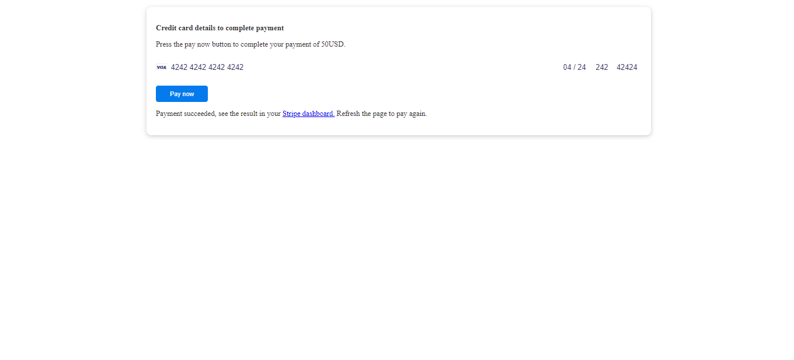

### Getting Started with Stripe in Spring Boot
Stripe is an online payment system that is almost similar to [Paypal](https://www.paypal.com/) and it enables transactions to be processed by leveraging credit cards provided by the customers when buying products online.

In this tutorial, the reader will learn how to integrate stripe into their application by creating a simple web application that collects card details and submits a payment to stripe.

### Table of Contents
- [Prerequisites]()
- [Create a stripe account]()
- [Project set up]()
- [Set up Stripe]()
- [Create a request DTO]()
- [Create a `PaymentIntent`]()
- [Create a `CheckoutForm` model]()
- [Create a model for the product]()
- [Create payment and checkout pages]()
- [Create a controller for the payment]()
- [Test the application]()
- [Conclusion]()

### Prerequisites
- Knowledge in [Spring Boot.](https://spring.io/guides/gs/spring-boot/)
- Knowledge in [Thymeleaf.](https://www.thymeleaf.org/)
- [JDK 11+](https://www.oracle.com/java/technologies/downloads/) installed on your computer.
- [Intellij IDEA](https://www.jetbrains.com/idea/) installed on your computer.

### Create a stripe account
Creating a [stripe account](https://dashboard.stripe.com/register) is required so that we can have access to public and private keys that we will use later to test our application.

When we log in to our stripe account, we will be redirected to the dashboard and this is where we will verify that the payment was successful.

The [API keys](https://dashboard.stripe.com/test/apikeys) section contains our private and public keys and we can differentiate a live key from a test key by checking which characters are prefixed on the keys.

A test key is prefixed with `pk_test_` denoting private key or `sk_test_` denoting secret key and a live key is prefixed with `pk_live_` denoting private key or `sk_live_` denoting secret key.

### Project set up
We will use [Spring Initialzr](https://start.spring.io/) to generate a Spring Boot application with the following dependencies:
- Spring Web
- Thymeleaf
- Spring Boot Dev Tools
- Validation


To ensure the public and private keys are available to the application we add the key contents in the `application.properties` file and then we can inject the values using `@Value` annotation.

The `@Value` annotation is used for expression-driven or property-driven dependency injection.

```properties
stripe.api.key=sk_test_
stripe.public.key=pk_test_

```

### Set up stripe
Setting up stripe requires adding a dependency for the stripe API in POM.xml file for Maven users and the dependency can be obtained from [maven central repository](https://mvnrepository.com/repos/central).

Maven will download the provided stripe API version and add it to the classpath to ensure that it is available during development.

Stripe has a runtime dependency `gson` a JSON library which we will also add to maven to ensure there are no dependency errors that occur when we run the application.

```xml
        <dependency>
            <groupId>com.stripe</groupId>
            <artifactId>stripe-java</artifactId>
            <version>20.77.0</version>
        </dependency>

        <dependency>
            <groupId>com.google.code.gson</groupId>
            <artifactId>gson</artifactId>
        </dependency>

```
Spring Boot uses Jackson by default which is a JSON marshaller and there are edge cases when you have both of them on the classpath.

Make sure to exclude Jackson from the classpath using the following configuration in your POM.xml file.

```xml
        <dependency>
            <groupId>org.springframework.boot</groupId>
            <artifactId>spring-boot-starter-web</artifactId>
            <exclusions>
                <exclusion>
                    <groupId>org.springframework.boot</groupId>
                    <artifactId>spring-boot-starter-json</artifactId>
                </exclusion>
            </exclusions>
        </dependency>
```

### Create a request DTO
This is a DTO that the browser will send to our server.

Create a `CreatePayment` class inside a package named `dto` with fields `amount` and `featureRequest`.

Generate getter and setter methods for the two fields.

```java
import javax.validation.constraints.Min;
import javax.validation.constraints.NotNull;
import javax.validation.constraints.Size;

public class CreatePayment {

    @NotNull
    @Min(4)
    private Integer amount;

    @NotNull
    @Size(min = 5, max = 200)
    private String featureRequest;

    public Integer getAmount() {
        return amount;
    }

    public void setAmount(Integer amount) {
        this.amount = amount;
    }

    public String getFeatureRequest() {
        return featureRequest;
    }

    public void setFeatureRequest(String featureRequest) {
        this.featureRequest = featureRequest;
    }
}
```

`@NotNull` - indicates that the field is required and can not be empty.

`@Min()` - Used to restrict the value provided to a specific minimum value.

`@Size` - provide the range of strings that can be supported by the field by specifying the minimum and maximum values.

### Create a `PaymentIntent`.

A `PaymentIntent` is an object that is used by stripe to record customers' information, tracking charge attempts, and change the state of payment from one stage to another.

The following image shows how a `PaymentIntent` is created and how it tracks the payment from providing card details, attempting payment, and finalizing the payment.


Create a `PaymentController` class inside a package named `controller` and add a post mapping method that has a `/create-payment-intent` endpoint.

The browser calls `/create-payment-intent` endpoint and this endpoint has to call stripe to create the payment intent.

The `PaymentIntentCreateParams` tells stripe the currency to be used, what the product the user wants to buy and how much the product costs using `setCurrency()` and `setAmount()` methods.

```java
import com.example.StripeWithSpringBoot.dto.CreatePayment;
import com.example.StripeWithSpringBoot.dto.CreatePaymentResponse;
import com.stripe.exception.StripeException;
import com.stripe.model.PaymentIntent;
import com.stripe.param.PaymentIntentCreateParams;
import org.springframework.web.bind.annotation.PostMapping;
import org.springframework.web.bind.annotation.RequestBody;
import org.springframework.web.bind.annotation.RestController;

import javax.validation.Valid;

@RestController
public class PaymentController {
    @PostMapping("/create-payment-intent")
    public CreatePaymentResponse createPaymentIntent(@RequestBody @Valid  CreatePayment createPayment)throws StripeException {
        PaymentIntentCreateParams createParams = new
                PaymentIntentCreateParams.Builder()
                .setCurrency("usd")
                .putMetadata("featureRequest", createPayment.getFeatureRequest())
                .setAmount(createPayment.getAmount() * 100L)
                .build();

        PaymentIntent intent = PaymentIntent.create(createParams);
        return new CreatePaymentResponse(intent.getClientSecret());
    }
}
```

### Create a model for the product.
Create a `CheckoutForm` class inside a package named `model` with the field `amount`, `featureRequest`, and `email`.

Generate getter and setter methods for the fields.

This class represents customer details for a particular payment and will be provided during the checkout process.

```java
import javax.validation.constraints.*;

public class CheckoutForm {

    @NotNull
    @Min(4)
    private Integer amount;

    @NotNull
    @Size(min = 5,max = 200)
    private String featureRequest;

    @Email
    private String email;

    public Integer getAmount() {
        return amount;
    }

    public void setAmount(Integer amount) {
        this.amount = amount;
    }

    public String getFeatureRequest() {
        return featureRequest;
    }

    public void setFeatureRequest(String featureRequest) {
        this.featureRequest = featureRequest;
    }

    public String getEmail() {
        return email;
    }

    public void setEmail(String email) {
        this.email = email;
    }
}
```

`@Email` - indicates that this field should only accept a string with an email structure.

### Create payment and checkout pages

First, create a file named `client.js` that we will use to process the request from the customer to the server and response from the server to the browser.

When the user goes to the page a payment intent is created, the payment intent calls stripe, informs the customer wants to pay, and returns a secret key.

Stripe has a javascript library which is called the javascript elements and when you call `elements.create()` on a specific `div` then stripe will insert the component into the div.

The payment happens at the `confirmCardPayment()` method which accepts a customers secret and card and once you submit it everything happens between stripe and the browser and no one ever sees the data.

```javascript
// A reference to Stripe.js initialized with your real test publishable API key.
var stripe = Stripe(stripePublicKey);

// The items the customer wants to buy
var purchase = {
    amount: amount,
    featureRequest: featureRequest
};

// Disable the button until we have Stripe set up on the page
document.querySelector("button").disabled = true;
fetch("/create-payment-intent", {
    method: "POST",
    headers: {
        "Content-Type": "application/json"
    },
    body: JSON.stringify(purchase)
})
    .then(function(result) {
        return result.json();
    })
    .then(function(data) {
        var elements = stripe.elements();

        var style = {
            base: {
                color: "#32325d",
                fontFamily: 'Arial, sans-serif',
                fontSmoothing: "antialiased",
                fontSize: "16px",
                "::placeholder": {
                    color: "#32325d"
                }
            },
            invalid: {
                fontFamily: 'Arial, sans-serif',
                color: "#fa755a",
                iconColor: "#fa755a"
            }
        };

        var card = elements.create("card", { style: style });
        // Stripe injects an iframe into the DOM
        card.mount("#card-element");

        card.on("change", function (event) {
            // Disable the Pay button if there are no card details in the Element
            document.querySelector("button").disabled = event.empty;
            document.querySelector("#card-error").textContent = event.error ? event.error.message : "";
        });

        var form = document.getElementById("payment-form");
        form.addEventListener("submit", function(event) {
            event.preventDefault();
            // Complete payment when the submit button is clicked
            payWithCard(stripe, card, data.clientSecret);
        });
    });

// Calls stripe.confirmCardPayment
// If the card requires authentication Stripe shows a pop-up modal to
// prompt the user to enter authentication details without leaving your page.
var payWithCard = function(stripe, card, clientSecret) {
    loading(true);
    stripe
        .confirmCardPayment(clientSecret, {
            receipt_email: email,
            payment_method: {
                card: card,
                billing_details: {
                    email: email
                }
            }
        })
        .then(function(result) {
            if (result.error) {
                // Show error to your customer
                showError(result.error.message);
            } else {
                // The payment succeeded!
                orderComplete(result.paymentIntent.id);
            }
        });
};

/* ------- UI helpers ------- */

// Shows a success message when the payment is complete
var orderComplete = function(paymentIntentId) {
    loading(false);
    document
        .querySelector(".result-message a")
        .setAttribute(
            "href",
            "https://dashboard.stripe.com/test/payments/" + paymentIntentId
        );
    document.querySelector(".result-message").classList.remove("hidden");
    document.querySelector("button").disabled = true;
};

// Show the customer the error from Stripe if their card fails to charge
var showError = function(errorMsgText) {
    loading(false);
    var errorMsg = document.querySelector("#card-error");
    errorMsg.textContent = errorMsgText;
    setTimeout(function() {
        errorMsg.textContent = "";
    }, 4000);
};

// Show a spinner on payment submission
var loading = function(isLoading) {
    if (isLoading) {
        // Disable the button and show a spinner
        document.querySelector("button").disabled = true;
        document.querySelector("#spinner").classList.remove("hidden");
        document.querySelector("#button-text").classList.add("hidden");
    } else {
        document.querySelector("button").disabled = false;
        document.querySelector("#spinner").classList.add("hidden");
        document.querySelector("#button-text").classList.remove("hidden");
    }
};
```

Create a file named `index.html` under the resources section and we will use this page to display a payment form to the customer.

```html
<!DOCTYPE html>
<html lang="en">
<head>
  <meta charset="utf-8" />
  <title>Accept a card payment</title>
  <meta name="description" content="A demo of a card payment on Stripe" />
  <meta name="viewport" content="width=device-width, initial-scale=1" />

  <link rel="stylesheet" href="global.css" />
  <script src="client.js" defer></script>
</head>

<body>
<!-- Display a payment form -->
<form id="payment-form" th:action="@{/}" th:object="${checkoutForm}" method="post">
  <p><b>Welcome to the transparent stripe integration</b></p>
  <p>Email: <input type="text" th:field="*{email}" placeholder="Email address" required /></p>
  <p th:if="${#fields.hasErrors('email')}" th:errors="*{email}" style="color: red;"></p>
  <p>Amount: <input type="text" th:field="*{amount}" placeholder="Amount" required /></p>
  <p th:if="${#fields.hasErrors('amount')}" th:errors="*{amount}" style="color: red;"></p>
  <p>Feature Request: <input type="text" th:field="*{featureRequest}" placeholder="Feature Request" required /></p>
  <p th:if="${#fields.hasErrors('featureRequest')}" th:errors="*{featureRequest}" style="color: red;"></p>
  <p><input type="submit"></p>
</form>
</body>
</html>
```

Once a customer has filled in all the details and pressed the submit button they will be redirected to a checkout page where they will enter their credit card details and complete payment.

Create a file named `checkout.html` under the resources section which we will use to display a checkout form to the customer.

```html
<!DOCTYPE html>
<html lang="en">
<head>
  <meta charset="utf-8" />
  <title>Accept a card payment</title>
  <meta name="description" content="A demo of a card payment on Stripe" />
  <meta name="viewport" content="width=device-width, initial-scale=1" />

  <link rel="stylesheet" href="global.css" />
  <script src="https://js.stripe.com/v3/"></script>
  <script src="https://polyfill.io/v3/polyfill.min.js?version=3.52.1&features=fetch"></script>
  <script th:inline="javascript">

    /*<![CDATA[*/

    var stripePublicKey = /*[[${stripePublicKey}]]*/ null;
    var amount = /*[[${amount}]]*/ null;
    var email = /*[[${email}]]*/ null;
    var featureRequest = /*[[${featureRequest}]]*/ null;

    /*]]>*/
  </script>
  <script src="client.js" defer></script>
</head>

<body>
<!-- Display a checkout form -->
<form id="payment-form">
  <p><b>Welcome To The Transparent Software Developer</b></p>
  <p>If you hit the pay button, you will be billed <span th:text="${amount}"></span>USD.</p>
  <div id="card-element"><!--Stripe.js injects the Card Element--></div>
  <button id="submit">
    <div class="spinner hidden" id="spinner"></div>
    <span id="button-text">Pay now</span>
  </button>
  <p id="card-error" role="alert"></p>
  <p class="result-message hidden">
    Payment succeeded, see the result in your
    <a href="" target="_blank">Stripe dashboard.</a> Refresh the page to pay again.
  </p>
</form>
</body>
</html>
```

Create a file named `global.css` that we will use to color our payment and checkout pages.

```css
/* Variables */
* {
    box-sizing: border-box;
}

body {
    font-family: -apple-system, BlinkMacSystemFont, sans-serif;
    font-size: 16px;
    -webkit-font-smoothing: antialiased;
    display: flex;
    justify-content: center;
    align-content: center;
    height: 100vh;
    width: 100vw;
}

form {
    width: 30vw;
    min-width: 500px;
    align-self: center;
    box-shadow: 0px 0px 0px 0.5px rgba(50, 50, 93, 0.1),
    0px 2px 5px 0px rgba(50, 50, 93, 0.1), 0px 1px 1.5px 0px rgba(0, 0, 0, 0.07);
    border-radius: 7px;
    padding: 40px;
}

input {
    border-radius: 6px;
    margin-bottom: 6px;
    padding: 12px;
    border: 1px solid rgba(50, 50, 93, 0.1);
    height: 44px;
    font-size: 16px;
    width: 100%;
    background: white;
}

.result-message {
    line-height: 22px;
    font-size: 16px;
}

.result-message a {
    color: rgb(89, 111, 214);
    font-weight: 600;
    text-decoration: none;
}

.hidden {
    display: none;
}

#card-error {
    color: rgb(105, 115, 134);
    text-align: left;
    font-size: 13px;
    line-height: 17px;
    margin-top: 12px;
}

#card-element {
    border-radius: 4px 4px 0 0 ;
    padding: 12px;
    border: 1px solid rgba(50, 50, 93, 0.1);
    height: 44px;
    width: 100%;
    background: white;
}

#payment-request-button {
    margin-bottom: 32px;
}

/* Buttons and links */
button {
    background: #5469d4;
    color: #ffffff;
    font-family: Arial, sans-serif;
    border-radius: 0 0 4px 4px;
    border: 0;
    padding: 12px 16px;
    font-size: 16px;
    font-weight: 600;
    cursor: pointer;
    display: block;
    transition: all 0.2s ease;
    box-shadow: 0px 4px 5.5px 0px rgba(0, 0, 0, 0.07);
    width: 100%;
}
button:hover {
    filter: contrast(115%);
}
button:disabled {
    opacity: 0.5;
    cursor: default;
}

/* spinner/processing state, errors */
.spinner,
.spinner:before,
.spinner:after {
    border-radius: 50%;
}
.spinner {
    color: #ffffff;
    font-size: 22px;
    text-indent: -99999px;
    margin: 0px auto;
    position: relative;
    width: 20px;
    height: 20px;
    box-shadow: inset 0 0 0 2px;
    -webkit-transform: translateZ(0);
    -ms-transform: translateZ(0);
    transform: translateZ(0);
}
.spinner:before,
.spinner:after {
    position: absolute;
    content: "";
}
.spinner:before {
    width: 10.4px;
    height: 20.4px;
    background: #5469d4;
    border-radius: 20.4px 0 0 20.4px;
    top: -0.2px;
    left: -0.2px;
    -webkit-transform-origin: 10.4px 10.2px;
    transform-origin: 10.4px 10.2px;
    -webkit-animation: loading 2s infinite ease 1.5s;
    animation: loading 2s infinite ease 1.5s;
}
.spinner:after {
    width: 10.4px;
    height: 10.2px;
    background: #5469d4;
    border-radius: 0 10.2px 10.2px 0;
    top: -0.1px;
    left: 10.2px;
    -webkit-transform-origin: 0px 10.2px;
    transform-origin: 0px 10.2px;
    -webkit-animation: loading 2s infinite ease;
    animation: loading 2s infinite ease;
}

@-webkit-keyframes loading {
    0% {
        -webkit-transform: rotate(0deg);
        transform: rotate(0deg);
    }
    100% {
        -webkit-transform: rotate(360deg);
        transform: rotate(360deg);
    }
}
@keyframes loading {
    0% {
        -webkit-transform: rotate(0deg);
        transform: rotate(0deg);
    }
    100% {
        -webkit-transform: rotate(360deg);
        transform: rotate(360deg);
    }
}

@media only screen and (max-width: 600px) {
    form {
        width: 80vw;
    }
}
```

### Create a controller for the payment

Create a `WebController` class inside the `controller` package and inject the stripe public key using `@Value` annotation.

Add a method that returns the payment form when the customer issues a request to the `/` endpoint.

Create another method that will return the checkout page after entering the payment details and hitting the submit button.

```java
import com.example.StripeWithSpringBoot.model.CheckoutForm;
import org.springframework.beans.factory.annotation.Value;
import org.springframework.stereotype.Controller;
import org.springframework.ui.Model;
import org.springframework.validation.BindingResult;
import org.springframework.web.bind.annotation.GetMapping;
import org.springframework.web.bind.annotation.ModelAttribute;
import org.springframework.web.bind.annotation.PostMapping;

import javax.validation.Valid;

@Controller
public class WebController {

    @Value("${stripe.public.key}")
    private String stripePublicKey;

    @GetMapping("/")
    public String home(Model model){
        model.addAttribute("checkoutForm",new CheckoutForm());
        return "index";
    }

    @PostMapping("/")
    public String checkout(@ModelAttribute
                                       @Valid CheckoutForm checkoutForm,
                           BindingResult bindingResult,
                           Model model){
        if (bindingResult.hasErrors()){
            return "index";
        }

        model.addAttribute("stripePublicKey",stripePublicKey);
        model.addAttribute("amount",checkoutForm.getAmount());
        model.addAttribute("email", checkoutForm.getEmail());
        model.addAttribute("featureRequest", checkoutForm.getFeatureRequest());
        return "checkout";
    }
}
```
### Test the integration
Stripe provides several test numbers that we can use to test the payment and in this tutorial, we will make use of `4242 4242 4242 4242` which is a Visa card number.

Provide any `3` digits for the CVC and any future date for the date field.

When we run the application and navigate to `localhost:8080`, the following payment page is displayed to the browser.


When we enter all the input fields and press the submit button we will be redirected to the checkout page where we enter the payment details.

Enter `4242 4242 4242 4242` as the test card number, any three CVC numbers, and any future date, and press the submit button.



When you press the pay now button the payment will be processed successfully and a link to our stripe dashboard will be added to the form.

The Stripe dashboard displays the amount of money that was paid, the date, customer, and the payment method as shown in the following image.


### Conclusion
In this tutorial, we have learned how to integrate stripe in a Spring Boot application by leveraging stripe payment intent that ensures at least one payment is made for each transaction.

In the next tutorial, we will learn how we can store the details returned by stripe to our database by creating a webhook that contains the details.


