Svelte is the shiny new framework for frontend developers. It seems to do a whole lot different than other frameworks. In this article, we'll be looking at how we can use Svelte to build a simple web application.

<!--more-->

### Table of contents

1. [Prerequisites](#prerequisites)

2. [Introduction](#introduction)

3. [Setting Up Firebase](#firebase)

4. [Building the Frontend with Svelte](#building-frontend)

5. [Conclusion](#conclusion)

6. [References](#references)

### Prerequisites

- A proper grasp of Javascript and its ecosystem
- Node v14 or higher
- A Node Package Manager (npm or yarn)

### Introduction

Svelte is a new Javascript Framework (actually a compiler) created by Rich Harris.  It has brought about a radical change in how to go about editing the DOM(Document Object Module).

Svelte runs at build time and spits out imperative code that updates the DOM. This eliminates the need for a Virtual DOM used in other frameworks. It also has features like 'scoped styling' and 'reactive assignment'. Furthermore, Svelte also has 'stores' to help to store state.

### Setting Up Firebase

#### Creating the project

- If you don't have a Google Account, you can go ahead to create one and sign in.

- Head over to the Firebase [homepage](https://firebase.google.com/) and click the 'Go To Console' button.


On the console, create a new project by clicking the '+' icon and give it whatever name you desire.

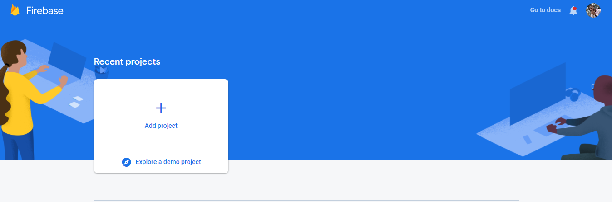

I'll call mine 'svelte-todo' and uncheck Google Analytics as we won't be needing it.

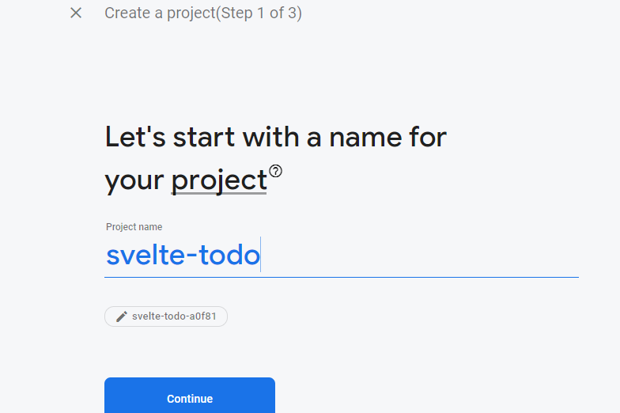

#### Setting up Google OAuth

We have to create an app for the platform we're building. Click on the web icon.

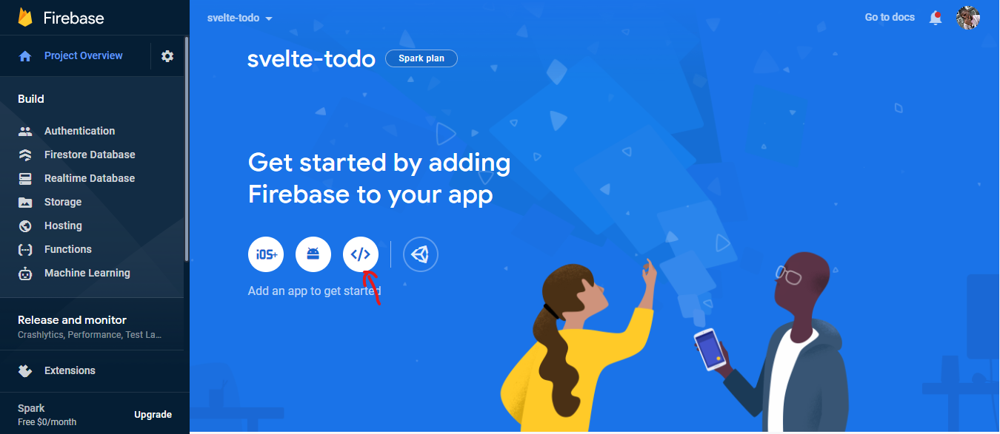

After registering the app with your nickname of choice, you'd see this:

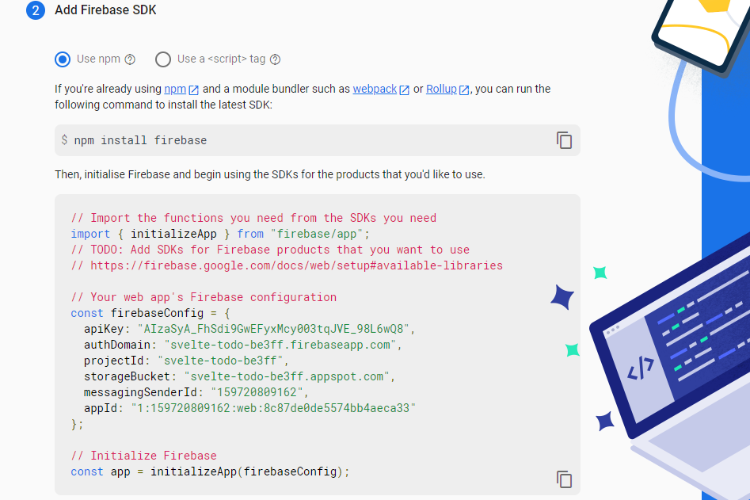

Copy the firebaseConfig object as we'll be using it later. DO NOT attempt to use the variables in the picture as they would have been deleted.

Back on the console, Click on Authentication in the sidebar.

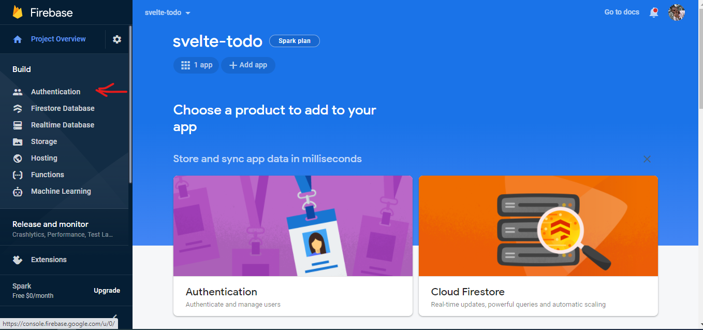

Click on 'Get Started' and select Google as your auth provider.

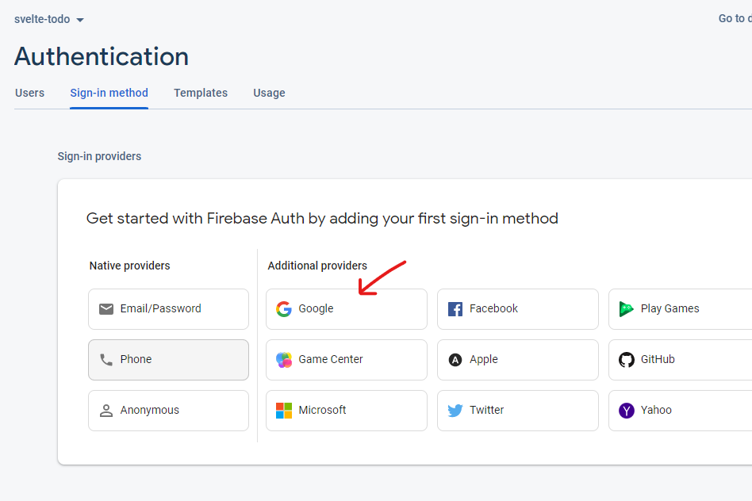

Enable the provider, choose your support email and click 'Save'.

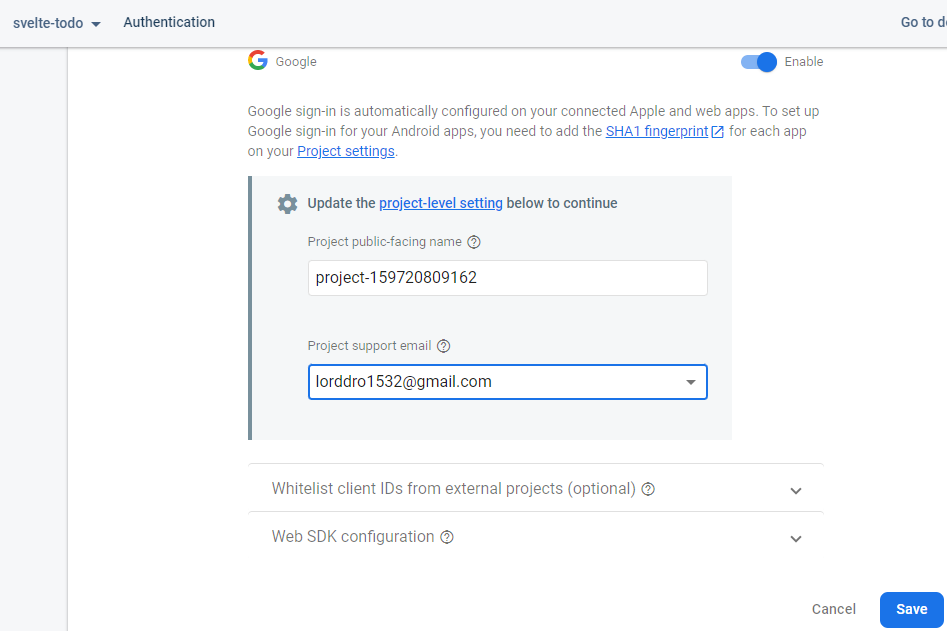

#### Setting up Firestore

To set up Firestore, head back to the console homepage and click on 'Cloud Firestore'

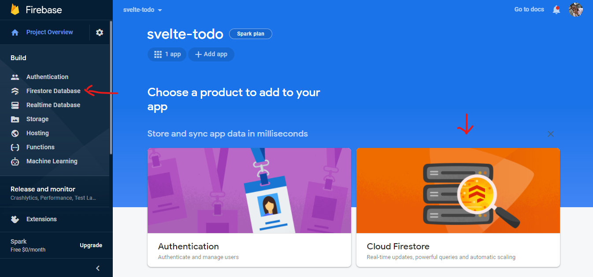

Click on 'Create Database', set it to 'Test Mode' and leave the location as is.

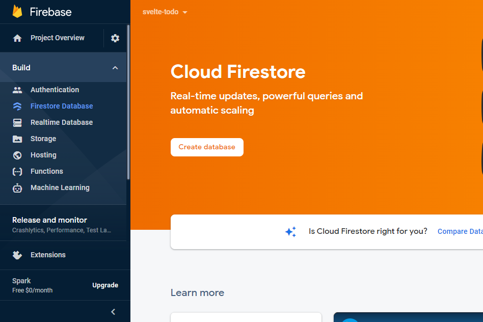

At this point, Firestore should be enabled for your project. You can add collections or documents from here to play around with it.

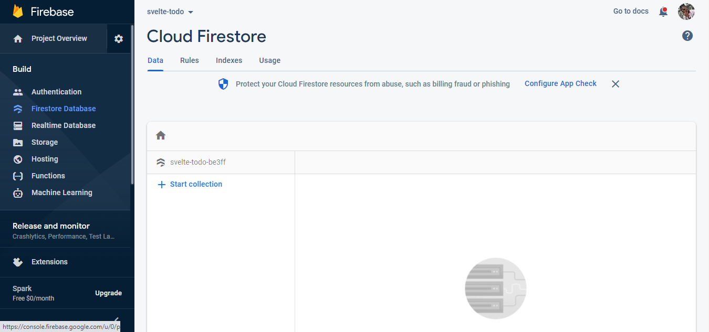

### Building the frontend with Svelte

To create a Svelte project, run

```terminal
npx degit sveltejs/template [PROJECT-NAME]
```

then run

```terminal
cd [PROJECT-NAME]
```

to enter into that directory.

 This creates a basic Svelte project for us from this [template](https://github.com/sveltejs/template). We still have to install the packages that come with the template though. We can use either yarn or npm for this but I'll use yarn.

Run

```terminal
yarn
```

to install packages, then run

```terminal
yarn dev
```

to start the server.

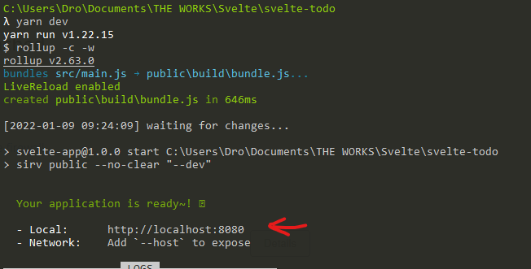

Head to the URL specified on 'Local' and you'd see your Svelte application running.

#### Enabling SCSS in the project

To do this, we have to install some new packages to help us parse SCSS. Run

```terminal
yarn add -D node-sass svelte-preprocess
```

Edit the `rollup.config.js` file in the root of the directory to look like so:

```js
import svelte from "rollup-plugin-svelte";
import commonjs from "@rollup/plugin-commonjs";
import resolve from "@rollup/plugin-node-resolve";
import livereload from "rollup-plugin-livereload";
import { terser } from "rollup-plugin-terser";
import css from "rollup-plugin-css-only";

//NEW LINE HERE
import preprocess from "svelte-preprocess";

const production = !process.env.ROLLUP_WATCH;

//CODE OMITTED FOR BREVITY

export default {
  input: "src/main.js",
  output: {
    sourcemap: true,
    format: "iife",
    name: "app",
    file: "public/build/bundle.js",
  },
  plugins: [
    svelte({
      //NEW LINE HERE
      preprocess: preprocess(),
      compilerOptions: {
        dev: !production,
      },
    }),
    css({ output: "bundle.css" }),
    
    //CODE OMITTED FOR BREVITY
    

```

To test if SCSS works, go into the `App.svelte` file and paste the below:

```js
<script>
  export let name;
</script>

<main>
  <h1>Hello {name}!</h1>
  <p>
    Visit the <a href="https://svelte.dev/tutorial">Svelte tutorial</a> to learn
    how to build Svelte apps.
  </p>
</main>

<style lang="scss">
  main {
    text-align: center;
    padding: 1em;
    max-width: 240px;
    margin: 0 auto;
    h1 {
      color: #1900ff;
      text-transform: uppercase;
      font-size: 4em;
      font-weight: 100;
    }
  }

  @media (min-width: 640px) {
    main {
      max-width: none;
    }
  }
</style>

```

I'm sure you're already wondering how this file works. Well, Svelte expects each component to have three sections:

- The Script: It is represented by the `<script></script>` tag and contains most javascript related functionalities.
- The Component Body: This is the main part of our component. It includes the HTML and dictates what is to be displayed.
- The Component Styles: It is represented by the `<style></style>` tag and contains our styling code. In our case, we're using SCSS so we set the lang attribute on the style tag to `scss`.

Our component is to accept a prop called `name` from its parent. `export let name` achieves this functionality for us. We can accept as many props as we want.

In the component body, we can display any of the variables in our script by wrapping them in curly braces.

Now that we understand the component, you can start the server again by running

```terminal
yarn dev
```

and you should see this:

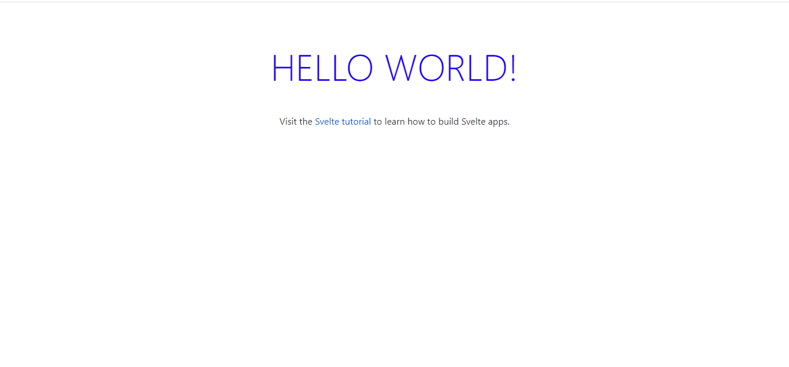

#### Enabling Routing with page.js

Since we're building an app that has users, we'll need a page to log in and another to add/view your todos. In the `src` folder, create a folder `pages` and add `home.svelte` and `login.svelte` into it.
The folder structure should look like this:

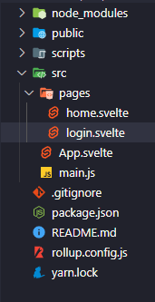

We're going to use a package called `page`. Run

```terminal
yarn add page
```

to install it and open `package.json` when it's done installing. Change the `start` script to

```g
"start": "sirv public --single"
```

Finally, go into the `App.svelte` file and paste the below.

```js
<script>
  import router from "page";
  import Home from "./pages/home.svelte";
  import Login from "./pages/login.svelte";
  
  let page;
  
  router("/", () => page = Home);
  
  router("/login", () => page = Login);
  
  router.start();
</script>
  
<svelte:component this={page} />
```

We're importing the router, adding our different routes and starting the router. Our pages are empty but before adding their content, we need to set up our store. In the `src` folder, create a `stores.js`file and paste the following into it:

```js
import { writable } from "svelte/store";

export const TodoStore = writable([]);

export const UserStore = writable(null);

```

`writable` helps us create a store that we can edit down the line. We then create 2 new stores, a `TodoStore` and a `UserStore` to hold the list of todos and the user's details respectively. All `writable` stores have 2 main methods:

- Set: To set the value of the store.
- Update: To update the value of the store based on a callback function.

Open the `login.svelte` file and paste:

```js
<script>
  import { UserStore } from "./../stores";
  import page from "page";

  $: if ($UserStore) page.redirect("/");
</script>

<div class="login container">
  <button>Log In</button>;
</div>

<style lang="scss">
  div.login.container {
    background: hsla(238, 100%, 71%, 1);

    background: linear-gradient(
      135deg,
      hsla(238, 100%, 71%, 1) 0%,
      hsla(295, 100%, 84%, 1) 100%
    );

    background: -moz-linear-gradient(
      135deg,
      hsla(238, 100%, 71%, 1) 0%,
      hsla(295, 100%, 84%, 1) 100%
    );

    background: -webkit-linear-gradient(
      135deg,
      hsla(238, 100%, 71%, 1) 0%,
      hsla(295, 100%, 84%, 1) 100%
    );
    min-height: 100vh;
    display: flex;
    justify-content: center;
    align-items: center;
    position: relative;
    button {
      background-color: hsla(350, 100%, 69%, 1);
      height: 200px;
      width: 200px;
      box-shadow: -10px -10px 15px rgb(255, 119, 142),
        10px 10px 15px rgb(231, 88, 112);
      border: none;
      border-radius: 50%;
      border: 8px solid hsla(350, 100%, 69%, 1);
      font-weight: bold;
      color: white;
      font-size: 2rem;
      &:focus {
        box-shadow: -10px -10px 15px rgb(255, 119, 142),
          10px 10px 15px rgb(231, 88, 112),
          inset -10px -10px 15px rgb(255, 119, 142),
          inset 10px 10px 15px rgb(231, 88, 112);
      }
    }
  }
</style>
```

Here, we're displaying a large centred button, that will log the user in when clicked. The `$UserStore` is used to access the value inside of the store.

In Svelte, statements written after `$:` like so `$: if ($UserStore) page.redirect("/")` are called `Reactive Statements`. They are run before a component updates if the values they depend on have changed. The \$ in `$UserStore` and `Reactive Statements` do not have the same function.

The reactive statement in our component checks if the `$UserStore` has a value i.e if we have a user currently logged in and redirects to the homepage if it does.

Paste this in the `home.svelte` file:

```js
<script>
  import EditTodo from "../components/edit-todo.svelte";
  import ViewTodos from "../components/view-todos.svelte";
  import Header from "./../components/header.svelte";
  import { UserStore } from "./../stores";
  import page from "page";

  $: if (!$UserStore) page.redirect("/login");
</script>

<section class="home">
  <div class="wrapper">
    <Header />
    <EditTodo />
    <ViewTodos />
  </div>
</section>

<style>
  section.home {
    display: flex;
    justify-content: center;
    align-items: center;
  }
  div.wrapper {
    width: 100%;
    max-width: 800px;
  }
</style>
```

This component is fairly short as it's purpose is to house all our other components. It also has a reactive statement that works similarly to the one in the `login` component. We simply check if there's no user currently logged in, and redirect to the `login` page if it holds true.

The components imported in the `home` page have not yet been built so let's go ahead and build them. Create a `components` folder in the `src` folder and add `edit-todo.svelte`, `header.svelte`, and `view-todos.svelte` into it.

Open the `edit-todo.svelte` file and paste this too:

```js
<script>
    let name = "";
    let priority = "1";
  
    const submitTodo = () => {
      const newTodo = {
        priority,
        name,
        completed: false,
      };
      console.log('Submit Todo', newTodo)
    };
  </script>
  
  <form>
    <header>Add New Todo</header>
  
    <label for="name">
      Todo Name
      <input bind:value={name} id="name" type="text" />
    </label>
  
    <label for="priority">
      Todo Priority
      <input
        bind:value={priority}
        id="priority"
        min="1"
        step="1"
        max="5"
        type="range"
      />
    </label>
  
    <button on:click|preventDefault={submitTodo}>Add Todo</button>
  </form>
  
  <style lang="scss">
    form {
      background: #fff;
      border-bottom-left-radius: 2rem;
      border-bottom-right-radius: 2rem;
      padding: 2rem 4rem;
      header {
        font-size: 2rem;
        text-align: center;
        font-weight: bold;
        margin-bottom: 1rem;
      }
      label {
        font-size: 1.4rem;
        margin-bottom: 1rem;
        display: block;
        input {
          display: block;
          width: 100%;
          margin-top: 0.5rem;
          border-radius: 1rem;
        }
        &:nth-child(2) {
          input {
            padding: 0.5rem;
          }
        }
      }
      button {
        padding: 1rem;
        border: none;
        background: #f2f9ff;
        font-size: 1.4rem;
        border-radius: 5px;
        margin-top: 1rem;
        border: solid 1px #ccc;
        position: relative;
        left: 50%;
        transform: translateX(-50%);
      }
    }
  </style>
```

In this component, we display a form that enables users to create todos by entering the name of the todo and its priority. You'll notice `bind:value` in both inputs. It is called a `directive` and it attaches the current value of that input to the variable specified.

The button in the form has a property `on:click|preventDefault`. This is also a `directive` but it has a `modifier` as well. Modifiers simply customize the directive we're currently using. `on:click` is a directive that helps us attach our click event handler to the button. The `|` is used to add modifiers and the `preventDefault` modifier calls the `event.preventDefault()` method for us before calling the event handler.

The `submitTodo` function currently logs out the todo we have created. We'll connect it to Firestore soon.

Open the `header.svelte` file and paste:

```js
<script>
  import { UserStore } from "./../stores";
</script>

<header>
  {#if $UserStore}
    
    <p>Welcome, {$UserStore.displayName.split(" ")[0]}</p>
  {/if}
  <button> Log Out </button>
</header>

<style lang="scss">
  header {
    width: 100%;
    background-color: lightsteelblue;
    display: flex;
    justify-content: space-between;
    align-items: center;
    padding: 1rem;
    & > img {
      height: 6rem;
      width: 6rem;
      border-radius: 50%;
    }
    & > p {
      font-size: 2rem;
      text-align: center;
    }
    & > button {
      font-size: 1.5rem;
      border: none;
      padding: 1rem;
      background-color: rgba(255, 0, 0, 0.5);
      color: white;
      border-radius: 0.5rem;
    }
  }
</style>
```

The `header` component simply shows the name and image of the current user as well as the log out button.

Lastly, we have the `view-todos` component that displays all the todos. Open the file and paste the following:

```js
<script>
  import TodoItem from "./todo-item.svelte";
  import { TodoStore } from "./../stores";
  let activeTab = "incomplete";

  $: incompleteTodos = $TodoStore
    .filter((todo) => !todo.completed)
    .sort((todoA, todoB) => todoB.priority - todoA.priority);
  $: completeTodos = $TodoStore.filter((todo) => todo.completed);
</script>

<main>
  <header>
    <button
      on:click={() => (activeTab = "incomplete")}
      class:active={activeTab === "incomplete"}
      >Current Todos ({incompleteTodos.length})</button
    >
    <button
      on:click={() => (activeTab = "complete")}
      class:active={activeTab === "complete"}
      >Completed Todos ({completeTodos.length})</button
    >
  </header>
  <div class="todos">
    {#if activeTab === "incomplete"}
      {#each incompleteTodos as todo (todo.id)}
        <TodoItem {todo} />
      {/each}
    {:else}
      {#each completeTodos as todo (todo.id)}
        <TodoItem {todo} />
      {/each}
    {/if}
  </div>
</main>

<style lang="scss">
  main {
    header {
      display: flex;
      justify-content: space-between;
      padding: 2rem;
      button {
        background: none;
        border: none;
        font-size: 1.4rem;
        padding-bottom: 0.5rem;
        &.active {
          border-bottom: solid 1px #333;
        }
      }
    }
    .todos {
      padding: 1rem 2rem;
    }
  }
</style>

```

The two reactive statements in this component help us generate arrays for the 'completed' and 'incompleted' todos. We sort the 'incompleted' todos based on priority but leave the 'completed' as is. We then keep track of the current tab we're on and display the right todos based on that.

We do this with the `{#if CONDITION}` which displays a component depending on the condition. We also use `{#each ARRAY as ARRAY_ITEM (ITEM_ID)}` to help us display a component for each item in an array. Both of them have to be closed though with matching `{/if}` and `{/each}` respectively. We come across another directive, `class:active` which adds a class to the element depending on the condition.

We imported one more component, `TodoItem`.
Create a new file in the `components` folder called `todo-item.svelte` and paste the following into the file:

```js
<script>
  export let todo = null;
  import TickIcon from "./../assets/tick.svg";
  import CancelIcon from "./../assets/cancel.svg";
  import StarIcon from "./../assets/star.svg";

  $: ratings = new Array(todo.priority);
</script>

<div class="todo">
  <button>
    {#if todo.completed}
      <CancelIcon width="100%" fill="#fff" />
    {:else}
      <TickIcon width="100%" fill="#fff" />
    {/if}
  </button>
  <div class="info">
    <p class:cancel={todo.completed}>{todo.name}</p>
    <div class="stars">
      {#each ratings as _}
        <StarIcon width="20px" />
      {/each}
    </div>
  </div>
</div>

<style lang="scss">
  .todo {
    display: flex;
    align-items: center;
    width: 100%;
    &:not(:last-child) {
      margin-bottom: 10px;
    }
    button {
      width: 40px;
      height: 40px;
      display: flex;
      justify-content: center;
      align-items: center;
      border-radius: 50%;
      padding: 1rem;
      border: none;
      background: #1890ff;
      margin-right: 1rem;
    }
    .info {
      p {
        font-size: 1.4rem;
        margin-bottom: 0.5rem;
        &.cancel {
          text-decoration: line-through;
        }
      }
    }
  }
</style>
```

This component takes a `todo` as a prop and renders its name as well as stars to represent its priority. It also has a button that marks its `complete` or `incomplete` state.

There's just one issue, Svelte cannot import `.svg` files by itself. We need to add packages to help us do that. Run

```terminal
yarn add -D rollup-plugin-svelte-svg
```

 and replace the `rollup.config.js` file with this:

```js
//CODE OMITTED FOR BREVITY
import css from "rollup-plugin-css-only";

//NEW LINE HERE
import { svelteSVG } from "rollup-plugin-svelte-svg";


//CODE OMITTED FOR BREVITY
  plugins: [
    //NEW LINE HERE
    svelteSVG({
      svgo: {},
    }),
    svelte({
      preprocess: preprocess(),
      compilerOptions: {
        dev: !production,
      },
    }),
//CODE OMITTED FOR BREVITY
    
```

Running

```terminal
  yarn dev
```

would still throw an error as we currently have no assets to import. 

Create a folder named `assets` in the `src` directory and paste these three files:

- cancel.svg
  
  ```svg
  <?xml version="1.0" ?><svg viewBox="0 0 32 32" xmlns="http://www.w3.org/2000/svg"><defs><style>.cls-1{fill:none;}</style></defs><title/><g data-name="Layer 2" id="Layer_2"><path d="M4,29a1,1,0,0,1-.71-.29,1,1,0,0,1,0-1.42l24-24a1,1,0,1,1,1.42,1.42l-24,24A1,1,0,0,1,4,29Z"/><path d="M28,29a1,1,0,0,1-.71-.29l-24-24A1,1,0,0,1,4.71,3.29l24,24a1,1,0,0,1,0,1.42A1,1,0,0,1,28,29Z"/></g><g id="frame"><rect class="cls-1" height="32" width="32"/></g></svg>
  ```

- star.svg
  
  ```svg
  <?xml version="1.0" encoding="UTF-8"?><svg enable-background="new 0 0 47.94 47.94" version="1.1" viewBox="0 0 47.94 47.94" xml:space="preserve" xmlns="http://www.w3.org/2000/svg"><path d="m26.285 2.486 5.407 10.956c0.376 0.762 1.103 1.29 1.944 1.412l12.091 1.757c2.118 0.308 2.963 2.91 1.431 4.403l-8.749 8.528c-0.608 0.593-0.886 1.448-0.742 2.285l2.065 12.042c0.362 2.109-1.852 3.717-3.746 2.722l-10.814-5.685c-0.752-0.395-1.651-0.395-2.403 0l-10.814 5.685c-1.894 0.996-4.108-0.613-3.746-2.722l2.065-12.042c0.144-0.837-0.134-1.692-0.742-2.285l-8.749-8.528c-1.532-1.494-0.687-4.096 1.431-4.403l12.091-1.757c0.841-0.122 1.568-0.65 1.944-1.412l5.407-10.956c0.946-1.919 3.682-1.919 4.629 0z" fill="#ED8A19"/></svg>
  ```

- tick.svg
  
  ```svg
  <?xml version="1.0" ?><svg id="Layer_1" style="enable-background:new 0 0 50 50;" version="1.1" viewBox="0 0 50 50" xml:space="preserve" fill='#fff' xmlns="http://www.w3.org/2000/svg" xmlns:xlink="http://www.w3.org/1999/xlink"><g id="Layer_1_1_"><polygon points="47.293,6.94 14,40.232 2.707,28.94 1.293,30.353 14,43.06 48.707,8.353  "/></g></svg>
  ```

We should be error-free now but on running it, the styling might look a bit off. Replace the `global.css` file in the `public/build` directory with:

```css
html,
body {
  position: relative;
  width: 100%;
  height: 100%;
  font-size: 10px;
}

* {
  margin: 0;
  padding: 0;
  box-sizing: border-box;
}

body {
  color: #333;
  margin: 0;
  box-sizing: border-box;
  font-family: Verdana, -apple-system, BlinkMacSystemFont, "Segoe UI", Roboto,
    Oxygen-Sans, Ubuntu, Cantarell, "Helvetica Neue", sans-serif;
}

a,
button {
  cursor: pointer;
}

input,
button,
select,
textarea {
  font-family: inherit;
  font-size: inherit;
  border: 1px solid #ccc;
}
```

Let's test out our current setup before hooking up Firebase. Head back to the `stores.js` file so we can add some initial data.

```js
import { writable } from "svelte/store";

export const TodoStore = writable([
  {
    completed: false,
    id: 0,
    name: "Read my books",
    priority: 3,
    user: "IBle5KaZruTFAobDKLIqpOksKZ23",
  },
  {
    completed: false,
    id: 1,
    name: "Cut my hair",
    priority: 2,
    user: "IBle5KaZruTFAobDKLIqpOksKZ23",
  },
  {
    completed: true,
    id: 2,
    name: "Write the article",
    priority: 3,
    user: "IBle5KaZruTFAobDKLIqpOksKZ23",
  },
]);

export const UserStore = writable({
  displayName: "Seun Taiwo",
  email: "lorddro1532@gmail.com",
  phoneNumber: null,
  photoURL:
    "https://lh3.googleusercontent.com/a-/AOh14GjhCUWFu5BpCrEK3t2TWml7mvmhTGBM5ROPf7NTWA=s96-c",
  uid: "IBle5KaZruTFAobDKLIqpOksKZ23",
});

```

Now, we should get something like this:

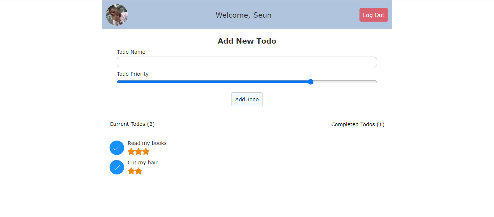

#### Connecting the frontend with Firebase

We need to add our Firebase Configuration variables to the project.  Recall we got them earlier from the Firebase Console. We can't add the variables into the project though because they're to be kept secret. We use environmental variables instead to keep them. Create a file in the root of the project, name it `.env` and add it to your `.gitignore` file.

Put your configuration variables into this file like so:

```js
FIREBASE_API_KEY="YOUR_API_KEY"
FIREBASE_AUTH_DOMAIN='YOUR_AUTH_DOMAIN'
PROJECT_ID='YOUR_PROJECT_ID'
STORAGE_BUCKET='YOUR_STORAGE_BUCKET'
MESSAGING_SENDER_ID='YOUR_MESSAGING_SENDER_ID'
APP_ID='YOUR_APP_ID'
```

In the `src` folder, add a folder named `services` and add a file named `firebase.js` into it. Paste this into the file.

```js
import { initializeApp } from "firebase/app";
import {
  getAuth,
  signInWithPopup,
  GoogleAuthProvider,
  signOut,
} from "firebase/auth";
import {
  getFirestore,
  collection,
  addDoc,
  getDocs,
  doc,
  updateDoc,
  query,
  where,
} from "firebase/firestore";
import { TodoStore } from "./../stores";

let env = env_var;
env = env.env;

const firebaseConfig = {
  apiKey: env.FIREBASE_API_KEY,
  authDomain: env.FIREBASE_AUTH_DOMAIN,
  projectId: env.PROJECT_ID,
  storageBucket: env.STORAGE_BUCKET,
  messagingSenderId: env.MESSAGING_SENDER_ID,
  appId: env.APP_ID,
};

initializeApp(firebaseConfig);

export const provider = new GoogleAuthProvider();
provider.setCustomParameters({ prompt: "select_account" });

const auth = getAuth();
export const signInWithGoogle = () => signInWithPopup(auth, provider);
export const logOut = () => signOut(auth);

export const db = getFirestore();

export const addTodo = async (todo, uid) => {
  try {
    let newTodo = {
      ...todo,
      user: uid,
    };
    const { id } = await addDoc(collection(db, "todos"), newTodo);
    newTodo.id = id;
    TodoStore.update((current) => [newTodo, ...current]);
  } catch (e) {
    console.error("Error adding document: ", e);
  }
};

export const getTodos = async (uid) => {
  if (!uid) return;
  const q = query(collection(db, "todos"), where("user", "==", uid));
  const querySnapshot = await getDocs(q);
  const docs = [];
  querySnapshot.forEach((doc) =>
    docs.push({
      id: doc.id,
      ...doc.data(),
    })
  );
  TodoStore.set(docs);
};

export const markTodo = async (completed, id) => {
  await updateDoc(doc(db, "todos", id), {
    completed,
  });
  TodoStore.update((current) => {
    let todoIdx = current.findIndex((todo) => todo.id === id);
    current[todoIdx].completed = completed;
    return [...current];
  });
};
```

We do 2 important things in this file:

1. We initialize Firebase with our configuration variables.
2. We export all the utility functions we'll be using in the components.

- The `signInWithGoogle` and `logOut` function do exactly what their names imply.
- The `addTodo` function stores the `todo` it receives as an argument to Firestore and adds it to our local store as well.
- The `markTodo` function updates the `completed` state of a `todo` locally and on Firestore.
- The `getTodos` function is called to fetch all the todos from Firestore and save it in our `TodoStore`

We have to add our environmental variables into the project so we can access it. Install the packages that enable us do that by running 

```terminal
yarn add -D @rollup/plugin-replace & yarn add dotenv
```

We also need access to the Firebase SDK. Install that by running 

```terminal
yarn add firebase
```

Then update your `rollup.config.js` to:

```js
//CODE OMITTED FOR BREVITY
import { svelteSVG } from "rollup-plugin-svelte-svg";
//NEW LINE HERE
import replace from "@rollup/plugin-replace";
import { config } from "dotenv";

//CODE OMITTED FOR BREVITY

  plugins: [
    //NEW LINE HERE
    replace({
      env_var: JSON.stringify({
        env: {
          isProd: production,
          ...config().parsed,
        },
      }),
    }),
    svelteSVG({
      svgo: {},
    }),
  
//CODE OMITTED FOR BREVITY

```

Firebase should be set up properly by now. We just have to add Firebase functionalities into the components.

- `login.svelte`
  
  ```js
  <script>
    import { signInWithGoogle } from "./../services/firebase";
    import { UserStore } from "./../stores";
    import page from "page";

    $: if ($UserStore) page.redirect("/");
  </script>

  <div class="login container">
    <button on:click={signInWithGoogle}>Log In</button>;
  </div>
  ```

  With this, we can now sign into the app with our Google Account.

- `todo-item.svelte`
  
  ```js
    <script>
      export let todo = null;
      import TickIcon from "./../assets/tick.svg";
      import CancelIcon from "./../assets/cancel.svg";
      import StarIcon from "./../assets/star.svg";
      import { markTodo } from "./../services/firebase";

      $: ratings = new Array(todo.priority);
    </script>

    <div class="todo">
      <button on:click={() => markTodo(!todo.completed, todo.id)}>
        {#if todo.completed}
          <CancelIcon width="100%" fill="#fff" />
        {:else}
          <TickIcon width="100%" fill="#fff" />
        {/if}
      </button>
      <div class="info">
        <p class:cancel={todo.completed}>{todo.name}</p>
        <div class="stars">
          {#each ratings as _}
            <StarIcon width="20px" />
          {/each}
        </div>
      </div>
    </div>
  ```

  We've updated the button to call the markTodo function and pass the right arguments.

- `header.svelte`
  
  ```js
  <script>
    import { logOut } from "./../services/firebase";
    import { UserStore } from "./../stores";
  </script>

  <header>
    {#if $UserStore}
      
      <p>Welcome, {$UserStore.displayName.split(" ")[0]}</p>
    {/if}
    <button on:click={logOut}> Log Out </button>
  </header>
  ```

  The 'Log Out' button can now log users out.

- `edit-todo.svelte`
  
  ```js
    <script>
      import { UserStore } from "./../stores";
      import { addTodo } from "./../services/firebase";
    
      let name = "";
      let priority = "1";
    
      const submitTodo = () => {
        const newTodo = {
          priority,
          name,
          completed: false,
        };
        name = ''
        priority = '1'
        addTodo(newTodo, $UserStore.uid);
      };
    
    </script>
    
    <form>
      <header>Add New Todo</header>
    
      <label for="name">
        Todo Name
        <input bind:value={name} id="name" type="text" />
      </label>
    
      <label for="priority">
        Todo Priority
        <input
          bind:value={priority}
          id="priority"
          min="1"
          step="1"
          max="5"
          type="range"
        />
      </label>
    
      <button on:click|preventDefault={submitTodo}>Add Todo</button>
    </form>
  ```

  This updates the button so it can call the addTodo function now.

- `App.svelte`
  
  ```js
    <script>
      import router from "page";
      import Home from "./pages/home.svelte";
      import Login from "./pages/login.svelte";
      import { getAuth, onAuthStateChanged } from "firebase/auth";
      import { UserStore } from "./stores";
      import { onMount } from "svelte";
      import { getTodos } from "./services/firebase";

      const auth = getAuth();
      onMount(async () => {
        onAuthStateChanged(auth, async (user) => {
          if (user) {
            UserStore.set(user);
            getTodos(user.uid);
          } else {
            UserStore.set(user);
            getTodos(user.uid);
            console.log("User signed out");
          }
        });
      });

      let page;

      router("/", (ctx, next) => (page = Home));

      router("/login", (ctx, next) => (page = Login));

      router.start();
    </script>

    <svelte:component this={page} />

  ```

We call the `onMount` function to help us run a function after a component has been mounted. The `onAuthStateChanged` function calls its callback whenever the user state changes. We then update the `UserStore` based on the value we receive.
  
Clear the stores in the `stores.js` file so Firebase can take over and !Voila! we're done.

### Conclusion

In this article, we created a Todo List using Svelte and Firebase. We went through some of the basics of Svelte and how to integrate it with Firebase. You can view the completed project [here](https://github.com/dro-1/svelte-todo). To ensure you've fully grasped the concepts covered in this tutorial, try adding your own features to the app like making the `todos` editable, or deletable.
