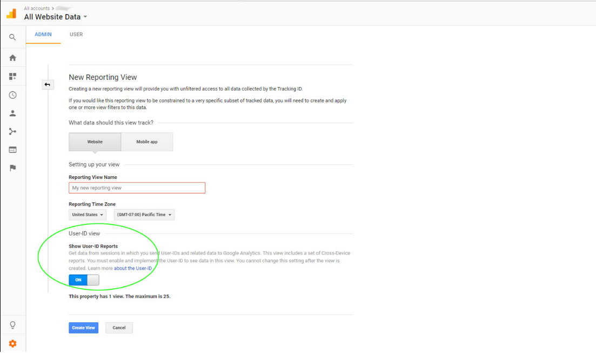

### Introduction
As a rule, Google Analytics gives total insights. It gives us gigantic capacity and experiences into the site traffic. Lets attempt to respond to the inquiry: Is it truly conceivable to follow individual clients in Google Analytics? The reaction is a major Yes,and that is possible if you happen to have a client authentication web application.some gatherings guarantee that it is preposterous. 
Assumming that,in your web application you have a shopping basket where your enrolled clients can sign in and utilize the application. In such a situation Google Analytics can be utilized to gauge and track the individual signed in clients. What's more, we will perceive how to execute it in this article. 
### Table of content
- [Introduction](#introduction)
- [Table of content](#table-of-content)
- [Login Google Analytics and afterward make an Account](#login-google-analytics-and-afterward-make-an-account)
- [Make Property](#make-property)
- [Make View with User-ID empowered](#make-view-with-user-id-empowered)
- [Make Custom Dimensions to Track User Types](#make-custom-dimensions-to-track-user-types)
- [Change following code to incorporate signed in client id and custom measurements](#change-following-code-to-incorporate-signed-in-client-id-and-custom-measurements)
- [Make custom reports, see and examine information](#make-custom-reports-see-and-examine-information)
- [Conclusion](#conclusion)

### Login Google Analytics and afterward make an Account
In case you are not a novice, simply bounce direct to stage 3 to make the view. In this progression,login to Google Analytics to track your site . 
Allude the picture beneath for help. 


### Make Property
To create a property follow the same progression as you did in generating google Analytics account
Check out the image below

### Make View with User-ID empowered
This is the progression where we are really venturing into the client id following. By and large when you make a view naturally the User-id alternative is off. Presently you need to turn it on to follow individual clients.

### Make Custom Dimensions to Track User Types 
Then, at that point, you need to make custom measurements. Google investigation of course has measurements and measurements. We need to make custom measurement to catch and send information to Google about the signed in client. 
For instance, consider we have various kinds of clients like, general client who don't login however utilize the site namelessly. Then, at that point, we have general essential individuals, creators and administrator. So three sorts of signed in clients. This is only for instance purpose. 
You may be having just one sort. For any case, you need to make a measurement as client type. Since, we will supply the distinctive client types as qualities.


### Change following code to incorporate signed in client id and custom measurements
```
ga('set','len1','lenValue');
```
This is the code that should be added to your Google Analytics following code. Here 'len1' addresses the custom measurement you have made in the past advance. In our model, it is 'Client Type'. lenValue can be {'Anonymous User', 'Part', 'Creator', 'Admin'} according to the condition of your application. Utilizing your application login meeting and so on, you can supply that worth. 
You ought to utilize Google Universal Analytics and the following code will be as underneath for a non-signed in client. You should substitute your UA-id in the underneath code.
```javascript
<script>
(function(i,s,o,g,r,a,m){i['GoogleAnalyticsObject']=r;i[r]=i[r]||function(){
(i[r].q=i[r].q||[]).push(arguments)},i[r].l=1*new Date();a=s.createElement(o),
m=s.getElementsByTagName(o)[0];a.async=1;a.src=g;m.parentNode.insertBefore(a,m)
})(window,document,'script','https://www.google-analytics.com/analytics.js','ga');
ga('create', 'UA-1111112345-1', 'auto');
ga('set', 'lenValue1', 'Visitor');
ga('send', 'pageview');
</script>

```
For a signed in client, it will be as underneath. You should take note of the line where we areThen, at that point, the following thing you ought not is the worth set for the 'lenVal1' as 'Creator' setting the 'userId' field and its worth as '147'. This 147 is the ID inside our application like an essential key that is utilized to exclusively distinguish a client. 
You ought not set it as email or other normal data utilizing which Google can recognize a client and its infringement of arrangement. The worth ought to be completely with regards to your application and it ought not bode well for Google. 
```javascript
<script>
 (function(i,s,o,g,r,a,m){i['GoogleAnalyticsObject']=r;i[r]=i[r]||function(){
 (i[r].q=i[r].q||[]).push(arguments)},i[r].l=1*new Date();a=s.createElement(o),
 m=s.getElementsByTagName(o)[0];a.async=1;a.src=g;m.parentNode.insertBefore(a,m)
 })(window,document,'script','https://www.google-analytics.com/analytics.js','ga');
ga('create', 'UA-1111112345-2', 'auto');
 ga('set', 'userId', '147');
 ga('set', 'lenVal1', 'Author');
 ga('send', 'pageview');
 </script>
```
### Make custom reports, see and examine information 

Presently the information is caught and shipped off the Google for following a signed in client. How are we going to remove that data back. Google gives a 'Client Explorer' and we can likewise make custom reports.


Presently lets check the Google Analytics gave 'Client Explorer' report. 

### Conclusion
At the point when you utilize this element, you need to utilize it mindfully. You ought to get express authorization from the client featuring them that you are utilizing this client id highlight. Guarantee that it is lawful in your locale. 
Try not to pass commonly actually recognizable data to Google other than your framework based ids.

Happy coding !


