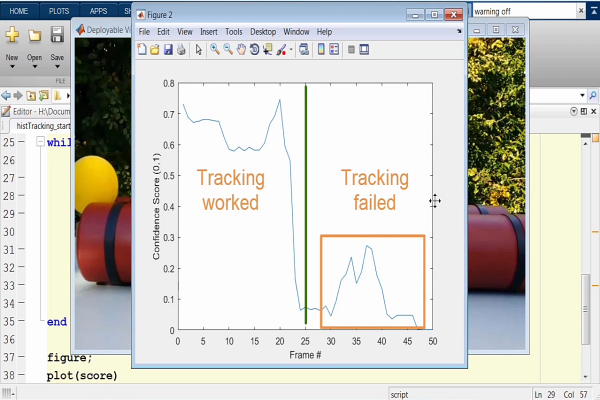

Object tracking is a deep learning application that takes a set of detected objects and creates a unique identification for all of them. After that, it performs tracking to the detected objects as they move in a video frame.

`HistogramBasedTracker` returns a tracker that tracks an object. It uses the histogram of pixel values to identify the tracked object.

This article will look at how to perform object tracking using the object-based tracker. Since a histogram-based tracker does not support tracking of the occluded objects, we will see how to handle occluded objects. Occluded objects are objects blocked by other objects.

### Prerequisites
To follow through this tutorial, you will need:
- [MATLAB](https://www.mathworks.com/products/get-matlab.html?s_tid=gn_getml) installed.
- Proper understanding of [MATLAB basics](/engineering-education/getting-started-with-Matlab/).

Tracking an object constitutes estimating the trajectory, change in location, and state of the object over time, including change in size or colour. In this guide, we will track a moving ball.

We will search for the object in all the frames of the video. In some situations, such as high frames rate applications or where the object is computationally an expensive algorithm, this method is insufficient.

As an alternative approach, we detect the object in the first image and then search for the corresponding location in the subsequent images. Thereby, the assumption is that the object does not move substantially between frames of a video. We will use a histogram-based tracker for our ball example. 

### Histogram based tracking
Histogram based tracker uses a continuously adaptive mean shift algorithm for object tracking. The tracked object is identified by the histogram of object pixel values based on colour or intensity. There are three steps to doing this:

1. Create a tracker object.
2. Initialize the tracker with the initial region of interest.
3. Loop the tracking algorithm over the frames in a video to track the object of interest.

### Matlab code for histogram-based tracker
We first read our video using `VideoFileReader()` function. This fuction takes in the video file and the `VideoOutputDataType`.

```matlab
close all
clear
clc
%% Set up video reader and player
videoFReader = vision.VideoFileReader('ball.mp4','VideoOutputDataType','double');
vidPlayer = vision.DeployableVideoPlayer;
```

After reading, we display the output using `DeployableVideoPlayer`.
Now, let us set up the histogram-based tracking using the system `HistogramBasedTracker`.

```Matlab
%% Create tracker object
tracker = vision.HistogramBasedTracker;
```

We need to initialize the tracker with the initial position of the object of interest. This position is a 1x4 matrix consisting of `x`, `y`, `width`, and `height` of the bounding box. The `x` and `y` are the left corner of the bounding box.

In Matlab, the object of interest can be automatically or manually selected. In this case, we do it manually. To enable this property, we use the code below:

```Matlab
%% Initialize tracker
img = step(videoFReader);
figure
imshow(img)
h = imrect;
wait(h)
boxLoc = getLoc(h);
imgYcbcr = rgb2ycbcr(img);
```

In the code avove, we first retrieve the first video frame of our video using the `step()` function. This function takes the video variable `videoFReader` as the argument. This retrieved frame is then displayed using the `imshow()` function.

Then, the `imrect()` function is used to get the region of interest. Finally, the utility function `getLoc()` with the region of interest as the argument gives the bounding box position in the required format. The required format is x, y, width and height.

For better tracking, we change the input image so that the tracking operates at the `ycbcr` colour space. `Ycbcr` colour is just a colour space as RGB. The difference is that `ycbcr` represents colour as brightness and two colour difference.

The main reason for the conversion is to avoid confusing the tracker between the region of interest and the surrounding environments. To convert to the ycbcr colour space, we use the `rgb2ycbcr()` function and the image to be converted as the input.

We then initialize the tracker using the region of interest. Initialization is done using the `initializeObject()` function:

```matlab
initializeObject(tracker,imgYcbcr(:,:,2),boxLoc);
```

The initialization function takes the tracker object, the input image, and the image's region of interest. The input image must be 2-Dimensional; thus, we cannot use an RGB image directly. It is because an RGB image is a 3-Dimensional array.

Therefore, selecting an appropriate representation of the input image is important for good tracking results. In our example, we have used a simple 2-Dimensional representation of the image `imgYcbcr(:,:,2)`. The integer `2` represents the colour channel.

The computer recognizes three colour channels. They are red, green and blue. If you use an integer of 1, it represents the red colour channel. The integer 2 represents green colour channels, and finally, 3 represents blue. The colour channel you choose to use depends on the object being tracked and the surrounding environment.

In our case, we use a green channel since the ball color is close to the green channel than the red or blue.
To apply tracking on our subsequent video frames, we use a `while` loop.

```matlab
%% Track object
idx = 1;
while ~isDone(videoFReader)
    img = step(videoFReader);
    imgYcbcr = rgb2ycbcr(img);
    [bbox,~,score(idx)] = step(tracker,imgYcbcr(:,:,2));
    out = insertShape(img,'Rectangle',bbox);
    step(vidPlayer,out);
    idx = idx + 1;
    pause(0.1)
end
```

The loop first checks if there is a video frame using the `~isDone()` function. It then reads the video frame using the `step()` function. This video frame is then converted from RGB colour space to ycbcr colour space in the loop. This conversion is done using `rgb2ycbcr()` function. 

We use `step` on the histogram-based tracker object with the green channel of the current video frame to track the object. We need to have a bounding box around the object of interest. We use the `insertShape()` function to insert a bounding box. This function takes in the image and the shape of the required shape of the bounding box.

Finally, we display the output using the `step()` function. This function takes the video player `vidPlayer` and the image `out`. This image is a video frame, but the object of interest is bounded using a `rectangular` bounding box.

A video is a combination of frames that keep changing. Since this is a combination, the while loop ensures that all the video frames are operated. It also ensures the object of interest is bounded. To visualize the output, add a pause of `0.1` seconds. 

The index `idx` is used to plot the confidence score. The confidence score is used to see the accuracy of the tracking process. When the confidence score is high, the accuracy of the tracking process is likely to be high. When it is low, then the opposite applies.

Now, let us plot the confidence score:

```matlab 
figure;
plot(score)
xlabel('Frame #')
ylabel('Confidence Score (0,1)')
```

From the code above, we created a `figure` in which the plotting should occur. We then used the `plot()` function to plot these scores. The `xlabel` is given as `frame` and the `ylabel` as the confidence score. The y-axis should move up to a maximum of 1.

Once all the tracking process is done, clean the video player `vidPlayer` and the video frame reader `videoFReader`. It is done using the `release()` function as shown below:

```Matlab
%% Clean up
release(vidPlayer);
release(videoFReader);
```

If we run this code at this point, we get the following output:


The plot for the confidence score is as follows:


As we can see, the tracking stops once the object is occluded. Also, the confidence scores diminishes as soon as the tracking is stopped.



It is a characteristic of a histogram-based tracker. To improve this characteristic, we should create the program such that once the object is lost, the search window reinitializes when the image reappears.

It can be done using the confidence score. It is because the confidence score shows the likeliness of the appearance of the object of interest. Let us add the code below in the while loop just below the `insertShape()` function:

```matlab
if score(idx) > 0.5
        out = insertShape(img,'Rectangle',bbox);
    else
        % Find the ball  
        boxLoc = segmentBall(img,5000);
        if (~isempty(boxLoc))
            % If ball is found, reinitialize and track again
            initializeSearchWindow(tracker,boxLoc)
            [bbox,~,score(idx)] = step(tracker,imgYcbcr(:,:,2));
            out = insertShape(img,'Rectangle',bbox);
        else
            % If ball is not found, output the unaltered frame
            out = img;
        end
   end
```

This code uses `if` statements to check for the conditions. The first step is checking if the confidence score is more than 0.5 using `score(idx) > 0.5`. When it is greater than 0.5, the object of interest is visible and can be tracked.

At this point, we add a bounding box to the object of interest. If the score is less than 0.5, we use the utility function `segmentBall()` to find the ball.

The second `if` statement checks if the location of the ball/object of interest is found. If it is not empty(~empty), we reinitialize using `initializeSearchWindow()` function. This function takes the tracker and the location of the object of interest as the arguments.

As explained earlier, the output is read using the `step()` function. We insert the bounding box `insertShape()` function to the read output.


Once the ball passes the occlusion, it reinitializes to get it again. Once the reinitialization is done and the ball identified, the tracking continues as shown below:


As demonstrated, the characteristics are improved. The tracking is working even after the object is occluded. The confidence plot is shown below:


You can find the files, video, and utility functions used here [here](https://github.com/peterAdongo/tracking)

### Conclusion
Histogram-based tracker bases the tracking on the histogram features of the object of interest. The tracking is good until an occlusion occurs. This tracker cannot estimate the position of an object in an occlusion.
It makes it an inefficient way of tracking the object. This method of tracking is only applicable in the absence of an occlusion.

Happy coding!
