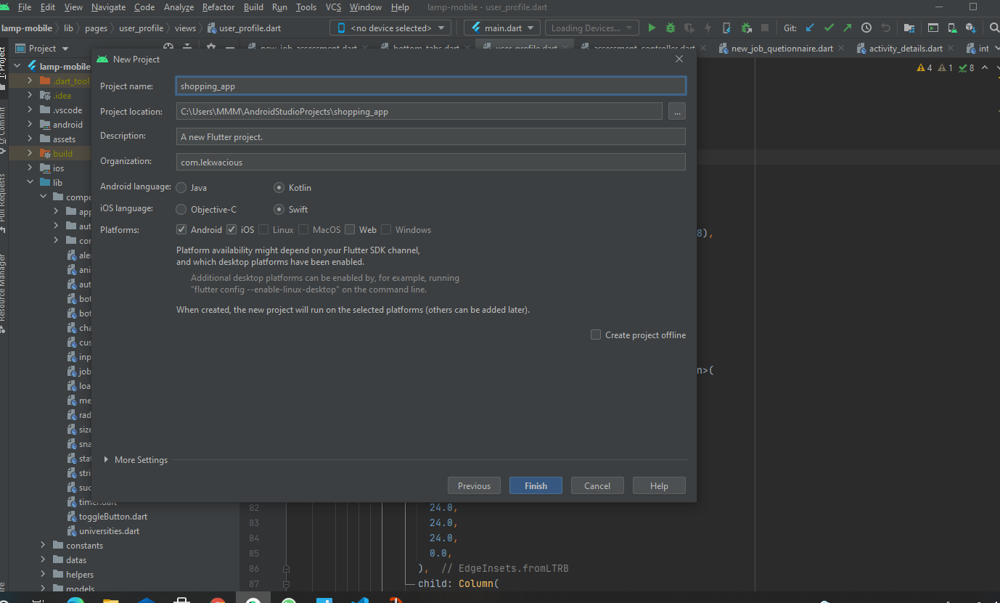
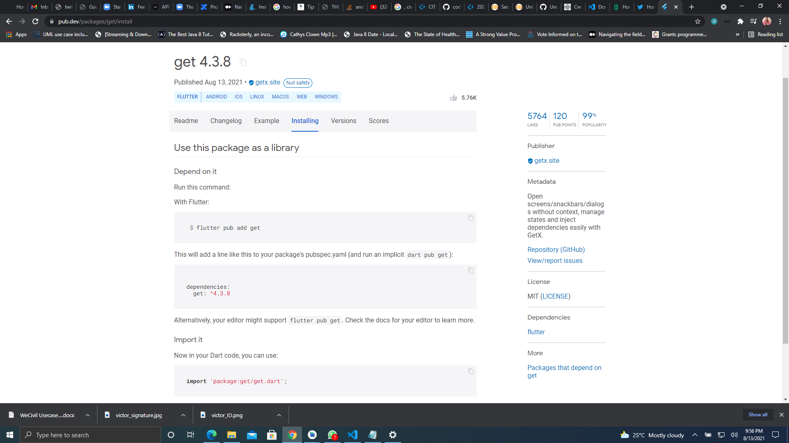
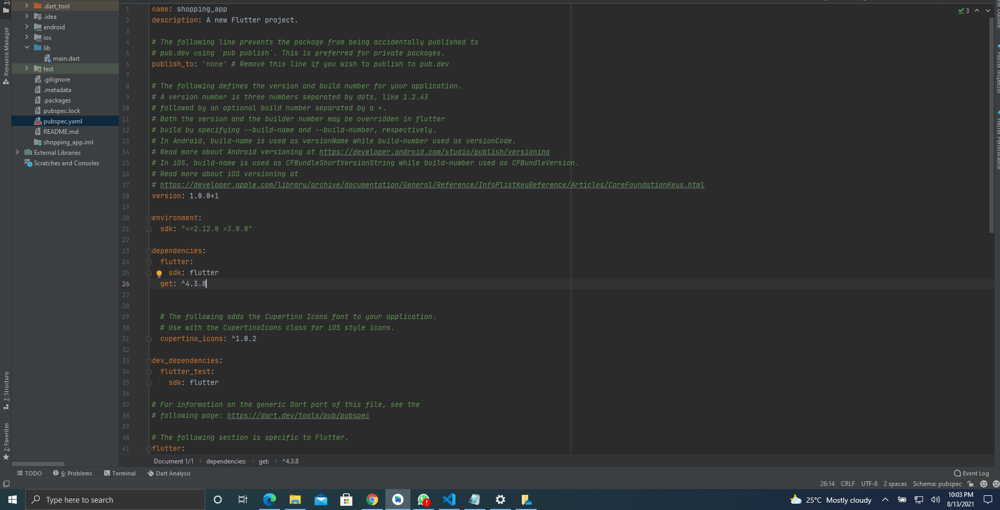

### Introduction
State management allows for the sharing of application state between screens, across your app. Put differently, it enables you to pass data from one User Interface to another so that when the state of your app changes, you change the state, and that rebuilds the user interface. Flutter traditionally uses the Stateful Widget to manage the state. While this works, but as your app grows bigger with nested widgets, it becomes a little difficult to pass data from a parent widget to a child widget and vice versa. In this kind of situation, you will have to pass the data through the constructors of the child widgets. The side effect is that data are passed to widgets that don't need them, just because they are within the widget tree. Also, the business logic will be tightly coupled to the User interface.

### Goals
This article teaches you how to use the GetX state management package to solve these problems. GetX is an extra-light and powerful solution for Flutter. It mixes high-performance state management, intelligent dependency injection, and route management swiftly and efficiently. It helps Developers realize a high level of productivity through easy and pleasant syntax without sacrificing the maximum performance your application can deliver. It enables for complete decoupling of the User Interface, presentation logic, business logic, dependency injection, and navigation. This helps to produce clean code by default.
In this tutorial, we will build a shopping mobile application that allows users to view products in the shop, like a product, add a product to a cart, and place orders. After placing orders successfully, users can view others as well. With this app, we will demonstrate the power of the GetX package and you will learn how to use GetX for state management, routing, etc.

### Key Takeaways
- How to setup Flutter project and configure dependencies
- How to use GetX as a state management tool
- Using Obx to maximize the power of reactive programming
- Exploring the Navigator Manager.
- How to use the GetBuilder sub ecosystem to manage state.
Reusable component of the GetX ecosystem.

### Prerequisites
To follow along with this tutorial, you are expected to have the following in place:
- Good knowledge of programming generally.
- An understanding of Dart and Flutter.
- Flutter SDK installed or [click](https://flutter.dev/docs/get-started/install) on this link to install.
- Andriod studio installed or get it installed by [clicking](https://developer.android.com/studio/install) on this link. You can install Visual Studio Code as well by [clicking](https://code.visualstudio.com/download) here. 

### Creating a Flutter application in Android Studio
The IDEA we are using for this project is Andriod studio. To get started launch your Android studio and click and click new Flutter project from File > New.
Since we are not building a package or plugin, select Flutter App. Be sure you selected the path where your Flutter SDK is located then click next. 
Next fill in the following project details to set up the project completely:
- Give the project a name. Let’s call it ``shopping_getx``.
- Choose a location where you want to save your project.
- Then a project description.
- Let’s name the organization com.lekwacious.
- Leave the default Andriod and ios languages to Kotlin and Swift respectively.
- Select the platform you want to develop for. Let's select and build for Andriod and ios. If you want to build for the web feel free to select the web option too then click on the finish button.  
This will generate the default Flutter counter project in the main.dart file.

### Integrating the GetX Ecosystem

 Go to the [GetX Documentation here](https://pub.dev/packages/get/install), copy ``get: ^4.3.8``, and add it  the project ``pubspec.yaml`` file under the ``dependencies section`` and then run dart ``pub get``. This will install the getX ecosystem to your project. Add ``intl: ^0.17.0`` to the  ``dependecies section`` too to install the ``intl package`` then run ``gub get` to install the dependency.  
 

Replace the generated code in the main.dart file with the following:

```Dart
import 'package:flutter/material.dart';
import 'package:get/get_navigation/src/root/get_material_app.dart';
import 'package:shopping_app/screens/product_overview_screen.dart';
 
 
void main() {
  runApp(MyApp());
}
 
class MyApp extends StatelessWidget {
  @override
  Widget build(BuildContext context) {
    return  GetMaterialApp(
        debugShowCheckedModeBanner: false,
        title: 'Flutter Demo',
        theme: ThemeData(
          primarySwatch: Colors.purple,
          accentColor: Colors.deepOrange,
          fontFamily: "Lato",
        ),
        home: ProductOverviewPage(),
 
    );
  }
}
```
- We have created the main method which is the entry point for the Dart VM to execute the program. The main method runs MyApp class.
- ``MyApp class`` extends the stateless widget and overrides the build method returns a GetMaterialApp.
- ``GetMaterialApp``: The build method is returning the GetMaterialApp as against the usual MaterialApp. This is because we can use GetX for Navigation. The GetMaterialApp is a class from the Getx package use for navigation.
- In the ``home``, We are rendering the ``ProductOverviewpage`` which is the next screen we are going to build.

### Project Structure
We are going to structure the project as follows. Inside the ``lib folder`` create four folders namely ``screens``(houses our UI), ``controller``(business logic), and ``models``(Object representation of the data to be stored). Let's begin with the ``models``. Inside the ``model folder`` create a file named ``product.dart`` and add the following code.

### The models
#### The Product Model
 
```Dart
class Product{
  final int   id;
  final String title;
  final String imageUrl;
  final String description;
  final double price;
   bool isFavourite;
 
  Product(
      {required this.id,
      required this.title,
      required this.imageUrl,
      required this.description,
      required this.price,
      this.isFavourite = false});
 
}
```
 
 
- This is just a Dart class that contains the fields of the product.
- We added a constructor that initializes all the fields. All the fieds were made required except for isFavourite initialized to false.

#### CartItem Model

```Dart
class CartItem {
  final String id;
  final String title;
  final int quantity;
  final double price;
 
  CartItem(
      {required this.id,
      required this.title,
      required this.quantity,
      required this.price});
}
```
 
- We have created a Dart class that stores the fields of the CartItem, and
- A Constructor with all the fields required.

#### The Order Class

```Dart
import 'package:shopping_app/models/cart_item.dart';
 
class Order {
  final String id;
  final double amount;
  final List<CartItem> products;
  final DateTime dateTime;
 
  Order(
      {required this.id,
      required this.amount,
      required this.products,
      required this.dateTime});
}
```
 
- This is just a Dart class that contains the fields of the Order that will be placed.
- We Created a ``Constructor`` with all the fields required.

### The Controllers
As stated earlier, all our business logic will be on the controller. This will help the application to be loosely coupled with the User Interface. Create a file named ``product_controller`` in the ``controller folder`` and write the following code:

#### The Product Controller

```Dart

import 'package:get/get.dart';
import 'package:shopping_app/models/product.dart';
 
class ProductController extends GetxController {
  List<Product> _items = [
    Product(
      id: 1,
      title: 'Red Shirt',
      description: 'A red shirt - it is pretty red!',
      price: 2500.00,
      imageUrl:
          'https://cdn.pixabay.com/photo/2016/10/02/22/17/red-t-shirt-1710578_1280.jpg',
    ),
    Product(
        id: 2,
        title: 'Legend',
        description:
            'Built to last with matte leather uppers, StormKing™ lug rubber outsoles and a flexible elastic goring, the Legend blends form and function like nothing you\'ve seen anywhere else.',
        price: 12000.00,
        imageUrl:
            'https://cdn.shopify.com/s/files/1/0419/1525/products/1024x1024-Men-Legend-BlackMatte-3.4_672x672.jpg?v=1600886623'),
    Product(
        id: 3,
        title: 'The Chelsea',
        description: 'Functional and Fashionable.',
        price: 49.00,
        imageUrl:
            'https://cdn.shopify.com/s/files/1/0419/1525/products/1024x1024-Cavalier-Black-1.jpg?v=1589391819'),
    Product(
        id: 4,
        title: 'Men\'s Sneakers',
        description: 'Clean & Comfortable Sneakers made with classic Leathers.',
        price: 49.99,
        imageUrl:
            'https://cdn.shopify.com/s/files/1/0419/1525/products/1024x1024-Men-PremierLowTop-Black-3.4.jpg?v=1600270679'),
    Product(
        id: 5,
        title: 'The Chelsea',
        description:
            'This hardwearing Chelsea is every bit as comfortable as you\'d expect from a slip-on boot but with the durability of our Rugged & Resilient collection.',
        price: 49.99,
        imageUrl:
            'https://cdn.shopify.com/s/files/1/0419/1525/products/1024x1024-Captain-Natural-3.jpg?v=1584114360'),
    Product(
        id: 6,
        title: 'Men\'s Sneakers',
        description: 'Clean & Comfortable Sneakers made with classic Leathers.',
        price: 49.99,
        imageUrl:
            'https://cdn.shopify.com/s/files/1/0419/1525/products/1024x1024-Men-PremierLowTop-Black-3.4.jpg?v=1600270679'),
    Product(
        id: 7,
        title: 'The Chelsea',
        description:
            'Handcrafted for the men who wear their boots hard, every detail was carefully selected so you can go the extra mile with confidence.',
        price: 49.99,
        imageUrl:
            'https://cdn.shopify.com/s/files/1/0419/1525/products/1024x1024-Men-Cavalier-Toffee-210402-2.jpg?v=1618424894'),
    Product(
        id: 8,
        title: 'Men\'s Sneakers',
        description: 'Clean & Comfortable Sneakers made with classic Leathers.',
        price: 49.99,
        imageUrl:
            'https://cdn.shopify.com/s/files/1/0419/1525/products/1024x1024-Men-Cavalier-Toffee-210402-3.jpg?v=1618424894'),
    Product(
        id: 9,
        title: 'The Chelsea',
        description: 'Functional and Fashionable.',
        price: 49.99,
        imageUrl:
            'https://cdn.shopify.com/s/files/1/0419/1525/products/1024x1024-Cavalier-Black-1.jpg?v=1589391819'),
    Product(
        id: 10,
        title: 'Men\'s Sneakers',
        description: 'Clean & Comfortable Sneakers made with classic Leathers.',
        price: 49.99,
        imageUrl:
            'https://cdn.shopify.com/s/files/1/0419/1525/products/1024x1024-Men-PremierLowTop-Black-3.4.jpg?v=1600270679'),
  ];
 
  List<Product> get items {
    return [..._items];
  }
 
  List<Product> get favouriteItems {
    return _items.where((productItem) => productItem.isFavourite).toList();
  }
 
  Product findProductById(int id) {
    return _items.firstWhere((element) => element.id == id);
  }
 
 
  void toggleFavouriteStatus(int id) {
    items[id].isFavourite = !items[id].isFavourite;
    update();
  }
}
 
 ```
 
- The GetxController: The ``ProductController`` class we just created is extending the ``GetxController`` class which is an abstract class that extends the ``DisposableInterface``. By extending ``DisposableInterface`` Getx helps us to reduce memory consumption by deleting our controller from memory immediately after the widget using it is removed from the navigation stack.
- What we need in the controller is the element we want to bind to the User Interface. In this case a list of ``Products``, as such we have created the field ``_items`` which contains the list of all the products. The underscore in the ``_items`` makes it private. We are hard-coding this, we can equally retrieve the product from the backend by making an HTTP call to the backend server.
- Next, we created two getters that return all the list of the product and the product that has been marked as favorite respectively.
- The ``findProductById`` method takes in an ``ID`` as an argument and returns the product with that particular ``ID``.
- The ``toggleFavouriteStatus`` method takes in an ``ID`` and marks the product with that ``ID`` as favorite.
- ``Update``: We called the update from ``Getx`` to update the User Interface on-click. The update method listens for changes in the ``toggleFavouriteStatus`` method and updates the appropriate User Interface. If you are familiar with the Provider package, the ``update`` method functions like the ``notifyListeners`` of the Provider package.

#### The Cart Controller
Create a dart file called ``cart_controller.dart`` in the ``controller`` folder and add the following code:

```Dart

import 'dart:core';
 
import 'package:get/get.dart';
import 'package:shopping_app/models/cart_item.dart';
 
class CartController extends GetxController {
  Map<int, CartItem> _items = {};
 
  Map<int, CartItem> get items {
    return {..._items};
  }
 
  int get itemCount {
    // return  _items?.length?? 0;
    return _items.length;
  }
 
  double get totalAmount {
    var total = 0.0;
    _items.forEach((key, cartItem) {
      total += cartItem.price * cartItem.quantity;
    });
    return total;
  }
 
  void addItem(int productId, double price, String title, int quantity) {
    if (_items.containsKey(productId)) {
      _items.update(
          productId,
          (existingCartItem) => CartItem(
              id: existingCartItem.id,
              title: existingCartItem.title,
              quantity: existingCartItem.quantity + 1,
              price: existingCartItem.price));
    } else {
      _items.putIfAbsent(
        productId,
        () => CartItem(
          id: DateTime.now().toString(),
          title: title,
          price: price,
          quantity: 1,
        ),
      );
    }
    update();
  }
 
  void removeitem(int productId) {
    _items.remove(productId);
    update();
  }
 
  void clear() {
    _items = {};
    update();
  }
}
 ```
 
 
- We have created a class ``CartContoller`` that extends the ``GetxController``. Remember to import the ``GetXController`` from the package.
- We created a ``map`` that holds the CartItem objects.
- We also created two getters that return all the items on the cart and the number of the items respectively.
- Next we created a method ``totalAmount`` that calculates and returns the total amount of all the products on the cart.
- The ``addItem`` method adds the products to the cart. First, we check, if the product exists already in the cart, we will update the number and if it does not we add it to the cart.
- The ``removeitem`` method takes a ``productId`` and removes a product with that ``ID`` from the cart.
- The ``clear`` method clears the cart once an order has been successfully placed.
- The ``Update`` method: Note we have invoked the update method from ``Getx`` in all the methods we created to listen for changes to update the appropriate User Interface where this data is needed.

#### The order Controller
Create a dart file called ``order_controller.dart`` in the ``controller folder`` and add the following code:

```Dart
import 'package:get/get.dart';
import 'package:shopping_app/models/cart_item.dart';
import 'package:shopping_app/models/order.dart';
 
class OrderController extends GetxController {
  List<Order> _orders = [];
 
  List<Order> get orders {
    return [..._orders];
  }
 
  void addOrder(List<CartItem> cartProducts, double total) {
    _orders.insert(
        0,
        Order(
            id: DateTime.now().toString(),
            products: cartProducts,
            amount: total,
            dateTime: DateTime.now()));
    update();
  }
}
```

- We created a list the holds all the orders.
- Next, we created a getter called ``orders`` to return all the orders placed.
- The ``addOrder`` method takes in a list of ``CartItem`` which are the products that have been added to the cart and a ``total`` of type ``double`` which is the sum of all the products added to the cart and places an order.
- The ``update`` method: Again we have called the ``update`` method to listen for changes and updates the UI. As simple as that, that's the beauty of the Getx package.

### The UI
Inside the screens folder create a dart file ``product_overview_screen.dart`` and add the following code:

#### The ProductOverviewPage

```Dart
import 'package:flutter/material.dart';
import 'package:get/get.dart';
import 'package:shopping_app/controllers/cart_controller.dart';
import 'package:shopping_app/screens/cart_screen.dart';
import 'package:shopping_app/widgets/app_drawer.dart';
import 'package:shopping_app/widgets/badge.dart';
import 'package:shopping_app/widgets/productgrid.dart';
 
class ProductOverviewPage extends StatelessWidget {
  @override
  Widget build(BuildContext context) {
    final cartController = Get.put(CartController());
 
    return Scaffold(
      appBar: AppBar(
        title: Text("My Shop"),
        actions: <Widget>[
          GetBuilder<CartController>(
              init: CartController(),
              builder: (contex) {
                return Badge(
                  child: IconButton(
                      icon: Icon(
                        Icons.shopping_cart,
                      ),
                      onPressed: () {
                        Get.to(() => CartScreen());
                      }),
                  value: cartController.itemCount.toString(),
                  color: Theme.of(context).accentColor,
                );
              })
        ],
      ),
      drawer: AppDrawer(),
      body: ProductsGrid(),
    );
  }
}
```
- ``Dependency injection``: Dependency injection allows for injecting instances of one class into another. To define what a ``dependency`` is, if some class C uses the functionality of a class D, then D is a dependency for C, or, in other words, C has a dependency on D.
- ``Getx`` allows you to perform Dependency injection with just one line of code, no Provider context, no inheritedWidget. With this line of code: 
```Dart 
final cartController = Get.put(CartController());
```
 we have injected the ``cartController`` into our UI so that we can access the data on the controller.
- The ``GetBuilder`` when wrapped over any widget to makes it interact with the methods and variables of the controller. So whatever widget is wrapped with a Getbuilder, Getx applies setState on it. With this, we were able to call the itemCount functions in the CartController class to return the number of products on the cart, etc.
- We use the ``Getx navigation manager`` to navigate to the ``CartScreen`` page when even the ``shopping_cart icon`` is pressed.
- In the body of this class, we have called the ProductsGrid class to return a grid showing all the products in the shop.

### Widgets
We have broken down our UI to make keep it simple and reusable. create a folder called ``widget``. Inside the ``widget folder``, create a dart file called ``productgrid.dart``.

#### The ProductsGrid class

```Dart
import 'package:flutter/material.dart';
import 'package:get/get.dart';
import 'package:shopping_app/controllers/cart_controller.dart';
import 'package:shopping_app/controllers/product_controller.dart';
import 'package:shopping_app/screens/product_details_screen.dart';
 
class ProductsGrid extends StatelessWidget {
  final controller = Get.put(ProductController());
  final cartController = Get.put(CartController());
 
  @override
  Widget build(BuildContext context) {
    return GridView.builder(
      padding: const EdgeInsets.all(10),
      itemCount: controller.items.length,
      gridDelegate: SliverGridDelegateWithFixedCrossAxisCount(
          crossAxisCount: 2,
          childAspectRatio: 3 / 2,
          crossAxisSpacing: 10,
          mainAxisSpacing: 10),
      itemBuilder: (context, index) {
        return GetBuilder(
          init: ProductController(),
          builder: (value) => ClipRRect(
            borderRadius: BorderRadius.circular(10),
            child: GridTile(
              child: GestureDetector(
                onTap: () {
                  Get.to(
                    ProductDetailsScreen(
                      controller.items[index].title,
                      controller.items[index].price,
                      controller.items[index].imageUrl,
                      controller.items[index].description,
                    ),
                  );
                },
                child: Image.network(
                  controller.items[index].imageUrl,
                  fit: BoxFit.cover,
                ),
              ),
              footer: GridTileBar(
                backgroundColor: Colors.black87,
                leading: IconButton(
                  icon: Icon(
                    controller.items[index].isFavourite == true
                        ? Icons.favorite
                        : Icons.favorite_border,
                    color: Theme.of(context).accentColor,
                  ),
                  onPressed: () {
                    controller.toggleFavouriteStatus(index);
                  },
                ),
                title: Text(
                  controller.items[index].title,
                  textAlign: TextAlign.center,
                ),
                trailing: GetBuilder<CartController>(
                    init: CartController(),
                    builder: (cont) {
                      return IconButton(
                        icon: Icon(Icons.shopping_cart),
                        onPressed: () {
                          cartController.addItem(
                              controller.items[index].id,
                              controller.items[index].price,
                              controller.items[index].title,
                              1);
                        },
                        color: Theme.of(context).accentColor,
                      );
                    }),
              ),
            ),
          ),
        );
      },
    );
  }
}
```

- We injected the ``ProductController`` and ``CartController`` into the ``ProductGrid`` class to have access to the functions defined in them.
- We wrap the ``ClipRRect`` widget with a ``GetBuilder`` to update it when the state changes. With the injected ``ProductController`` we displayed the products showing their title, image.
- We used the navigator manager to route to the ``ProductDetailsScreen`` when a particular product is clicked by simply calling the ``Get.to()`` and pass in the title, price, image, and description of the product selected.
- On click of the favorite icon, we call the product controller access the ``toggleFavouriteStatus`` function and change the color of the icon appropriately.
- The ``shopping_cart`` icon has been wrapped with the ``Getbuilder`` so that whenever it is clicked we add the product to the cart by calling the ``addItem`` function from the CartController.

#### The ProductDetailsScreen
Inside the screens folder create a dart file ``product_details_screen.dart`` and add the following code:

```Dart
import 'package:flutter/cupertino.dart';
import 'package:flutter/material.dart';
import 'package:get/get.dart';
import 'package:shopping_app/controllers/cart_controller.dart';
import 'package:shopping_app/controllers/product_controller.dart';
 
class ProductDetailsScreen extends StatelessWidget {
 
  final String title;
  final double price;
  final String image;
  final String description;
 
  ProductDetailsScreen(this.title, this.price, this.image, this.description);
 
  @override
  Widget build(BuildContext context) {
    return Scaffold(
      appBar: AppBar(
        title: Text(this.title),
      ),
      body: SingleChildScrollView(
        child: Container(
          color: Color(0xffF6F6F6),
          child: Column(
            children: [
              Container(
                child: ClipRRect(
                  borderRadius: BorderRadius.only(
                      bottomLeft: Radius.circular(25),
                      bottomRight: Radius.circular(25)),
                  child: Image.network(
                    this.image,
                    fit: BoxFit.cover,
                  ),
                ),
              ),
              Padding(
                padding: const EdgeInsets.all(10.0),
                child: Column(
                  children: [
                        Chip(
                          label: Text(
                            "Price: " + "₦" + this.price.toString(),
                            textAlign: TextAlign.center,
                            style: TextStyle(
                                color: Colors.white,
                                fontSize: 24,
                                fontWeight: FontWeight.bold
                            ),
                          ),
                          backgroundColor: Theme.of(context).primaryColor,
                        ),
                    SizedBox(height: 15),
                    Text(
                      "" + this.description,
                      textAlign: TextAlign.center,
                      style: TextStyle(
                        color: Color(0xff403B58),
                        fontSize: 16,
                        fontWeight: FontWeight.bold,
                      ),
                    ),
                  ],
                ),
              )
            ],
          ),
        ),
      ),
    );
  }
}
 ```
 
- We use the constructor to pass in the detail from the ``productGrid`` class when you click on a product to view the details.

#### The CartScreen
Inside the ``screens folder`` create a dart file ``cart_screen.dart`` and write the following code:

```Dart

import 'package:flutter/cupertino.dart';
import 'package:flutter/material.dart';
import 'package:get/get.dart';
import 'package:shopping_app/controllers/cart_controller.dart';
import 'package:shopping_app/controllers/order_controller.dart';
import 'package:shopping_app/widgets/cart_items.dart';
 
class CartScreen extends StatelessWidget {
 
  @override
  Widget build(BuildContext context) {
    var cartController = Get.put(CartController());
    var orderController = Get.put(OrderController());
 
    return Scaffold(
      appBar: AppBar(
        title: Text("Your cart"),
      ),
      body: GetBuilder<CartController>(
        init: CartController(),
        builder: (cont) => Column(
          children: <Widget>[
            Card(
              margin: EdgeInsets.all(15),
              child: Padding(
                padding: const EdgeInsets.all(8.0),
                child: Row(
                  mainAxisAlignment: MainAxisAlignment.spaceBetween,
                  children: <Widget>[
                    Text(
                      "Total",
                      style: TextStyle(
                        fontSize: 20,
                      ),
                    ),
                    Spacer(),
                    Chip(
                      label: Text(
                        '₦${cartController.totalAmount.toStringAsFixed(2)}',
                        style: TextStyle(
                          color: Colors.white,
                        ),
                      ),
                      backgroundColor: Theme.of(context).primaryColor,
                    ),
                    GetBuilder<OrderController>(
                        init: OrderController(),
                        builder: (context) {
                          return TextButton(
                              onPressed: () {
                                orderController.addOrder(
                                    cartController.items.values.toList(),
                                    cartController.totalAmount);
                                cartController.clear();
                                Get.snackbar(
                                  "Orders",
                                  "Orders placed successfully",
                                  backgroundColor: Colors.green,
                                  snackPosition: SnackPosition.BOTTOM
                                );
                              },
                              child: Text('ORDER NOW'));
                        })
                  ],
                ),
              ),
            ),
            SizedBox(
              height: 10,
            ),
            Expanded(
              child: ListView.builder(
                  itemCount: cartController.items.length,
                  itemBuilder: (context, index) => CartItem(
                        cartController.items.values.toList()[index].id,
                        cartController.items.values.toList()[index].price,
                        cartController.items.values.toList()[index].quantity,
                        cartController.items.values.toList()[index].title,
                        cartController.items.keys.toList()[index],
                      )),
            ),
          ],
        ),
      ),
    );
  }
}
```

- Again we have injected the ``OrderController`` and ``CartController`` into the cartScreen class to have access to the functions defined in them.
- We used the ``GetBuilder ``to update the widgets that need to be rebuilt as the state changes. The total amount is updated accordingly by calling the ``CartController``.
- The ``Listview.bulder`` widget has been used to render the list of all products added to the cart that is the ``Cartitem`` class. We are showing the title, amount, quantity, and price of products in the cart.
- We used the injected instance of the ``OrderController`` to invoke the ``addOrder`` function so that whenever the ``TextButton`` widget is clicked we place an order.
- If an order is placed successfully, we use the ``snackbar`` from GetX to show a message to the user that the order has been placed successfully simply by adding this code
```Dart
Get.snackbar(
            "Orders",
            "Orders placed successfully",
              backgroundColor: Colors.green,
              snackPosition: SnackPosition.BOTTOM
                  );
```

That is the power of GetX ecosystem.
- Once an order is placed successfully we invoke the ``clear`` method from the ``cartController`` to clear the cart.

#### The CartItem
In the ``widget folder`` create a dart file ``cart_items.dart`` with the following code:
```Dart

import 'package:flutter/material.dart';
import 'package:get/get.dart';
import 'package:shopping_app/controllers/cart_controller.dart';
 
class CartItem extends StatelessWidget {
  final String id;
  final int productId;
  final double price;
  final int quantity;
  final String title;
 
  CartItem(this.id, this.price, this.quantity, this.title, this.productId);
 
  @override
  Widget build(BuildContext context) {
    var cartController = Get.put(CartController());
    return Dismissible(
      key: ValueKey(id),
      background: Container(
        color: Theme.of(context).errorColor,
        child: Icon(Icons.delete, color: Colors.white,size: 40,
 
        ),
        alignment: Alignment.centerRight,
        padding: EdgeInsets.only(right: 20),
        margin:  EdgeInsets.symmetric(horizontal: 15, vertical: 4),
 
      ),
      direction: DismissDirection.endToStart,
      onDismissed: (direction){
        cartController.removeitem(productId);
 
      },
      child: Card(
        margin: EdgeInsets.symmetric(horizontal: 15, vertical: 4),
        child: Padding(
          padding: const EdgeInsets.all(8.0),
          child: ListTile(
            leading: Chip(
              label: Padding(
                padding: const EdgeInsets.all(8.0),
                child: Text('₦$price'),
              ),
              backgroundColor: Theme.of(context).primaryColor,
            ),
            title: Text(title),
            subtitle: Text('Total: ₦${(price * quantity)}'),
            trailing: Text('$quantity X'),
          ),
        ),
      ),
    );
  }
}
 ```
 
- We created the ``CartItem`` class which extends the stateless widget. The fields include the id, productId, price, quantity, and title. The constructor was used to initialize the fields.
- The ``CartController`` has been injected. We used that to access the ``removeitem`` method to delete a product from the cart whenever the Dismissible widget is swiped.

#### The OrderScreen

``` Dart
import 'package:flutter/material.dart';
import 'package:get/get.dart';
import 'package:shopping_app/controllers/order_controller.dart';
import 'package:shopping_app/widgets/app_drawer.dart';
import 'package:shopping_app/widgets/order_item.dart';
 
class OrderScreen extends StatelessWidget {
  var orderController = Get.put(OrderController());
  @override
  Widget build(BuildContext context) {
    return Scaffold(
      appBar: AppBar(
        title: Text("Yours Orders"),
      ),
      drawer: AppDrawer(),
      body: ListView.builder(
          itemCount: orderController.orders.length,
          itemBuilder: (context, index) =>
              OrderItem(orderController.orders[index])),
    );
  }
}
 ```
 
- The ``OrderScreen`` class renders the ``OrderItem`` widget.
- We injected the ``OrderController`` to access the ``orders`` which contain the list of all the orders place.
- We rendered the ``AppDrawer`` to show the ``Orders`` and the ``Shops`` depending on the one selected.

#### The OrderItem

```Dart
import 'package:flutter/material.dart';
import 'package:shopping_app/models/order.dart';
import 'package:intl/intl.dart';
import 'dart:math';
 
class OrderItem extends StatefulWidget {
  final Order order;
 
  OrderItem(this.order);
 
  @override
  _OrderItemState createState() => _OrderItemState();
}
 
class _OrderItemState extends State<OrderItem> {
  var _isExpanded = false;
  @override
  Widget build(BuildContext context) {
    return Card(
      margin: EdgeInsets.all(10),
      child: Column(
        children: <Widget>[
          ListTile(
            title: Text('${widget.order.amount.toStringAsFixed(2)}'),
            subtitle: Text(
                DateFormat('dd/MM/yyyy hh:mm').format(widget.order.dateTime)),
            trailing: IconButton(
              icon: Icon(_isExpanded ? Icons.expand_less : Icons.expand_more),
              onPressed: () {
                setState(() {
                  _isExpanded = !_isExpanded;
                });
              },
            ),
          ),
          if (_isExpanded)
            Container(
              padding: EdgeInsets.symmetric(horizontal: 15, vertical: 4),
              height: min(widget.order.products.length * 20 + 10, 180),
              child: ListView(
                children: widget.order.products
                    .map(
                      (product) => Row(
                        mainAxisAlignment: MainAxisAlignment.spaceBetween,
                        children: <Widget>[
                          Text(
                            product.title,
                            style: TextStyle(
                              fontWeight: FontWeight.bold,
                              fontSize: 18,
                            ),
                          ),
                          Text(
                            '${product.quantity}X ₦${product.price}',
                            style: TextStyle(
                              fontSize: 18,
                              color: Colors.grey,
                            ),
                          ),
                        ],
                      ),
                    )
                    .toList(),
              ),
            )
        ],
      ),
    );
  }
}
 
```
- This class renders the list of orders placed.

#### The AppDrawer
```Dart

import 'package:flutter/material.dart';
import 'package:get/get.dart';
import 'package:shopping_app/screens/order_screen.dart';
import 'package:shopping_app/screens/product_overview_screen.dart';
 
class AppDrawer extends StatelessWidget {
  const AppDrawer({Key? key}) : super(key: key);
 
  @override
  Widget build(BuildContext context) {
    return Drawer(
      child: Column(
        children: <Widget>[
          AppBar(
            title: Text("Hello Friend"),
            automaticallyImplyLeading: false,
          ),
          Divider(),
          ListTile(
            leading: Icon(Icons.shop),
            title: Text("Shop"),
            onTap: () {
              Get.to(() => ProductOverviewPage());
            },
          ),
          Divider(),
          ListTile(
            leading: Icon(Icons.payment),
            title: Text("Orders"),
            onTap: () {
              Get.to(() => OrderScreen());
            },
          ),
        ],
      ),
    );
  }
}
 ```

- The class returns a Column with ``Drawer`` widget so users can select to either navigate to the shop that is the ``ProductOverviewPage`` showing all the products or navigate to the order page that has the list of the orders placed, whichever the user selected, we use the GetX navigator to route to the appropriate screen.

### OBX
While the GetBuilder is fast and has a low memory footprint, it is not reactive. Obx is one of the reactive state managers of the GetX ecosystem. GetX turns reactive programming into something quite simple:
- You won't need to create StreamControllers.
- You won't need to create a StreamBuilder for each variable
- You will not need to create a class for each state.
- You will not need to create a get for an initial value.
- You will not need to use code generators

The tuttorial has focuesed on the GetBuilder, however if we were to use the reactive streans(OBX) the ``OrderController`` class would have looked like this.

```Dart

import 'package:get/get.dart';
import 'package:shopping_app/models/cart_item.dart';
import 'package:shopping_app/models/order.dart';
 
class OrderController extends GetxController {
  var _orders = [].obs;
 
  List<Order> get orders {
    return [..._orders];
  }
 
  void addOrder(List<CartItem> cartProducts, double total) {
    _orders.insert(
        0,
        Order(
            id: DateTime.now().toString(),
            products: cartProducts,
            amount: total,
            dateTime: DateTime.now()));
  }
}
 ```
 
- ``obs``: We have declared a variable that is going to hold a list of all orders and we made it an observable by making it an obs using the dot notation. By making it an obs, every time the orders change, all widgets that use it are automatically changed.
- In the ``addOrder`` method, we don't need to manually call the ``update`` method to update the UI that is bound to it. ``Obx`` intelligently observes and updates accordingly.
To bind a controller to a view using ``Obx`` wrap the widget as shown below:
```Dart

    body: Obx(() => ListView.builder(
            itemCount: orderController.orders.length,
            itemBuilder: (context, index) =>
                OrderItem(orderController.orders[index])),
      ),
 ```

### Conclusion
We have successfully built a shopping mobile app using Flutter, and GetX for state management.
You've learned how to build a shopping application with Flutter and use GetX for state management, navigation, and rendering widgets.
You can clone the project on this [Git Repository](https://github.com/Lekwacious/shopping_app-_getx).
Happy coding!
