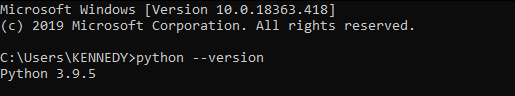
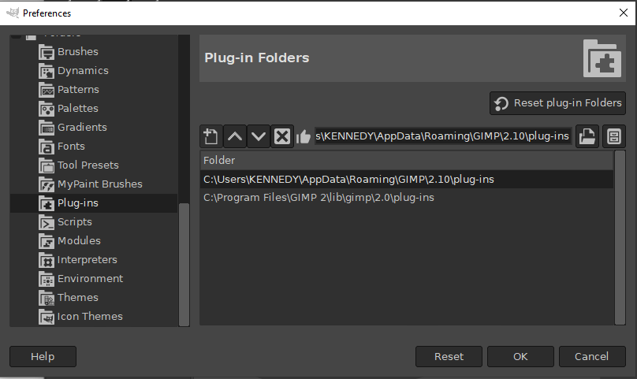
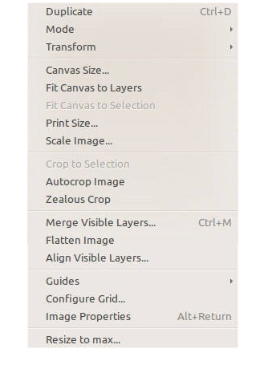
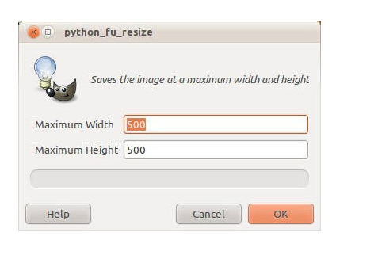
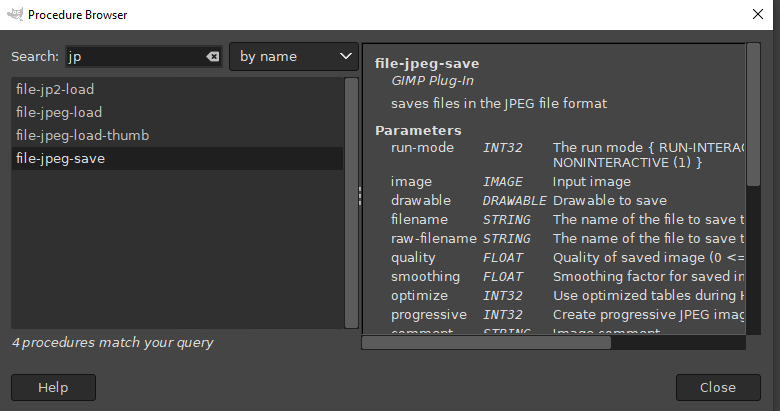
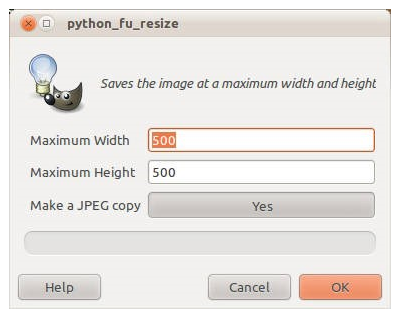

### Goal
In this article, you figure out how to compose Python code that permits you to mechanize two distinct errands in GIMP:
- resizing images
- saving them in different formats.
### Introduction
GIMP is an open-source picture control program that numerous people use as a practical choice as opposed to a part of the business commitments. GIMP handles tangled parts like layers and ways. GIMP maintains different assorted picture associations and goes with commonly complex channels. GIMP has a strong neighborhood and consideration, so it is easy to find information concerning how to use or grow GIMP for the most part. 

This article will wind up being hollering to utilize GIMP-Python, which is a gathering of Python modules that permit you to program in Python to mechanize errands in the GNU Image Manipulation Program (GIMP). These Python modules are generally covered for the libgimp library. GIMP-Python isn't generally so old as Script-Fu developments. To run scripts in Script-Fu, a module is used. The Python script turns into the predominant point of convergence in GIMP-Python and practices the work. You may run the GIMP-Python scripts clearly from GIMP, or you can use GIMP's bunch mode to start it from the request line
### Table of content


###  Installation
You can introduce and utilize both gimp and python on any stage in 'Mac OS,', 'Linux, and 'Microsoft windows'. You can compose complex modules for GIMP utilizing python and have the option to run them on these stages. 
- GIMP is an open-source picture control program that many individuals use as a feasible option in contrast to a portion of the business contributions, subsequently making it more straightforward to introduce on your gadget. You can download the most recent version of GIMP ['here'](http://www.gimp.org/downloads/). 
- After an effective establishment of GIMP programming the next thing to introduce is Python on your working framework as indicated by the guidance on the python documentation. You can download the most recent version of python ['here'](https://www.python.org/downloads/). To affirm that you have effectively introduced python on your OS, open the command line and type 'python --version' the yield ought to be 

 

You can likewise get GIMP-python documentation [here](http://www.gimp.org/docs/python/)

### Enrolling your content
On the Windows stage, Python records go in your client's home GIMP folder. For my situation its 
'C:\Users\KENNEDY\AppData\Roaming\GIMP\2.10\plug-ins' the place where I have saved my `.py` record 
- Note that framework modules are a hidden folder; thus, to get to Gimp 2.10 modules index in Windows 10 open File Explorer and enter the above path from your GIMP. 
You can get the above path by opening your GIMP, tapping on 'edit>preferences>folders>plug-ins' 
The figure beneath shows the way of getting the document area 

 

the chose path above is for '`system plug-ins`', and the other is for 'user plug-ins' duplicate the framework modules and paste it on your file explorer pathway. Make another text document in the open folder and save it as '.py' 
On Mac and Linux frameworks, that folder is '~/.gimp-2.6/modules'. 
The Python script records should in like manner be executable and have the Python translator on the primary line, like the standard substance declarations under.
There are 12 arguements to the register work you might found them clarified [here](http://www.expmedia.com/content/broadening gimp-python-python-fu-modules section 2). You are needed to enlist your python script all together GIMP to add the modules in one of the GIMP menus. The following is a model

``` python
#!/usr/bin/python
From gimpfu import * # same for every plug-ins
def gimp_plugins(image, drawable):
    return
register(
# name of the order you invoke from the command prompt
"python_fu_resize",
# The procedure browser displays information about the plug-in.
"Saves the image at a maximum width and height",
# The designer of the plug-in
"Kennedy Mwangi",
# The plug-copyright in's holder. 
"Kennedy Mwangi",
# The copyright expiration date	 
"2021",
# The menu label that the plug-in uses. 
"<Image>/Image/Resize to max ",
# The methodology parameters for the plug-in
[
    (PF_FILE, "infile", "Path for input file", ""), 
     (PF_DIRNAME, "save-path", "Path for output filename", ""), 
],
# The results of the plug-in’s method
[
    menu="<image>/Resize to max../"
],
gimp_plugins)
main()
```
The register() system gives any data about your module. It has a few boundaries that let GIMP know how to show menu choices for the modules and what python technique to call when you start your modules 
There is more data about the register technique's boundaries on the python-Fu console, 
- on windows explore through 'filters>python-Fu>Console' 
in any case, in Mac, the executable is at 
- '/Applications/GIMP.app/Contents/MacOS/python' 
with libraries at: 
- '/Applications/GIMP.app/Contents/Resources/lib/python2.7' 
then, at that point, compose the accompanying order
```
import gimpfu
help(gimfu.register)
```
save your content in the '.\GIMP\2.10\plug-ins folder'. Start gimp in the command line to perceive any information that is printed out by your plug-ins. 
From your, GIMP click 'picture' to see the refreshed 'Resize to max' menu as displayed beneath



### Scripting the resize
After an effective python modules show in GIMP, add the code underneath in your 'python primary' technique to resize your picture.
``` python
def gimp_plugins(image, drawable, maxheight=500, maxwidth=500):
currentWidth = drawable.width
currentHeight = drawable.height
newWidth = currentWidth
newHeight = currentHeight
if (maxwidth < newWidth):
newWidth = maxwidth
newHeight = (float(currentHeight) / (float(currentWidth) / newWidth))
if (maxheight < newHeight):
newHeight = maxheight
newWidth = (float(currentWidth) / (float(currentHeight) / newHeght))
```
'pdb.gimp_scale_image' is a strategy to resize the picture 
in the wake of doing some elementary computations to observe the upsides of the scaled picture sizes. To find out about different strategies to call inside your python script in GIMP click 'help>procedure Browser' 
### Running the resize module script 
- After you add the code to play out the resize, open a picture in GIMP by tapping on 'file>open a layer>select your picture from your document explorer>drag and drop in your GIMP work area'. 
- After adding your picture click on the 'image>resize to max' menu, an interface will spring up like displayed underneath to request the sizes (i.e Maximum Width and Maximum Height)

    

Subsequent to setting your maximum_height and maximum_width click the OK button the 'plug_main'method executes and your content resizes your picture
### Prearranging the picture change
Since the document you have saved is in '.xcf' which is a GIMP saving format, you can refresh the python record to save the picture in an alternate picture design. it permits you to save the Orignal picture as either JPEG or PNG just as resize it to fit specific requirements.

``` python
#!/usr/bin/python
from gimpfu import *
def gimp_plugins(image, drawable, maxheight=500, maxwidth=500, savecopy=TRUE):
currentWidth = drawable.width
currentHeight = drawable.height
newWidth = currentWidth
newHeight = currentHeight
if (maxw > newWidth):
newWidth = maxwidth
newHeight = (float(currentHeight) / (float(currentWidth) / newWidth))
```
Besides, you can get the name of the strategy to use from the 'pdl' (method information base variable) by utilizing GIMP's 'Help > Procedure Browser'. 
The figure beneath shows the various ways you can save your picture 

 

- 'gimpfu library' offers steady utilized for the parameter input type which you can get by running the order underneath in python console in GIMP.
``` 
import gimpfu
help(gimpfu)
```
The constants start with PF_ and depict information types that you can use for the controls on the data structure. 
### Running the revived module script 
Subsequent to saving the picture as JPEG, you can execute 
the module by opening a picture in GIMP and utilizing the 'Picture > Resize to max' menu thing to see the refreshed boundary input box. The figure underneath outlines the refreshed parameter input 

 

Since you've made the script and given it a shot on few pictures, you can run the plug-ins on all of the pictures in an folder.
### Running both on a folder
Because of the non-interactive batch mode, GIMP permits you to call command line where you can utilize the command line highlights to work on all pictures in a folder utilizing standard special cases(wildcards). For instance, the strategy for saving a picture as PNG can be passed straightforwardly into GIMP's batch mode by utilizing the command underneath. In any case, this is more hard to do while considering the estimations essential for the size requirements. Subsequently this plug-ins incredibly works on the both activities so you can call them from a sinsle GIMP command.
 ``` 
gimp -i -b '(file-png-save "Menu_006.png" 200 200 TRUE)' -b '(gimp-quit 0)'
```
Since your plug-ins is working and is enlisted in GIMP, the module has its own order in GIMP's system data set. By going to the strategy program 'Help > Procedure Browser in GIMP' and typing in the name you gave your plug-ins, you can view the command for them. 
``` 
gimp -i -b '(python-fu-resize "myimage.png" 200 200 TRUE)' -b '(gimp-quit 0)'
```
GIMP opens the picture you indicated, executes your command utilizing the boundaries that you give, and afterward stops without saving any adjustments made to the first picture.You may pre-arrange big scope adjustments to a complete folder full of photographs by using the GIMP command in non-interactive batch mode.. The order underneath works your new module's order on all convenient Network Graphics pictures in an folder.
``` 
gimp -i -b '(python-fu-resize "*.png" 200 200 TRUE)' -b '(gimp-quit 0)'
```
### Conclusion
Hope this article has shown you the best approach with python modules for GIMP and it has been of help. It has profoundly covered all the necessary python scripts by working line of codes and control. The codes are likewise simple to learn and investigate since they have remarks which assist you with realizing what line of code is doing what. 
Much thanks to you for your time.
### Further reading
[Treading python projects on GitHub 2020](https://analyticsindiamag.com/top-10-trending-python-projects-on-github-2020/)

Happy coding!