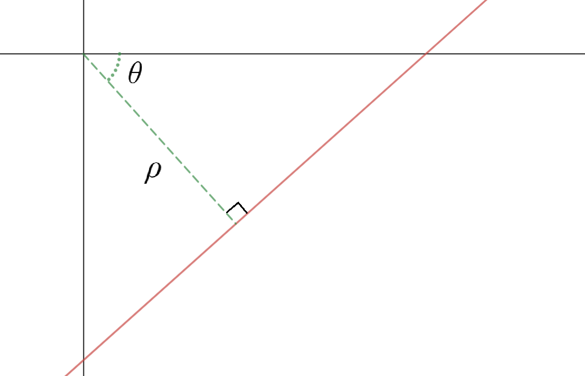
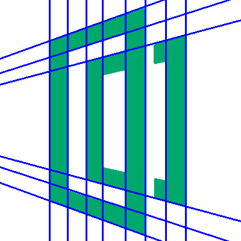
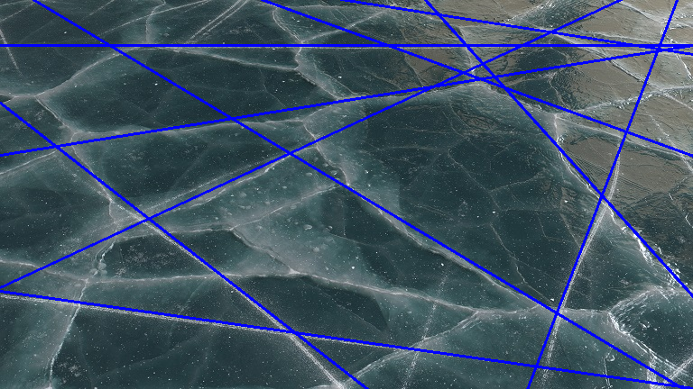

# Computer Vision: Straight Lines
Computer vision is how computers can identify high-level information from images or videos.
In this article, we will look into one of the more basic algorithms in computer vision, like finding straight lines in images.
While it sounds basic, it illustrates many techniques that are used in more complicated computer vision algorithms. 

## Edges
Before we dive into lines, we need to first think about what steps are needed to get there.
We have an image and we want to extract information from it.
To do this, we need to first determine what aspects of the image are important for our use.
What this is will depend heavily on what our end goal is.
The most obvious thing for our use would be the edges in the images. <!-- this needs a lot of work -->
That means we don't care about the color or texture.

This is step one of the line detecting process: making an edge image.

We will use a method called [Canny edge detection](https://opencv-python-tutroals.readthedocs.io/en/latest/py_tutorials/py_imgproc/py_canny/py_canny.html).
Without going into depth here's a quick summary of how it works:
1. Apply a [gaussian filter](https://opencv-python-tutroals.readthedocs.io/en/latest/py_tutorials/py_imgproc/py_filtering/py_filtering.html#gaussian-filtering) to smooth the image.
2. Finding the norm of the [gradient](https://en.wikipedia.org/wiki/Image_gradient) at each pixel (this will give us an [image with emphasized edges](https://en.wikipedia.org/wiki/Sobel_operator#/media/File:Valve_sobel_(3).PNG)).
3. Edges that form lines/curves with gradient norm above a threshold are thinned to one pixel in width.
4. Connect weak edges to strong edges and remove unconnected weak edges ([Hysteresis](https://en.wikipedia.org/wiki/Hysteresis)).

Let's see how this works in action.
Take the following image of the section logo.

The edge image would look like the following.

It might look like we are done and that we have found the straight lines, but that's because the sections logo is made up of only straight lines.
So what if instead, we looked at a more complicated image. The edge images, in this case, can only take us so far in finding straight lines.

<!-- I might just get rid of these image -->

*Image source: [Wikipedia](https://en.wikipedia.org/wiki/Canny_edge_detector)*

## Lines
Before we start to find straight lines in the images, we will need to understand what a line is.
The most common way to define a line is, of course, $y=mx+b$. 
We, however, will not be using this definition instead, we will use what is called the Hesse normal form of a line.

The equation that represents the red line is now: $\rho = x \cos(\theta) - y \sin(\theta)$ for some particular $\theta$ and $\rho$. <!-- should I add more or is it evedent from the image -->
This means that we can define a line as a point in $(\theta, \rho)$ space.
Additionally, this form gives us a lot of benefits over the slope-intercept form, namely, we can represent verticle lines (we would set $\theta = 0$).
The rest of the benefits will become evident when we talk more about the Hough transform.

There are still cases where we would want to have the slope-intercept form of a line.
This can easily be calculated: $m = \cot(\theta)$ and $b = -\rho \cdot \csc(\theta)$.

## Hough Space
Let's look at the edge image and what we can do with it. Right now it's just a bunch of pixels that represent edges.
Each pixel can only be a 1 or a 0 (an edge or not an edge).
Because our image is of a discrete size we can think of our edges image as being a set of edge points or pixels.
We will say that each of these points are in image space, a location in the image. <!-- I can do better with the words -->

To determine what lines exist in our images, we will look at each edge pixel and essentially ask, what are all the possible lines this point could be in?
This, in essence, is what the Hough transform is.

We made it easy for our selves to figure out all the possible lines because we are using the Hesse normal form of a line.
We can just iterate over every possible $\theta$ (with a discrete step size) and then solve for the resulting $\rho_\theta$s.
This works because any line can be represented with some $0 \leq \theta < 180$ and $\rho \in \mathbb{R}$ (note $\rho$ can be negative in this case).
We can then plot these $(\theta, \rho)$ pairs in a sperate graph. 
Note, these $(\theta, \rho)$ points do not reside in the images space, instead, they reside in the Hough space.

The whole process will end up looking like the following for each edge pixel.
In this graph, the orange and purple points represent edges in image space.

*I made this as an interactable Desmos plot [here](https://www.desmos.com/calculator/lvwhvdltth)*

<!-- talk more about the graphic-->
In this image, the plot on the right is the result of the Hough transform. The plot shows Hough space with the $\rho$ values (Y-axis) vs. the $\theta$ values (X-axis). 
The main plot (with the points) shows the image space of the edges where each point represents a single edge.
We can see that one point in image space is turned into a line (really a curve) in Hough space (look at the purple point and the purple line). 
And a point in Hough space is a line in image space (look at the red point and the red line). 
It might make sense that there are intersections in Hough space where <!-- or when --> the line hits multiple points.
We can say that an intersection in Hough space makes a line from two or more points in image space. <!-- reword -->

Solving for intersections is costly and difficult, so instead of plotting the Hough space we will add points from the plot into "buckets".
We will define Hough space to be a matrix of buckets that represent chucks of the continuous Hough space shown in the desmos plot. 
<!--Each bucket will count the number of edges that are in the line that the bucket represents, we will call each of these a vote.-->
Each entry of this matrix will count the number of edges that are in the line (we'll call these votes), and each bucket represents all lines were the $\theta$ and $\rho$ lie within the range that the bucket resides in.
This will mean that the bucket that contains the intersection of the 4 Hough space lines in the desmos plot will have 4 votes.

This allows us to not just solve for intersections, but to also know how many points reside in any possible line.
This is useful because any two points can form a line but that doesn't mean that they really are a line in the image.
That would only be the case if the number of votes a particular bucket has is above some threshold which we can set.

If we go back to our section logo edge image and apply the Hough transform to it (or more specifically to each edge) then we get the following result.
I normalized the vote counts and applied a heat map so that the details are more visible.

<!-- *I am not sure what causes the vertical lines, I assume it is some form aliasing* -->

Just like before, the X-dimension represents the $\theta$ values in the range $0$ to $180$ degrees, and the Y-dimension represents the $\rho$ values with 0 being halfway.

You will notice that this looks a lot like the Desmos plot, which should make sense.
The main difference is that it is flipped.
This is because matrices/images store the $(0,0)$ entry at the top left corner and then higher entries towards the bottom right. 
Therefore, while this image means the same thing as the Desmos plot, when we show it as an image it looks flipped.

Now, where are the 16 lines of the section logo? 
If you were to count the peaks in the Hough space you should count about 16 major peaks.
You have the 8 peaks at 0 degrees, the 4 just before 90 degrees, and the 4 just after 90 degrees. 
Try to figure out which line in the section logo each peak represents.

Note that because 180 degrees and 0 degrees both represent a vertical line and because 180 degrees is not an option the peaks at the right side aren't real peaks.
Instead, they lead up to the real peaks at 0 degrees.
<!-- The Hough space has a weird Mobius strip shape to it. -->

## The Algorithm
So far we have our Hough space matrix that has peaks where the lines are.
All we need to do is to extract the lines from this matrix; easier said than done.

The most accurate way to do this would be to use [gradient ascent](https://en.wikipedia.org/wiki/Gradient_descent).
However, for a demo, it is good enough to just pick the spots with the most votes and filter out similar lines.
Regardless, the complexity of the Hough transform is $O(n^2)$ because we have to run the Hough transform for each pixel. <!-- this doesn't really add anything -->

Ones we found a peak, which is just a $(\theta, \rho)$ point in Hough space, we can convert it into a line in images space. Then we are done, we have successfully found a line.
I will also draw the lines on the images to make it more clear what lines were found.

<!-- code: ??? -->

There is still one important thing to note about the Hough transform.
It is only effective if a high number of votes fall into a small subset of bins.
This means that there can not be a lot of noise in the edge image.
Furthermore, the bin sizes must be properly sized depending on the accuracy/variance of the line being detected.
We will talk more about this in the next section. <!-- might remove -->

## Results
When we finally run the full algorithm to get out our line we can then plot the lines on the image.
If we use our section logo limited to 16 lines we get the following:

The section logo is made up of straight lines so this example doesn't show the full extent of the abilities of this technique.
If we instead use a more complicated image, we will get a better understanding of how well this method works.
Take this image of cracks in ice for example.

None of the edges are 100% straight, but they are straight enough that we would expect them to be detected.
For the edges to be detected we will have to lower the "accuracy" for each possible line.
We can do this by making the Hough space buckets larger in the $\rho$ dimension.
This allows us to still detect straight lines, but to also allow for some variance in the position of each edge within.
And with all that done, here is the resulting image with 10 lines.

I would say that worked pretty well. You will notice how not all of the lines line up exactly with the image. 
This is because we decreased the line's $\rho$ accuracy. <!-- conclusion?? -->

If you want to, you can play around with the [program I wrote in python](https://repl.it/@ZackJorquera/FindingLinesComputerVision) with these and more images. <!-- I should try to add the code to the article -->
All the code to make all of the images shown in this article can be found there.

## More Hough
In this article, we looked at the standard Hough transform which is specialized for lines.
However, the Hough transform has sense been generalized for more purposes.
Some good examples of this are [finding circles/ellipses](https://en.wikipedia.org/wiki/Circle_Hough_Transform) in images, [finding any shape](https://en.wikipedia.org/wiki/Generalised_Hough_transform) in images, and [finding complex objects using image keywords](https://github.com/ZackJorquera/Keyword_Object_Detection).
