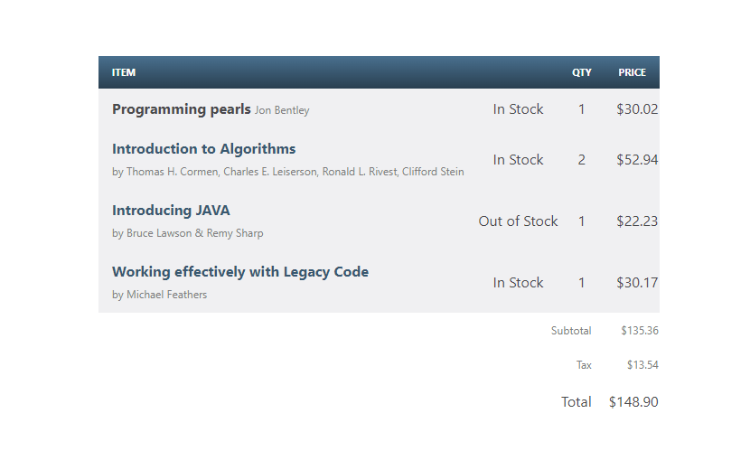

```php       
       $docraptor = new DocRaptor\DocApi();
        $docraptor->getConfig()->setUsername("YOUR_API_KEY_HERE");

        $doc = new DocRaptor\Doc();
        $doc->setTest(true);   // test documents are free but watermarked
        // HTML Table page as parameter
        $doc->setDocumentContent(<!DOCTYPE html>
<html lang="en">
  <head> 
    <meta charset="utf-8">
    <meta name="viewport" content="width=device-width, initial-scale=1, shrink-to-fit=no">
    <meta name="csrf-token" content="m8GCXCxn8DS2r8zNl1wmhb4O0n79avTSc9puuaqd">
    <title>Home</title>
    <!-- Bootstrap CSS --><link rel="stylesheet" href="https://stackpath.bootstrapcdn.com/bootstrap/4.5.0/css/bootstrap.min.css" integrity="sha384-9aIt2nRpC12Uk9gS9baDl411NQApFmC26EwAOH8WgZl5MYYxFfc+NcPb1dKGj7Sk" crossorigin="anonymous">
</head>
<body>
    <div class="container" style="margin-top: 8%; margin-left: 30%; border-color: #1dcf06 ;">
      <table style="border-collapse: separate; border-spacing: 0; color: #4a4a4d;  font: 14px/1.4 "Helvetica Neue", Helvetica, Arial, sans-serif;">
        <thead style="background: #395870; background: linear-gradient(#49708f, #293f50); color: #fff; font-size: 11px; text-transform: uppercase;">
          <tr>
            <th scope="col" colspan="2" style="padding: 10px 15px; vertical-align: middle;">Item</th>
            <th scope="col" style="padding: 10px 15px; vertical-align: middle;">Qty</th>
            <th scope="col" style="padding: 10px 15px;  vertical-align: middle;">Price</th>
          </tr>
        </thead>
        <tbody style="background: #f0f0f2;">
          <tr>
            <td style="padding: 10px 15px; vertical-align: middle;">
              <strong class="book-title">Programming pearls</strong>
              <span class="text-offset" style="color: #807c80;  font-size: 12px">Jon Bentley</span>
            </td>
            <td class="item-stock" style="text-align: center">In Stock</td>
            <td class="item-qty" style="text-align: center">1</td>
            <td class="item-price" style="text-align: right">$30.02</td>
          </tr>
          <tr>
            <td style="padding: 10px 15px; vertical-align: middle;">
              <strong class="book-title" style="color: #395870;  display: block;">Introduction to Algorithms</strong>
              <span class="text-offset" style="color: #807c80;  font-size: 12px">by Thomas H. Cormen, Charles E. Leiserson, Ronald L. Rivest, Clifford Stein</span>
            </td>
            <td class="item-stock" style="text-align: center;">In Stock</td>
            <td class="item-qty" style="text-align: center;">2</td>
            <td class="item-price" style="text-align: right;">$52.94</td>
          </tr>
          <tr>
            <td style="padding: 10px 15px; vertical-align: middle;">
              <strong class="book-title" style="color: #395870;  display: block;">Introducing JAVA</strong>
              <span class="text-offset" style="color: #807c80;  font-size: 12px">by Bruce Lawson &#38; Remy Sharp</span>
            </td>
            <td class="item-stock" style="text-align: center;">Out of Stock</td>
            <td class="item-qty" style="text-align: center;">1</td>
            <td class="item-price" style="text-align: right;">$22.23</td>
          </tr>
          <tr>
            <td style="padding: 10px 15px; vertical-align: middle;">
              <strong class="book-title" style="color: #395870;  display: block;">Working effectively with Legacy Code</strong>
              <span class="text-offset" style="color: #807c80;  font-size: 12px">by Michael Feathers</span>
            </td>
            <td class="item-stock" style="text-align: center;">In Stock</td>
            <td class="item-qty" style="text-align: center;">1</td>
            <td class="item-price" style="text-align: right;">$30.17</td>
          </tr>
        </tbody>
        <tfoot style="text-align: right;">
          <tr class="text-offset" style="color: #807c80;  font-size: 12px">
            <td colspan="3"style="padding: 10px 15px; vertical-align: middle;">Subtotal</td>
            <td>$135.36</td>
          </tr>
          <tr class="text-offset" style="color: #807c80;  font-size: 12px">
            <td colspan="3" style="padding: 10px 15px; vertical-align: middle;">Tax</td>
            <td>$13.54</td>
          </tr>
          <tr>
            <td colspan="3" style="padding: 10px 15px; vertical-align: middle;">Total</td>
            <td>$148.90</td>
          </tr>
        </tfoot>
      </table>
    </div>
</body>
</html>);     // supply content directly
        $doc->setName("docraptor-php.pdf");                                    // help you find a document later
        $doc->setDocumentType("pdf");                                          // pdf or xls or xlsx
        $create_response = $docraptor->createDoc($doc);
        // Instruct PHP to return a file download.
        header('Content-Description: File Transfer');
        header('Content-Type: application/pdf');
        header('Content-Disposition: attachment; filename=example.pdf');
        header('Content-Transfer-Encoding: binary');
        header('Expires: 0');
        header('Cache-Control: must-revalidate, post-check=0, pre-check=0');
        header('Pragma: public');
        header('Content-Length: ' . strlen($create_response));
        ob_clean();
        flush();
        echo($create_response);
```
on running code above it results to the following pdf:

