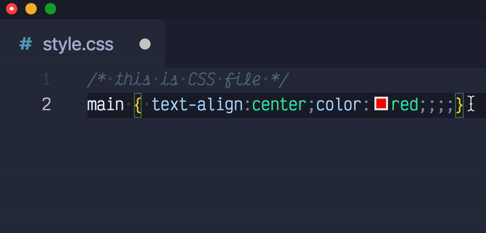
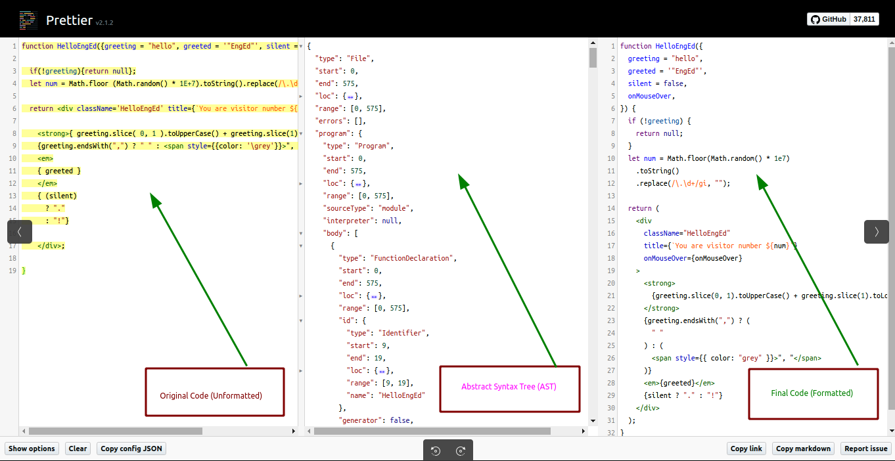
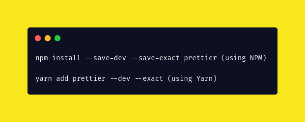
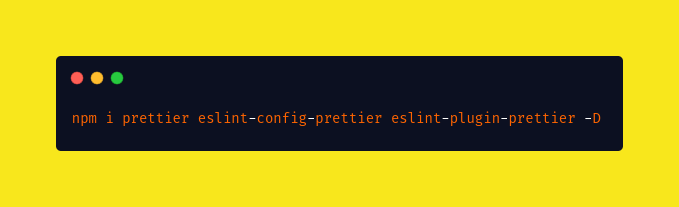
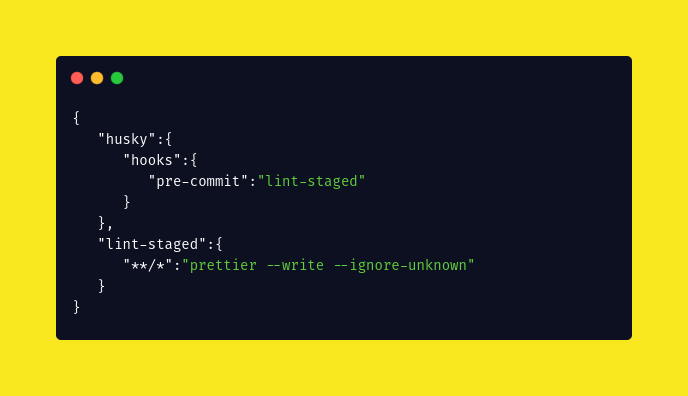

# How to setup code formatting of Node JS app using Prettier and ESLint

 - One of the most fundamental parts of contributing to open-source projects is working as a group and handling a large number of files across every development stage. These stages consist of enormous chunks of code that not only require a great amount of time for formatting but also differ in style with different individuals in the team. Have you ever wondered to cut short this formatting time with just one-click? Any alternatives to prevent this monotonous task? For getting rid away with the hassles of writing clean code and maintaining consistency across a project on specific code style guidelines, **Prettier** is one of the most prominent tools out there in which you can bank upon! With Prettier editor integration, you can just press that magic key binding and poof, the code is formatted. Prettier, along with the support of **ESLint**, is a deadly combination that increases productivity manifolds.

 - This guide includes step-by-step instructions so that you have a comfortable experience in beginning your open source deployment. Without further ado, let's get started by answering all the why(s), what(s) & how(s)!

## Table of Contents

- What is Prettier?
- Why is Prettier so useful?
- How does it work?
- How to install Prettier?
- How to configure Prettier to work with ESLint?
- How to format all your code with just one-click?
- Further Reading

## A Complete Roadmap

## What is Prettier?
  
 - Prettier is an opinionated code formatter with support for JavaScript, GraphQL, Angular and other popular Community Plugins. It is highly established in the open-source ecosystem with more than 2 million dependent repositories on GitHub. You can measure its efficiency by the fact that it has more than 6000 dependent packages on npm. Many of the technology giants like Facebook, React, Dropbox and PayPal, etc. use it quite extensively. It also has support for various IDE, viz. VS Code, Web Storm, Atom and Vim.

[Prettier Magic](https://glebbahmutov.com/blog/images/prettier/projectA.gif)

## Why is Prettier so useful?

- **Building and enforcing a style guide**: In open source development, having common style guidelines is a highly desirable feature in a project, but achieving that is a little tricky process. Prettier not only provides a perfect platform to build the style guide from scratch with suitable requirements but also helps in maintaining it throughout the life cycle of the project.

- **Saves you time and energy**: People usually spend a lot of time and mental energy formatting their code. Through Prettier, we can perform this monotonous task in a blink of an eye. It has been efficiently designed to solve the problem of formatting fatigue.

- **Hassle-free code reviews**: Using Prettier, we can safely ignore all style issues and focus on things that actually matter, like the structure and semantics of our code. Hence, they save a lot of time in code reviews. They keep everybody on the same page.

- **Easy to adopt & use**: Prettier is super easy to use. Even a beginner, with very limited programming experience, can quickly ramp up the things and get used to the code style. Setting Prettier up is a one time cost, but has long-time benefits.

- **One-click Optimization**: With proper configuration, you can use Prettier as a pre-commit githook to format all your files with just one-click. Supported with ESLint, you will be able to rectify syntax errors also.
   

[Supports multiple languages](https://glebbahmutov.com/blog/images/prettier/format-css.gif)

## How does it work?

- Prettier takes in all your code, removes all formatting, and re-formats the code according to its style guidelines. It scans all the files for style issues and automatically reformats the code to ensure that consistent rules are being followed for indentation, line break, spacing, semicolons, single quotes vs double quotes, etc.

- Internally, all the javascript code is converted into **Abstract Syntax Tree** (AST) and then formatted back. So it ensures that there would not be any breaking changes to the code that was written. Initially, an abstract representation of this AST is generated and then all the commands are executed sequentially. For the user, everything gets formatted magically and he does not have to worry about all the processes. It is super fast and quite productive.

## How to install Prettier?

- Install the exact version of Prettier locally in your project. This will keep everybody on the same page, following the same rules. Even a patch release of Prettier can result in slightly different formatting, so you wouldn’t want different team members using different versions and formatting each other’s changes back and forth. 

- For this, first install prettier on your system. For installing it in your IDE/Editor, go to the integrations page on the website and download the corresponding plugin. In VS Code go to View ->Extensions, Search for prettier code formatter, Click Install and you're done. Go to **.vscode/settings.json**, it will open your ide setting in JSON format. Add the following snippet to format all the files with a single click:

  {
    "editor.defaultFormatter": "esbenp.prettier-vscode",
    "editor.formatOnSave": true
  }

- For installing prettier in projects, we will install the prettier CLI and add it as a dev dependency. Simply, go to the **VS Code** terminal and install the packages.

  npm install --save-dev --save-exact prettier (using NPM)
  yarn add prettier --dev --exact (using Yarn)

- Then, create an empty config JSON file (file A) and create a .prettierignore file (file B) to let editors and other tooling know you are using Prettier and which files to not format.
  echo {}> .prettierrc.json         ... File A

  # Ignore artifacts:          
  package-lock.json
  .next
  node_modules/                     ... File B

- Once you're done with writing your code files in the project, it's now time to format all the files you have. 

  npx prettier --write .    (using NPM)
  yarn prettier --write .   (using Yarn)

## How to configure Prettier to work with ESLint?

- ESLint is a programming tool that analyzes and checks source code. It flags programming errors, indentation errors, formatting errors, bugs, and suspicious constructs. The linting feature of ESLint & efficient formatting of Prettier is a deadly combination that increases productivity manifolds. To do the same, first install ESLint on your system. Here is a wonderful [tutorial](https://www.section.io/engineering-education/node-eslint/#eslint-and-node) you can refer to, for installing ESLint.

- After installing Prettier and ESLint, install the following packages: 

  npm i prettier eslint-config-prettier eslint-plugin-prettier -D

- Now, Update “extends” in your .eslintrc file as follows:

  "extends": [ "airbnb", "plugin:prettier/recommended" ]

- If you want to modify the default Prettier configuration, just create a **.prettierrc** file in *“eslint-app”* directory, for example:

  {
    // Use single quotes instead of double quotes.
    "singleQuote": false,

    /**
     * Print trailing commas wherever possible.
     * Valid options:
     *   - "none" - no trailing commas
     *   - "es5" - trailing commas where valid in ES5 (objects, arrays, etc)
     *   - "all" - trailing commas wherever possible (function arguments)
     */
    "trailingComma": "es5",
    
    /**
     * Do not print semicolons, except at the beginning of lines which may need them.
     * Valid options:
     * - true - add a semicolon at the end of every line
     * - false - only add semicolons at the beginning of lines that may introduce ASI failures
     */
    "noSemi": true,

    /**
     * Do not print spaces between brackets.
     * If true, puts the > of a multi-line JSX element at the end of the last line instead of being
     * alone on the next line
     */
    "jsxBracketSameLine": false,
     
     // add many more as required!
    
  }

## How to format all your code with just one-click?

- Instead of running Prettier from the command line (prettier --write), checking formatting in CI, or running it from the editor, you can run Prettier as a pre-commit hook as well. This makes sure all your commits are formatted, without having to wait for your CI build to finish in a single click! 

- In order to do that, add the following snippet to your *package.json* to have ESLint and Prettier run before each commit, via **lint-staged** and **husky**(Remember during lint-staged ESLint should be run before Prettier to keep the code format as it is in the actual order):

  {
    "husky": {
      "hooks": {
        "pre-commit": "lint-staged"
      }
    },
    "lint-staged": {
      "**/*": "prettier --write --ignore-unknown"
    }
  }

- And... **Voila!** With just a single click, you're done! Although setting these things up is a little tricky task but it just has *one-time* cost and the time-saving benefits compound over the period is quite worthy.

## Further Reading:
 
- [NPM Prettier](https://www.npmjs.com/package/prettierrc)
- [Prettier Configuration Docs](https://prettier.io/docs/en/configuration.html)
- [React JS App with ESLint + Prettier](https://medium.com/javascript-in-plain-english/set-up-react-js-with-eslint-prettier-and-airbnb-cc015363a7c7)

## About the Author
   - ***Aman Saxena*** is pursuing a degree in Computer Science. He has a keen interest in Competitive Programming & Web Development. He is fond of playing Cricket & solving Big-O complexities. When he’s not glued to a computer screen, he is likely exploring the mighty Universe. For any query or a fruitful discussion, you may connect with him on LinkedIn [@Aman](https://www.linkedin.com/in/amansaxena333/)

### Headshot = [Image](prettier-setup/Aman.jpg)