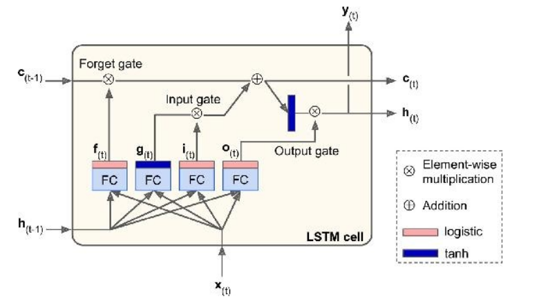
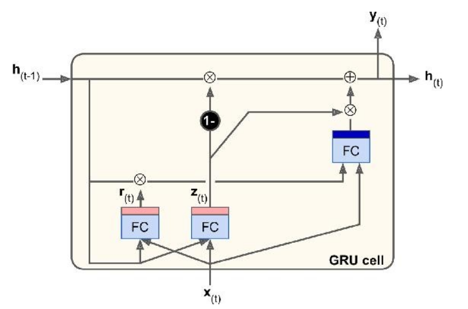
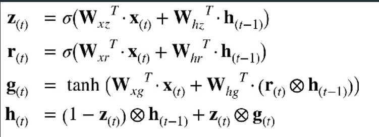

# Recurrent Neural Networks - Part 2
In the [previous article](link), we talked about recurrent neural networks, where they are used and different architectures of recurrent neural networks. In this article, we will talk about the vanishing gradient problem, LSTM, GRU.
## Vanishing Gradient Problem
RNNs theoretically should be able to retain information about inputs seen in the previous time steps, but in practice, such long term dependencies are impossible to learn. This is due to the vanishing gradient problem; this is similar to feedforward networks with many layers. You can read more in this research paper [Understanding the difficulty of training deep feedforward neural networks](http://proceedings.mlr.press/v9/glorot10a/glorot10a.pdf).

[Back Propagation algorithms](http://neuralnetworksanddeeplearning.com/chap2.html) work by going from the output layer to the input layer, propagating error gradient on the way. Once the algorithm has calculated the gradient, it uses it to update the parameters. Unfortunately, gradients often get small as the algorithm progresses into the deeper layers; as a result, the gradient descent update leaves the lower layer weights virtually unchanged, and training never converges to a good solution. To solve this problem, various types of long memory cells have been introduced; we will look at some of them here.

## LSTM 
The **_Long Short Term Memory_** networks are a modified version of recurrent neural networks. It adds a way for information to be carried across many timesteps; we can think of this as a conveyer belt, one which contains information and moves through different timesteps, information from the sequence can jump onto the conveyer belt at any point and unnecessary information can jump off. LSTM was introduced in [this book](https://www.mitpressjournals.org/doi/abs/10.1162/neco.1997.9.8.1735#.WIxuWvErJnw) which you can refer for more information.

### Architecture of LSTM

$h_{t}$  is the short term memory.
$C_{t}$ is the long term memory. In some books it is mentioned as $Cell(t)$ or $Carry(t)$.

As the long term state $c_{t-1}$, passes through the cell, it first goes through a *forget gate*, dropping some memories, then it adds some new memories selected by the *input gate*. So, at each time step, some
memories are dropped and some memories are added. The long-
term state is copied and passed through the tanh function, and then the result is filtered by the *output gate*. This produces the short-term state $h_{t}$ (which is equal to the cell’s output for this time step $y (t)$ ).

**How the gates work**, the input vector $x_{t}$ and short term state $h_{t}$ are passed to four [fully connected layers](https://iq.opengenus.org/fully-connected-layer/) which act like gates, they all serve different purposes:

* The layer which outputs $g_{t}$ is analyses the input $x_{t}$ and $h_{t-1}$, in a simple RNN the output from this layer goes straight to $y_{t}$ and $h_{t}$, but in an LSTM it is stored in the long term memory.
		
	$$g(t) = tanh(W_{x}.x_{t-1} + W_{g}.h_{t-1}+b_{g}) $$
	
* The other three layers are *gate controllers*, they use a [logistic activation](https://en.wikipedia.org/wiki/Logistic_function) function hence output a number between 0 and 1, their outputs are fed to element-wise multiplication operations if 0 then "completely get rid of this" if 1 then "completely keep this".
	* The *forget gate* (controlled by $f_{t}$) controls which parts of the long term state should be erased.
		$$  f(t)=  \sigma(W_{f}.[h_{t-1}, x_{t}] + b_{f})$$
	* The *input gate* (controlled by $i_{t}$ ) controls which parts of $g_{t}$ should be added to the long-term state.
	$$i(t) = \sigma(W_{i}.[h_{t-1}, x_{t}] + b_{i})$$
	* The *output gate* (controlled by $o_{t}$) controls which parts of the long-term state should be output to ht and $yt_{$}.
		$$o(t) = \sigma(W_{o}.[x_{t}+h_{t-1}]+b_{g})$$

 Where $W$ are weights and $b$ are bias terms. 
 **Peephole Connections**, is a type of architecture where the gate controllers are allowed to look at the long term memory. Have a look at [this paper](http://www.jmlr.org/papers/volume3/gers02a/gers02a.pdf).

## GRU

**_Gated Recurrent Unit_**  	is a simplified version of the LSTM cell, and it performs just as well. 

In lstm we had two state vectors $h_{t}$ and $c_{t}$, in this both are merged into a single vector $h_{t}$. A single gate controller controls both forget gate and input gate. If that gate controller outputs 1, the input gate is open and forget gate is closed. If it outputs a 0, the opposite happens. Whenever a memory must be stored, the location where it will be stored is erased first.
The full state vector is output at every time step. However, there is a new gate controller that controls which part of the previous state will be shown to the main layer.

The equations for the above are 

.

For more detailed explanation on the difference between LSTM and GRU read this paper [Empirical Evaluation of Gated Recurrent Neural Networks on Sequence Modeling](https://arxiv.org/pdf/1412.3555v1.pdf).

I am also learning about this topic as I write this article, I will be pushing code to [my github](https://github.com/rohanreddych) as I experiment with RNNs, check out if you are interested.

### References and Resources
* [Hands on machine learning with scikit ... , A. Geron ](https://www.oreilly.com/library/view/hands-on-machine-learning/9781492032632/)
* [Deep Learning with Python, F. Chollet](https://www.manning.com/books/deep-learning-with-python)
* **[https://colah.github.io/posts/2015-08-Understanding-LSTMs/](https://colah.github.io/posts/2015-08-Understanding-LSTMs/)**
